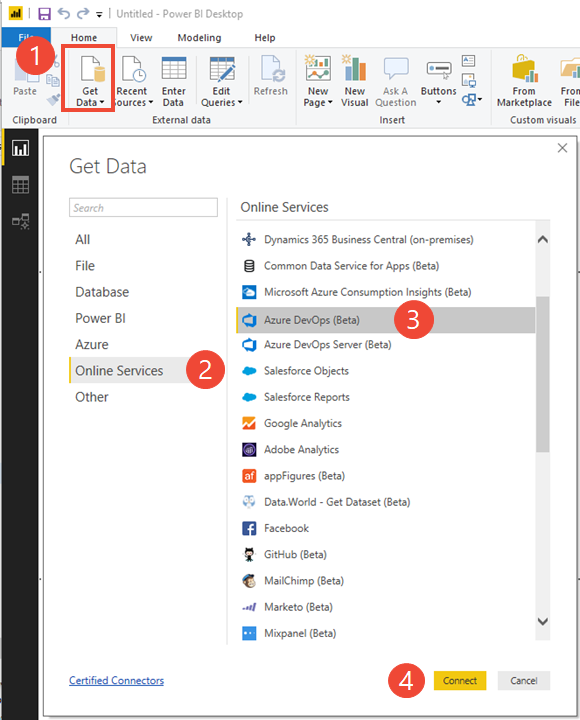

# Create an active bugs report in Power BI based on a custom Analytics view

[!INCLUDE [temp](../_shared/version-azure-devops.md)]

In this article, we'll show you how to create a custom Analytics view for active bugs and then generate a Power BI report based on that view. You'll learn how to filter the Analytics view, create a trend chart, as well as a card showing the current count of active bugs. 

 Using Power BI connected to [Analytics views](what-are-analytics-views.md), you can create reports on your work items. Reports can show your current work data and also historical revisions of the work items.  

Follow these steps to create a report in Power BI desktop that shows a **daily active trend of  bugs** based on a custom **Analytics view**:

1. From the web portal for Azure DevOps:   
	a. Open **Analytics views**  
	b. Create a custom Analytics view for your data.   
2. From the Power BI Desktop:  
	a. Get the dataset defined by the Analytics view   
	b. Create a trend report  
	c. Apply filters to your trend report  
	d. Create a card and apply the Is Current=True filter to show current count.  

## Prerequisites  

In order to create a Power BI report that references an Analytics view, you must meet the following criteria:  

* You must be a member of a project. If you don't have a project yet, [create one](../../boards/get-started/sign-up-invite-teammates.md). 
* If you haven't been added as a team member, [get added now](/azure/devops/organizations/accounts/add-organization-users-from-user-hub). Anyone with access to a project, except stakeholders, can view **Analytics views**.
* Have installed the [Analytics Marketplace extension](../dashboards/analytics-extension.md). You must be an Azure DevOps owner or a member of the [Project Collection Administrator group](/azure/devops/organizations/security/set-project-collection-level-permissions) to add extensions.
* Have the **View Analytics** permission set to **Allow**. See [Grant permissions  to access the Analytics service](/azure/devops/report/powerbi/analytics-security).
- Have installed *Power BI Desktop* *February 2018 Update* or later version. You can download this client application from the official [Power BI Desktop download page](https://powerbi.microsoft.com/desktop).
- Have tracked bugs for some period of time on which to generate a trend report. 

[!INCLUDE [temp](../_shared/analytics-open.md)] 

## Create a view to only include Active bugs

From the web portal, **Analytics view**, choose  **New View** to create a custom view. Fill out the forms provided in each tab as shown in the steps below. 

Choose **Continue** to move to the next tab in the panel. If you need to revisit a tab, simply click the tab title. 

### 1. Name your view and set to Private  

0. Give your view a name, such as Active bugs. Select **Private view** to save it under **My Views**. Otherwise, you can select **Shared view** to save it under **Shared Views**.  

   > [!div class="mx-imgBorder"]
   > 

	Choose **Continue** to move to the next tab. 

0. From the **Work items** tab, select the Project and Team that contain the data you want to report on.  
 
	Here we choose the FabrikamFiber project and the Fiber Suite App team.
    
    > [!div class="mx-imgBorder"]
    > 

	To add additional projects or teams, click  to add a new row and then select the project and team. 

0. Under **Backlogs and work items**, click  to add a new row, and then select **Bug** from the list of work items types.

    > [!div class="mx-imgBorder"]
    > 

0. Under **Field criteria**, choose the **State** field set to **Active**.   

    > [!div class="mx-imgBorder"]
    >

	Choose **Continue** to move to the next tab. 

0. In the next tab, **Fields**, we'll keep the most common fields selection. This selection will also include any custom fields that have been added to your project.  
    
    > [!div class="mx-imgBorder"]
    > 

	Choose **Continue** to move to the next tab. 

0. In the **History** tab, select **Rolling period in days** and enter **60** days. Keep the **Granularity** set to **Daily**. These selections will generate 60 snapshot rows of data for each active bug. Each day will include all the details of that work item as it was at the end of that day. 
    
    > [!div class="mx-imgBorder"]
    > 

	To learn more about these defining trend data options, see [Create an Analytics view, Select trend data options](analytics-views-create.md#select-trend-data).

	Choose **Continue** to move to the next tab. 

0. On the last tab, **Verification**, click **Verify view**. The system will verify your view by running a test query against the dataset it defines and validate all your filter criteria. 

	> [!div class="mx-imgBorder"]
    > 
  
    > [!NOTE]   
	> Verification time will vary based on the amount of data defined in your view. Verify your view to make sure all the definitions are correct.  

	Once your view successfully verifies, choose **Save**. You can then start using it in Power BI. Verification also returns an estimate of the number of rows in the dataset and the time it will take to load in Power BI.

	> [!div class="mx-imgBorder"]
	> 

	If your view fails to verify successfully, you'll get an error explaining the issue and pointing to a possible fix. Try changing the options you selected in the **Work Items** and **History** tabs to include less data, and then verify the view again. 

## Open Power BI desktop and load your view 

1. Open Power BI Desktop.  

::: moniker range="azure-devops"  
2. Choose (1) **Get Data**, (2) **Online Services**, (3) **Azure DevOps (Beta)**, and then (4) **Connect**. 

    > [!div class="mx-imgBorder"]
    > 

3. Enter your organization name, the same Azure DevOps name you used to create the Active Bugs view, and the same project for which you defined the Active Bugs view. 

	  
::: moniker-end

::: moniker range="azure-devops-2019"  
1. Choose (1) **Get Data**, (2) **Online Services**, (3) **Azure DevOps Server (Beta)**, and then (4) **Connect**.  

    > [!div class="mx-imgBorder"]
    > 

2. Enter the URL for your server and collection, the same same project for which you defined the Active Bugs view. 

	  
::: moniker-end

3. Expand the **Private Views** folder, choose the **Active Bugs** view you saved in the previous section, and then click **Load**. 

    > [!div class="mx-imgBorder"]
    > 

	Need help connecting? See [Connect with Power BI Data Connector](data-connector-connect.md).

## Create a daily bug trend report 

0. In your report, (1) select the Line chart visual, (2) enter `work item id` in the search field, and then (3) check the box for **Work Item Id**. 

    > [!div class="mx-imgBorder"]
    > 

	This will change your chart to a single dot.  

	> [!TIP]    
	> To change the chart size, choose the **View** tab, **Page View**, and then select the **Adjust Size** option as shown. You can then resize the chart to your desired dimensions.  
	> 
	>   
     
0.	Click the context menu icon next to the **Work Item Id** field and change it from **Count** to **Count (Distinct)**.

    > [!div class="mx-imgBorder"]
    > 

0. Next, (1) select the **Date** field in the fields list as your axis. To see a daily trend, (2) click the context menu icon next to the field and change it from **Date Hierarchy** to **Date**.

   > [!div class="mx-imgBorder"]
   > 

   To view trends over time, you want to use **Date** and not **Date Hierarchy**. The **Date Hierarchy** in Power BI rolls ups everything into a simple number for the period. The day level in the hierarchy rolls all days to a number between 1-31. For example, April 3 and May 3 both roll up into number 3. This is not the same as counting items per actual date.

	> [!TIP]    
	> If you need to modify your Analytics view, you can do so and then return to your Power BI report and refresh the data. Simply click the **Refresh** option as shown.  
	> 
	> 

## Filter your trend by Priority

0. To group your bugs by `Priority`, search for the field in the list (a). Drag the Priority field into the `Legend` of your trend chart (b)

    > [!div class="mx-imgBorder"]
    > 

0. The chart now shows a daily distinct count of bugs, grouped by Priority.

0. To just show only Priority 0 and 1 bugs, click the context menu icon next to the **Priority** field to set the filters.  
    
    > [!div class="mx-imgBorder"]
    > 

	The trend chart is now grouped and filtered by high priority bugs.

## Create a card for latest bug count

0. Add a new page by clicking the plus sign (+) at the bottom of the page. 

0. Select the card visual, add the **Work Item Id** field, add the **Work Item Type** field, and click the context menu icon next to the field and change it from **Count** to **Count (Distinct)**.

	The card now shows the number of active bugs times the number of days they existed within the selected time period.  For this example, that number is 1066. 
    
    > [!div class="mx-imgBorder"]
    > 
    
0. To get the latest count, add **Is Current** as a page level filter, and select the True checkbox. The **Is Current** field is added automatically to all datasets, marking the rows that contain the latest revision of the work items.
    
    > [!div class="mx-imgBorder"]
    > 
   
	The value on this card should match the count on the last day of the trend chart, which you can obtain by returning to Page 1 and hovering over the last day as shown.  

    > [!div class="mx-imgBorder"]
    > 

## Save your report, optionally share with others 

0. Choose **File > Save As** to save your report to your local workspace. 

0. To publish your report to Power BI, choose the **Publish** tab. For additional information, see [Collaborate in your Power BI app workspace](/power-bi/service-collaborate-power-bi-workspace).

    > [!div class="mx-imgBorder"]
    > 

## Continue to explore your data

Analytics views provide you with a great deal of power and flexibility to filter your data and generate useful reports quickly and easily using Power BI. Within a custom view, you can create datasets that span multiple teams or projects. 

## Try this next
> [!div class="nextstepaction"]
> [Create a custom Analytics view](analytics-views-create.md)

## Related articles 

- [Get started with Power BI Desktop](/power-bi/desktop-getting-started)
- [Power BI integration overview](overview.md) 
- [Create Analytics views](analytics-views-create.md)
- [Connect with Power BI Data Connector](./data-connector-connect.md)
- [Dataset design for the Power BI Data Connector](data-connector-dataset.md)
- [Functions available in Power BI Data Connector](data-connector-functions.md)
