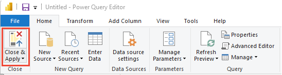
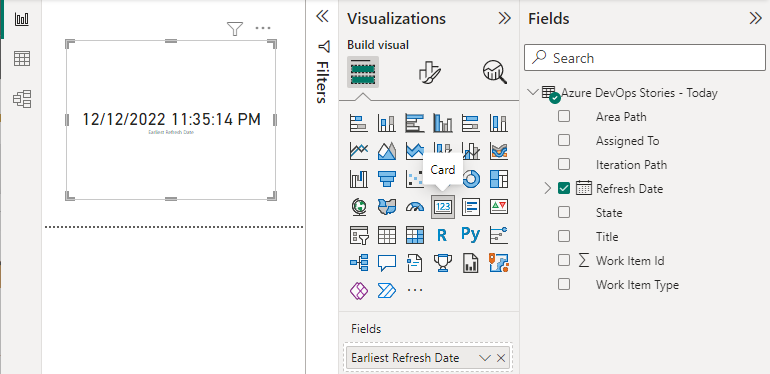

# Refresh your report and show last refresh date  

[!INCLUDE [version-gt-eq-2019](../../includes/version-gt-eq-2019.md)]

The last refresh date, when added to a report, alerts users as to how fresh the data is in the report. You can add a card to a report that provides the date and time that the data for the report was last updated. Also, you can refresh the data models from Power BI to update all data models with the latest data.  

The method for adding a last refresh date differs depending on whether your Power BI report is based on an Analytics view, Power BI, or OData query.  
 
> [!NOTE]   
> Several Analytics entity types include The `AnalyticsUpdatedDate` property, such as `WorkItemRevision`, `WorkItem`, `WorkItemLink`, `TestRun`, and more. This property indicates the last time the individual entity references was last updated. 

[!INCLUDE [prerequisites-simple](../includes/analytics-prerequisites-simple.md)]

## Add the last refresh date based on an Analytics view 

To add a column with the last refresh date of the dataset, follow these steps.  

1. Load the Power BI pbix file associated with your view in Power BI Desktop.  

1. In the External Data section of the ribbon, choose **Edit Queries**.   

    > [!div class="mx-imgBorder"]  
    >  

1. Open **Advanced Editor**.  

    > [!div class="mx-imgBorder"]  
    >  

    If you haven't already modified the query, review the following examples with specific table values matching your Analytics view.

	#### [Private view](#tab/private/)
	```Query 
	let
	    Source = VSTS.AnalyticsViews("{OrganizationName}", "ProjectName}", []),
	    #"Private Views_Folder" = Source{[Id="Private Views",Kind="Folder"]}[Data],
	    #"{AnalyticsViewsID_Table}" = #"Private Views_Folder"{[Id="{AnalyticsViewsID}",Kind="Table"]}[Data]
	in
	    #"{AnalyticsViewsID_Table}"
	```
	
	#### [Shared view](#tab/shared/)
	```Query 
	let
	    Source = VSTS.AnalyticsViews("{OrganizationName}", "{ProjectName}", []),
	    #"{AnalyticsViewsID_Table}" = Source{[Id="{AnalyticsViewsID}",Kind="Table"]}[Data]
	in
	    #"{AnalyticsViewsID_Table}"
	```
	
	***

1. Modify the query according to the following syntax.  
	#### [Private view](#tab/private/)
	```Query 
	let
	   Source = VSTS.AnalyticsViews("{OrganizationName}", "{ProjectName}", []),
		#"Private Views_Folder" = Source{[Id="Private Views",Kind="Folder"]}[Data],
		#"{AnalyticsViewsID_Table}" = #"Private Views_Folder"{[Id="{AnalyticsViewsID}",Kind="Table"]}[Data]
	    #"Added Refresh Date" = Table.AddColumn(#"{tableid}_Table", "Refresh Date", 
	        each DateTimeZone.FixedUtcNow(), type datetimezone)
	in
	    #"Added Refresh Date"
	```
	
	#### [Shared view](#tab/shared/)
	```Query 
	let
	   Source = VSTS.AnalyticsViews("{OrganizationName}", "{ProjectName}", []),
	   #"{AnalyticsViewsID_Table}" = Source{[Id="{AnalyticsViewsID}",Kind="Table"]}[Data]
	   #"Added Refresh Date" = Table.AddColumn(#"{tableid}_Table", "Refresh Date", 
	       each DateTimeZone.FixedUtcNow(), type datetimezone)
	in
	   #"Added Refresh Date"
	```
	 
	***

> [!IMPORTANT]  
> These examples use UTC. You can adjust the query code based on your specific timezone as described in [DateTimeZone functions](/powerquery-m/datetimezone-functions).

1. When finish, choose **Done**.

1. Choose **Close & Apply** to immediately refresh the dataset.   

	> [!div class="mx-imgBorder"]  
	>    


## Add last refresh date based on a Power BI or OData query 

1. From Power BI, choose **Blank Query**, rename the query to *Last Refreshed Date*, and then enter the following formula into the function bar. 

	:::image type="content" source="media/last-refresh/last-refresh-date-query.png" alt-text="Screenshot of Power Query Editor, formula for DateTime.LocalNow for Last Refresh Date query. ":::

1. To convert the date data to a table format, choose **To Table** and select the  **To Table** option. 

	:::image type="content" source="media/last-refresh/convert-data-to-table.png" alt-text="Screenshot of Power Query Editor, To Table option. ":::

	A single column appears with the date.

	:::image type="content" source="media/last-refresh/column-coverted-data.png" alt-text="Screenshot of converted date column. ":::

1. From the **Transform** menu, choose **Change Data Type** and select the **Date/Time** option. 

	:::image type="content" source="media/last-refresh/change-data-type-date-time.png" alt-text="Screenshot of Transform menu, Change Data Type option to Date/Time. ":::

1. Rename **Column1** to something more meaningful, such as *Last Refresh Date*. 

1. From the Home menu, choose **Close and Apply**. 

	> [!div class="mx-imgBorder"]  
	>    

## Add a card to a report with the Refresh Date 

1. To add a card with the last refresh date to your reports, under **Visualizations**, choose **Card**, and add **Refresh Date** or **Last Refresh Date** to **Fields**.

	> [!div class="mx-imgBorder"]  
	> 

## Refresh data 

1. Choose **Refresh** to refresh report page data and the data model. After all queries are updated, the card refreshes with the latest date. 

	:::image type="content" source="media/last-refresh/refresh-data.png" alt-text="Screenshot of Power BI, Refresh option.":::


## Related articles

- [Power BI integration overview](overview.md) 
- [Create Analytics views](analytics-views-create.md)
- [Create a Power BI report with a default Analytics view](create-quick-report.md)
- [Publish a Power BI Desktop file to Power BI](publish-power-bi-desktop-to-power-bi.md)
- [Get started with Power BI Desktop](/power-bi/fundamentals/desktop-getting-started)