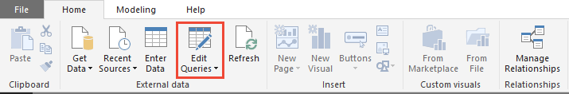

# Create a column in Power BI for last refresh date

[!INCLUDE [temp](../_shared/version-azure-devops.md)]

After [creating a report](create-quick-report.md) and [publishing it to Power BI.com](publish-power-bi-desktop-to-power-bi.md) one of the most common requests is a way to determine the last time the data was refreshed.  

The steps below show how to add a column to your model which will contain the last refresh date of the dataset.  

1. Load the Power BI pbix file associated with your view in Power BI Desktop.  

2. In the External Data section of the ribbon, choose **Edit Queries**.   

    > [!div class="mx-imgBorder"]  
    >  

3. Open **Advanced Editor**. 

    > [!div class="mx-imgBorder"]  
    >  

    If you have not already modified the query you should see text below with specific table values matching your Analytics view.
	 
    ```Query 
    let
        Source = VSTS.AnalyticsViews("{OrganizationName}", "{ProjectName}", null),
        #"{tableid}_Table" = Source{[Id="{tableid}",Kind="Table"]}[Data],
    in
        #"{tableid}_Table"
    ```

    Modify the query as follows:
	   
    ```Query 
    let
        Source = VSTS.AnalyticsViews("account", "project", null),
        #"{tableid}_Table" = Source{[Id="{tableid}",Kind="Table"]}[Data],
        #"Added Refresh Date" = Table.AddColumn(#"{tableid}_Table", "Refresh Date", 
            each DateTimeZone.FixedUtcNow(), type datetimezone)
    in
        #"Added Refresh Date"
    ```

    > [!IMPORTANT]  
    > These examples use UTC. You can adjust the query code based on your specific timezone as described in [DateTimeZone functions](https://msdn.microsoft.com/query-bi/m/datetimezone-functions).

4. When finish, choose **Done**.

5. Choose **Close & Apply** to immediately refresh the dataset.   

	> [!div class="mx-imgBorder"]  
	>    

6. Identify the *Refresh Date* column under the field.

	> [!div class="mx-imgBorder"]  
	>   

7. Add the field to a card to see the last refresh date on your reports.

	> [!div class="mx-imgBorder"]  
	>   


 

## Related articles

- [Power BI integration overview](overview.md) 
- [Create Analytics views](analytics-views-create.md)
- [Get started with Power BI Desktop](/power-bi/desktop-getting-started)
