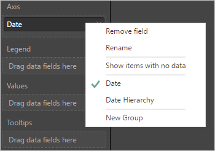

# Historical data representation in Analytics

[!INCLUDE [version-gt-eq-2019](../../includes/version-gt-eq-2019.md)]  

You specify specific entity sets to report on historical data or create trend reports. Understanding how Analytics records historical data is important to ensure you can track and report the data of interest.  

## Entity sets that support historical reporting

The following table describes the entity sets that you can use to create historical or trend reports. 

|`EntitySet`  |   **Description** | **Sample report** |
|------------|-------------|-------------|  
|[**WorkItemBoardSnapshot**](../analytics/entity-reference-boards.md#kanban-board-properties-fields) |(Composite) The state of each work item on each calendar date, including Kanban board location. | [Cumulative Flow Diagram (CFD) sample report](sample-boards-cfd.md) |
|[**WorkItemRevisions**](../analytics/entity-reference-boards.md#property-names-fields)|All historic work item revisions, including the current revision. Doesn't include deleted work items. | [Return the history of a specific work item](../extend-analytics/analytics-recipes.md#history)   | 
|[**WorkItemSnapshot**](../analytics/entity-reference-boards.md#property-names-fields)|(Composite) The state of each work item on each calendar date. |[Bug trends sample report](sample-boards-bugtrend.md)   |   
|[**ParallelPipelineJobsSnapshot**](../analytics/entity-reference-pipelines.md#parallelpipelinejobssnapshot)|(Composite) Supports understanding of parallel pipeline consumption.  |    | 
|[**TaskAgentPoolSizeSnapshots**](../analytics/entity-reference-pipelines.md#taskagentpoolsizesnapshots)|(Composite) Supports understanding of pool size, pipeline jobs, and concurrency. | [Historical graph for agent pools](../../pipelines/agents/pool-consumption-report.md)  |    
|[**TaskAgentRequestSnapshots**](../analytics/entity-reference-pipelines.md#taskagentrequestsnapshots)|(Composite) Supports reporting on task agent requests.   |    | 
|[**TestPointHistorySnapshot**](../analytics/entity-reference-test-plans.md#testpointhistorysnapshot) | (Composite) Individual execution results for a specific **Test** associated with a **TestRun**. |[Manual test execution trend sample report](sample-test-plans-execution-trend.md)| 
|[**TestResultsDaily**](../analytics/entity-reference-test-plans.md#testresultsdaily) | A daily snapshot aggregate of **TestResult** executions, grouped by Test.|[Test summary trend sample report](../powerbi/sample-test-summary-trend.md)| 

A snapshot provides a record of the values defined for the entity type each day. The record is written to Analytics once a day at the same time each day. You use snapshots when you want to generate a trend report.  By default, all the snapshot tables are modeled as daily snapshot fact tables. If you query for a time range it will get a value for each day. Long time ranges result in a large number of records. If you don't need such high precision, you can use weekly or even monthly snapshots.

## Periodic snapshot fact tables

Analytics models historical data as a **periodic snapshot fact table**. The fact table contains one row created at midnight for each work item or entity type at the end of each period. For example, history on a daily period is modeled as one row at midnight for each day, while a weekly period would be one row at midnight of the last day of the week. If the week hasn't completed, the snapshot value for the week is based on the current value.

The grain of this table is the period, not the individual work item. It means that **a single Work Item will appear multiple times**, once for each historical period. Selecting the last 30 days of history will result in a single work item appearing 30 times in the data model. If the work item hasn't changed within the last 30 days, the most recent revision of the work item is replicated on each day.

When working with the Power BI Data Connector and historical data, we recommend using the `Date` field.  **If the dataset contains historical data, but only the current values are needed, this can be setup by filtering `Is Current`**.  

For example, if you want to show a table of work items and values for the associated fields you would use `Is Current` as a filter that is set to **True**. If you wanted to show a trend of work items based on state instead, you'd include the **Date** column on the Axis of the visualization.  

> [!TIP]  
> Always use the **Date** option when using the Date column. The Date field is not intended to support default hierarchies in Power BI.

## Work item revisions

 Each time you update a work item, the system creates a new revision and records this action in the `System.RevisedDate` field, which makes it useful for specifying a history filter. The revised date is represented by `RevisedDate` (DateTime) and `RevisedDateSK` (Int32) properties. For best performance, use the latter date surrogate key. It represents the date when a revision was created or it has null for active or incomplete revisions. 

If you want all the dates since the `{startDate}` inclusive, add the following filter to your query.

`RevisedDateSK eq null or RevisedDateSK gt {startDateSK}`  

You use the `WorkItemRevisions` entity set to load all the revisions for a given work item. The query returns all historic work item revisions, including the current revision, for the work items you filter on. It doesn't include deleted work items. 

> [!TIP]  
> To create a work tracking trend report, create or modify a default **Analytics view** and specify the time frame of interest in the **History** tab. To learn more, see [Create an Analytics view](../powerbi/analytics-views-create.md).

Both [Analytics Views](./what-are-analytics-views.md) and the [Burndown and Burnup widgets](../dashboards/configure-burndown-burnup-widgets.md) let you configure filters that scope the data set to your needs. You apply filters to scope the data to specific teams, work item types, or backlogs. Filters may also apply to specific properties or fields and their corresponding values. For example, you can apply filters on work items to return only bugs defined for the *Fabrikam Voice* team and that are tagged with *Customer*.  

## How filters are applied to historical data

Filters are applied to each revision of a work item. For example, let's say we have a work item that has the following revisions:

|Rev #|Revision Date|ID|Title|State|Area Path|Tags|
|---|---|---|---|---|---|---|
|1|Jan-01|1001|A bug|New|||
|2|Jan-02|1001|A bug|New|/Admirals||
|3|Jan-10|1001|A bug|Active|/Admirals||
|4|Jan-12|1001|A bug|Active|/Admirals|Customer|
|5|Jan-20|1001|A bug|Resolved|/Admirals|Customer|
|6 (Current)|Jan-28|1001|A bug|Closed|/Admirals|Customer|

The latest revision (#6) is the Current revision of the work item. In Analytics Views, if you selected "Current only" in the History tab, you would get one row of data for this work item, the current row.

When reporting on history, we could potentially be pulling in revisions 1 through 6 for reporting. 

Let's say, when creating an Analytics View or configuring the Burndown widget, you set these two filters:

* Area Path = /Admirals
* Tags contains Customer

Applying these filters to the set of work item revisions yields the following matches:

|Match?|Rev #|Revision Date|ID|Title|State|Area Path|Tags|
|---|---|---|---|---|---|---|---|
||1|Jan-01|1001|A bug|New|||
||2|Jan-02|1001|A bug|New|/Admirals||
||3|Jan-10|1001|A bug|Active|/Admirals||
||4|Jan-12|1001|A bug|Active|/Admirals|Customer|
||5|Jan-20|1001|A bug|Resolved|/Admirals|Customer|
||6 (Current)|Jan-28|1001|A bug|Closed|/Admirals|Customer|

Revisions 1, 2 and 3 don't match, because those revisions didn't match the filters. The above work item wouldn't appear in your data set or your trend chart until revision 4, or Jan-12. 

Let's say you wanted to report on your trend of Active bugs, you'd create a filter of State = Active. Those filters would match the following revisions:

|Match?|Rev #|Changed Date|ID|Title|State|Area Path|Tags|
|---|---|---|---|---|---|---|---|
||1|Jan-01|1001|A bug|New|||
||2|Jan-02|1001|A bug|New|/Admirals||
||3|Jan-10|1001|A bug|Active|/Admirals||
||4|Jan-12|1001|A bug|Active|/Admirals|Customer|
||5|Jan-20|1001|A bug|Resolved|/Admirals|Customer|
||6 (Current)|Jan-28|1001|A bug|Closed|/Admirals|Customer|

The filters would only match revision 3 and 4 of the work item, and would only include the Jan-10 and Jan-12 revisions in your trend chart.

## What does this mean for Burndown or Burnup?

When you configure a Burndown  or Burnup widget that filters for a given **Tag** (for example, "Customer"), work items won't appear in your burndown until the date the **Tag** is defined for the work item. If at any point the **Tag** is removed from the work item, then the work item is from the burndown after the date the **Tag** was removed. 

Some have assumed that if the current version of a work item has the **Tag**, then it will be included in the burndown retroactively from the start. For example, if the current version of the work item has the tag "Customer", it was assumed that work item would be included in the burndown from the point the work item was created.

It isn't how historical filtering works. If filters were only applied based on the current version of a work item, then trend charts wouldn't work. You can't remove an item from your burndown by removing a Tag, or by setting the Area Path to another team's area path. 

> [!NOTE] 
> We are considering adding a "was ever" operand to the filter criteria in **Analytics views** and widgets such as **Burndown/Burnup**. This feature would allow you to create a filter like: "State **Was Ever** Active". This would mean a work item revision would match the filter criteria if any revision of the work item ever had State = Active. If you believe this feature is important, you can [vote for it on our Developer Community site](https://developercommunity.visualstudio.com/idea/366009/support-was-ever-filter-in-analytics-views-burndow.html). 

::: moniker range="< azure-devops"

## Historical data and pausing or disabling Analytics

Pausing Analytics preserves your data but stops staging jobs from updating your data. You can resume the service later and your data is then updated. 

If an administrator disables Analytics, then all Analytics staging jobs are disabled and Analytics data stored in the Analytics tables is deleted. All Analytics data that captures historical trends is lost. It doesn't delete any other data stored in your collection. You can't undo this action. Once historical data and trending data is deleted, you can't restore it. Re-enabling Analytics won't restore the historical data. 

With Analytics disabled or removed, the following actions occur: 

- No staging jobs are run, and the Analytics tables won't have updated information.  
- Table data is deleted, and if Analytics is re-enabled, all data will be repopulated from scratch.

To learn more, see [Install or enable the Analytics service](../dashboards/analytics-extension.md).

::: moniker-end

## Summary

To restate, when reporting on historical data, all filters are applied to the work item's version as-of the historical point in time. Work items will appear in your trend when they meet the filter criteria. They'll disappear from your trend when they no longer meet the filter criteria.  

## Related articles

- [OData Analytics query guidelines](../extend-analytics/odata-query-guidelines.md)
- [Entities and properties reference for Azure Boards](../analytics/entity-reference-boards.md)
- [Data model for Analytics](../extend-analytics/data-model-analytics-service.md)

<!---
Snapshot entity types
WorkItemRevisions 
Revision property
How filters are applied 
Example reports that support historical reporting 
Disabling analytics - deletes historical data. 
RevisedDateSK 

-->
