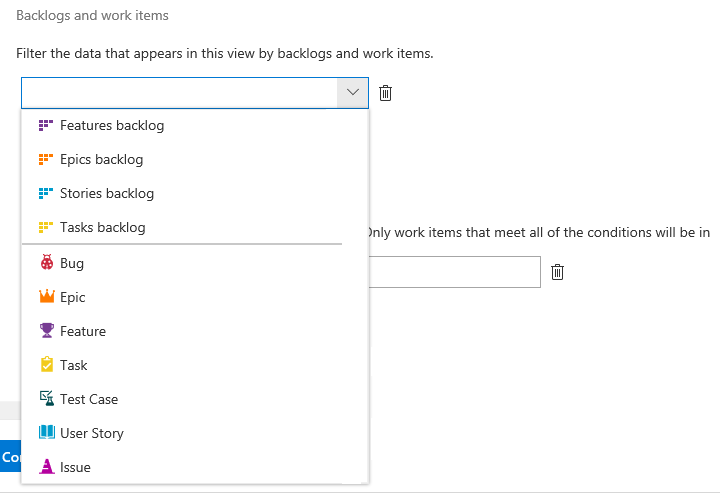

# Create an Analytics view in Azure DevOps 

[!INCLUDE [temp](../_shared/version-azure-devops.md)]

You create a custom Analytics view to define the filtered set of data and other criteria to support your Power BI reporting needs. A custom view provides you with greater flexibility over filter criteria and the fields loaded into a Power BI report over those available with a default Analytics view. 

You create custom views in the web portal for Azure DevOps, and then load the view using the [Power BI Data Connector](data-connector-connect.md). Like work item queries, you can create views only for your use, or share them with others on your team. 

[!INCLUDE [temp](../_shared/boards-disabled.md)]

Use this article to learn how to:

> [!div class="checklist"]
> * Meet prerequisites to access Analytics views
> * Open **Analytics views**
> * Browse your Analytics views
> * Create a custom Analytics view
> * Review filter criteria for a view 

[!INCLUDE [temp](../_shared/analytics-prerequisites.md)] 

[!INCLUDE [temp](../_shared/analytics-open.md)] 

## Browse your views

From the **All** page as shown in the following image, you can access all Analytics views defined for the project. **My Views** are views that only you can use or edit. **Shared Views** are views that are shared across the project. Anyone on your team can connect and use shared views in Power BI.

> [!div class="mx-imgBorder"]
> 

[!INCLUDE [temp](../_shared/analytics-image-differences.md)] 

To favorite a view, hover over the view and choose the . Views you favorite will appear on the **Favorites** page.

## Create a custom view

Choose  **New View** to open the dialog for creating a custom view. Fill out the forms provided in each tab to fully define the filter criteria for shaping the data you want to view in Power BI. 

1.	Name the view and choose a sharing option
2.	Specify work item filters
3.	Select the view's fields
4.	Choose the amount of historical data contained within the view
5.	Verify and save the view

Choose **Continue** to move to the next tab in the panel. If you need to revisit a tab, simply click the tab title. 

### 1. Name the view and choose a sharing option

Enter a name for the view and provide a description. To allow others to view and use the Analytics view, choose the **Shared** option. With shared views, you can set permissions as to who can view, edit, and delete the view as described in [Manage Analytics views](analytics-views-manage.md).

> [!div class="mx-imgBorder"]
> 

<a id="specify-wi-filters" />

### 2. Specify Work items filters

Specify filters to reduce the number of results returned by your view. In the work items section, you can add different filters on work item fields to scope your data.
> [!div class="mx-imgBorder"]
> 

> [!TIP]
> Scope your data to generate reports that quickly refresh. For large datasets, refreshing non-filtered views can fail. To narrow your results, add the right set of filters. The more filters you add, the faster the view loads and refreshes in Power BI.

* **Add Teams or Area Path filters**

   By default, a view includes all the teams defined in the current project. You can specifically select teams in the current project or add additional projects defined in the organization to the filter. 

 You can change the selected teams for the current project or add additional projects to the filter. You can also change from filtering on teams to area Paths. Here is a view filtered by two Fabrikam area paths.
> [!div class="mx-imgBorder"]
> 

* **Add filters for backlogs and work items types**

   Scope the data to specific Work item types in your project. You can specify a backlog to filter by work item types associated with a specific backlog level or add individual specific work item types. Work items of the selected types are included in the view.

    > [!div class="mx-imgBorder"]
    > 

* **Add filters by field criteria**

    In addition to all previous filter criteria, you can add filters based on different work item fields. You specify these fields in the same way you do for fields you add to a work item query. As shown in the following example, you can filter to show only high Priority bugs with the specific "Hotfix" tag.

    > [!div class="mx-imgBorder"] 
    > 

	For details about working with tags, see [Add work item tags to categorize and filter lists and boards](../../boards/queries/add-tags-to-work-items.md).

   > [!NOTE]   
   > It is important to understand how filters are applied to historical data. Read [Filters applied to historical data](analytics-historical-filtering.md) for more information.

<a id="select-fields" />

### 3. Select the fields to appear in the report

In the next tab, <strong>Fields</strong>, you can add and remove fields that you'll use in your report. Choose the  <strong>Add</strong> to add a field. To start with a fresh list, choose <strong>Remove All</strong>. 

> [!div class="mx-imgBorder"]
> 

You can add any custom fields you've added through an inherited process.

> [!NOTE]
>  You can't add fields with a data type of Plain Text (long text) or HTML (rich-text). These fields aren't available from the Analytics service for the purposes of reporting. 

<a id="select-trend-data" />

### 4. Select trend data options 

In the next tab, **History**, you choose the options that determine how much history data will be available from the view. 

As shown in the following example, if you have 10 work items and choose a rolling period of 14 days (two weeks) with a weekly granularity, your view will contain 30 rows. If you refresh on Saturday, then you have a row on the last two Saturdays for each work item and a row for the most recent data on Saturday. 

 > [!div class="mx-imgBorder"]
 > 

#### History

For a snapshot of the current status, choose **Current only**. For trend charts, choose one of the other options as indicated.

> [!div class="mx-tdCol2BreakAll"]
> |  Option  | Description |
> |------|---------|
> | **Current only** | Choose this option when you want a snapshot of work item status. Generates a single row per work item matching the work item's latest values in the Analytics data store. |
> | **Rolling period** | Choose this option and enter the number of days previous to the current day to include in the dataset. The sliding window changes each time you refresh your report. |
> | **Date range** | Choose this option and select a specific start and end date to include in the dataset, or check the to present checkbox to specify a rolling window with no fixed end date. When you check **to present**, the end date corresponds to the day the reports is refreshed. If you uncheck it, the end date is always the date selected on the end date field. |
> | **All history** | Choose this option to include the complete history for all work items you've selected in your filter criteria. If you have a significant history, specify a Weekly or Monthly granularity.|

**Exclude closed items**  - The Analytics service stores all work item history, including any revisions for a closed work item. As a result, in an Analytics view if you select a rolling period of 14 days your view will include the current revision for all work items that were closed before this period. To Exclude work items that were completed before a specific date,simply check the corresponding box under any of the options for history. This greatly decreases the amount of data loaded into Power BI and helps advanced calculations, like [time in state](create-timeinstate-report.md) to be much more performant. For Rolling period and Date range, the date work items will be excluded by is set by the start of the period. For Current only and All history, you need to provide that date. For example, the image below excludes all work times that were completed before Mon May 14.

 > [!div class="mx-imgBorder"]
 >

#### Granularity

You can choose to get a snapshot of every work item for each day, week, or month. Each row represents the item based on the most recent revision for the defined interval.

> [!div class="mx-tdCol2BreakAll"]
> |  Option  | Description |
> |------|---------|
> | **Daily** | Generates a row per work item, showing the latest data for each day. | 
> | **Weekly** | Generates a row per work item showing the data per week taken on the day that represents the week (defaults to Saturday). | 
> | **Monthly** | Generates a row per work item showing the data for the last day of each month. | 

> [!NOTE]   
> It is important to understand how filters are applied to historical data. Read [Filters applied to historical data](analytics-historical-filtering.md) for more information.

<a id="verify-and-save" />

### 5. Verify and save the view

The last step verifies your view by running a test query against the view and validating all the filter criteria. Verification time can vary according to the amount of data defined in your view. For example, a view that includes all work item types and specifies "All history", takes more time to verify than a view that includes only bugs and specifies a rolling period of 30 days.

> [!TIP]  
> Verifying your view is an important step. When verification ends successfully, your view is more likely to load correctly in Power BI. If verification takes too long, you can quickly adjust the view. Add filters or narrow your history and verify your view again.

Once your view successfully verifies, save it. You can then start using it in [Power BI](data-connector-connect.md).

If a view fails to verify successfully, you'll get an error explaining the issue and pointing to a possible fix. Try changing the definitions and verify the view again. When the view verifies successfully, you'll get an estimation of the row count included in your view.

> [!div class="mx-imgBorder"]
> 

For example, if you try to filter by a field that is no longer defined for the project, you'll get an error. You can easily remove that field from the filters in the [Work Items filters](#specify-wi-filters) tab and verify again. 

For more information about resolving errors, see [Resolve errors associated with an Analytics view](troubleshooting-views.md).

## Review a view's filter criteria  

Choose any view from the **Favorites** or **All** page of Analytics views to see a **Summary** of the view's definitions and filters.
Choose the **Edit** link to edit a view.

> [!div class="mx-imgBorder"]
> 

## Try this next

> [!div class="nextstepaction"]
> [Create an Active bugs Power BI report with a custom Analytics view](active-bugs-sample-report.md)

## Related articles

- [Manage Analytics views](analytics-views-manage.md) 
- [Data available from the Analytics Service](data-available-in-analytics.md)
- [Grant permissions to access the Analytics service](./analytics-security.md)
- [Power BI integration overview](overview.md)

