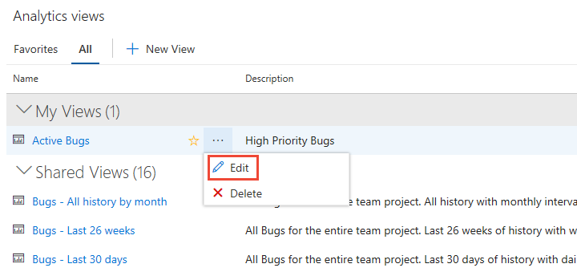
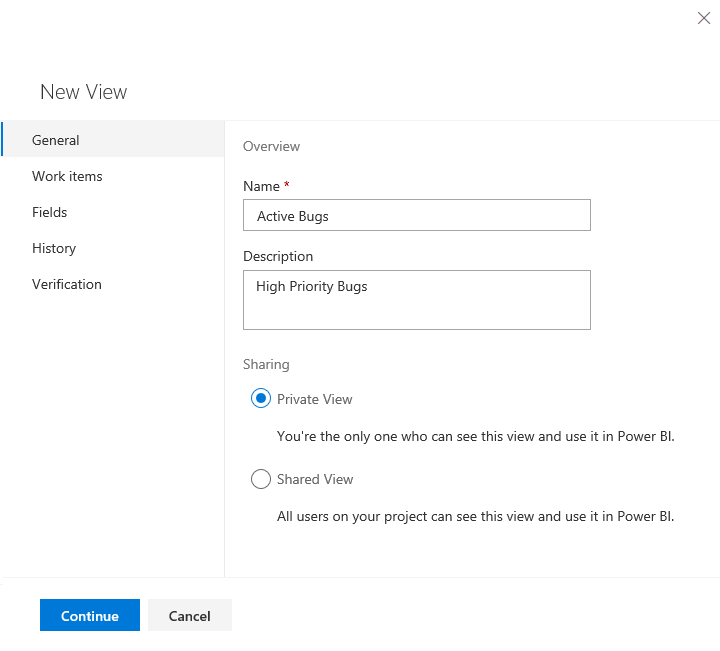
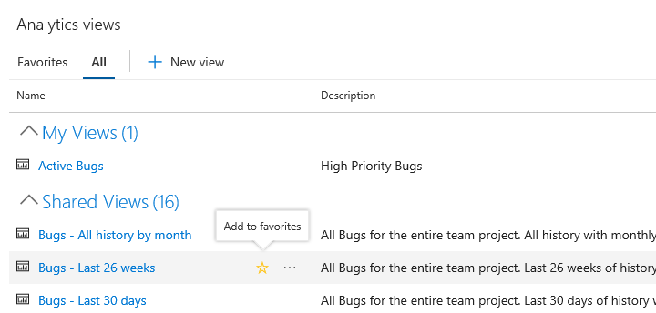

# Manage Analytics views 

[!INCLUDE [temp](../_shared/version-azure-devops.md)]

With Analytics views, you gain a simplified way to specify and share the filter criteria for a Power BI report based on the Analytics Service data store. The Analytics Service provides the reporting platform for Azure DevOps. 

[!INCLUDE [temp](../_shared/boards-disabled.md)]

Use this article to learn how to:

> [!div class="checklist"]
> * Meet prerequisites to access Analytics views
> * Open **Analytics views**
> * Edit an existing view
> * Share a view
> * Favorite a view
> * Manage permissions for a shared view
> * Delete a view

[!INCLUDE [temp](../_shared/analytics-prerequisites.md)] 

[!INCLUDE [temp](../_shared/analytics-open.md)] 

## Edit an existing view

The creator of a view and all members of the Project Administrators and Project Collection Administrators groups have permissions to edit, manage, and delete views.

1. From either the **Favorites** or **All** page, hover over the view you want to edit, click the  actions icon and choose the **Edit** option. You can also choose **Edit** from the Summary panel. 

	> [!div class="mx-imgBorder"]
	> 

2. You can edit any part of the view, in the same way you did to define a view. For details, see [Create an Analytics view.](analytics-views-create.md)

3. Save your changes.

	Refresh your Power BI report to access the changes you made to the view.

 > [!TIP]
 > If you remove fields from a view that are in use in the report, you'll need to update any Power BI report that references the view. 

<a id="share-view" />
## Share a view 

All contributors to a project can view shared views and create Power BI reports based on them. When you create a view, you can choose to make it private or shared. 

To share a private view, simply edit the view and change the sharing option to **Shared**. To unshare a view, switch the sharing option to **Private**.

<!--If you make a shared view private, any Power BI report connected to that view fails to refresh in Power BI.-->

> [!IMPORTANT]
> If you plan to share [Power BI reports or dashboards](/power-bi/service-share-dashboards) based on an Analytics view, make sure the view is **Shared**. Otherwise, you are the only one who can modify the view and manually refresh the data. We recommend sharing views to support shared reports and dashboards.

    > [!div class="mx-imgBorder"]
    > 

## Favorite a view

Favoriting an item provides a quick way to navigate to items you regularly visit. 
To favorite a view, hover over the view and choose the .
    
> [!div class="mx-imgBorder"]
> 

<a id="manage-permissions" />
[!INCLUDE [temp](_shared/manage-shared-view-permissions.md)]

## Delete a view

You can always delete a view you created. Once you delete a view, any Power BI report or dashboard that depends on the view will no longer refresh.

To delete a view, click the  actions icon and choose  **Delete** from the menu.

## Try this next
> [!div class="nextstepaction"]
> [Create a Power BI report using an Analytics view](data-connector-connect.md)

## Related articles
- [Create an Analytics view](analytics-views-create.md) 
- [Data available from the Analytics Service](data-available-in-analytics.md)
- [Grant permissions to access the Analytics service](./analytics-security.md)
- [Power BI integration overview](overview.md)

<!--- 
## Copy a view

For a quick start, you can copy any view including [default Analytics Views](./analytics-default-views.md) and edit it.

0. To copy a view click the  actions icon to open the copy panel.

1. Provide the copy name description.
1. Decide who can use this view. Set the radio to "Shared" if  you want to make this available to others. Learn more about [sharing Analytics Views](analytics-views-manage.md#share-views)and sharing option. All other definition is copied from the original view.

1. Click Copy to created the new copy. The copied view is detached from the original view. Even if you copy a view from "My views" to "Shared views", it's a new separate view.

--->
