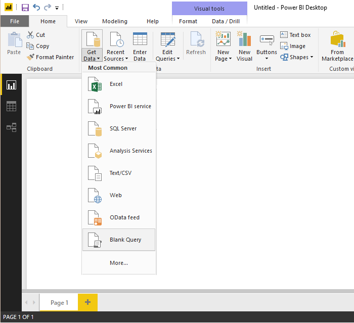
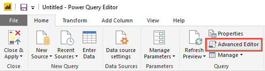
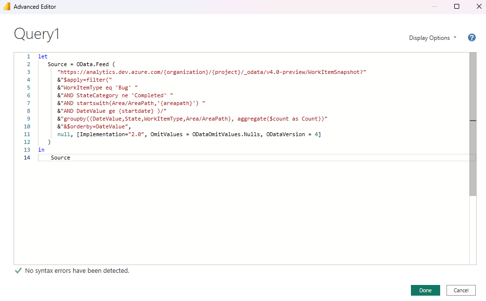
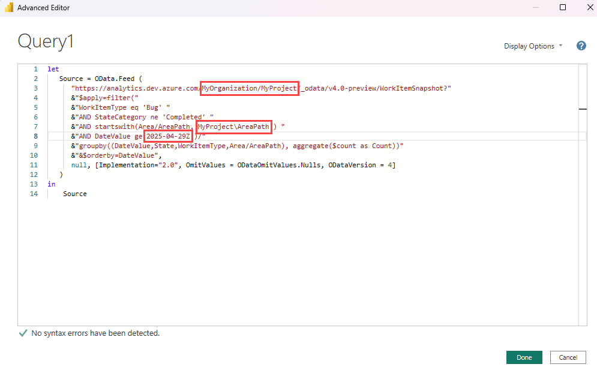
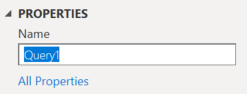
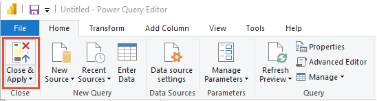

# Create a Power BI report with an OData query

[!INCLUDE [version-lt-eq-azure-devops](../../includes/version-lt-eq-azure-devops.md)]

In this quickstart, you create a bug trend report in Power BI Desktop by connecting to Azure DevOps Analytics with an OData query. The query uses server-side filtering and aggregation (`$apply`) to return only the data you need, which keeps refresh times short even for large projects.

If you don't have Power BI Desktop, you can [download it for free](/power-bi/desktop-what-is-desktop). For information about other connection methods, see [About Power BI integration](overview.md).

[!INCLUDE [ai-assistance-mcp-server-tip](../../includes/ai-assistance-mcp-server-tip.md)]

## Prerequisites  

::: moniker range="azure-devops"

|Category  | Requirements |
|-------------|-------------|
| **Access levels** | - [Project member](../../organizations/security/add-users-team-project.md).<br>- At least **Basic** access. |
| **Permissions** | **View Analytics** permission set to **Allow**. For more information, see [Grant permissions for Analytics access](./analytics-security.md) |
|**Tools** | - [Azure Boards enabled](../../organizations/settings/set-services.md)<br>- [Power BI Desktop](https://powerbi.microsoft.com/desktop)    |
|**Tasks**| Monitor work items over a specified period to generate a trend report. |

::: moniker-end

::: moniker range=" < azure-devops"

|Category  | Requirements |
|-------------|-------------|
| **Access levels** | - [Project member](../../organizations/security/add-users-team-project.md).<br>- At least **Basic** access. |
| **Permissions** | **View Analytics** permission set to **Allow**. For more information, see [Grant permissions for Analytics access](./analytics-security.md) |
|**Tools** | - [Analytics extension](../dashboards/analytics-extension.md). [**Project Collection Administrators**](../../organizations/security/change-organization-collection-level-permissions.md) can add and enable the service.<br>- [Power BI Desktop](https://powerbi.microsoft.com/desktop).<br>- [Azure Boards turned on](../../organizations/settings/set-services.md)  |
|**Tasks**| Monitor work items over a specified period to generate a trend report. |

::: moniker-end

## Create a Power BI query

1. In Power BI Desktop, select **Get Data** > **Blank Query**.

    > [!div class="mx-imgBorder"] 
    > 

1. In the Power Query Editor, select **Advanced Editor**.

    > [!div class="mx-imgBorder"] 
    > 

1. Replace the contents with the following query:

    ```
    let
       Source = OData.Feed (
          "https://analytics.dev.azure.com/{organization}/{project}/_odata/v4.0-preview/WorkItemSnapshot?"
          &"$apply=filter("
          &"WorkItemType eq 'Bug' "
          &"AND StateCategory ne 'Completed' "
          &"AND startswith(Area/AreaPath,'{areapath}') "
          &"AND DateValue ge {startdate} )/"
          &"groupby((DateValue,State,WorkItemType,Area/AreaPath), aggregate($count as Count))"
          &"&$orderby=DateValue",
          null, [Implementation="2.0", OmitValues = ODataOmitValues.Nulls, ODataVersion = 4]
       )
    in
        Source
    ```

    > [!div class="mx-imgBorder"] 
    > 

1. Replace the placeholder values in the query:

    | Placeholder | Replace with |
    |-------------|--------------|
    | `{organization}` | Your organization name |
    | `{project}` | Your team project name, or omit `/{project}` entirely for a cross-project query |
    | `{areapath}` | Your Area Path (format: `Project\Level1\Level2`) |
    | `{startdate}` | The start date for your trend report (format: `YYYY-MM-DDZ`, for example `2022-09-01Z`). Don't enclose in quotes. |

    > [!div class="mx-imgBorder"] 
    > 

1. Select **Done** to execute the query.

   Power BI might require you to authenticate. For more information, see [Client authentication options](client-authentication-options.md).

## Expand columns

The query groups results by `Area/AreaPath`, which returns **Area** as a nested record. You need to expand the record to flatten it into individual columns.

In the **Power Query Editor**, expand each column that shows *Record*:

1. Select the expand button on the **Area** column header, select the properties you want (for example, **AreaName** and **AreaPath**), and then select **OK**.

    > [!div class="mx-imgBorder"] 
    > 

	> [!NOTE]   
	> The available properties depend on the fields requested in the query. If you don't specify any properties, all properties are available. For more information, see [Areas](../analytics/entity-reference-boards.md#areas), [Iterations](../analytics/entity-reference-boards.md#iterations), and [Users](../analytics/entity-reference-general.md#users).

1. The table now contains the expanded fields.

    > [!div class="mx-imgBorder"] 
    > 

1. Repeat for any other columns that show *Record*.

## Rename fields and close

Optionally, rename columns and the query for clarity before loading the data.

1. Right-click a column header and select **Rename**.

	> [!div class="mx-imgBorder"] 
	> 

1. Rename the query from the default **Query1** to something more meaningful, such as **BugTrends**.

	> [!div class="mx-imgBorder"] 
	> 

1. Select **Close & Apply** to save the query and return to Power BI.

	> [!div class="mx-imgBorder"] 
	> 

## Create the report

Power BI shows you the fields you can report on. The following steps assume you didn't rename any columns.

:::image type="content" source="media/reports-boards/bug-trends-selections.png" alt-text="Screenshot of Power BI Visualizations and Fields selections for Bug trends report.":::

1. Select the **Line chart** visualization.
1. Add **DateValue** to **X-axis**.
    - Right-click **DateValue** and select **DateValue** rather than **Date Hierarchy**. Using **Date Hierarchy** groups dates by level (year, quarter, month, day) instead of showing each calendar date.
1. Add **State** to **Legend**.
1. Add **Count** to **Values**.
    - Right-click the **Count** field and ensure **Sum** is selected.

The following image shows a sample bug trends report:

:::image type="content" source="media/odatapowerbi-bugtrend-report.png" alt-text="Screenshot of Sample Bug trends line chart report.":::

[!INCLUDE [odata-ai-assistance](includes/odata-ai-assistance.md)]
 
## Next step

> [!div class="nextstepaction"]
> [Create an Open bugs report](sample-boards-openbugs.md)

## Related content

[!INCLUDE [temp](includes/sample-relatedarticles.md)]
