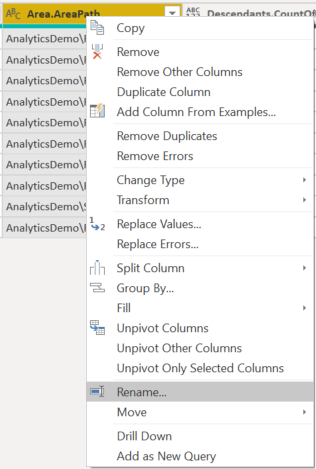

# Create a Power BI report with an OData Query

[!INCLUDE [version-gt-eq-2019](../../includes/version-gt-eq-2019.md)]

With Power BI Desktop, you can easily start creating reports for your project in Azure DevOps. 

If you don't have Power BI Desktop, [download](/power-bi/desktop-what-is-desktop) and install it for free.

## Prerequisites  

::: moniker range="azure-devops"

|Category  | Requirements |
|-------------|-------------|
| **Access levels** | - [Project member](../../organizations/security/add-users-team-project.md).<br>- At least **Basic** access. |
| **Permissions** | **View Analytics** permission set to **Allow**. For more information, see [Grant permissions for Analytics access](./analytics-security.md) |
|**Tools** | - [Azure Boards enabled](../../organizations/settings/set-services.md)<br>- [Power BI Desktop](https://powerbi.microsoft.com/desktop)    |
|**Tasks**| Monitor work items over a specified period to generate a trend report. |

::: moniker-end

::: moniker range=" < azure-devops"

|Category  | Requirements |
|-------------|-------------|
| **Access levels** | - [Project member](../../organizations/security/add-users-team-project.md).<br>- At least **Basic** access. |
| **Permissions** | **View Analytics** permission set to **Allow**. For more information, see [Grant permissions for Analytics access](./analytics-security.md) |
|**Tools** | - [Analytics extension](../dashboards/analytics-extension.md). [**Project Collection Administrators**](../../organizations/security/change-organization-collection-level-permissions.md) can add and enable the service.<br>- [Power BI Desktop](https://powerbi.microsoft.com/desktop).<br>- [Azure Boards turned on](../../organizations/settings/set-services.md)  |
|**Tasks**| Monitor work items over a specified period to generate a trend report. |

::: moniker-end

## Create a Power BI query
    
Create a Power BI query to pull the data into Power BI as follows:

1. Choose **Get Data**, and then **Blank Query**.

    > [!div class="mx-imgBorder"] 
    > 

2. From the Power BI Query editor, choose **Advanced Editor**.

    > [!div class="mx-imgBorder"] 
    > 

3. The Advanced Editor window opens.

    > [!div class="mx-imgBorder"] 
    > 

4. Replace the contents with the following query:
 
    ```
    let
       The query you provided has a syntax issue due to the placement of double quotes. Specifically, the `$apply` and `$orderby` parameters should be part of the URL string, but they are not correctly concatenated. Here is the corrected version:

```markdown
let
   Source = OData.Feed (
      "https://analytics.dev.azure.com/{organization}/{project}/_odata/v4.0-preview/WorkItemSnapshot?"
      &"$apply=filter("
      &"WorkItemType eq 'Bug' "
      &"AND StateCategory ne 'Completed' "
      &"AND startswith(Area/AreaPath,'{areapath}') "
      &"AND DateValue ge {startdate} )/"
      &"groupby((DateValue,State,WorkItemType,Area/AreaPath), aggregate($count as Count))"
      &"&$orderby=DateValue",
      null, [Implementation="2.0", OmitValues = ODataOmitValues.Nulls, ODataVersion = 4]
   )
in
    Source
```

   > [!div class="mx-imgBorder"] 
   > 

1. Substitute your values within the sample query.

    The sample query has strings that you must replace with your values:

    * `{organization}` - Your organization name 
    * `{project}` - Your team project name. Or omit `/{project}` entirely, for a cross-project query
    * `{areapath}` - Your Area Path. Format: Project\Level1\Level2
    * `{startdate}` - The date to start your trend report on. Format: YYYY-MM-DDZ. Example: `2022-09-01Z` represents 2022-September-01. Don't enclose in quotes.

    > [!div class="mx-imgBorder"] 
    > 

2. Choose **Done** to execute the query.

   Power BI might require you to authenticate. For more information, see [Client authentication options](client-authentication-options.md).

## Expand Area, Iteration, AssignedTo columns

The query returns several columns that you need to expand before you can use them in Power BI. Any entity pulled in using an `$expand` statement returns a record with potentially several fields. You need to expand the record to flatten the entity into its fields. Examples of such entities are: `AssignedTo`, `Iteration`, and `Area`. 

After closing the **Advanced Editor** and while remaining in the **Power Query Editor**, select the expand button on the entities you need to flatten.

1. For example, choose the expand button for **Area**, select the properties you want to expand, and choose **OK**. Here, we choose `AreaName` and `AreaPath` to flatten. The `AreaName` property is similar to the **Node Name** field.

    > [!div class="mx-imgBorder"] 
    > 

	> [!NOTE]   
	> The available properties to select depend on the properties requested to return in the query. If you don't specify any properties, then all properties are available. For more information about these properties, see the following metadata references: [Areas](../analytics/entity-reference-boards.md#areas), [Iterations](../analytics/entity-reference-boards.md#iterations), and [Users](../analytics/entity-reference-general.md#users).
	
1. The table now contains entity fields.

    > [!div class="mx-imgBorder"] 
    > 

1. Repeat steps 1 through 3 for all fields representing entities that need to expand. These fields appear with *Record* listed in the table column when unexpanded. 

## Rename fields and query, then Close & Apply

When finished, you might choose to rename columns. 

1. Right-click a column header and select **Rename...**

	> [!div class="mx-imgBorder"] 
	> 

1. You also might want to rename the query from the default **Query1**, to something more meaningful. 

	> [!div class="mx-imgBorder"] 
	> 

1. Once done, choose **Close & Apply** to save the query and return to Power BI.

	> [!div class="mx-imgBorder"] 
	> 

## Create the report

Power BI shows you the fields you can report on. 

> [!NOTE]   
> The following example assumes that no one renamed any columns. 
> :::image type="content" source="media/reports-boards/bug-trends-selections.png" alt-text="Screenshot of Power BI Visualizations and Fields selections for Bug trends report. ":::

For a simple report, do the following steps:

1. Select Power BI Visualization **Line chart**. 
1. Add the field "DateValue" to **Axis**
    - Right-click "DateValue" and select "DateValue," rather than Date Hierarchy
1. Add the field "State" to **Legend**
1. Add the field "Count" to **Values**
    - Right-click WorkItemId field and ensure **Sum** is selected

Example report:

:::image type="content" source="media/odatapowerbi-bugtrend-report.png" alt-text="Screenshot of Sample Bug trends line chart report.":::
 
## Next steps

> [!div class="nextstepaction"]
> [Create an Open bugs report](sample-boards-openbugs.md)

## Related articles

[!INCLUDE [temp](includes/sample-relatedarticles.md)]
