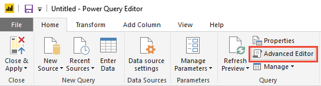
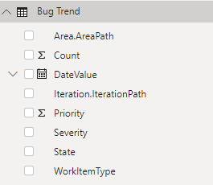

# Create a Power BI report with an OData Query

[!INCLUDE [temp](../_shared/version-azure-devops.md)]

With Power BI Desktop, you can easily start creating reports for your project in Azure DevOps. 

If you don't have Power BI Desktop, you can [download](/power-bi/desktop-what-is-desktop) and install it for free.
 
Follow the steps to create a report in Power BI desktop that shows a **daily trend of bugs**.

> [!div class="checklist"] 
> * Create a Power BI query
> * Create Power BI transforms
> * Create an Open Bugs trend report

<a id="prerequisites">  </a>

## Prerequisites  

In order to create a Power BI report, you must meet the following criteria:  

::: moniker range="azure-devops"

- You must be a member of a project. If you don't have a project yet, create one. See [Sign up for free](/azure/devops/user-guide/sign-up-invite-teammates). 
- If you haven't been added as a project member, [get added now](/azure/devops/organizations/accounts/add-organization-users-from-user-hub). Anyone with access to the project, except Stakeholders, can view Analytics views.
- Have the **View Analytics** permission set to **Allow**. See [Grant permissions  to access Analytics](/azure/devops/report/powerbi/analytics-security).
- **Boards** must be enabled. To re-enable it, see [Turn an Azure DevOps service on or off](../../organizations/settings/set-services.md). 
- Have installed *Power BI Desktop* *October 2018 Update* or later version. You can download this client application from the official [Power BI Desktop download page](/power-bi/desktop-what-is-desktop).
- Have tracked work items for some period of time on which to generate a trend report. 

::: moniker-end

::: moniker range="azure-devops-2019"

- You must be a member of a project. If you don't have a project yet, [create one](/azure/devops/organizations/projects/create-project). 
- If you haven't been added as a project member, [get added now](/azure/devops/organizations/security/add-users-team-project). Anyone with access to the project, except Stakeholders, can view Analytics views.
- Have [enabled or installed Analytics](../dashboards/analytics-extension.md). You must be an account owner or a member of the [Project Collection Administrator group](/azure/devops/organizations/security/set-project-collection-level-permissions) to add extensions or enable the service.
- **Boards** must be enabled. To re-enable it, see [Turn an Azure DevOps service on or off](../../organizations/settings/set-services.md).
- Have the **View Analytics** permission set to **Allow**. See [Grant permissions  to access Analytics](/azure/devops/report/powerbi/analytics-security).
- Have installed *Power BI Desktop* *October 2018 Update* or later version. You can download this client application from the official [Power BI Desktop download page](/power-bi/desktop-what-is-desktop).
- Have tracked work items for some period of time on which to generate a trend report. 

::: moniker-end


## Create a Power BI Query
    
Create a Power BI Query to pull the data into Power BI as follows:

1. Choose **Get Data**, and then **Blank Query**.

    > [!div class="mx-imgBorder"] 
    > 

2. From the Power BI Query editor, choose **Advanced Editor**.

    > [!div class="mx-imgBorder"] 
    > 

3. The Advanced Editor window opens.

    > [!div class="mx-imgBorder"] 
    > 

4. Replace the contents with the following query.
 
    ```
    let
       Source = OData.Feed ("https://analytics.dev.azure.com/{organization}/{project}/_odata/v3.0-preview/WorkItemSnapshot? "
            &"$apply=filter( "
                &"WorkItemType eq 'Bug' "
                &"and StateCategory ne 'Completed' "
                &"and startswith(Area/AreaPath,'{areapath}') "
                &"and DateValue ge {startdate}  "
                &") "
            &"/groupby( "
                &"(DateValue,State,WorkItemType,Priority,Severity,Area/AreaPath,Iteration/IterationPath,AreaSK), "
                &"aggregate($count as Count) "
                &") "
        ,null, [Implementation="2.0",OmitValues = ODataOmitValues.Nulls,ODataVersion = 4]) 
    in
        Source
    ```

    > [!div class="mx-imgBorder"] 
    > 

5. Substitute your values within the sample query.

    The sample query has strings that you must replace with your values:

    * {organization} - Your organization name 
    * {project} - Your team project name. Or omit "/{project}" entirely, for a cross-project query
    * {areapath} - Your Area Path. Format: Project\Level1\Level2
    * {startdate} - The date to start your trend report on. Format: YYYY-MM-DDZ. Example: 2019-07-01Z represents 2019-July-01. Do not enclose in quotes.

    > [!div class="mx-imgBorder"] 
    > 

6. Choose **Done** to execute the query.

    If you have never connected to your account, Power BI may require you to authenticate. See [Client authentication options](client-authentication-options.md) for more information.

## Create Power BI transforms

[!INCLUDE [temp](_shared/sample-expandcolumns.md)]

[!INCLUDE [temp](_shared/sample-finish-query.md)]


## Create the report

Power BI shows you the fields you can report on. 

> [!NOTE]   
> The example below assumes that no one renamed any columns. 

> [!div class="mx-imgBorder"] 
> 

For a simple report, perform the following steps:

1. Select Power BI Visualization **Line chart**. 
1. Add the field "DateValue" to **Axis**
    - Right click "DateValue" and select "DateValue", rather than Date Hierarchy
1. Add the field "State" to **Legend**
1. Add the field "Count" to **Values**
    - Right click WorkItemId field and ensure **Sum** is selected

The example report:

> [!div class="mx-imgBorder"] 
> 

[!INCLUDE [temp](_shared/sample-multipleteams.md)]

<a id="q-a">  </a>
## Try this next
> [!div class="nextstepaction"]
> [Create an Open bugs report](sample-boards-openbugs.md)


## Related articles

[!INCLUDE [temp](_shared/sample-relatedarticles.md)]
