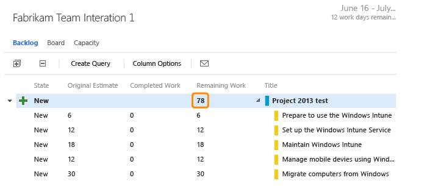
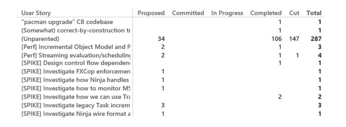
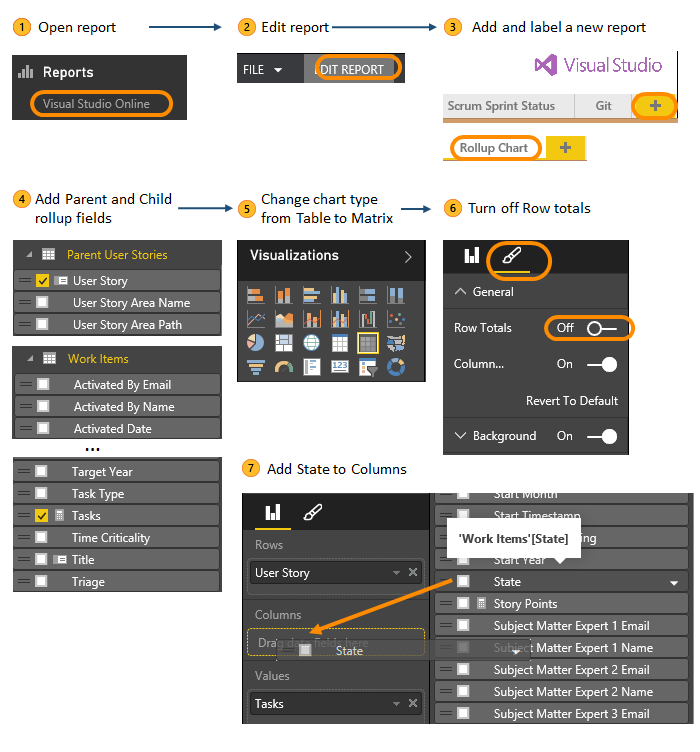
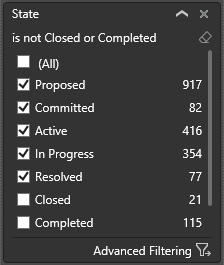

# Create rollup charts

**VSTS**
[!INCLUDE [temp](../_shared/content-pack-deprecation.md)]

Rollup provides summed values of select fields for all child work items of a parent. You can create rollups based on counts of work items or selected measures, such as Story Points, Effort, Size for backlog items and Original Estimate, Remaining Work, Completed Work for tasks. 

Natively, VSTS provides rollup of Remaining Work for tasks on the Task board. 

With Power BI, you can create additional rollup charts for those [supported rollup paths](#supported-rollup-paths).

##Rollup count of tasks per user story  

Here's an example that shows the number of child tasks and their state for each user story. Unparented tasks are also listed.  

 

You can create this type of rollup chart by following steps  through  outlined below.  
  
Optionally, can also add different measures such as Completed Work or Remaining work to see that information instead of just counts.

##Basic steps to create a rollup chart  

The following image shows the basic steps to create a rollup chart. In step , you choose the parent and child work item types that will filter the rollup. For example, by choosing Parent User Stories>User Story and Work Items/Task, you get a table that will rollup the count of Tasks that are children of each user story.   

After you have your initial chart, you can change the chart type from Table to Matrix and add the State field to the Column to expand the number of columns in the chart. 

If you use the [Scrum](../../work/work-items/guidance/scrum-process.md) or 
[CMMI](../../work/work-items/guidance/cmmi-process.md) processes, you can create similar charts by first choosing the Parent Product Backlog Items/Product Backlog or Parent Requirements/Requirement fields for the first column of the matrix in . 

if you're new to Power BI, go [here to Connect to Power BI](connect-vso-pbi-vs.md).  

You can create Power BI rollup charts for data stored in VSTS. To access similar charts for on-premises TFS, see [Rollup of work and other fields](https://msdn.microsoft.com/library/dn217871.aspx). 

##Supported rollup paths  
The VSTS data model supports rollup along these pre-defined paths.  
- **Agile process:** Epics > Features > User Stories > Bugs > Tasks

- **Scrum process:** Epics > Features > Product Backlog Items > Bugs > Tasks

- **CMMI process:**  
	- Epics > Features > Requirements > Bugs > Tasks  
	- Issues > Tasks  
	- Epics > Features > Requirements > Change Requests > Issues > Bugs > Tasks

Rollups within any one of these chains will work as well. For example, child Tasks of Epics will rollup to the Epic level.  

Rollup doesn't support those parent-child relationships that don't follow this structure. For example, rollup isn't supported for parent Risks and child tasks (CMMI process). Also, the rollup data model doesn't support custom parent-child links and hierarchies.

> [!TIP]    
> Use the **Parent...** dimensions only for hierarchical charts. Use the **Work Items** dimension for all other standard charts.   

 
##Apply State filter 

To focus the rollup chart to count only active or in progress tasks from, add the state filter and check those values associated with being Closed, Completed, Cut, or Done. For example: 

 

## Related notes

The sprint burndown chart based on Story Points provides you with a daily update of your sprint progress when you don't break your stories down into tasks. You can update the chart further by adding Work Item Type as an additional filter to differentiate the story point count for bugs versus user stories.  

### Get started using Power BI and the VSTS connector 
- [Create dashboards and reports](report-on-vso-with-power-bi-vs.md)
- [Add a page to a Power BI report](https://support.powerbi.com/knowledgebase/articles/474804-add-a-page-to-a-power-bi-report)  
- [Pin a tile to a Power BI dashboard from a report](https://support.powerbi.com/knowledgebase/articles/430323-pin-a-tile-to-a-power-bi-dashboard-from-a-report)  
- [Save a report in Power BI](https://support.powerbi.com/knowledgebase/articles/444112-save-a-report-in-power-bi)  

### Rollup requirements
To support rollup of different measures such as Story Points, Effort, Size, Completed Work, or Remaining Work, structure your work items according to the following recommendations:  
- Use parent-child links to link work items that contain values that you want to rollup.  
- Add required fields to the WITs that will capture the rollup values. Default fields used to schedule work are only present on the task work item. These fields are:  
	- Original Estimate (Microsoft.VSTS.Scheduling.OriginalEstimate): The amount of work required to complete a task. (Agile and CMMI)  
	- Completed Work (Microsoft.VSTS.Scheduling.CompletedWork): The amount of work that has been spent implementing a task. (Agile and CMMI)   
	- Remaining Work (Microsoft.VSTS.Scheduling.RemainingWork): This field is used to support burndown charts.  
	If your team project was created using the Visual Studio Scrum process template, only Remaining Work is defined in the task.  
	To learn more about adding fields, see Modify or add a field to support queries, reports, and workflow. 
- Determine the unit of time used to track work and make sure it is used consistently across your team or organization. For example, you can track tasks using hours or days.  
- Determine if you want to make rollup values read-only on the work item form. By making them read-only you prevent users from entering inaccurate data. You make fields read-only using the Control field Readonly attribute.  