# Create a Power BI report filtered by team using a custom Analytics view

[!INCLUDE [temp](../_shared/version-azure-devops.md)]

Analytics views support field criteria to filter work items based on teams. However, there is no team-specific field available to support filtering a Power BI report. While each work item is associated with a specific area path, area paths can be associated with more than one team. Due to this one-to-many associations, the Analytics service doesn't provide a team-specific field. 

However, you can still filter on a team using the steps provided in this article. The general process introduces a mapping table between the [Analytics view](create-quick-report.md) and the [teams](../extend-analytics/data-model-analytics-service.md) entity.

> [!NOTE]  
> In a similar manner, limitations exist in determining the board-specific column of a work item within an Analytics view. However, the guidance provided in this article won't work for board locations due to the dependency on the selected historical data in the view. 

## Add the AreaSK field to your Analytics view 

The default fields included within the default Analytics views don't include the fields necessary to create the relationship mapping in Power BI. Use the following steps to introduce the mapping table to your model and build the necessary relationships to support filtering on teams.

1. [Edit](analytics-views-manage.md) your Analytics view.
2. In the **Field** tab add the *AreaSK* field.  
3. Save the updated view.
4. Load the Power BI pbix file associated with your Analytics view in Power BI Desktop.
5. Refresh the view and verify that the *AreaSK* field appears in the.  

## Add tables for teams 

The next step is to add the *Teams* entity to the Power BI data model and generate the necessary mapping table to create the relationships in Power BI. This process requires that you add three queries through the Power Query Editor.  

1. Load the Power BI pbix file associated with your view in Power BI Desktop.  
2. Choose **Get Data**.  
3. Select the **Blank Query** option.

    > [!div class="mx-imgBorder"]  
    > 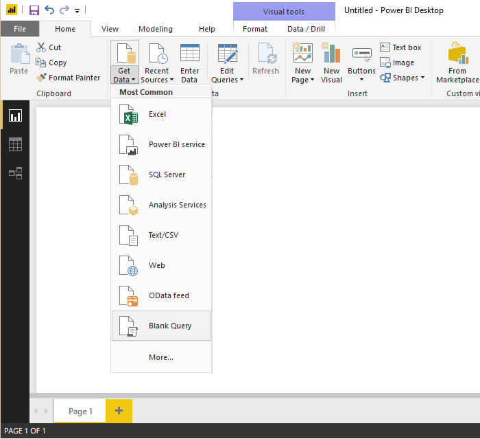 

4. Open **Advanced Editor**.    
 
    > [!div class="mx-imgBorder"]    
    >  

5. Add the following query code, substituting organization information and team names to match your Analytics view. 
   
    ```Query
    let
        #"Get table" = VSTS.Feed("https://{OrganizationName}.analytics.visualstudio.com/_odata/v1.0/Teams?$select=TeamName,TeamSK&$filter=TeamName eq '{TeamName1}' or TeamName eq '{TeamName2}"),
        #"Select columns" = Table.SelectColumns(#"Get table", {"TeamName", "TeamSK"})
    in
        #"Select columns"
    ```

6. Rename the query to *Teams*.

    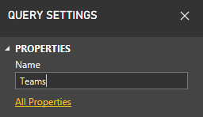

7. From the **Home** tab, choose **New Source** to add another blank query and rename it to 
 *Areas*. 

8. Open **Advanced Editor** and add the following query code, substituting organization information to match your view.

    ```Query
    let
        #"Get table" = VSTS.Feed("https://{OrganizationName}.analytics.visualstudio.com/_odata/v1.0/Areas?$select=AreaName,AreaSK"),
        #"Select columns" = Table.SelectColumns(#"Get table", {"AreaName", "AreaSK"})
    in
        #"Select columns"
    ```

9. From the **Home** tab, choose **New Source** to add another blank query and rename it to *AreaToTeam*.

10. Open **Advanced Editor** and add the following query code, substituting organization information to match your view.

    ```Query
    let
        #"Get table" = VSTS.Feed("https://{OrganizationName}.analytics.visualstudio.com/_odata/v1.0/Areas?$select=AreaSK&$expand=Teams($select=TeamSK)"),
        #"Select columns" = Table.SelectColumns(#"Get table", {"AreaSK", "Teams"}),
        #"Expand Teams" = Table.ExpandTableColumn(#"Select columns", "Teams", {"TeamSK"}, {"TeamSK"})
    in
        #"Expand Teams"
    ```

    > [!IMPORTANT]  
    > The process of adding the three queries will only work for Area Paths that map to 1,000 teams or fewer. 

11. On the Home tab, choose **Close & Apply**.   

	> [!div class="mx-imgBorder"]  
	> 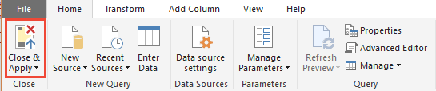   

16. Next, choose **Refresh** to add *AreaSK* to the view.  


## Create the Power BI relationship mappings

The last step is to create the necessary relationships in Power BI.

1. Open the **Relationships** view. 

    > [!div class="mx-imgBorder"]  
    > 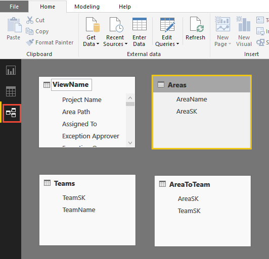 

2. From the **Home** tab, open **Manage Relationships**.

	> [!div class="mx-imgBorder"]  
	> 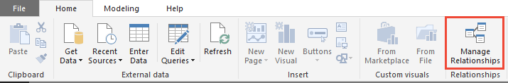 
	
3. In the Manage Relationships dialog:  
	a. Delete any relationships that might have been automatically detected.   
	b. Choose **New** to create a bidirectional *Many to One* relationship between your *View* and *Area*. To learn more, see [Bidirectional cross-filtering using DirectQuery in Power BI Desktop](/power-bi/desktop-bidirectional-filtering).  

	> [!div class="mx-imgBorder"]  
	> 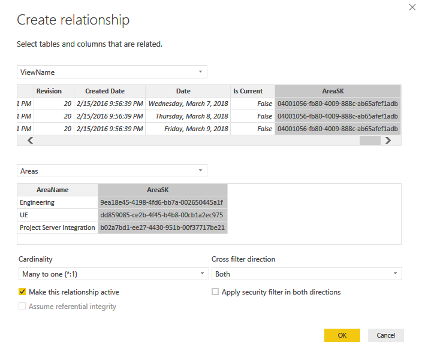

4. Create a bidirectional *One to Many* relationship between *Areas* and *AreaToTeam*.

	> [!div class="mx-imgBorder"]  
	> 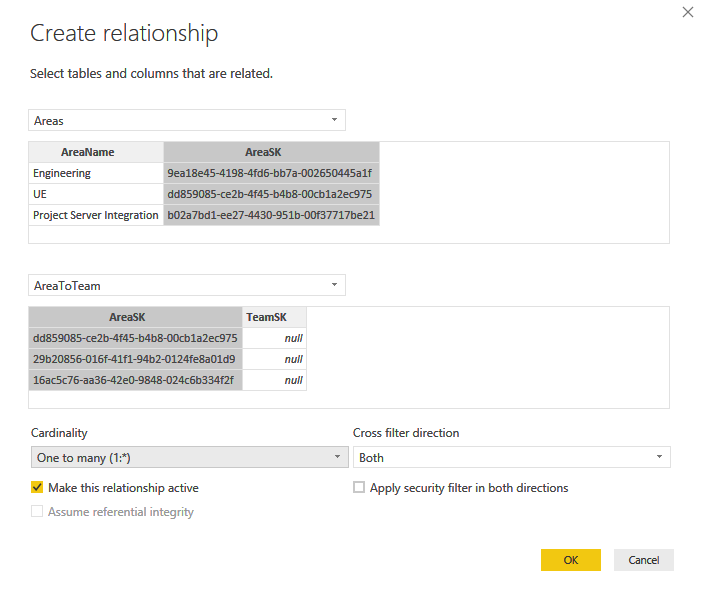 	 

5. Create a bidirectional *Many to One* relationship between *AreaToTeam* and *Teams*.  

	> [!div class="mx-imgBorder"]  
	> 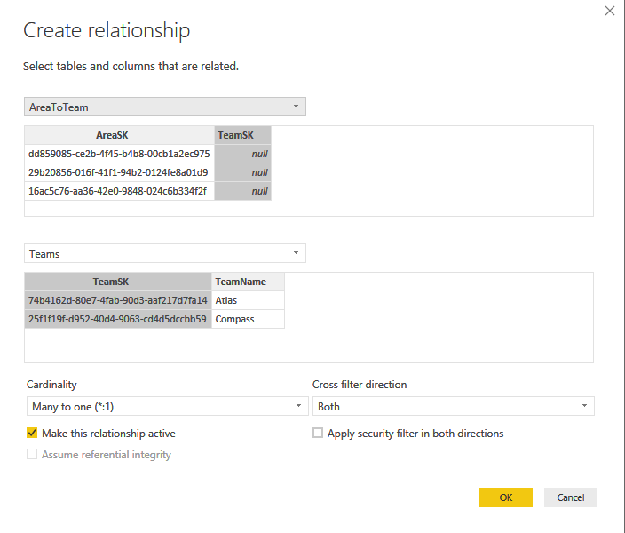 

6. Return to the **Report** view, and open the context menu for *TeamName* and *TeamSK* fields and choose the **Hide** option. <!--- Hide Area and AreaToTeam Tables --> 

    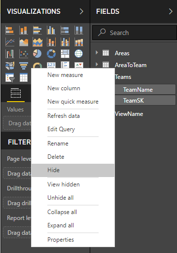

7. Hide corresponding SKs in your *View* and *Team* tables. 

## Filter a report view on teams

Now that you have the mappings in place, you can filter a report view based on *Teams*. To begin, start by adding a slicer to your report based on *Team Name* (remove Blank if needed).

> [!div class="mx-imgBorder"]  
> 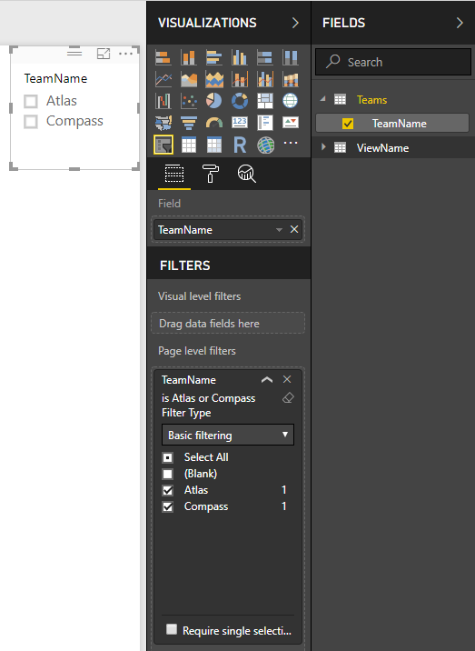  

Now you can filter all visualization on a report using a slicer or any other supported filtering functionality in Power BI.

> [!div class="mx-imgBorder"]  
> 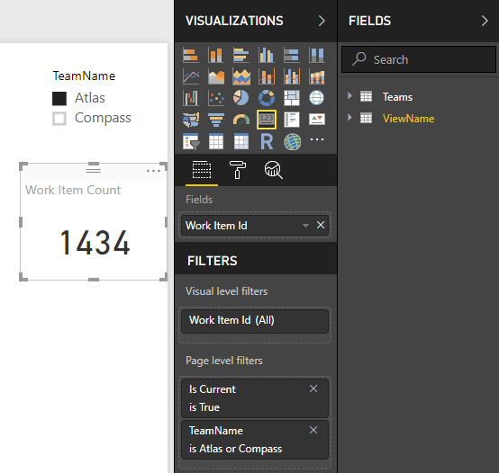  
 

## Related articles

- [Power BI integration overview](overview.md) 
- [Create Analytics views](analytics-views-create.md)
- [Get started with Power BI Desktop](/power-bi/desktop-getting-started)
- [Bidirectional cross-filtering using DirectQuery in Power BI Desktop](/power-bi/desktop-bidirectional-filtering)