# Calculate time-in-state for an existing Analytics view

[!INCLUDE [temp](../_shared/version-azure-devops.md)]

The time a work item spends in a specific state or series of states is an important aspect for understanding efficiency. The Analytics widgets, [Cycle Time and Lead Time](../dashboards/cycle-time-and-lead-time.md), provide some measures of time-in-state. However, these widgets may not have the level of detail that you want. 

This article provides a series of recipes using DAX calculations to evaluate time spent by work items in any combination of states. Specifically, you'll learn how to add the following calculated columns and one measure and use them to generate various trend charts. (All fields are calculated columns except the first one listed.) 

- *Work Items Count* (measure) 
- *State Sort Order*  
- *Date Previous*   
- *Date Diff in Days*    
- *Is Last Day in State*    
- *State Time in Days*    
- *State Previous*   
- *State Changed*  
- *State Flow*  
- *State Change Count*  
- *State Change Count - Last Proposed*
- *State Restart Time in Days*
- *State Time in Days - In Progress*   

> [!IMPORTANT]  
> * When adding a calculated column or measure per the examples shown in this article, replace *View Name* with the table name for the Analytics view. For example, replace *View Name* with *Stories - Last 30 days*.<br/><br/>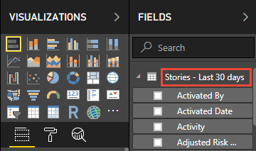)
> * Analytics views do not support intra-day revisions. These examples have the most precision when using a Daily interval for the Analytics view. 
> * All intra-day or intra-period (weekly/monthly) revisions are ignored by the calculations. This can result in unexpected results for specific scenarios like a work item showing no time "In Progress" when a work item is "In Progress" for less than a day.   
> * Power BI default aggregations are used whenever possible instead of building measures.  
> * Some calculations will include +0 to ensure that a numeric value is included for every row instead of BLANK.
> You may need to revise some of the calculated column definitions based on the workflow states used by your project. For example, if your project uses 'New", 'Active' and 'Closed' in place of 'Proposed', 'In Progress', and 'Completed'. 

## Add the *Work Items Count* measure 

To simplify quickly generating reports, we designed Analytics views to work with default aggregations in Power BI. To illustrate the difference between a default aggregation and a measure, we start with a simple work item count measure.

1. Load the Power BI pbix file associated with your view in Power BI Desktop. For details, see [Connect with Power BI Data Connector](data-connector-connect.md).

2. From the Modeling tab **Calculations** section of the ribbon, choose **New Measure**.

    > [!div class="mx-imgBorder"]  
    > 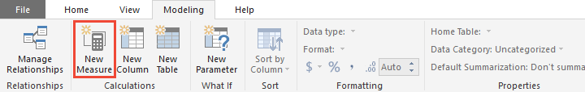  

3. Replace the default text with the following code and then click the  checkmark.

    ```DAX  
    Work Items Count = 
    CALCULATE (
        COUNTROWS ( 'View Name' ),
        LASTDATE ( 'View Name'[Date] )
    )
    ```

	The *Work Items Count* measure uses the [`CALCULATE`](https://msdn.microsoft.com/query-bi/dax/calculate-function-dax), [`COUNTROWS`](https://msdn.microsoft.com/query-bi/dax/countrows-function-dax),  and [`LASTDATE`](https://msdn.microsoft.com/query-bi/dax/lastdate-function-dax) DAX functions which are described in more detail [later in this article](#dax-functions).

	> [!NOTE]   
	> Remember to replace *View Name* with the table name for the Analytics view. For example, here we replace *View Name* with *Stories - Last 30 days*. 

    > [!div class="mx-imgBorder"]  
    > 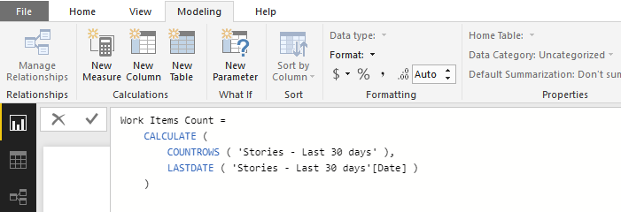

### Understand the difference between a measure and a calculated column

Before describing the additional functions you'll create, you'll want to understand the difference between a [measure and a calculated column](https://www.sqlbi.com/articles/calculated-columns-and-measures-in-dax/). Specifically, a measure always evaluates the entire table where a calculated column is specific to a single row. 

Compare the *Work Items Count* measure with the default count aggregation based on the *Work Item ID*:

> [!div class="mx-imgBorder"]  
> 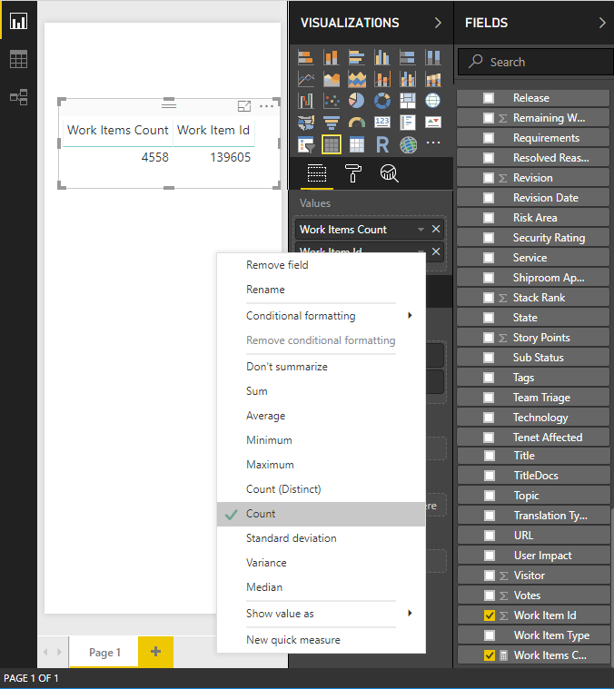 

To get the correct count using a default aggregation, you apply the filter *Is Current* equals 'True'. This pattern of applying filters to a default aggregation will be the basis for many of the examples provided in this article.

> [!div class="mx-imgBorder"]  
> 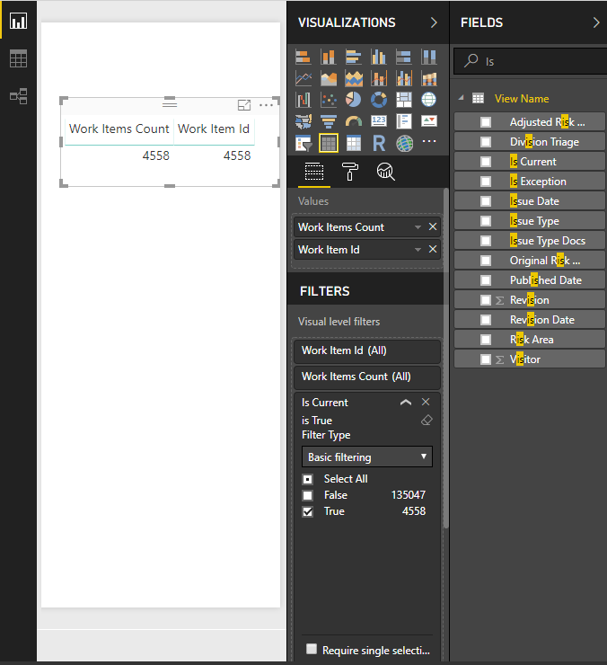 

## Add *State Sort Order*  

By default, Power BI will show states sorted alphabetically in a visualization. This can be misleading when you want to visualize time in state and *Proposed* shows up after *In Progress*.  

The following steps will help you resolve this issue.

1. Verify that the *State Category* field is included in the Analytics view. This field is included in all default shared views. 

2. Choose **New Column** and replace the default text with the following code and then click the  checkmark.

    ```DAX  
    State Sort Order =  
    SWITCH (  
        'View Name'[State Category],  
        "Proposed", 1,  
        "InProgress", 2,  
        "Resolved", 3,  
        4  
    )  
    ``` 

	> [!NOTE]   
	> You may need to revise the definition if you need more granularity than *State Category* provides.  *State Category* provides correct sorting across all work item types regardless of any *State* customizations.

4. Open the **Data** view and select the *State* field.

    > [!div class="mx-imgBorder"]  
    > 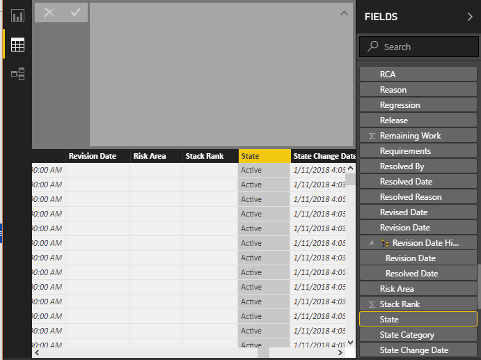

5. From the **Modeling** tab, choose **Sort by Column** and then select the *State Sort Order* field.

    > [!div class="mx-imgBorder"]  
    > 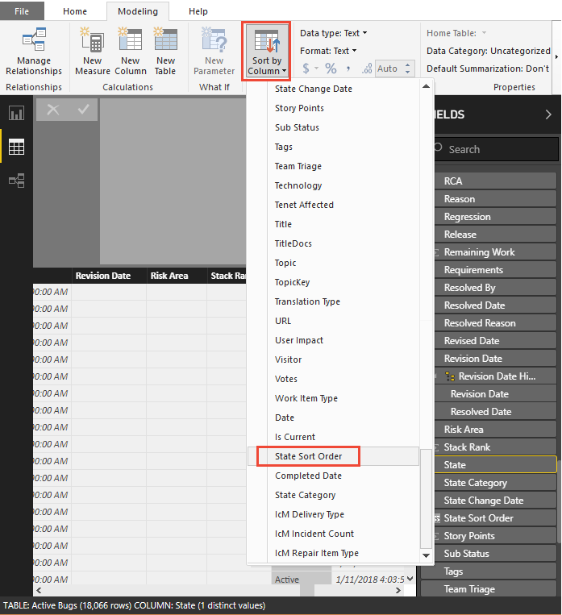

<a id="date-previous" />

## Add *Date Previous*  

The next step for calculating time-in-state requires mapping the previous interval (day, week, month) for each row of data in the dataset. This is a very simple calculation using a calculated column. Typically, you would define this column as shown. 

> [!div class="tabbedCodeSnippets"]   
```DAX  
Date Previous  = 
PREVIOUSDAY ( 'View Name'[Date] )
```

However, this approach has two main problems:  
- It works only for daily periods.  
- It does not handle gaps in the data. For example, if a work item is moved between projects.  

To resolve these problems, the calculated column should find the previous day by scanning the *Date* field. 

To add the *Date Previous* calculated column, from the **Modeling** tab, choose **New Column** and then replace the default text with the following code and click the  checkmark.

```DAX  
Date Previous =
CALCULATE (
    MAX ( 'View Name'[Date] ),
        ALLEXCEPT ( 'View Name', 'View Name'[Work Item Id] ),
        'View Name'[Date] < EARLIER ( 'View Name'[Date] )
)
```

This calculated column uses three DAX functions, [`MAX`](https://msdn.microsoft.com/query-bi/dax/max-function-dax), [`ALLEXCEPT`](https://msdn.microsoft.com/query-bi/dax/allexcept-function-dax), and  [`EARLIER`](https://msdn.microsoft.com/query-bi/dax/earlier-function-dax), described in more detail [later in this article](#dax-functions). Keep in mind that because this is a calculated column it is run for each and every row in the table and each time it is run it has the context of that specific row. 

> [!div class="mx-imgBorder"]  
> 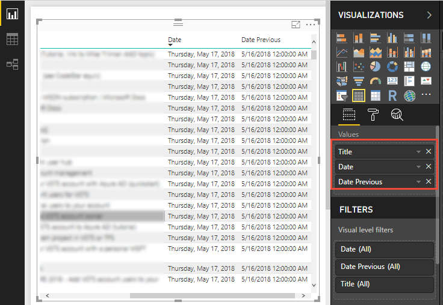 

> [!TIP] 
> From the context menu for the *Date* and *Previous Date* fields, choose **Date** (instead of **Date Hierarchy**) to see a single date for these fields.   

<a id="date-diff-in-days" />
## Add *Date Diff in Days*  

*Date Previous* calculates the difference between the previous and current date for each row. With *Date Diff in Days*, we'll calculate a count of days between each of those periods. For most rows in a daily snapshot, the value will equal 1. However, for many work items which have gaps in the dataset, the value will be larger than 1.  

> [!IMPORTANT]  
> Requires that you have added the *Date Previous* calculated column to the table.

It is important to consider the first day of the dataset where *Date Previous* is blank. In this example we give that row a standard value of 1 to keep the calculation consistent.

From the **Modeling** tab, choose **New Column** and then replace the default text with the following code and click the  checkmark.

> [!div class="tabbedCodeSnippets"]   
```DAX 
Date Diff in Days =
IF (
    ISBLANK ( 'View Name'[Date Previous] ),
    1,
    DATEDIFF (
        'View Name'[Date Previous],
        'View Name'[Date],
        DAY
    )
)
```

This calculated column uses the [`ISBLANK`](https://msdn.microsoft.com/query-bi/dax/isblank-function-dax) and [`DATEDIFF`](https://msdn.microsoft.com/query-bi/dax/datediff-function-dax) DAX functions described [later in this article](#dax-functions).

## Add *Is Last Day in State*  

In this next step, we calculate if a given row represents the last day a specific work item was in a state. This supports default aggregations in Power BI with the next column we'll add, the *State Time in Days*.

From the **Modeling** tab, choose **New Column** and then replace the default text with the following code and click the  checkmark.

> [!div class="tabbedCodeSnippets"]   
```DAX 
Is Last Day in State = 
ISBLANK (CALCULATE (
    COUNTROWS ( 'View Name' ),
        ALLEXCEPT ( 'View Name', 'View Name'[Work Item Id] ),
        'View Name'[Date] > EARLIER ( 'View Name'[Date] ),
        'View Name'[State] = EARLIER ( 'View Name'[State] )
))
```

## Add *State Time in Days*  

The time that a work item spent in a specific state can now be calculated by summing the *Date Diff in Days* for each work item. This calculation will include all of the time spent in a specific state even if it has switched between states multiple times. It is possible to evaluate each row as a trend using *Date* or the latest information by using *Is Last Day In State*.

> [!IMPORTANT]  
> Requires that you have added the *Date Diff in Days* and *Is Last Day in State* calculated columns to the table.

From the **Modeling** tab, choose **New Column** and then replace the default text with the following code and click the  checkmark.

> [!div class="tabbedCodeSnippets"]   
```DAX 
State Time in Days = 
CALCULATE (
    SUM ( 'View Name'[Date Diff in Days] ),
    ALLEXCEPT ( 'View Name', 'View Name'[Work Item Id] ),
    'View Name'[Date] <= EARLIER ( 'View Name'[Date] ),
    'View Name'[State] = EARLIER ( 'View Name'[State] )
) + 0
```

To demonstrate the *State Time in Days* column the report below includes a chart (top) showing a single work item and the state it was in on each day. The second chart (bottom) shows the time that this work item has spent in each state over time. Notice that the state increases by one each day until it moves to the next state.

> [!div class="mx-imgBorder"]  
> 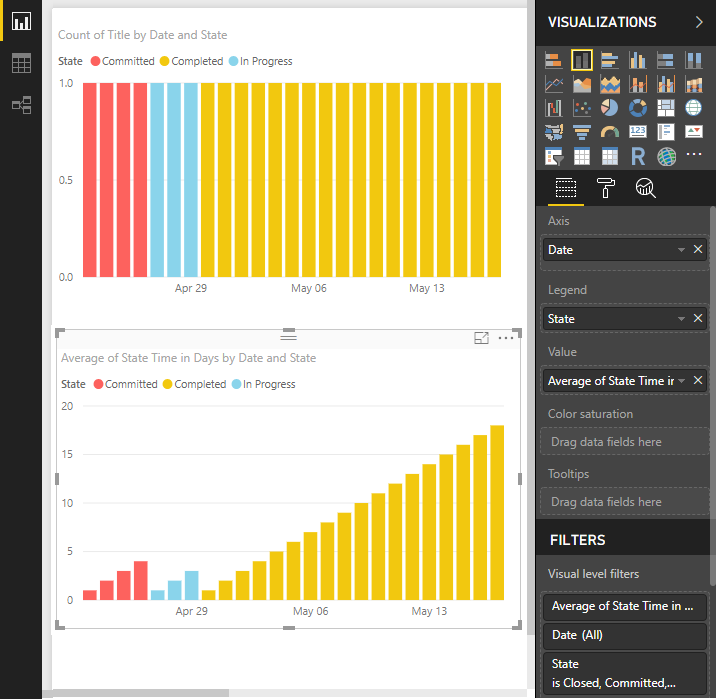

### Create a trend chart based on *State Time in Days*  

You can create a trend chart of an average time in state across all work items that were in that state on a given day using the *State Time in Days* calculated column in addition to *Date*.   

To demonstrate, the same visualization used above are updated to show an average across all work items. This representation can help build understanding of the amount of work in progress and how it impacts the overall time in state for the teams. This team has a pattern of committing to work that they aren't ready to start work on. (Note that the data for the following report is based on different data than the previous report.)

> [!div class="mx-imgBorder"]  
> 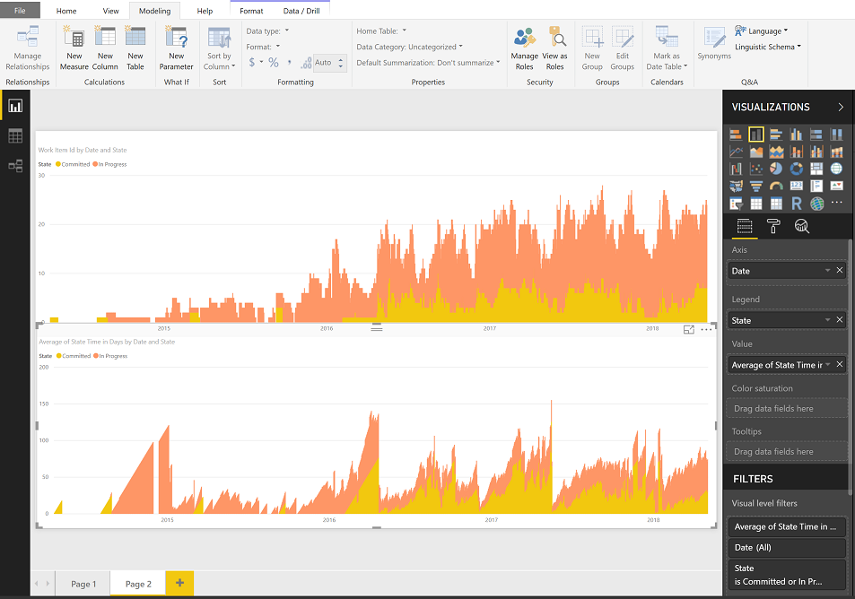


### Add *State Time in Days - Latest* (Is Last Day In State)

When evaluating time-in-state for each work item in a table or when filtered by a field like *Area Path*, do not use the *State Time in Days* column in an aggregation. The aggregation will use the value for every day the work item was in the state. For example, if a work item was *In Progress* on Monday and moved to *Completed* on Thursday, the time-in-state is 3 days, but the sum of *State Time in Days* column is 6 days (1+2+3) which is clearly incorrect.

> [!div class="mx-imgBorder"]  
> 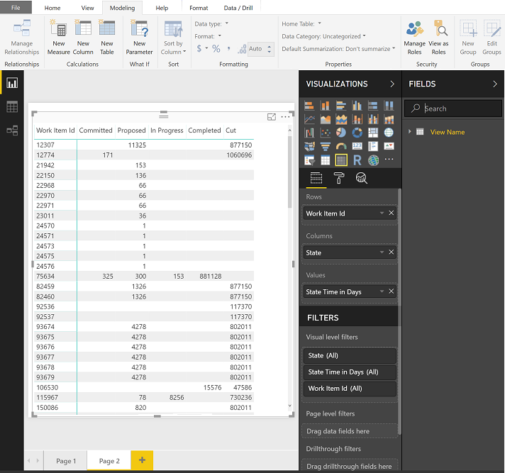 

To resolve this issue, use *State Time in Days* and apply the filter *Is Last Day In State* equals 'True'. This eliminates all the historical data necessary for a trend and focuses instead on just the latest value for each state.

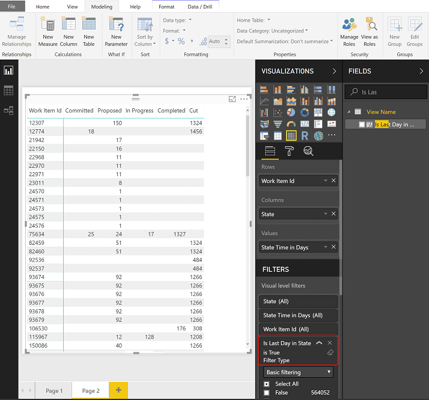 

### Add *State Time in Days - In Progress*

In the examples above *State Time in Days* for a given work item is only counted during the period of time when the work item was in that specific state. If your goal is to have the time-in-state for a given work item count towards an average continuously, You must change the calculation. For example, if we want to track the "In Progress" state, we add the *State Time in Days - In Progress* calculated column. 

From the **Modeling** tab, choose **New Column** and then replace the default text with the following code and click the  checkmark.

> [!div class="tabbedCodeSnippets"]   
```DAX
State Time in Days - In Progress = 
CALCULATE (
    SUM ( 'View Name'[Date Diff in Days] ),
    ALLEXCEPT ( 'View Name', 'View Name'[Work Item Id] ),
   'View Name'[Date] <= EARLIER('View Name'[Date]),
   'View Name'[State] = "In Progress"
) + 0
```

> [!NOTE]   
> You may need to revise the definition based on the workflow states used by your project. For example, if your project uses 'Active' in place of 'In Progress'. 


> [!NOTE]   
> You may need to revise the definition based on the workflow states used by your project. For example, the project used in the examples in this article use the 'In Progress' workflow state, however, Agile, Scrum, and CMMI processes typically use the 'Active' or 'Committed' states to represent work in progress. For an overview, see [Workflow states and state categories](../../boards/work-items/workflow-and-state-categories.md).

The following image shows the impact of considering all time-in-state for every existing work item (shown left) versus only those work items in a specific state on a given day (shown right).

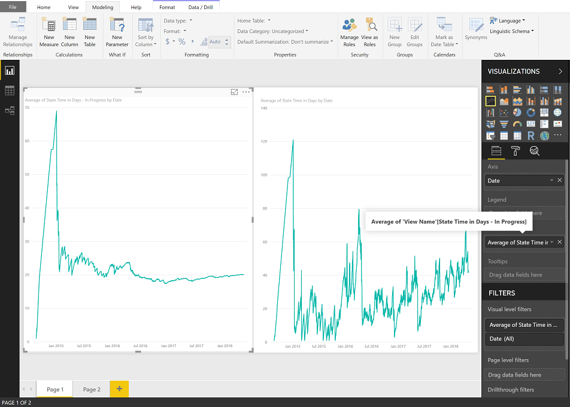


### *State Time in Days* trend of multiple states

Analyzing performance across multiple states is also possible using the "Continuous" pattern. However, this approach only works with a trend chart.

From the **Modeling** tab, choose **New Column** and then replace the default text with the following code and click the  checkmark.

> [!div class="tabbedCodeSnippets"]   
```DAX
State Time in Days - Working States = 
CALCULATE (
    SUM ( 'View Name'[Date Diff in Days] ),
    ALLEXCEPT ( 'View Name', 'View Name'[Work Item Id] ),
   'View Name'[Date] <= EARLIER('View Name'[Date]),
   'View Name'[State] IN { "Committed", "In Progress" }
) + 0
```

> [!NOTE]   
> You may need to revise the definition based on the workflow states used by your project. For example, if your project uses 'Active' in place of 'Committed' or 'Proposed'. 


The chart of the left shows combined average while the right hand side shows each individual state.

> [!div class="mx-imgBorder"]  
> 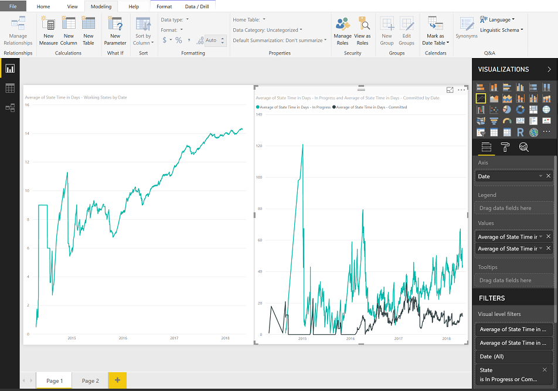 
    
## Get the State Time in Days- Latest for multiple states

You use the *State Time in Days- Latest* calculated column when creating a trend. Using a filter on the states, the *State Time in Days* column and *Is Last Day in State* provides a simple way to get the total time any work item or group of work items spent in a set of states.

> [!div class="mx-imgBorder"]  
> 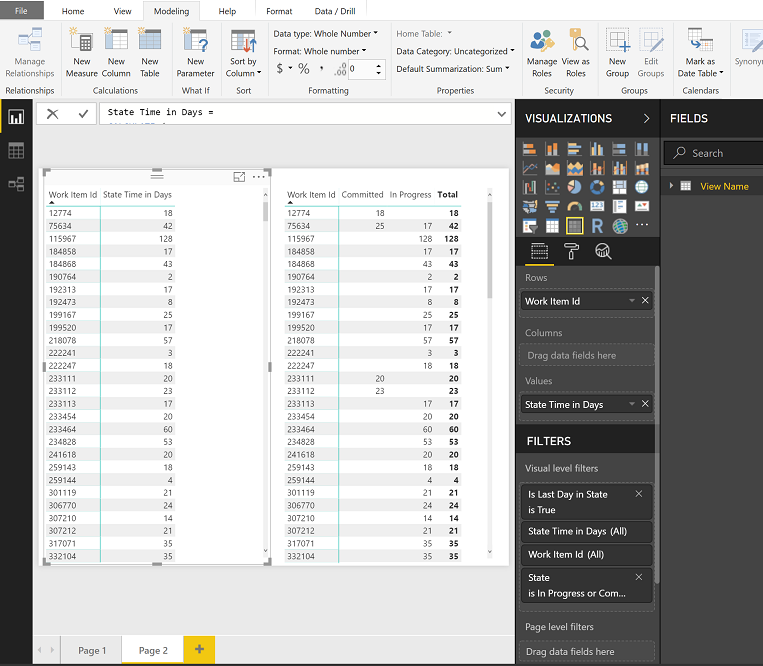 

## Add *State Previous*

The *Date Previous* calculated column can also be used to lookup past values such as previous state for each work item.

> [!IMPORTANT]  
> Requires that you have added the [*Date Previous* calculated column](#date-previous) to the table.

From the **Modeling** tab, choose **New Column** and then replace the default text with the following code and click the  checkmark.

> [!div class="tabbedCodeSnippets"]   
```DAX 
State Previous =
LOOKUPVALUE (
    'View Name'[State],
    'View Name'[Work Item Id], 'View Name'[Work Item Id],
    'View Name'[Date], 'View Name'[Date Previous]
)
```

This calculated column uses the [`LOOKUPVALUE`](https://msdn.microsoft.com/query-bi/dax/lookupvalue-function-dax), described [later in this article](#dax-functions).
 
The first `LOOKUPVALUE` parameter, `'View Name'[State]`, specifies to return the value of [State]. 

The next parameter, `'View Name'[Work Item Id], 'View Name'[Work Item Id]`, specifies that only rows with a matching work item id as the current row should be considered.

And, the last parameter, `'View Name'[Date], 'View Name'[Date Previous]`, specifies that the date of the row being returned must have a [Date] that matches the [Previous Date] of the current row. In a snapshot only one row can meet this criteria.

<a id="state-changed" />
<a id="state-previous" />
## Add *State Changed* 

Using the *State Previous* column, we can flag the rows for each work item where a state transition has occurred. The *Stage Changed* calculated column you'll add has two special considerations:
* Blank values of *State Previous* will be set to the *Created Date* of the work item
* Creation of a work item is considered a state transition

> [!IMPORTANT]  
> Requires that you have added the [*State Previous*](#add-state-previous) calculated column to the table.

From the **Modeling** tab, choose **New Column** and then replace the default text with the following code and click the  checkmark.

> [!div class="tabbedCodeSnippets"]   
```DAX 
State Changed =
IF (
    ISBLANK ( 'View Name'[State Previous] ),
    'View Name'[Created Date].[Date] = 'View Name'[Date],
    'View Name'[State Previous] <> 'View Name'[State]
)
```

<a id="state-flow" />

## Add *State Flow* 

With *State Previous* and *State Changed* calculated columns, you can create a column that will help illustrate the State Flow for a given work item. Creating this column is optional for the purposes of this article.

> [!IMPORTANT]  
> Requires that you have added the [State Previous](#add-state-previous) and [*State Changed*](#state-changed) calculated columns to the table.

From the **Modeling** tab, choose **New Column** and then replace the default text with the following code and click the  checkmark.

> [!div class="tabbedCodeSnippets"]   
```DAX 
State Flow = 
IF([State Changed], [State Previous], [State]) & " ž¡ " & [State]
```

## Add *State Change Count* 

As we move into the more complicated measures, we need to have a representation of the total number of state changes to compare the rows of a data for a given work item. We achieve this by adding a *State Change Count* calculated column.

> [!IMPORTANT]
> Requires that you have added the [*State Changed*](#state-changed) calculated column to the table.

From the **Modeling** tab, choose **New Column** and then replace the default text with the following code and click the  checkmark. 

> [!div class="tabbedCodeSnippets"]   
```DAX
State Change Count = 
CALCULATE (
    COUNTROWS ( 'View Name' ),
    ALLEXCEPT ( 'View Name', 'View Name'[Work Item Id] ),
    'View Name'[Date] <= EARLIER ( 'View Name'[Date] ),
    'View Name'[State Changed]
) + 0
```

## Add *State Change Count - Last Proposed* and *State Restart Time in Days* 

Calculating restarts, *State Restart Time in Days*, is a fairly complex calculation. The first step is to find the last time a work item was in a proposed state. Add the *State Change Count - Last Proposed*  calculated column. 


> [!NOTE]   
> You may need to revise the following definitions based on the workflow states used by your project. For example, if your project uses 'New' in place of 'Proposed'. 

From the **Modeling** tab, choose **New Column** and then replace the default text with the following code and click the  checkmark.

> [!div class="tabbedCodeSnippets"]   
```DAX
State Change Count - Last Proposed = 
CALCULATE (
    MAX ( 'View Name'[State Change Count] ),
    ALLEXCEPT ( 'View Name', 'View Name'[Work Item Id] ),
    'View Name'[Date] <= EARLIER ( 'View Name'[Date] ),
    'View Name'[State] = "Proposed"
)
```

Then, look further back to the past and see if there were some active states before this proposed state. Lastly, sum up all the days when work item was in active state before the last proposed. 

From the **Modeling** tab, choose **New Column** and then replace the default text with the following code and click the  checkmark.

> [!div class="tabbedCodeSnippets"]   
```DAX
State Restart Time in Days = 
CALCULATE (
    SUM ( 'View Name'[Date Diff in Days] ),
    ALLEXCEPT ( 'View Name', 'View Name'[Work Item Id] ),
    'View Name'[Date] <= EARLIER ( 'View Name'[Date] ),
    'View Name'[State Change Count] < EARLIER('View Name'[State Change Count - Last Proposed] ),
    'View Name'[State] <> "Proposed"
) + 0
```

Since the *State Restart Time in Days* is updated for each row of data, you can either create a trend to evaluate rework across specific sprints or examine rework for individual work items by using 'Is Current'.


## Add *State Rework Time in Days* 

Similar to *State Restart Time in Days*, the *State Rework Time in Days* looks for the first time a work item was in the Completed state category. After that time, each day a work item spends in a state other than Completed, counts as rework.

From the **Modeling** tab, choose **New Column** and then replace the default text with the following code and click the  checkmark.

> [!div class="tabbedCodeSnippets"]   
```DAX
State Rework Time in Days = 
IF (
    ISBLANK ( 'View Name'[State Change Count - First Completed] ),
    0,
    CALCULATE (
        SUM ( 'View Name'[Date Diff in Days] ),
        ALLEXCEPT ( 'View Name', 'View Name'[Work Item Id] ),
        'View Name'[Date] <= EARLIER ( 'View Name'[Date] ),
        'View Name'[State Change Count] > EARLIER ( 'View Name'[State Change Count - First Completed] ),
        'View Name'[State] IN {"Completed", "Closed", "Cut" } = FALSE()
    ) + 0
)
```


> [!NOTE]   
> You may need to revise the above definition based on the workflow states used by your project. For example, if your project uses 'Done' in place of 'Closed'. 


<a id="dax-functions" />

## DAX functions
Additional information is provided in this section for the DAX functions used to created the calculated columns and measure added in this article. 

* [`CALCULATE`](https://msdn.microsoft.com/query-bi/dax/calculate-function-dax): This function is the basis for nearly all examples. The basic structure is an expression followed by a series of filters which are applied to the expression.     

* [`COUNTROWS`](https://msdn.microsoft.com/query-bi/dax/countrows-function-dax): This function, `COUNTROWS ( 'View Name' )`, simply counts the number of rows which remain after the filters are applied. 
	
* [`LASTDATE`](https://msdn.microsoft.com/query-bi/dax/lastdate-function-dax): We apply the `LASTDATE` filter to an expression, for example `LASTDATE ( 'View Name'[Date] )`, to find the newest date across all rows in the table and eliminate the rows that do not share the same date. With the snapshot table generated by an Analytics view this filter effectively picks the last day of the selected period.    

* [`MAX`](https://msdn.microsoft.com/query-bi/dax/max-function-dax): Returns the largest numeric value in a column, or between two scalar expressions. We apply  `MAX ( 'View Name'[Date] )`, to determine the most recent date after all filters have been applied.  

* [`ALLEXCEPT`](https://msdn.microsoft.com/query-bi/dax/allexcept-function-dax): Removes all context filters in the table except filters that have been applied to the specified columns. Essentially, `ALLEXCEPT ('View Name'', 'View Name'[Work Item Id])` reduces the rows in the table down to only those that share the same work item ID as the current row.   

* [`EARLIER`](https://msdn.microsoft.com/query-bi/dax/earlier-function-dax): Returns the current value of the specified column in an outer evaluation pass of the mentioned column. For example, `'View Name'[Date] < EARLIER ( 'View Name'[Date] )`, further reduces the data set to only those rows that occurred before the date for the current row which is referenced by using the `EARLIER` function. `EARLIER` does not refer to previous dates, it specifically defines the row context of the calculated column 

* [`ISBLANK`](https://msdn.microsoft.com/query-bi/dax/isblank-function-dax): Checks whether a value is blank, and returns TRUE or FALSE. `ISBLANK` evaluates the current row to determine if *Date Previous* has a value. If it does not, the If statement sets *Date Diff in Days* to 1.

* [`DATEDIFF`](https://msdn.microsoft.com/query-bi/dax/datediff-function-dax): Returns the count of interval boundaries crossed between two dates. `DATEDIFF` subtracts *Date Previous* from *Date* to determine the number of days between them.

* [`LOOKUPVALUE`](https://msdn.microsoft.com/query-bi/dax/lookupvalue-function-dax): Returns the value in *result_columnName* for the row that meets all criteria specified by *search_columnName* and *search_value*.  

## Related articles

- [Power BI integration overview](overview.md) 
- [Create Analytics views](analytics-views-create.md)
- [Get started with Power BI Desktop](/power-bi/desktop-getting-started)
- [Dataset design for the Power BI Connector](data-connector-dataset.md)
- [Workflow states and state categories](../../boards/work-items/workflow-and-state-categories.md)
- [Data model for the Analytics service](../extend-analytics/data-model-analytics-service.md)
