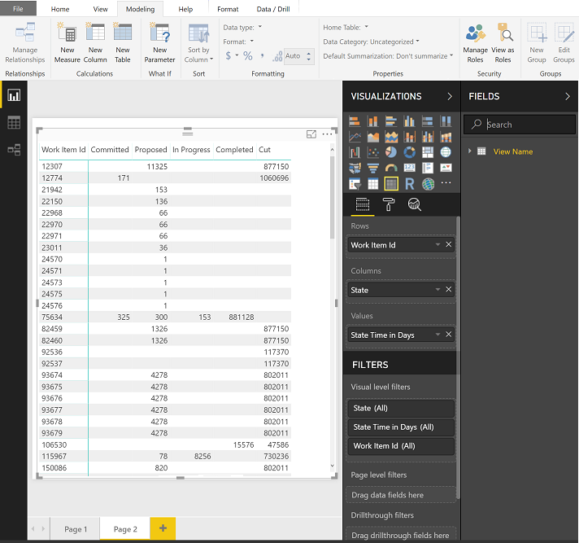
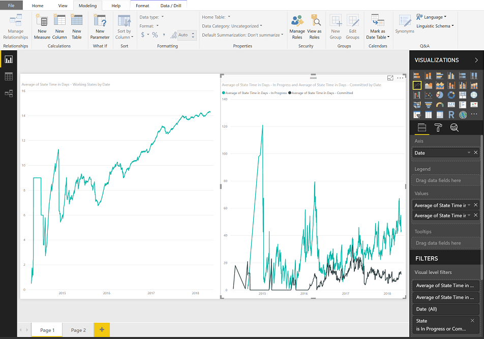
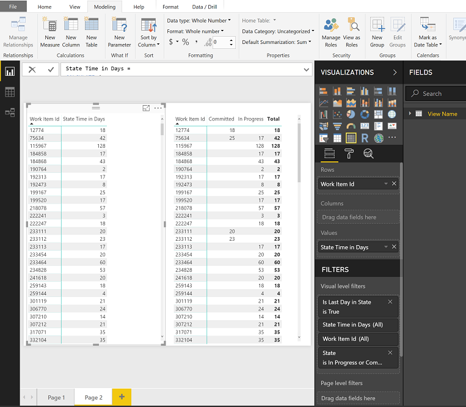

# Add a time-in-state measure to your Power BI report

[!INCLUDE [version-gt-eq-2019](../../includes/version-gt-eq-2019.md)]

The time a work item spends in a specific workflow state or series of states is an important aspect for understanding efficiency. The [Cycle Time and Lead Time](../dashboards/cycle-time-and-lead-time.md) Analytics widgets provide some measures of time-in-state. However, these widgets may not have the level of detail that you want. 

This article provides recipes using DAX calculations to evaluate time spent by work items in a combination of states. Specifically, you learn how to add the following measure and calculated columns to your Power BI reports and use them to generate various trend charts. All fields are calculated columns except the first one listed.  

|Count| Description |
|-----|-------------|
| *Work Items Count* (measure)|Calculates the count of distinct work items based on the last day entry for the work item |
| *State Sort Order* | Adds a column to use to sort workflow States based on the **State Category** sequence |
| *Date Previous* | Adds a column that calculates the previous date based on the **Date** column |  
| *Date Diff in Days* | Adds a column that calculates the number of days between the **Date** and **Date Previous** columns |
| *Is Last Day in State* | Adds a column that determines if the **Date** value is the last day the work item was in a **State** |    
| *State Time in Days* | Adds a column that calculates the number of days the work item spent in each **State** |
| *State Previous* | Adds a column that identifies the previous state for each row in the data table |
| *State Changed*  | Adds a column that determines the date when a work item transitioned from one **State** to another  |
| *State Flow* | Adds a column that illustrates the state flow as a work item transitions from one **State** to another   |
| *State Change Count* | Adds a column that calculates the number of times a work item transitioned from one **State** to another   |
| *State Change Count - Last Proposed* | Adds a column that determines if a work item was in a Proposed state previously after it transitioned to a later **State**   |
| *State Restart Time in Days* | Adds a column that calculates the days a work item spent in a restart state    |
| *State Rework Time in Days* |  Adds a column that calculates the days a work item spends in a state other than *Completed*    | 

> [!IMPORTANT]  
> * When adding a calculated column or measure per the examples shown in this article, replace *View Name* with the table name for the Analytics view  or data table. For example, replace *View Name* with *Active Bugs*.  
> :::image type="content" source="media/measure/view-name.png" alt-text="Screenshot of Power BI Table tools tab, Data table name.":::  
> * Analytics doesn't support intra-day revisions. These examples have the most precision when using a **Daily** interval when referencing an Analytics view. 
> * All intra-day or intra-period (weekly/monthly) revisions are ignored by the calculations. This can result in unexpected results for specific scenarios like a work item showing no time "In Progress" when a work item is "In Progress" for less than a day.   
> * Power BI default aggregations are used whenever possible instead of building measures.  
> * Some calculations include **+0** to ensure that a numeric value is included for every row instead of BLANK.
> You may need to revise some of the calculated column definitions based on the workflow states used by your project. For example, if your project uses *New*, *Active*, and *Closed* in place of *Proposed*, *In Progress*, and *Completed*. 

[!INCLUDE [prerequisites-simple](../includes/analytics-prerequisites-simple.md)]

> [!NOTE]  
> To exercise all the time-in-state measures described in this article, make sure to include the following fields in your Analytics views, Power Query, or OData query: **Created Date** and **State Category** in addition to the default fields: **Area Path**, **Assigned To**, **Iteration Path**, **State**, **Title**, **Work Item ID**, and **Work Item Type**.  
> 
> Also, consider using an Analytics view based on a **Daily** granularity. Examples in this article are based on the Active Bugs Analytics view defined in [Create an active bugs report in Power BI based on a custom Analytics view](active-bugs-sample-report.md), with the exception that 60 days of **History** and **Daily** granularity are selected. Determine also if you want to review completed or closed work items. 

## Add a Work Items Count measure 

To simplify quickly generating reports, we designed Analytics views to work with default aggregations in Power BI. To illustrate the difference between a default aggregation and a measure, we start with a simple work item count measure.

1. Load your Analytics view into Power BI Desktop. For details, see [Connect with Power BI Data Connector, Connect to an Analytics view](data-connector-connect.md#connect-to-an-analytics-view).

2. Select the data table, and then from the **Table tools** tab, **Calculations** section of the ribbon, choose **New measure**.

	:::image type="content" source="media/measure/new-measure.png" alt-text="Screenshot of Power BI Table tools tab, New measure.":::

3. Replace the default text with the following code and then select the :::image type="icon" source="media/checkmark.png" border="false"::: checkmark.

    ```DAX  
    Work Items Count=CALCULATE(COUNTROWS ('View Name'),LASTDATE ('View Name'[Date]))
    ```

	The *Work Items Count* measure uses the [`CALCULATE`](/dax/calculate-function-dax), [`COUNTROWS`](/dax/countrows-function-dax),  and [`LASTDATE`](/dax/lastdate-function-dax) DAX functions that are described in more detail [later in this article](#dax-functions).

	> [!NOTE]   
	> Remember to replace *View Name* with the table name for the Analytics view. For example, here we replace *View Name* with *Active bugs*. 

	:::image type="content" source="media/measure/work-items-count-measure.png" alt-text="Screenshot of Power BI Measure tools tab, Work Items Count syntax.":::

### How does a measure differ from a calculated column

A measure always evaluates the entire table where a calculated column is specific to a single row. For more information, see [Calculated Columns and Measures in DAX](https://www.sqlbi.com/articles/calculated-columns-and-measures-in-dax/). 

Compare the *Work Items Count* measure with the default count aggregation based on the *Work Item ID*. The following image is created by adding the **Card** visual and the **Work Item Count** measure to the first card, and the **Work Item ID** property to the second card. 

:::image type="content" source="media/measure/work-item-count-measure-vs-id.png" alt-text="Screenshot of Power BI report page, two cards showing Work Item Count measure and Work Item ID property.":::

To get the correct count using a default aggregation, you apply the filter *Is Current* equals 'True'. This pattern of applying filters to a default aggregation is the basis for many of the examples provided in this article.

:::image type="content" source="media/measure/work-item-id-count-is-current.png" alt-text="Screenshot of Power BI report page, Work Item ID*count filtered with Is Current=True.":::

## Add State Sort Order

By default, Power BI shows states sorted alphabetically in a visualization. It can be misleading when you want to visualize time in state and *Proposed* shows up after *In Progress*.  The following steps help to resolve this issue.

1. Verify that the *State Category* field is included in the Analytics view. This field is included in all default shared views. 

1. Select the data table, and then from the **Table tools** tab, **Calculations** section of the ribbon, choose **New column**.

	:::image type="content" source="media/measure/new-column.png" alt-text="Screenshot of Power BI Table tools tab, New column.":::

1. Replace the default text with the following code and then select the :::image type="icon" source="media/checkmark.png" border="false"::: checkmark.

    ```DAX  
    State Sort Order =  
    SWITCH (  
        'View Name'[State Category],  
        "Proposed", 1,  
        "InProgress", 2,  
        "Resolved", 3,  
        4  
    )  
    ``` 

	See the following example: 

	:::image type="content" source="media/measure/state-sort-order-column.png" alt-text="Screenshot of Power BI Table tools tab, state category entry.":::

	> [!NOTE]   
	> You may need to revise the definition if you need more granularity than *State Category* provides. *State Category* provides correct sorting across all work item types regardless of any *State* customizations.

3. Open the **Data** view and select the **State** column.

4. From the **Column Tools** tab, choose **Sort by Column** and then select the *State Sort Order* field.

	:::image type="content" source="media/measure/column-sort-order-select.png" alt-text="Screenshot of Power BI Column tools tab, Sort by column selection.":::

<a id="date-previous" />

## Add Date Previous

The next step for calculating time-in-state requires mapping the previous interval (day, week, month) for each row of data in the dataset. It's a simple calculation using a calculated column. Typically, you would define this column as shown. 

> [!div class="tabbedCodeSnippets"]   
> ```DAX  
> Date Previous  = 
> PREVIOUSDAY ( 'View Name'[Date] )
> ```

However, this approach has two main problems:  
- It works only for daily periods.  
- It doesn't handle gaps in the data. For example, if a work item is moved between projects.  

To resolve these problems, the calculated column should find the previous day by scanning the *Date* field. 

To add the *Date Previous* calculated column, from the **Table tools** tab, choose **New Column** and then replace the default text with the following code and select the :::image type="icon" source="media/checkmark.png" border="false"::: checkmark.

```DAX  
Date Previous =
CALCULATE (
    MAX ( 'View Name'[Date] ),
        ALLEXCEPT ( 'View Name', 'View Name'[Work Item Id] ),
        'View Name'[Date] < EARLIER ( 'View Name'[Date] )
)
```

The **Date Previous** calculated column uses three DAX functions, [`MAX`](/dax/max-function-dax), [`ALLEXCEPT`](/dax/allexcept-function-dax), and  [`EARLIER`](/dax/earlier-function-dax), described in more detail [later in this article](#dax-functions). Because the column is calculated, it's run for every row in the table, and each time it's run it has the context of that specific row. 

:::image type="content" source="media/measure/table-report-state-date-date-previous.png" alt-text="Screenshot of Power BI table chart and Visualization tab for Date and Date Previous.":::

> [!TIP] 
> From the context menu for the *Date* and *Previous Date* fields, choose **Date** (instead of **Date Hierarchy**) to see a single date for these fields.   

<a id="date-diff-in-days" />

## Add Date Diff in Days 

*Date Previous* calculates the difference between the previous and current date for each row. With *Date Diff in Days*, we calculate a count of days between each of those periods. For most rows in a daily snapshot, the value equals **1**. However, for many work items that have gaps in the dataset, the value is greater than **1**.  

> [!IMPORTANT]  
> Requires that you have added the *Date Previous* calculated column to the table.

It's important to consider the first day of the dataset where *Date Previous* is blank. In this example, we give that row a standard value of 1 to keep the calculation consistent.

From the **Modeling** tab, choose **New Column** and then replace the default text with the following code and select the :::image type="icon" source="media/checkmark.png" border="false"::: checkmark.

> [!div class="tabbedCodeSnippets"]   
> ```DAX 
> Date Diff in Days =
> IF (
>     ISBLANK ( 'View Name'[Date Previous] ),
>     1,
>     DATEDIFF (
>         'View Name'[Date Previous],
>         'View Name'[Date],
>         DAY
>     )
> )
> ```

This calculated column uses the [`ISBLANK`](/dax/isblank-function-dax) and [`DATEDIFF`](/dax/datediff-function-dax) DAX functions described [later in this article](#dax-functions).

## Add Is Last Day in State

In this next step, we calculate if a given row represents the last day a specific work item was in a state. It supports default aggregations in Power BI we add in the next section where we add the *State Time in Days* column.

From the **Modeling** tab, choose **New Column** and then replace the default text with the following code and select the :::image type="icon" source="media/checkmark.png" border="false"::: checkmark.

> [!div class="tabbedCodeSnippets"]   
> ```DAX 
> Is Last Day in State = 
> ISBLANK (CALCULATE (
>     COUNTROWS ( 'View Name' ),
>         ALLEXCEPT ( 'View Name', 'View Name'[Work Item Id] ),
>         'View Name'[Date] > EARLIER ( 'View Name'[Date] ),
>         'View Name'[State] = EARLIER ( 'View Name'[State] )
> ))
> ```

## Add State Time in Days

The time that a work item spent in a specific state can now be calculated by summing the *Date Diff in Days* for each work item. This calculation includes all of the time spent in a specific state even if it has switched between states multiple times. It's possible to evaluate each row as a trend using *Date* or the latest information by using *Is Last Day In State*.

> [!IMPORTANT]  
> Requires that you have added the *Date Diff in Days* and *Is Last Day in State* calculated columns to the table.

From the **Modeling** tab, choose **New Column** and then replace the default text with the following code and select the :::image type="icon" source="media/checkmark.png" border="false"::: checkmark.

> [!div class="tabbedCodeSnippets"]   
> ```DAX 
> State Time in Days = 
> CALCULATE (
>     SUM ( 'View Name'[Date Diff in Days] ),
>     ALLEXCEPT ( 'View Name', 'View Name'[Work Item Id] ),
>     'View Name'[Date] <= EARLIER ( 'View Name'[Date] ),
>     'View Name'[State] = EARLIER ( 'View Name'[State] )
> ) + 0
> ```

### Create stacked column trend charts based on State Time in Days

To demonstrate the *State Time in Days* column, the following stacked column charts are created. The first chart shows the count of work items in each state over time.  

:::image type="content" source="media/measure/stacked-column-chart-title-date-state.png" alt-text="Screenshot of Power BI stacked column chart and Visualization tab that illustrates the count of work item title by date and state.":::

The second chart illustrates the trend of average days the active work items are in a particular state.  

:::image type="content" source="media/measure/stacked-column-chart-average-time-in-days.png" alt-text="Screenshot of Power BI stacked column chart and Visualization tab that illustrates the average days in state for work items by date.":::


### Add State Time in Days - Latest (Is Last Day In State)

When evaluating time-in-state for each work item in a table or when filtered by a field like *Area Path*, don't use the *State Time in Days* column in an aggregation. The aggregation uses the value for every day the work item was in the state. For example, if a work item was *In Progress* on Monday and moved to *Completed* on Thursday, the time-in-state is three days, but the sum of *State Time in Days* column is six days (1+2+3) which is clearly incorrect.

> [!div class="mx-imgBorder"]  
>  

To resolve this issue, use *State Time in Days* and apply the filter *Is Last Day In State* equals 'True'. It eliminates all the historical data necessary for a trend and focuses instead on just the latest value for each state.

:::image type="content" source="media/StateTimeInDaysTableIsLast.png" alt-text="Use State Time in Days and apply the filter Is Last Day In State equals 'True'.":::

### Add State Time in Days - In Progress

In the examples above, *State Time in Days* for a given work item is only counted when the work item was in that specific state. If your goal is to have the time-in-state for a given work item count towards an average continuously, you must change the calculation. For example, if we want to track the "In Progress" state, we add the *State Time in Days - In Progress* calculated column. 

From the **Modeling** tab, choose **New Column** and then replace the default text with the following code and select the :::image type="icon" source="media/checkmark.png" border="false"::: checkmark.

> [!div class="tabbedCodeSnippets"]   
> ```DAX
> State Time in Days - In Progress = 
> CALCULATE (
>     SUM ( 'View Name'[Date Diff in Days] ),
>     ALLEXCEPT ( 'View Name', 'View Name'[Work Item Id] ),
>    'View Name'[Date] <= EARLIER('View Name'[Date]),
>    'View Name'[State] = "In Progress"
> ) + 0
> ```
> 
> [!NOTE]
> You may need to revise the definition based on the workflow states used by your project. For example, the project used in the examples in this article use the 'In Progress' workflow state, however, Agile, Scrum, and CMMI processes typically use the 'Active' or 'Committed' states to represent work in progress. For an overview, see [Workflow states and state categories](../../boards/work-items/workflow-and-state-categories.md).

The following image shows the effect of considering all time-in-state for every existing work item (shown left) versus only those work items in a specific state on a given day (shown right).

:::image type="content" source="media/TimeInStateActive.png" alt-text="Trend Comparison of the Average Time in State":::


### State Time in Days trend of multiple states

Analyzing performance across multiple states is also possible using the "Continuous" pattern. However, this approach only works with a trend chart.

From the **Modeling** tab, choose **New Column** and then replace the default text with the following code and select the :::image type="icon" source="media/checkmark.png" border="false"::: checkmark.

> [!div class="tabbedCodeSnippets"]   
> ```DAX
> State Time in Days - Working States = 
> CALCULATE (
>     SUM ( 'View Name'[Date Diff in Days] ),
>     ALLEXCEPT ( 'View Name', 'View Name'[Work Item Id] ),
>    'View Name'[Date] <= EARLIER('View Name'[Date]),
>    'View Name'[State] IN { "Committed", "In Progress" }
> ) + 0
> ```
> 
> [!NOTE]
> You may need to revise the definition based on the workflow states used by your project. For example, if your project uses 'Active' in place of 'Committed' or 'Proposed'. 


The chart of the left shows combined average while the right-hand side shows each individual state.

> [!div class="mx-imgBorder"]  
>  
    
## Get the State Time in Days- Latest for multiple states

You use the *State Time in Days- Latest* calculated column when creating a trend. Using a filter on the states, the *State Time in Days* column and *Is Last Day in State* provides a simple way to get the total time any work item or group of work items spent in a set of states.

> [!div class="mx-imgBorder"]  
>  

## Add State Previous

The *Date Previous* calculated column can also be used to look up past values such as previous state for each work item.

> [!IMPORTANT]  
> Requires that you have added the [*Date Previous* calculated column](#date-previous) to the table.

From the **Modeling** tab, choose **New Column** and then replace the default text with the following code and select the :::image type="icon" source="media/checkmark.png" border="false"::: checkmark.

> [!div class="tabbedCodeSnippets"]   
> ```DAX 
> State Previous =
> LOOKUPVALUE (
>     'View Name'[State],
>     'View Name'[Work Item Id], 'View Name'[Work Item Id],
>     'View Name'[Date], 'View Name'[Date Previous]
> )
> ```

This calculated column uses the [`LOOKUPVALUE`](/dax/lookupvalue-function-dax), described [later in this article](#dax-functions).
 
The first `LOOKUPVALUE` parameter, `'View Name'[State]`, specifies to return the value of [State]. 

The next parameter, `'View Name'[Work Item Id], 'View Name'[Work Item Id]`, specifies that only rows with a matching work item ID as the current row should be considered.

And, the last parameter, `'View Name'[Date], 'View Name'[Date Previous]`, specifies that the date of the row being returned must have a [Date] that matches the [Previous Date] of the current row. In a snapshot, only one row can meet this criteria.

<a id="state-changed" />
<a id="state-previous" />

## Add State Changed

Using the *State Previous* column, we can flag the rows for each work item where a state transition occurred. The *Stage Changed* calculated column has two special considerations:
* Blank values of *State Previous* which we set to the *Created Date* of the work item
* Creation of a work item is considered a state transition

> [!IMPORTANT]  
> Requires that you have added the [*State Previous*](#add-state-previous) calculated column to the table.

From the **Modeling** tab, choose **New Column** and then replace the default text with the following code and select the :::image type="icon" source="media/checkmark.png" border="false"::: checkmark.

> [!div class="tabbedCodeSnippets"]   
> ```DAX 
> State Changed =
> IF (
>     ISBLANK ( 'View Name'[State Previous] ),
>     'View Name'[Created Date].[Date] = 'View Name'[Date],
>     'View Name'[State Previous] <> 'View Name'[State]
> )
> ```

The calculated column is a boolean value that identifies whether the row is a state transition. By using the `Not Equal To` operator, you correctly catch rows where the previous state doesn't match the current state, which means the comparison returns True as expected.  


<a id="state-flow" />

## Add State Flow

With *State Previous* and *State Changed* calculated columns, you can create a column that illustrates the **State Flow** for a given work item. Creating this column is optional for the purposes of this article.

> [!IMPORTANT]  
> Requires that you have added the [*State Previous*](#add-state-previous) and [*State Changed*](#state-changed) calculated columns to the table.

From the **Modeling** tab, choose **New Column** and then replace the default text with the following code and select the :::image type="icon" source="media/checkmark.png" border="false"::: checkmark.

> [!div class="tabbedCodeSnippets"]   
> ```DAX 
> State Flow = 
> IF([State Changed], [State Previous], [State]) & " => " & [State]
> ```

## Add State Change Count

As we move into the more complicated measures, we need to have a representation of the total number of state changes to compare the rows of a data for a given work item. We get the representation by adding a *State Change Count* calculated column.

> [!IMPORTANT]
> Requires that you have added the [*State Changed*](#state-changed) calculated column to the table.

From the **Modeling** tab, choose **New Column** and then replace the default text with the following code and select the :::image type="icon" source="media/checkmark.png" border="false"::: checkmark. 

> [!div class="tabbedCodeSnippets"]   
> ```DAX
> State Change Count = 
> CALCULATE (
>     COUNTROWS ( 'View Name' ),
>     ALLEXCEPT ( 'View Name', 'View Name'[Work Item Id] ),
>     'View Name'[Date] <= EARLIER ( 'View Name'[Date] ),
>     'View Name'[State Changed]
> ) + 0
> ```

## Add State Change Count - Last Proposed and State Restart Time in Days

Calculating restarts, *State Restart Time in Days*, is a fairly complex calculation. The first step is to find the last time a work item was in a proposed state. Add the *State Change Count - Last Proposed*  calculated column. 


> [!NOTE]   
> You may need to revise the following definitions based on the workflow states used by your project. For example, if your project uses 'New' in place of 'Proposed'. 

From the **Modeling** tab, choose **New Column** and then replace the default text with the following code and select the :::image type="icon" source="media/checkmark.png" border="false"::: checkmark.

> [!div class="tabbedCodeSnippets"]   
> ```DAX
> State Change Count - Last Proposed = 
> CALCULATE (
>     MAX ( 'View Name'[State Change Count] ),
>     ALLEXCEPT ( 'View Name', 'View Name'[Work Item Id] ),
>     'View Name'[Date] <= EARLIER ( 'View Name'[Date] ),
>     'View Name'[State] = "Proposed"
> )
> ```

Then, look further back to the past and see if there were some active states before this proposed state. Lastly, sum up all the days when work item was in active state before the last proposed. 

From the **Modeling** tab, choose **New Column** and then replace the default text with the following code and select the :::image type="icon" source="media/checkmark.png" border="false"::: checkmark.

> [!div class="tabbedCodeSnippets"]   
> ```DAX
> State Restart Time in Days = 
> CALCULATE (
>     SUM ( 'View Name'[Date Diff in Days] ),
>     ALLEXCEPT ( 'View Name', 'View Name'[Work Item Id] ),
>     'View Name'[Date] <= EARLIER ( 'View Name'[Date] ),
>     'View Name'[State Change Count] < EARLIER('View Name'[State Change Count - Last Proposed] ),
>     'View Name'[State] <"Proposed"
> ) + 0
> ```

Since the **State Restart Time in Days** is updated for each row of data, you can either create a trend to evaluate rework across specific sprints or examine rework for individual work items by using **Is Current**.


## Add State Rework Time in Days

Similar to *State Restart Time in Days*, the *State Rework Time in Days* looks for the first time a work item was in the **Completed** state category. After that time, each day a work item spends in a state other than Completed, counts as rework.

From the **Modeling** tab, choose **New Column** and then replace the default text with the following code and select the :::image type="icon" source="media/checkmark.png" border="false"::: checkmark.

> [!div class="tabbedCodeSnippets"]   
> ```DAX
> State Rework Time in Days = 
> IF (
>     ISBLANK ( 'View Name'[State Change Count - First Completed] ),
>     0,
>     CALCULATE (
>         SUM ( 'View Name'[Date Diff in Days] ),
>         ALLEXCEPT ( 'View Name', 'View Name'[Work Item Id] ),
>         'View Name'[Date] <= EARLIER ( 'View Name'[Date] ),
>         'View Name'[State Change Count] EARLIER ( 'View Name'[State Change Count - First Completed] ),
>         'View Name'[State] IN {"Completed", "Closed", "Cut" } = FALSE()
>     ) + 0
> )
> ```
> 
> [!NOTE]
> You may need to revise the above definition based on the workflow states used by your project. For example, if your project uses *Done* in place of *Closed*. 


<a id="dax-functions" />

## DAX functions

Additional information is provided in this section for the DAX functions used to create the calculated columns and measure added in this article. See also [DAX, Time intelligence functions](/dax/time-intelligence-functions-dax).

|Function| Description |
|-----|-------------|
| [`ALLEXCEPT`](/dax/allexcept-function-dax) | Removes all context filters in the table except filters that have been applied to the specified columns. Essentially, `ALLEXCEPT ('View Name'', 'View Name'[Work Item Id])` reduces the rows in the table down to only the ones that share the same work item ID as the current row. |   
| [`CALCULATE`](/dax/calculate-function-dax) | This function is the basis for nearly all examples. The basic structure is an expression followed by a series of filters that are applied to the expression. |   
| [`COUNTROWS`](/dax/countrows-function-dax) | This function, `COUNTROWS ( 'View Name' )`, simply counts the number of rows that remain after the filters are applied. |   
| [`DATEDIFF`](/dax/datediff-function-dax) | Returns the count of interval boundaries crossed between two dates. `DATEDIFF` subtracts *Date Previous* from *Date* to determine the number of days between them.|   
| [`EARLIER`](/dax/earlier-function-dax) | Returns the current value of the specified column in an outer evaluation pass of the mentioned column. For example, `'View Name'[Date] < EARLIER ( 'View Name'[Date] )`, further reduces the data set to only those rows that occurred before the date for the current row that is referenced by using the `EARLIER` function. `EARLIER` doesn't refer to previous dates, it specifically defines the row context of the calculated column. |   
| [`ISBLANK`](/dax/isblank-function-dax) | Checks whether a value is blank, and returns TRUE or FALSE. `ISBLANK` evaluates the current row to determine if *Date Previous* has a value. If it doesn't, the If statement sets *Date Diff in Days* to 1.|   
| [`LASTDATE`](/dax/lastdate-function-dax) | We apply the `LASTDATE` filter to an expression, for example `LASTDATE ( 'View Name'[Date] )`, to find the newest date across all rows in the table and eliminate the rows that don't share the same date. With the snapshot table generated by an Analytics view, this filter effectively picks the last day of the selected period. |   
| [`LOOKUPVALUE`](/dax/lookupvalue-function-dax) | Returns the value in *result_columnName* for the row that meets all criteria specified by *search_columnName* and *search_value*. |   
| [`MAX`](/dax/max-function-dax) | Returns the largest numeric value in a column, or between two scalar expressions. We apply  `MAX ( 'View Name'[Date] )`, to determine the most recent date after all filters have been applied.  |   


## Related articles

- [Power BI integration overview](overview.md) 
- [Create Analytics views](analytics-views-create.md)
- [Get started with Power BI Desktop](/power-bi/fundamentals/desktop-getting-started)
- [Dataset design for the Power BI Connector](data-connector-dataset.md)
- [Workflow states and state categories](../../boards/work-items/workflow-and-state-categories.md)
- [Data model for Analytics](../extend-analytics/data-model-analytics-service.md)