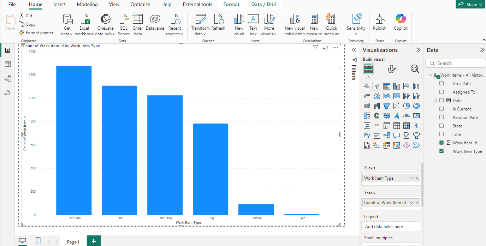
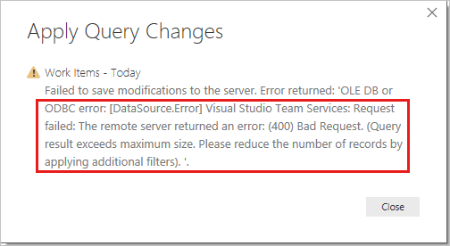
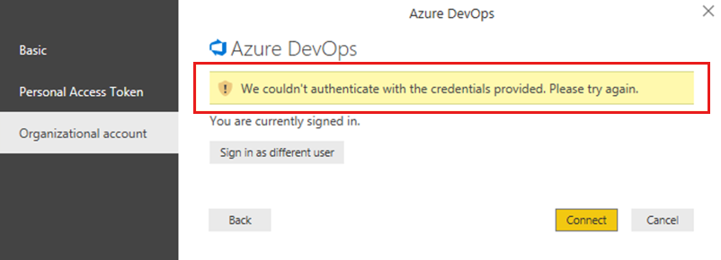
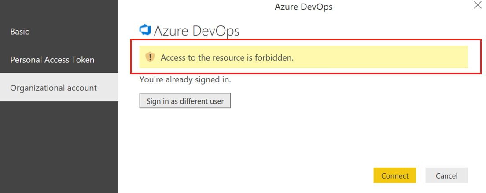
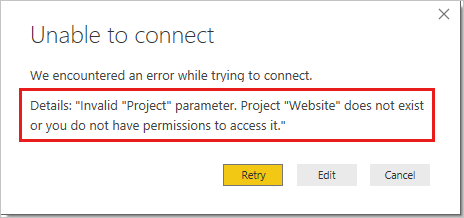

# Connect to Analytics with Power BI Data Connector

[!INCLUDE [temp](../includes/version-azure-devops.md)]

[!INCLUDE [alt-creds-deprecation-notice](../../includes/alt-creds-deprecation-notice.md)]

The Power BI Data Connector uses [Analytics Views](what-are-analytics-views.md). 

[!INCLUDE [temp](includes/analytics-views-warning.md)]

## Prerequisites

Follow the steps below to get started using the Azure DevOps Power BI Data Connector:

::: moniker range="azure-devops"

- If you are not familiar with Analytics, read "[what is Analytics](what-is-analytics.md)" before continuing. 
- Install the *Power BI Desktop* *October 2018 Update* or a newer version. You can download it from the official [Power BI Desktop download page](/power-bi/desktop-what-is-desktop). 
- If you haven't been added as a project member, [get added now](../../organizations/security/add-users-team-project.md). Anyone with access to the project, except stakeholders, can view Analytics views. 
- **Boards** must be enabled. If it is disabled, **Analytics views** won't be displayed. To re-enable **Boards**, see [Turn an Azure DevOps service on or off](../../organizations/settings/set-services.md).
- Make sure you have [permissions required to access Analytics](analytics-security.md). If you are a member of the project Contributors group, you have permission.
- [Create an Analytics view](analytics-views-create.md) that you want to create a Power BI report. 
- Review the [knowledge base of Power BI articles](/power-bi). 

::: moniker-end

::: moniker range=">= azure-devops-2019 < azure-devops"

- If you are not familiar with Analytics, read [what is Analytics?](what-is-analytics.md) before continuing. 
- Install the *Power BI Desktop* *October 2018 Update* or a newer version. You can download it from the official [Power BI Desktop download page](/power-bi/desktop-what-is-desktop). 
- You must be a member of a project with Basic access or higher. If you don't have a project yet, [create one](../../organizations/projects/create-project.md). 
- If you haven't been added as a project member, [get added now](../../organizations/security/add-users-team-project.md). Anyone with access to the project, except stakeholders, can view Analytics views.
- [Verify that Analytics](../dashboards/analytics-extension.md?view=azure-devops-2019&preserve-view=true)] is installed, and if not, then enable it. You must be an account owner or a member of the [Project Collection Administrator group](../../organizations/security/set-project-collection-level-permissions.md) to add extensions or enable the service. 
- **Boards** must be enabled. If it is disabled, **Analytics views** won't be displayed. To re-enable **Boards**, see [Turn an Azure DevOps service on or off](../../organizations/settings/set-services.md).
- Make sure you have [permissions required to access Analytics](analytics-security.md). If you are a member of the project Contributors group, you have permission.
- [Create an Analytics view](analytics-views-create.md) that you want to create a Power BI report. 
- Review the [knowledge base of Power BI articles](/power-bi). 

::: moniker-end

[!INCLUDE [temp](../includes/connect-analytics-view.md)]

## Create your report

**Create reports based on the loaded data**. After the load operation finishes, you can explore the data by creating custom reports. For examples of common reports, see [Example Reports - using the Data Connector](data-connector-examples.md).

## Q & A

<!-- BEGINSECTION class="md-qanda" -->

### Q: How should I read error messages coming from the connector?

**A:** You may feel challenged reading error messages coming from the connector because they typically contain additional contextual information.
If the load operation fails, then the message starts with *Failed to save modifications to the server...*.
When you see it, then search for **&#91;DataSource.Error&#93; Azure DevOps...:**.
The following text is the real error message returned from the connector.

In the example below the most important part of the error message is:

> Query result exceeds maximum size. Please reduce the number of records by applying additional filters.  
> 
> 

### Q: How do I resolve: *Query result exceeds maximum size. Please reduce the number of records by applying additional filters*?

**A:** You'll get the following error if the number of records retrieved from Analytics exceeds 250,000.  
> Failed to save modifications to the server. Error returned: 'OLE DB or ODBC error: 
> &#91;DataSource.Error&#93; VSTS: Request failed: The remote server returned an error: (400) Bad Request. 
> (**Query result exceeds maximum size. Please reduce the number of records by applying additional filters**).'.

This error typically occurs when your project has a large number of work items. The size of the dataset must be reduced by [customizing the view](analytics-views-create.md) before using it in Power BI.  

### Q: How do I resolve error: *The user was not authorized*?

> The user was not authorized.

**A:** You can encounter this error if you try to access a project to which you don't have permissions or your credentials aren't recognized by Power BI. To check your permissions, see [Set permissions to access Analytics and Analytics views](analytics-security.md). If its a credential problem, you should work with your administrator to see if they can help resolve the problem. To learn more, see [Power BI Security, User Authentication](/power-bi/admin/service-admin-power-bi-security#user-authentication) and [Troubleshooting sign-in issues for Power BI](/power-bi/admin/power-bi-cannot-sign-in).

> [!div class="mx-imgBorder"] 
> 

> [!NOTE]   
> Power BI uses Azure Active Directory ([AAD](https://azure.microsoft.com/services/active-directory/)) to authenticate users who sign in to the Power BI service, and in turn, uses the Power BI login credentials whenever a user attempts to access resources that require authentication. Users sign in to the Power BI service using the email address used to establish their Power BI account; Power BI uses that login email as the *effective username*, which is passed to resources whenever a user attempts to connect to data. The *effective username* is then mapped to a [*User Principal Name* (UPN)](/windows/win32/secauthn/user-name-formats) and resolved to the associated Windows domain account, against which authentication is applied. 

### Q: How do I resolve error: *Access to the resource is forbidden*?

> Access to the resource is forbidden.

**A:** You can encounter this error if you have access to a given project but you do not have the *View analytics* permissions. Please work with your project administrator to get these permissions.
For more information about the security model, see [Analytics security](analytics-security.md).

> [!div class="mx-imgBorder"]  
> 

### Q: How do I resolve error: *Project "X" does not exist or you do not have permissions to access it*?

> We encountered an error while trying to connect.  
> Details: Invalid "Project" parameter. **Project "X" does not exist or you do not have permissions to access it.**.

**A:** This error indicates that the value you entered for *Project name* does not correspond to any project. A common mistake users can make is to confuse the project name with a team name.  

If the URL you use on a daily basis is "`https://dev.azure.com/fabrikam-fiber-inc/Fabrikam-Fiber-Git/Device`", then `Fabrikam-Fiber-Git` is the project name and it should be used in the parameter, whereas `Device` is the team name.

<!-- ENDSECTION -->

## Related articles

- [Permissions required to access Analytics](analytics-security.md)
- [Power BI integration overview](overview.md)
- [Analytics security](analytics-security.md)
- [Authenticate your identity with personal access tokens](../../organizations/accounts/use-personal-access-tokens-to-authenticate.md) 
- [Dataset design for the Power BI Data Connector](data-connector-dataset.md)  
- [Data Connector - Example reports](data-connector-examples.md)