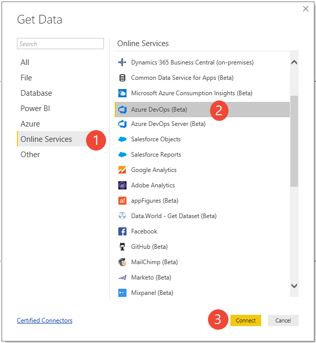
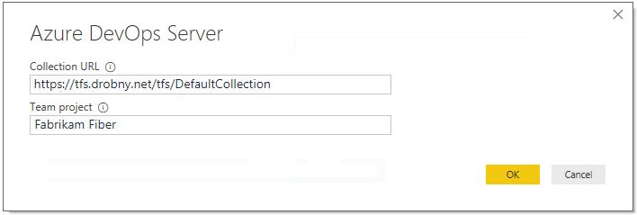

# Connect to the Analytics service with Power BI Data Connector

[!INCLUDE [temp](../_shared/version-azure-devops.md)]

The Azure DevOps Power BI Data connector works with Analytics views. For more information, see [what are Analytics Views](what-are-analytics-views.md).

## Prerequisites

Follow the steps below to get started using the Azure DevOps Power BI Data Connector:

::: moniker range="azure-devops"

1. Install the *Power BI Desktop* *October 2018 Update* or a newer version. You can download it from the official [Power BI Desktop download page](https://powerbi.microsoft.com/desktop). 
3. Make sure you have [permissions required to access the Analytics service](analytics-security.md). If you are a member of the project Contributors group, you have permission.
4. [Create an Analytics view](analytics-views-create.md) that you want to create a Power BI report. 
4. Review the [knowledge base of Power BI articles](https://powerbi.microsoft.com/documentation/powerbi-landing-page/). 
5. If you are not familiar with the Analytics service, we recommend you read "[what is the Analytics service](what-is-analytics.md)" before continuing. 

::: moniker-end

::: moniker range="azure-devops-2019"

1. Install the *Power BI Desktop* *October 2018 Update* or a newer version. You can download it from the official [Power BI Desktop download page](https://powerbi.microsoft.com/desktop). 
3. Make sure you have [permissions required to access the Analytics service](analytics-security.md). If you are a member of the project Contributors group, you have permission.
4. Review the [knowledge base of Power BI articles](https://powerbi.microsoft.com/documentation/powerbi-landing-page/). 
5. If you are not familiar with the Analytics service, we recommend you read "[what is the Analytics service](what-is-analytics.md)" before continuing. 

::: moniker-end

## Connect to your data

::: moniker range="azure-devops"  

1. **Launch Power BI Desktop and get your data**. Select **Get Data** using one of the two options to access the Data Connector.  

	You can either choose **Get Data** button in the splash screen that opens up when you launch *Power BI.* 

	> [!div class="mx-imgBorder"] 
	> 
	
	Or, you can find a similar button in the ribbon in the **Home** section. 
	
	  

2. Choose (1) **Online Services**, (2) **Azure DevOps (Beta)**, and then **Connect**.  

	  

3. **Specify the basic parameters to connect to your data**. 

	

	- For *Organization*, enter the organization name in Azure DevOps (not the full URL). For example, use `fabrikam-fiber-inc` if the URL of your organization is "`https://dev.azure.com/fabrikam-fiber-inc./`".
	- For *Team project*, enter just the project name (e.g. use `Fabrikam-Fiber` if the URL of your project is "`https://dev.azure.com/fabrikam-fiber-inc./Fabrikam-Fiber`").

	> [!IMPORTANT]  
	> Don't confuse the team name with the project name, a common mistake. 
	> If the URL you use on the daily basis is "`https://dev.azure.com/fabrikam-fiber-inc./Fabrikam-Fiber-Git/Device`", then `Fabrikam-Fiber-Git` is the project name, whereas `Device` is the team name.

4. **Sign in to the service**. Upon first-time access, you're required to sign in and have your credentials authenticated. Power BI Desktop saves your credentials so you will only have to do this once.

	Choose between these two authentication options: 
	- Select *Organizational account* if your organization is using Azure Active Directory to manage users.  
	- Select *Personal Access Token* if you want to use a personal access token.
	- Select *Basic* if you are connecting to a personal organization. This option also supports alternate credentials, but it is not recommended as unlike personal access tokens, this login doesn't expire and can't be scoped to limit access to your data.

	> [!div class="mx-imgBorder"]  
	> 

	If you select *Organizational account,* enter your username and password into the standard login page.  

5. Choose **Connect** upon verification of your credentials. Upon successful login Power BI will verify if your user credentials have the right permissions to access the specified project. If any errors arise, refer to the [Q & A](#q-a) section as it covers the most common problems.

	> [!div class="mx-imgBorder"]  
	>   

::: moniker-end  

::: moniker range="azure-devops-2019"  

1. **Launch Power BI Desktop and get your data**. Select **Get Data** using one of the two options to access the Data Connector.  

	You can either choose **Get Data** button in the splash screen that opens up when you launch *Power BI.* 

	> [!div class="mx-imgBorder"] 
	> 
	
	Or, you can find a similar button in the ribbon in the **Home** section. 
	
	  

2. Choose (1) **Online Services**, (2) **Azure DevOps Server (Beta)**, and then **Connect**.  

	  

3. **Specify the basic parameters to connect to your data**. 
 
	

	- For *Collection URL*, enter the URL where your Azure DevOps Server instance is hosted. For example, an example URL is "`http://fabrikam-server/AzureDevOpsServer/fabrikam-collection`".
	- For *Team project*, enter just the project name (e.g. use `Fabrikam-Fiber` if the URL of your Azure DevOps Server instance is "`http://fabrikam-server/AzureDevOpsServer/fabrikam-collection/Fabrikam-Fiber`").

	> [!IMPORTANT]  
	> Don't confuse the team name with the project name, a common mistake. 
	> If the URL you use on the daily basis is "`http://fabrikam-server/AzureDevOpsServer/fabrikam-collection/Fabrikam-Fiber-Git/Device`", then `Fabrikam-Fiber-Git` is the project name, whereas `Device` is the team name.

4. **Sign in to the service**. Upon first-time access, you're required to sign in and have your credentials authenticated. Power BI Desktop saves your credentials so you will only have to do this once.

	Choose between these two authentication options: 
	- Select *Windows* if you want to sign in using Windows.  
	- Select *Personal Access Token* if you want to use a personal access token.

	> [!div class="mx-imgBorder"]
	>  

5. Choose **Connect** upon verification of your credentials. Upon successful login Power BI will verify if your user credentials have the right permissions to access the specified project. If any errors arise, refer to the [Q & A](#q-a) section as it covers the most common problems.  

::: moniker-end  

## Select the Analytics view

1. **Select the view**. The Data Connector will present a list of available [Analytics Views](what-are-analytics-views.md). Each view represents a set of data that can be pulled into Power BI. 

	Azure DevOps provides a set of [default Analytics Views](analytics-default-views.md). You can also [create custom Analytics Views](analytics-views-create.md). The image below shows the default Analytics views. Your list of views may differ.

	> [!div class="mx-imgBorder"]
	> 

	> [!NOTE]
	> The preview shown for any selected views in the navigator can be truncated depending on the number of fields selected and the size of the dataset. The data is truncated only for the preview and will not impact the full data refresh.

	Choose **Work Items - Today** table and wait for the preview to load.
	It represents the current state of all Work Items in the project.

	Select the checkbox next to **Work Items - Today** table and choose **Load**. 

	> [!NOTE]
	> [Analytics Views](what-are-analytics-views.md) do not apply filters that have defined using Power BI on the server. Any filters applied in Power BI will limit the data shown to end users but will not reduce the amount of data retrieved from the Analytics service. If the filter is intended to reduce the size of the dataset, it should be applied by [customizing the view](analytics-views-create.md).  

2. **Wait for the data to load**. You can observe its progress by looking at the status messages, which appear directly under 
	the table name. Should you see any errors, refer to the [Q & A](#q-a) section.

	> [!div class="mx-imgBorder"]
	> 

3. **Review the Data model**. While the model is being loaded please review the [Dataset design for the Power BI Data Connector](data-connector-dataset.md)

## Create your report

**Create reports based on the loaded data**. After the load operation finishes, you can explore the data by creating custom reports. For examples of common reports, see [Example Reports - using the Data Connector](data-connector-examples.md).

## Q & A

<!-- BEGINSECTION class="md-qanda" -->

### Q: How should I read error messages coming from the connector?

**A:** Reading error messages coming from the connector can be challenging because they typically contain additional contextual information.
If the load operation fails, then the message will start with *Failed to save modifications to the server...*.
When you see it, then search for **&#91;DataSource.Error&#93; Azure DevOps...:**.
The following text is the real error message returned from the connector.

In the example below the most important part of the error message is:

> Query result exceeds maximum size. Please reduce the number of records by applying additional filters. 
> 

### Q: How do I resolve: *Query result exceeds maximum size. Please reduce the number of records by applying additional filters*?

**A:** You will get the following error if the number of records retrieved from Analytics exceeds 250,000.  
> Failed to save modifications to the server. Error returned: 'OLE DB or ODBC error: 
> &#91;DataSource.Error&#93; VSTS: Request failed: The remote server returned an error: (400) Bad Request. 
> (**Query result exceeds maximum size. Please reduce the number of records by applying additional filters**).'.

This error typically occurs when your project has a large number of work items. The size of the dataset must be reduced by [customizing the view](analytics-views-create.md) before using it in Power BI.  

### Q: How do I resolve error: *The user was not authorized*?

> The user was not authorized.

**A:** You can encounter this error if you try to access a project to which you don't have permissions. To get access, see [Set permissions to access the Analytics service and Analytics views](analytics-security.md).

> [!div class="mx-imgBorder"] 
> 

### Q: How do I resolve error: *Access to the resource is forbidden*?

> Access to the resource is forbidden.

**A:** You can encounter this error if you have access to a given project but you do not have the *View analytics* permissions. Please work with your project administrator to get these permissions.
For more information about the security model, see [Analytics service security](analytics-security.md).

> [!div class="mx-imgBorder"]  
> 

### Q: How do I resolve error: *Project "X" does not exist or you do not have permissions to access it*?

> We encountered an error while trying to connect.  
> Details: Invalid "Project" parameter. **Project "X" does not exist or you do not have permissions to access it.**.

**A:** This error indicates that the value you entered for *Project name* does not correspond to any project. A common mistake users can make is to confuse the project name with a team name.  

If the URL you use on a daily basis is "`https://dev.azure.com/fabrikam-fiber-inc/Fabrikam-Fiber-Git/Device`", then `Fabrikam-Fiber-Git` is the project name and it should be used in the parameter, whereas `Device` is the team name.

<!-- ENDSECTION -->

## Related articles

- [Permissions required to access the Analytics service](analytics-security.md)
- [Power BI integration overview](overview.md)
- [Analytics service security](analytics-security.md)
- [Authenticate your identity with personal access tokens](../../organizations/accounts/use-personal-access-tokens-to-authenticate.md) 
- [Dataset design for the Power BI Data Connector](data-connector-dataset.md)  
- [Data Connector - Example reports](data-connector-examples.md)

