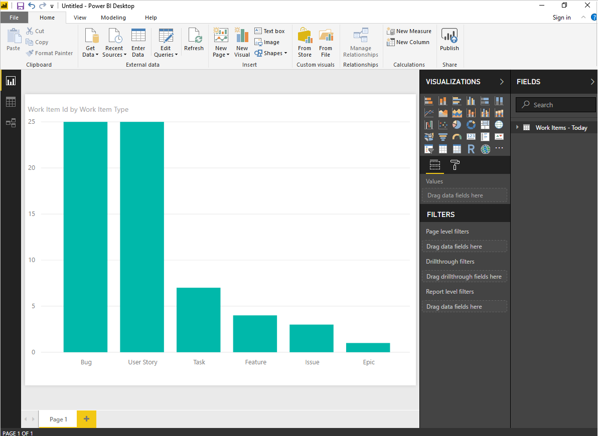

# Connect to VSTS with Power BI Data Connector

**VSTS**

Follow the steps below to get started using the VSTS Power BI Data Connector:

1. Install the *Power BI Desktop* *January 2018 Update* or a newer version. You can download it from the official [Power BI Desktop download page](https://powerbi.microsoft.com/desktop).

2. Install the [VSTS Analytics extension](https://marketplace.visualstudio.com/items?itemName=ms.vss-analytics)

3. Configure the [permissions required to access the Analytics service](../analytics/analytics-security.md)

4. Review the [knowledge base of Power BI articles](https://powerbi.microsoft.com/en-us/documentation/powerbi-landing-page/)

5. If you are not familiar with the VSTS Analytics Service, we recommend you read "[What is the Analytics Service](../analytics/what-is-analytics.md)" before continuing

6. **Launch Power BI Desktop and get your data**. Select *Get Data* using one of the two options to access the Data Connector. 

	You can either click *Get Data* button in the splash screen that opens up when you launch *Power BI.* 

	
	
	Or, you can find a similar button in the ribbon in the *Home* section. 
	
	

7. Select the VSTS entry listed under the Online Services category, and click **Connect**.

	

8. **Specify the basic parameters to connect to your data**. 
 
	

	- For *Account*, enter just the VSTS account name and not the full URL (e.g. use `fabrikam-fiber-inc` if the URL of your account is "`https://fabrikam-fiber-inc.visualstudio.com`").
	- For *Team project*, enter just the project name (e.g. use `Fabrikam-Fiber` if the URL of your project is "`https://fabrikam-fiber-inc.visualstudio.com/Fabrikam-Fiber`").

	> [!IMPORTANT]  
	> Don't confuse the team name with the project name, a common mistake. 
	> If the URL you use on the daily basis is "`https://fabrikam-fiber-inc.visualstudio.com/Fabrikam-Fiber-Git/Device`", then `Fabrikam-Fiber-Git` is the project name, whereas `Device` is the team name.

9. **Sign in to the service**. Upon first-time access, you're required to sign in and have your credentials authenticated. Power BI Desktop saves your credentials so you will only have to do this once.

	Choose between these two authentication options: 
	- Select *Organizational account* if your organization is using Azure Active Directory to manage users.  
	- Select *Basic* if you are connecting to a personal account or you want to use personal access token. This option also support alternate credentials, but it is not recommended as unlike personal access tokens, this login doesn't expire and can't be scoped to limit access to your VSTS data.

	

	If you select *Organizational account,* enter your username and password into the standard login page.  

	

10. Click connect upon verification of your credentials. Upon successful login Power BI will verify if your user account has the right permissions to access the specified team project. If any errors arise, refer to the [Q & A](#q-a) section as it covers the most common problems.

	

11. **Select the view**. The Data Connector will present a list of available views. Each view represents a set of data that can be pulled into Power BI. 

	

	Click *Work Items - Today* table and wait for the preview to load.
	It represents the current state of all Work Items in the project.

	Select the checkbox next to *Work Items - Today* table 

	> [!NOTE]
	> Currently, the views do not filter. That is they will return all Bugs or all Work items in the team project. For large accounts, these views may fail with the error: "Query result exceeds maximum size". If you have a large account and are encountering this error, the February 2018 update of Power BI will include the ability create views which have filters. This will allow you to reduce the data set to something that can be loaded in Power BI.

12. **Wait for the data to load**. You can observe its progress by looking at the status messages, which appear directly under 
	the table name. Should you see any errors, refer to the [Q & A](#q-a) section.

	

13. **Review the VSTS Data model**. While the model is being loaded please review the [VSTS data model](data-connector-available-data.md)

14. **Create reports based on the loaded data**. After the load operation finishes, you can explore the data by creating custom reports. For examples of common reports, see [Example Reports - using the Data Connector](data-connector-examples.md).

	

## Related notes
- [Permissions required to access the Analytics service](../analytics/analytics-security.md)
- [Power BI integration overview](overview.md)
- [Analytics Service security](../analytics/analytics-security.md)
- [Authenticate your identity with personal access tokens](../../accounts/use-personal-access-tokens-to-authenticate.md) 
- [Available data tables in the Power BI Data Connector](data-connector-available-data.md)  
- [Data Connector - Example reports](data-connector-examples.md)

## Q & A

<!-- BEGINSECTION class="md-qanda" -->

### Q: How should I read error messages coming from the connector?
**A:** Reading error messages coming from the connector can be challenging because they typically contain additional contextual information.
If the load operation fails, then the message will start with *Failed to save modifications to the server...*.
When you see it, then search for **&#91;DataSource.Error&#93; VSTS:**.
The following text is the real error message returned from the connector.

In the example below the most important part of the error message is:

>Query result exceeds maximum size. Please reduce the number of records by applying additional filters.

### Q: What can I do to resolve: *Query result exceeds maximum size. Please reduce the number of records by applying additional filters*?

**A:** You will get the following error if the number or records exceeds 200k.  
> Failed to save modifications to the server. Error returned: 'OLE DB or ODBC error: 
> &#91;DataSource.Error&#93; VSTS: Request failed: The remote server returned an error: (400) Bad Request. 
> (**Query result exceeds maximum size. Please reduce the number of records by applying additional filters**).'.

This error typically occurs when your project has a lot of work items. In the upcoming February update you will be able to update views with filters to reduce the amount of data.  However, in this release you will not be able to load data for your account and project using the VSTS Data Connector. It is still possible to use Power BI through our [VSTS functions](data-connector-functions.md)

### Q: How do I resolve error: *The user was not authorized*?

> The user was not authorized.

**A:** You can encounter this error if you try to access a team project to which you don't have permissions.

### Q: How do I resolve error: *Access to the resource is forbidden*?

> Access to the resource is forbidden.

**A:** You can encounter this error if you have access to a given project but you do not have the *View analytics* permissions. Please work with your project administrator to get these permissions.
For more information about the security model, see [Analytics Service security](../analytics/analytics-security.md).

### Q: How do I resolve error: *Project "X" does not exist or you do not have permissions to access it*?

> We encountered an error while trying to connect.  
> Details: Invalid "Project" parameter. **Project "X" does not exist or you do not have permissions to access it.**.

**A:** This error indicates that the value you entered for *Project name* does not correspond to any project. A common mistake users can make is to confuse the team project name with a team name.  

If the URL you use on a daily basis is "`https://fabrikam-fiber-inc.visualstudio.com/Fabrikam-Fiber-Git/Device`", then `Fabrikam-Fiber-Git` is the project name and it should be used in the parameter, whereas `Device` is the team name.

<!-- ENDSECTION -->

[!INCLUDE [temp](../../_shared/help-support-shared.md)] 