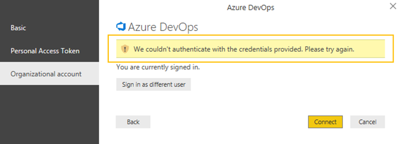
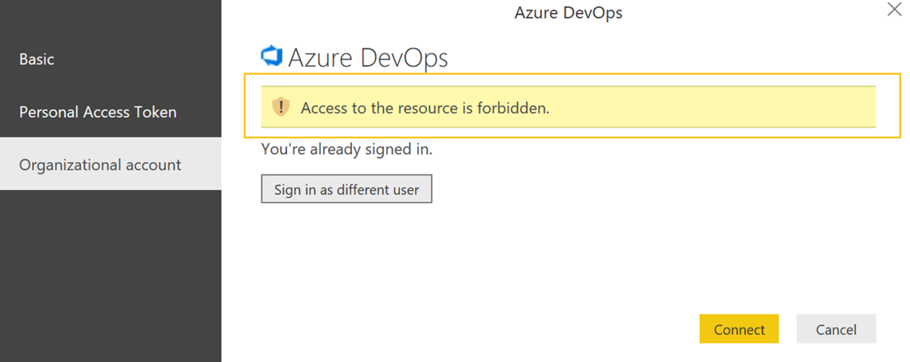

# Connect to VSTS with Power BI Data Connector

<b>VSTS</b>

[!INCLUDE [temp](../_shared/analytics-preview.md)]

The **Beta VSTS Power BI Desktop Data Connector**, was shipped with the *January 2017 Update* and is currently under development.  The Data Connector will be updated in early 2018, until the updated Data Connector is available we recommend using the [Power BI OData Connector](../analytics/access-analytics-power-bi.md).

## Import data

1. Make sure you have *Power BI Desktop*  *January 2017 Update* or a newer version. You can download it from the official [Power BI Desktop download page](https://powerbi.microsoft.com/desktop).

2. Make sure you have [permissions required to access the Analytics service](../analytics/analytics-security.md).

3. **Launch Power BI Desktop and get your data**. Select *Get Data* using one of the two options to access the Data Connector. 

	You can either click *Get Data* button in the splash screen that opens up when you launch *Power BI.* 

	
	
	Or, you can find a similar button in the ribbon in the *Home* section. 
	
	

4. Select the VSTS (Beta) entry listed under the Online Services category, and click **Connect**.

	

5. **Confirm acceptance of using the data connector that is in Preview**.  While the data connector is in Preview you need to confirm that you are aware of the implications.

	Select *Don't warn me again for this connector* to avoid seeing it every time you want to use the connector. Then, click **Continue**.

	

6. **Specify the basic parameters to connect to your data**. *VSTS account name*" and *Project name* are mandatory. 
 
	

	- For *VSTS account name*, enter just the account name and not the full URL (e.g. use `fabrikam-fiber-inc` if the URL of your account is "`https://fabrikam-fiber-inc.visualstudio.com`").
	- For *Project name*, enter just the project name (e.g. use `Fabrikam-Fiber-Git` if the URL of your project is "`https://fabrikam-fiber-inc.visualstudio.com/Fabrikam-Fiber-Git`").
	- For *Area path(s)* (optional), enter the full path as it appears in the `Area` field of your work items and optionally add `\*` suffix to include all children.
	> [!TIP]
	> The *Area path(s)* parameter supports wildcards. You can add `\*` at the end of the path to include all its children. Also, you can specify multiple paths by entering each path separated by the `|` (vertical bar) character.

	

	> [!IMPORTANT]  
	> Don't confuse the team name with the project name, a common mistake. 
	> If the URL you use on the daily basis is "`https://fabrikam-fiber-inc.visualstudio.com/Fabrikam-Fiber-Git/Device`", then `Fabrikam-Fiber-Git` is the project name, whereas `Device` is the team name.

7. **Sign in to the service**. Upon first-time access, you're required to sign in and have your credentials authenticated. Power BI Desktop saves your credentials so you will only have to do this once.

	Choose between these two authentication options: 
	- Select *Organizational account* if your organization is using Azure Active Directory to manage users.  
	- Select *Basic* if you are connecting to a personal account or you want to use personal access token. This option also support alternate credentials, but it is not recommended as unlike personal access tokens, this login doesn't expire and can't be scoped to limit access to your VSTS data.

	

	If you select *Organizational account,* enter your username and password into the standard login page.  

	

8. Click connect upon verification of your credentials. Upon successful login Power BI will verify if your user account has the right permissions to access the specified team project. If any errors arise, refer to the [Q & A](#q-a) section as it covers the most common problems.

	

9. **Select tables to load**. Once your credentials are saved they will be used to fetch the list of available tables. To learn more about available tables, see [Available data tables in the Power BI Data Connector](data-connector-available-data.md).
 
	Click *Work Items - Today* table and wait for the preview to load.
	It represents the current state of all Work Items in the project.
	Columns are sorted alphabetically. Each column corresponds to a field.

	Select the checkbox next to *Work Items - Today* table and click **Edit** to enter query edit mode.

	> [!NOTE]
	> We don't recommend that you click the *Load* button as it will load the whole table. 
	> Loading the whole table will succeed only if the number of Work Items is less than 200K. 
	> Otherwise the load operation will fail with an error message saying that the number of rows exceeded the allowed limit.
	> For more information, see [How do I resolve error: *Query result exceeds maximum size...*](#QueryExceedsPreferedMaxSizeException) in the Q & A section.

	

10. **Select relevant rows**.  Just as you can [define work item queries in VSTS](../../work/track/using-queries.md) you can also select the Work Items that you are interested in using the *Power BI Query Editor*. The query editing experience differs from that of the web portal as it shows you a   preview of the dataset after each filter or transformation step you make.

	> [!TIP]
	> Filtering rows can significantly decrease the load time and speed up queries against the dataset.
	> One of the best ways to reduce the number of rows is to set filter on `State` column.

	Although the *Work Items - Today* table is already filtered to a selected *Project* and *Area Path*, it can still result in a very large dataset. Therefore, we recommend you add additional filter steps.

	You can do this and quickly reduce the number of rows by setting the filter on `State` column.  
	a. Scroll horizontally to see the `State` column.  
	b. Click the filter drop-down button.  
	c. Select active states.  
	d. Click **OK** to accept the selection.  

	

	You can combine many filters by applying them in a sequence. 
	For example, in order to add additional filterS on `Work Item Type` you can repeat the steps from above.

	

11. **Select relevant columns**. As you can see in the preview, the *Work Items - Today* table 
	has many columns, one for each field available in any Work Item used in the project. 
	Depending on the process  referenced by the team project&mdash;[Agile](../../work/work-items/guidance/agile-process.md), [Scrum](../../work/work-items/guidance/scrum-process.md), or [CMMI](../../work/work-items/guidance/cmmi-process.md)&mdash;the number of columns can be very large, reaching even hundreds. Of course, not all of them will be relevant to your reporting scenarios.

	> [!TIP]
	> By selecting only those columns of interest you decrease the load time, speed up queries, and make the data model easier to work with.

	Follow these steps to select relevant columns:
	a. While holding `Ctrl` button on the keyboard scroll and click column headers to select columns you care about.  
	b. Once all the columns are selected, right-click the header to open context menu.  
	c. Select `Remove Other Columns` to insert selection step.  

	

12. **Close the Query Editor and apply your changes**. After filtering rows and selecting columns you can either finish and click *Close & Apply* or add additional transformation steps.

	> [!IMPORTANT]  
	> Power BI automatically translates filtering and columns selection steps into queries to the underlying data source provided that they appear at the beginning of *Applied steps* list. Always start with filtering and columns selection before you apply more advanced transformations such as adding custom columns.

	

13. **Wait for the data to load**. Closing the *Query Editor* triggers the load operation. 
	You can observe its progress by looking at the status messages, which appear directly under 
	the table name. Should you see any errors, refer to the [Q & A](#q-a) section.

	

14. **Create reports based on the loaded data**. After the load operation finishes, you can explore the data by creating custom reports. For examples of common reports, see [Data Connector - Example reports](data-connector-examples.md).

	

## Related notes
- [Permissions required to access the Analytics service](../analytics/analytics-security.md)
- [Power BI integration overview](overview.md)
- [Analytics Service security](../analytics/analytics-security.md)
- [Authenticate your identity with personal access tokens](../../accounts/use-personal-access-tokens-to-authenticate.md) 
- [Available data tables in the Power BI Data Connector](data-connector-available-data.md)  
- [Data Connector - Example reports](data-connector-examples.md)

## Q & A

<!-- BEGINSECTION class="md-qanda" -->

### Q: How should I read error messages coming from the connector?
**A:** Reading error messages coming from the connector can be challenging because they typically contain additional contextual information.
If the load operation fails, then the message will start with *Failed to save modifications to the server...*.
When you see it, then search for **&#91;DataSource.Error&#93; VSTS:**.
The following text is the real error message returned from the connector.

In the example below the most important part of the error message is:

>Query result exceeds maximum size. Please reduce the number of records by applying additional filters.

### Q: How do I resolve error: *Query result exceeds maximum size. Please reduce the number of records by applying additional filters*?

**A:** You will get the following error if the number or records exceeds 200k.  
> Failed to save modifications to the server. Error returned: 'OLE DB or ODBC error: 
> &#91;DataSource.Error&#93; VSTS: Request failed: The remote server returned an error: (400) Bad Request. 
> (**Query result exceeds maximum size. Please reduce the number of records by applying additional filters**).'.

This error typically occurs when your project has a lot of work items and you haven't specified filters that would bring the number of rows to an acceptable level. If you encounter this error then go to step [10. Select relevant rows](#select-relevant-rows) and update existing or add more filter steps.

### Q: How do I resolve error: *The user was not authorized*?

> The user was not authorized.

**A:** You can encounter this error if you try to access a team project to which you don't have permissions.

### Q: How do I resolve error: *Access to the resource is forbidden*?

> Access to the resource is forbidden.

**A:** You can encounter this error if you have access to a given project but you do not have the *View analytics* permissions. Please work with your project administrator to get these permissions.
For more information about the security model, see [Analytics Service security](../analytics/analytics-security.md).

### Q: How do I resolve error: *Project "X" does not exist or you do not have permissions to access it*?

> We encountered an error while trying to connect.  
> Details: Invalid "Project" parameter. **Project "X" does not exist or you do not have permissions to access it.**.

**A:** This error indicates that the value you entered for *Project name* does not correspond to any project. A common mistake users can make is to confuse the team project name with a team name.  

If the URL you use on a daily basis is "`https://fabrikam-fiber-inc.visualstudio.com/Fabrikam-Fiber-Git/Device`", then `Fabrikam-Fiber-Git` is the project name and it should be used in the parameter, whereas `Device` is the team name.

<!-- ENDSECTION -->

