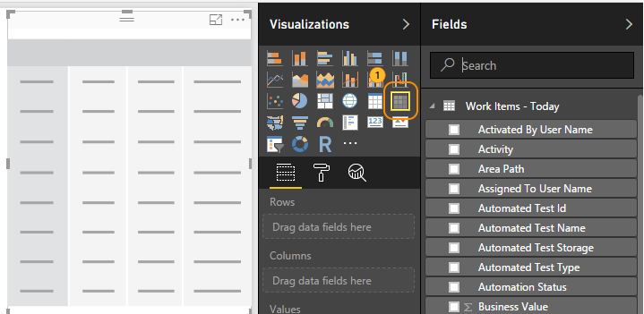
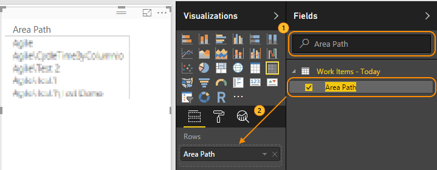
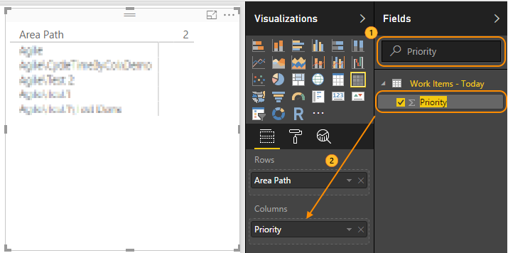
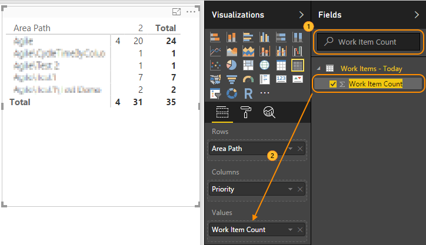
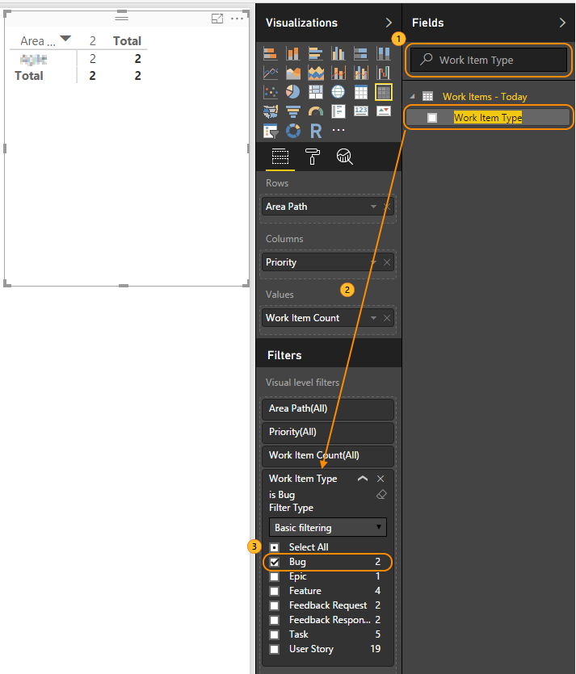

# Example reports for Power BI Data Connector

<b>VSTS</b>

Steps are provided to support generating the following example reports: 

- [Number of Work Items](#number-of-work-items)  
- [Number of Bugs by Area Path and Priority](#number-of-bugs-by-area-path-and-priority)  

Prior to generating these reports, you must first [connect to the Analytics Services for VSTS using the Power BI data connector](data-connector-connect.md). 

> [!TIP]  
> Use the search box if you are working with tables that contain many columns.

<a id="number-of-work-items" />
## Number of Work Items

1. Load `Work Items - Today` table with columns: `Work Item Count`.  

2. Select *Card* visual.  

	  

3. Search for `Work Item Count` and drag it to the `Fields`.

	  

<a id="number-of-bugs-by-area-path-and-priority" />
## Number of Bugs by Area Path and Priority

1. Load `Work Items - Today` table with columns: `Area Path`, `Priority`, `Work Item Count`, `Work Item Type`.  

2. Select `Matrix` visual.  

	

3. Search for `Area Path` and drag it to `Rows`.

	

4. Search for `Priority` and drag it to `Columns`.

	

5. Search for `Work Item Count` and drag it to `Values`.

	

6. Search for `Work Item Type`, drag it to `Visual level filters` and select `Bugs`.

	

## Related notes 
- [Power BI integration overview](overview.md) 
- [Connect to VSTS with Power BI Data Connector](./data-connector-connect.md)
- [Available data tables in the Power BI Content Pack](data-connector-available-data.md) 
- [Functions available in Power BI Data Connector](data-connector-functions.md) 