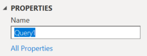
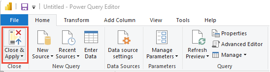

In Power BI, do the following steps.  

When finished, you may choose to rename columns. 

1. Right-click a column header and select **Rename...**

	> [!div class="mx-imgBorder"] 
	> 

1. Change the type of count columns to **Whole Number** and percentage fields to **Decimal Number**.

	> [!div class="mx-imgBorder"]
	> 

1. You also may want to rename the query from the default **Query1**, to something more meaningful. 

	> [!div class="mx-imgBorder"] 
	> 

1. Once done, choose **Close & Apply** to save the query and return to Power BI.

	> [!div class="mx-imgBorder"] 
	> 

