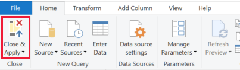

# Connect using Power BI and OData queries

[!INCLUDE [temp](../_shared/version-azure-devops.md)]

Using OData queries is the recommended approach for pulling data into Power BI. To get started quickly, check out the [Overview of sample reports using OData queries](sample-odata-overview.md). For information on other approaches, read the [Power BI integration overview](overview.md). 

Power BI can execute OData queries, which can return a filtered or aggregated set of data to Power BI. OData queries have two advantages: 
1. All filtering is done server-side. Only the data you need is returned, which leads to shorter refresh times.
1. You can pre-aggregate data server-side. An OData query can perform aggregations such as work item rollup and build failure rates. These are accomplished server-side, and only the aggregate values are returned to Power BI. This allows you to perform aggregations across large data sets, without needing to pull all the detail data into Power BI.

Use this article to learn how to:

> [!div class="checklist"]
> * Write and test OData queries
> * Execute an OData query from Power BI

[!INCLUDE [temp](../_shared/analytics-prerequisites.md)] 

## Using Visual Studio Code to write and test OData queries

The easiest way to write and test OData is to use [Visual Studio Code (VS Code)](http://aka.ms/vscode) with the [OData extension](https://marketplace.visualstudio.com/items?itemName=stansw.vscode-odata). VS Code is a free code editor available on Windows, Mac, and Linux. The OData extension provides syntax highlighting and other functions useful for writing and testing queries. 

### 1. Install Visual Studio  Code
 
To download and install Visual Studio Code, go to [Visual Studio Code download page](http://aka.ms/vscode).

### 2. Install the OData extension

Open Visual Studio Code, select **Extensions**, and search for "odata". Select **vscode-odata** and install it.

### 3. Create an .odata file

From Visual Studio Code, create and save a file called "filename.odata". You may name it whatever you want, but it must have the extension ".odata" to enable the OData extension functionality.

### 4. Write the OData query

Write the OData query. For example queries, review the [Overview of sample reports using OData queries](sample-odata-overview.md). 

The following query returns the top 10 work items under a specific area path. You will need to substitute {organization}, {project}, and {area path} with your values.

```
https://analytics.dev.azure.com/{organization}/{project}/_odata/v3.0-preview/WorkItems?
    $select=WorkItemId,Title,WorkItemType,State,CreatedDate
    &$filter=startswith(Area/AreaPath,'{area path}')
    &$orderby=CreatedDate desc
    &$top=10
``` 

For more information on how to write OData queries against Analytics, see [OData query quick reference](../extend-analytics/quick-ref.md) 

Once you've written the query in Visual Studio Code, you should see syntax highlighting:


### 5. Test the OData query

To test the OData query, place your cursor anywhere in the query text and select **View > Command Pallette**. In the search box, type "odata" to bring up all the OData commands:

> [!div class="mx-imgBorder"] 
> 

Select **OData: Open**. This will combine the multi-line query into a one-line URL and open it in your default browser. 

The Odata query result set is in JSON format. To view the results, install a JSON Formatter extension for your browser. There are several options available for both Chrome and Edge.

> [!div class="mx-imgBorder"] 
> 

If the query has an error, the Analytics service retursn an error in JSON format as well. For example, this error states the query has selected a field that doesn't exist:

> [!div class="mx-imgBorder"] 
> 

Once you've verified the query works correctly, you can execute the query from Power BI.

## Execute an OData query from Power BI

### 1. Combine the multi-line OData Query into a single-line

Before using the query in Power BI, you must convert the multi-line OData query to a single-line. The simplest way to do this is in [Visual Studio Code](http://aka.ms/vscode) with the [OData extension](https://marketplace.visualstudio.com/items?itemName=stansw.vscode-odata), and use the **OData: Combine** command.

> [!NOTE]
> Within your filename.odata file, you may want to create a copy of the multi-line query text first, and execute **OData: Combine** on the copy. Since there is no way to convert the single-line query back to a readable multi-line. 

From Visual Studio Code, place your query anywhere in the query text and select **View > Command Pallette**. In the search box, type "odata" and select **OData: Combine**.

The multi-line query converts into a single line.

> [!div class="mx-imgBorder"] 
> 

Copy the entire line to your clipboard.

### 2. Execute the query from Power BI

Open Power BI, select **Get Data**, and then the OData Feed connector. For details, see [Create a Power BI report with an OData Query](create-quick-report-odataq.md).

> [!div class="mx-imgBorder"] 
> 

From the OData feed dialog, copy the OData query from the clipboard into the URL text box, then choose **OK**.

> [!div class="mx-imgBorder"] 
> 


### 3. Specify query options

Power BI displays a preview dialog:

> [!div class="mx-imgBorder"] 
> 

Select **Edit** to open the Power Query Editor.

> [!div class="mx-imgBorder"] 
> 

Select **Advanced Editor**.

> [!div class="mx-imgBorder"] 
> 

Scroll the view pane horizontally to the right, to view the "[Implementation='2.0']" parameter.

> [!div class="mx-imgBorder"] 
> 

Replace the "[Implementation='2.0']" with the following string:

```
[Implementation="2.0",OmitValues = ODataOmitValues.Nulls,ODataVersion = 4]
``` 

> [!div class="mx-imgBorder"] 
> 

These steps accomplish the following actions: 
- Instructs Power BI to reference OData v4
- Instructs the Analytics Service to omit any values that are null.
- 
These actions are required for Power BI to successfully execute an OData query against the Azure DevOps Analytics service.

Select **OK** to close the Advanced Editor and return to Power BI's Power Query editor. You can use the Power Query Editor to perform the optional actions:  
- Name the Query from "Query1" to something specific
- Transform columns to a specific type. Power BI will auto-detect the type, but you may want to convert column to to a specific data type. 
- Add computed columns
- Remove columns
- Expand columns into specific fields

### 4. Create a report using the data

Select **Close & Apply** to save your settings and pull the data into Power BI. Once the data is refreshed, you can create a report as you would normally in Power BI.

> [!div class="mx-imgBorder"] 
> 

## Related articles

- [Sample Power BI Reports using OData Queries](sample-odata-overview.md)
- [Data available from Analytics](data-available-in-analytics.md)
- [Grant permissions to access Analytics](./analytics-security.md)
- [Power BI integration overview](overview.md)

