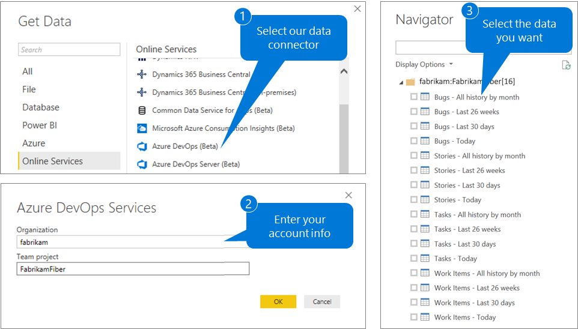
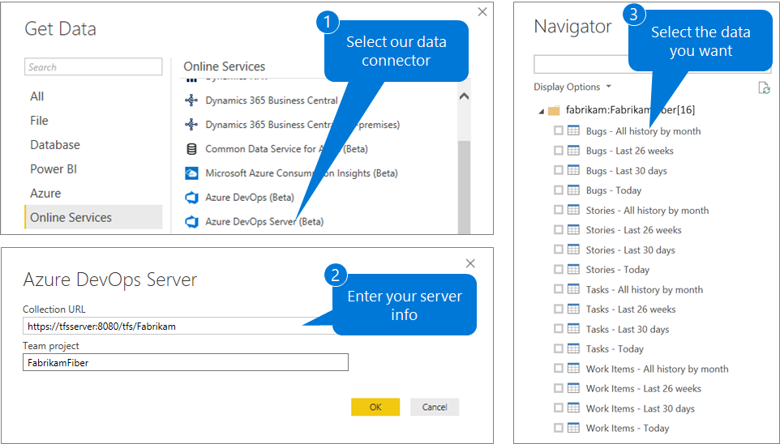

# About Power BI integration

[!INCLUDE [temp](../_shared/version-azure-devops.md)]

[Power BI](https://powerbi.microsoft.com) is a suite of business analytics tools. Use it to do ad hoc analysis, produce beautiful reports, and publish for enterprise consumption.

[!INCLUDE [temp](../_shared/powerbi-preview.md)]

The easiest way to pull Azure DevOps data into Power BI is to use the [Power BI Data Connector](data-connector-connect.md). The Azure DevOps Power BI Data connector works with Analytics views. For more information, read [What are Analytics views](what-are-analytics-views.md).
 
::: moniker range="azure-devops"

::: moniker-end

::: moniker range="azure-devops-2019"

::: moniker-end

## Support data connection methods
You can pull data from the Analytics services into Power BI in one of three ways. 

<table width="90%">
<tbody valign="top">
    <tr>
        <td width="25%"><b>Connection Option</td>
        <td><b>Description</td>
    </tr>
    <tr>
        <td><a href="data-connector-connect.md">Connect using the Azure DevOps Data Connector</href></td>
        <td>The Azure DevOps Data connector is the recommended way to connect Power BI to the Analytics service. The connector simplifies the data model into a single table and models historical data to simplify trend reporting.
        The Azure DevOps Power BI Data connector works with <a href="what-are-analytics-views.md">Analytics views</href></a>. Last updated February 4th, 2018</td>
    </tr>
    <tr>
        <td><a href="access-analytics-power-bi.md">Connect using the Power BI OData connector</href></td>
        <td>Using the Power BI OData connector is not recommended for anything other than analysis of current work items. The Analytics service data model has relationships and advanced filters which are necessary for many scenarios and are not supported using the OData connector</td>
    </tr>
    <tr>
        <td><a href="data-connector-functions.md">Connect using Azure DevOps functions</href></td>
        <td>This option is intended for advanced users who need a greater degree of control of what data is included in the model. Using the functions, you can specify OData queries as well as combine data from other sources, such as Azure DevOps REST APIs. You can also support complex model structures not supported by the Azure DevOps Data Connector. 
        Last updated February 4th, 2018</td>
    </tr>
</tbody>
</table>

## Prerequisites

Before you get started using Power BI to work with the Analytics service, make sure you have completed the following steps:

::: moniker range="azure-devops"

0. Install the *Power BI Desktop* *October 2018 Update* or a newer version. You can download it from the official [Power BI Desktop download page](https://powerbi.microsoft.com/desktop).  
0. Configure the [permissions required to access the Analytics service](analytics-security.md).  
0. Review the [knowledge base of Power BI articles](https://powerbi.microsoft.com/documentation/powerbi-landing-page/).  
0. If you are not familiar with the Analytics service, read "[What is the Analytics service](what-is-analytics.md)" before continuing.

::: moniker-end

::: moniker range="azure-devops-2019"

0. Install the *Power BI Desktop* *October 2018 Update* or a newer version. You can download it from the official [Power BI Desktop download page](https://powerbi.microsoft.com/desktop).  
0. Install the [Analytics extension](../dashboards/analytics-extension.md).  
0. Configure the [permissions required to access the Analytics service](analytics-security.md).  
0. Review the [knowledge base of Power BI articles](https://powerbi.microsoft.com/documentation/powerbi-landing-page/).  
0. If you are not familiar with the Analytics service, read "[What is the Analytics service](what-is-analytics.md)" before continuing.

::: moniker-end

## Deprecated PowerBI.com Content Pack

<!--- QUESION -Do we still need this section? --> 
In November, 2017 we deprecated the PowerBI.com Azure DevOps Content Pack. We deprecated it due to the negative impact it had on the performance of organizations, including throttling end users access. Support will continue for all existing PowerBI.com datasets based on the Content Pack; however, you won't be able to create any new datasets.

