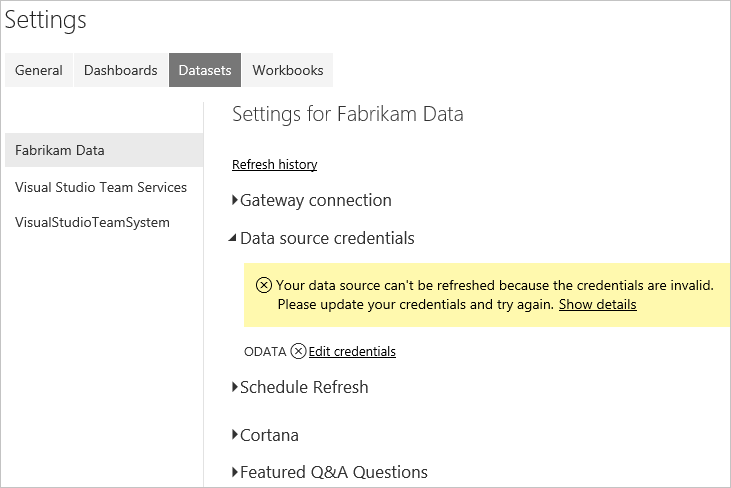
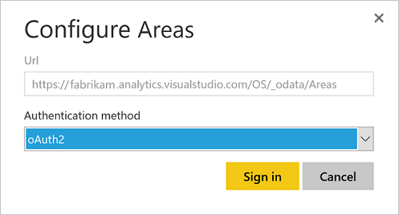
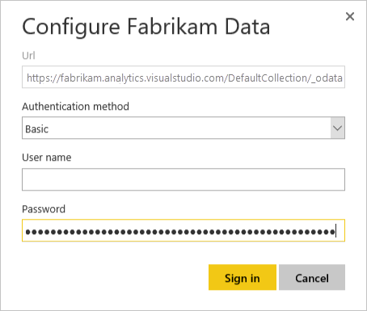

# Publish a Power BI Desktop file to PowerBI.com 

[!INCLUDE [temp](../_shared/version-azure-devops.md)]

Once you've [created a Power BI Desktop file](access-analytics-power-bi.md) and the associated datasets, measures and charts, you can share those with others by creating a dashboard on PowerBI.com. This article shows you how.   

1. If using an [Analytics View](what-are-analytics-views.md) , verify that the view is Shared and not Private.

0. Open the **Power BI Desktop** file with your data.  

0. Choose **Publish** on the **Home** tab. 

     

0. Respond to the prompts to sign in. If you don't already have a Power BI account you will need to create one. Choose **Sign in**.
  
     

0. Choose the **Open 'file name' in Power BI** link.

0. Expand the navigation pane in Power BI and select the work space that you selected when you published the report.  

0. Choose **Datasets** in the upper right corner.

0. Choose the ellipsis next to the dataset that represents the report you just loaded (this is typically the file name.   

     

0. Choose **Schedule Refresh**.  

0. Choose the **Edit credentials** link next to ODATA under Data source credentials as shown here:

     

0. Select the appropriate authentication option. 

	* Use **oAuth2**  for Azure Active Directory (Azure AD) or Windows credentials.

    
 
	* Use **Basic** for PAT credentials.   

    

	> [!IMPORTANT]  
	> If you are using a Personal Access Token, remember that the token expires on a set interval. When it expires you'll need to [update the credentials](client-authentication-options.md#update-credentials). Otherwise the report, while still displaying data, won't update with the latest data.

0. Choose **Sign in**.  

At this point, the data will update on your scheduled basis using the credentials entered.

> [!IMPORTANT]   
> Any data included in the Analytics view and published Power BI.com will be accessible to all users with access to the report, regardless of the project permissions configured in Azure DevOps.    

## Related articles

- [Analytics service](index.md)  
- [Authenticate your identity with personal access tokens](../../organizations/accounts/use-personal-access-tokens-to-authenticate.md)  
- [Access data through Excel](access-analytics-excel.md)  
- [Access data through Power BI desktop](access-analytics-power-bi.md)  

