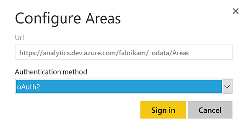

# Publish a Power BI Desktop file to PowerBI.com 

**VSTS**  

Once you've [created a Power BI Desktop file](access-analytics-power-bi.md) and the associated datasets, measures and charts, you can share those with others by creating a dashboard on PowerBI.com. This process walks you through how to do that. 

1. Verify that the [Analytics View](../analytics/what-are-analytics-views.md) is shared with all users who might have [access to edit it](../analytics/analytics-views-create.md).

0. Open the **Power BI Desktop** file with your data.  

0. Click **Publish** on the **Home** tab. 

     

0. You will be prompted to Sign in, if you don't already have a Power BI account you will need to create one. Click **Sign in**.
  
     

0. Click the **Open 'file name' in Power BI** link.

0. Expand the navigation pane in Power BI and select the work space that you selected when you published the report.  

0. Click **Datasets** in the upper right corner.

0. Click the ellipsis next to the dataset that represents the report you just loaded (this is typically the file name.   

     

0. Click **Schedule Refresh**.  

0. Click the Edit credentials link next to ODATA under Data source credentials as shown here:

     

0. Select the appropriate authentication option (as discussed in [Client Authentication Options](../analytics/client-authentication-options.md)). 
* Use **oAuth2**  for Azure Active Directory (AAD) credentials.

    
 
* Use **Basic** for PAT credentials.   

    

	See [Client Authentication Options](../analytics/client-authentication-options.md) for more information on acquiring credentials.  
>[!IMPORTANT]  
>If you are using a Personal Access Token, remember that the token expires on a set interval. When it expires you'll need to [update the credentials](../analytics/client-authentication-options.md#update-credentials). Otherwise the report, while still displaying data, won't update with the latest data.

0. Click **Sign in**.  

At this point, the data will update on your scheduled basis using the credentials entered.

>[!IMPORTANT]   
>Any VSTS data included in the Analytics View and published Power BI.com will be accessible to all users with access to the report regardless of the project permissions configured in VSTS.    

## Related articles

- [Analytics Service](index.md)  
- [Client Authentication Options](../analytics/client-authentication-options.md)
- [Authenticate your identity with personal access tokens](../../organizations/accounts/use-personal-access-tokens-to-authenticate.md)  
- [Access data through Excel](../analytics/access-analytics-excel.md)  
- [Access data through Power BI desktop](access-analytics-power-bi.md)  

[!INCLUDE [temp](../../_shared/help-support-shared.md)] 
