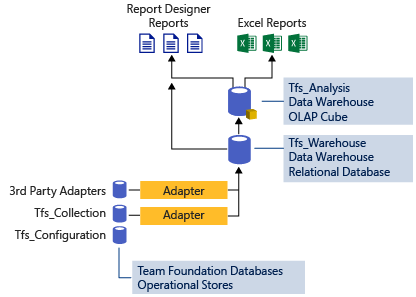

# Reporting roadmap for Azure DevOps 

[!INCLUDE [version-lt-eq-azure-devops](../../includes/version-lt-eq-azure-devops.md)]

The Analytics service provides support for Azure DevOps reporting. It is available for Azure DevOps Server 2019 and later versions.  It replaces the previous platform based on SQL Server Reporting Services. 

With the release of Azure DevOps Server 2022, the only option for gaining Azure DevOps data insights is the Analytics service. Integration with SQL Server Reporting Services is no longer supported. For guidance on migrating from using SQL Reporting Services to Analytics, see [Migrate to Analytics from SQL Reporting Services for Azure DevOps](../sql-reports/migration-guide.md). 

For additional information, see the following articles: 

- [What is Analytics](../powerbi/what-is-analytics.md)
- [Data Available in Analytics](../powerbi/data-available-in-analytics.md) 
 
> [!NOTE]  
> If you are looking for information about the Azure Analysis Services, see 
[Azure Analysis Services](https://azure.microsoft.com/services/analysis-services/).

## The Analytics service

::: moniker range=">= azure-devops-2020"

Analytics is generally available for Azure DevOps Services and Azure DevOps Server 2020 and later versions. It provides several [advanced widgets](../dashboards/analytics-widgets.md) and supports [Power BI integration](overview.md) and access to the [OData feed](../extend-analytics/quick-ref.md). 

::: moniker-end

::: moniker range="<= azure-devops-2019"

Analytics is in Public Preview for Azure DevOps Server 2019 and later versions. You gain access to it by [enabling or installing Analytics](../dashboards/analytics-extension.md). Analytics provides several [advanced widgets](../dashboards/analytics-widgets.md), [Power BI integration](overview.md), and access to the [OData feed](../extend-analytics/quick-ref.md).

Team Foundation Server (TFS) 2018 and earlier versions don't support Analytics. 

::: moniker-end

To learn more, see [What is Analytics](what-is-analytics.md). It currently contains partial data. We're working to add all reportable data to Analytics. For more information, see [Data Available in Analytics](data-available-in-analytics.md).

## Azure DevOps Server, TFS, and SQL Server Reporting

Since [Team Foundation Server (TFS)](https://visualstudio.microsoft.com/tfs/) was released in 2005, we've offered a reporting solution [based on a data warehouse and OLAP cube](/previous-versions/azure/devops/report/sql-reports/reporting-services-reports), coupled with [a SQL Server Reposrting Services server](/previous-versions/azure/devops/report/sql-reports/create-and-manage-reporting-services-reports) to host reports.

While the configuration is complex, it provides a powerful solution. You can create custom reports by writing [customized SSRS reports](../sql-reports/create-and-manage-reporting-services-reports.md?toc=/azure/devops/report/sql-reports/toc.json&bc=/azure/devops/report/sql-reports/breadcrumb/to]c.json). You can also create reports [using Excel](/previous-versions/azure/devops/report/admin/create-status-and-trend-excel-reports), and share them on SharePoint once you've [configured SharePoint to host Excel Charts](/previous-versions/azure/devops/report/sharepoint-dashboards/configure-sharepoint-tfs-2017-earlier).

We have no plans to bring a cloud version of our SQL Server Reporting story to Azure DevOps Services.

## Future of SQL Server Reporting

The SQL Server Reporting Services platform is supported on all on-premises deployments from Azure DevOps Server 2020 and earlier versions. 
Azure DevOps Server 2020 is the last version to support SQL Server Reporting. Future versions will support only Analytics. This plan allows customers time to convert their reports to Analytics.
 
## Roadmap timeline

Check out the [Features Timeline](/azure/devops/release-notes/features-timeline) for the roadmap of reporting features.
