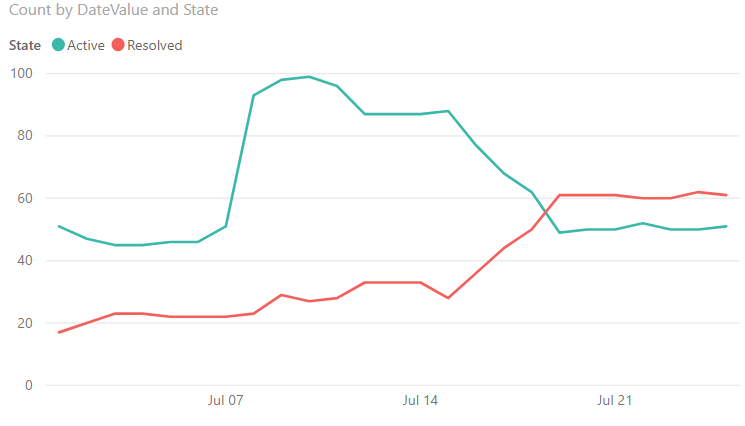
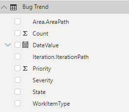

# Bug trends sample report 

[!INCLUDE [temp](../_shared/version-azure-devops.md)]

This article shows you how to display, for a given set of open Bugs, the number of Bugs in each State, trended over a period of time. The following image shows an example of such a trend. 

> [!div class="mx-imgBorder"] 
> 

[!INCLUDE [temp](_shared/sample-required-reading.md)]


## Sample queries

#### [Power BI Query](#tab/powerbi/)

[!INCLUDE [temp](_shared/sample-powerbi-query.md)]

```
let
   Source = OData.Feed ("https://analytics.dev.azure.com/{organization}/{project}/_odata/v3.0-preview/WorkItemSnapshot? "
        &"$apply=filter( "
            &"WorkItemType eq 'Bug' "
            &"and State ne 'Closed' "
            &"and startswith(Area/AreaPath,'{areapath}') "
            &"and DateValue ge {startdate}  "
            &") "
        &"/groupby( "
            &"(DateValue,State,WorkItemType,Priority,Severity,Area/AreaPath,Iteration/IterationPath,AreaSK), "
            &"aggregate($count as Count) "
            &") "
    ,null, [Implementation="2.0",OmitValues = ODataOmitValues.Nulls,ODataVersion = 4]) 
in
    Source
```

#### [OData Query](#tab/odata/)

[!INCLUDE [temp](_shared/sample-odata-query.md)]

```
https://analytics.dev.azure.com/{organization}/{project}/_odata/v3.0-preview/WorkItemSnapshot? 
        $apply=filter(
            WorkItemType eq 'Bug'
            and State ne 'Closed'
            and startswith(Area/AreaPath,'{areapath}')
            and DateValue ge {startdate} 
            )
        /groupby(
            (DateValue,State,WorkItemType,Priority,Severity,Area/AreaPath,Iteration/IterationPath,AreaSK),
            aggregate($count as Count)
            )
```

***

### Substitution strings

[!INCLUDE [temp](_shared/sample-query-substitutions.md)]
- {areapath} - Your Area Path. Example format: Project\Level1\Level2
- {startdate} - The date to start your trend report. Format: YYYY-MM-DDZ. Example: 2019-04-01Z represents 2019-April-01. Do not enclose in quotes.

<!--- How specify the end date? --> 


### Query breakdown

The following table describes each part of the query.  

<table width="90%">
<tbody valign="top">
<tr><td width="25%"><b>Query part</b></td><td><b>Description</b></td><tr>
<tr><td><code>$apply=filter(</code></td><td>Start of filter statement</td><tr>
<tr><td><code>WorkItemType eq 'Bug'</code></td><td>Return Bugs.</td><tr>
<tr><td><code>and State ne 'Closed'</code></td><td>Omit Closed bugs.</td><tr>
<tr><td><code>and startswith(Area/AreaPath,'{areapath}')</code></td><td>Work items under a specific Area Path. Replacing with <code>Area/AreaPath eq '{areapath}'</code> returns items at a specific Area Path.<br>To filter by Team Name, use the filter statement <code>Teams/any(x:x/TeamName eq '{teamname})'</code>.</td><tr>
<tr><td><code>and DateValue ge {startdate}</code></td><td>Start trend on or after the specified date. Example: <strong>2019-04-01Z</strong> represents 2019-April-01.</td><tr>
<tr><td><code>)</code></td><td>Close filter()</td><tr>
<tr><td><code>/groupby(</code></td><td>Start groupby()</td><tr>
<tr><td><code>(DateValue, State, WorkItemType, Priority, Severity, Area/AreaPath, Iteration/IterationPath), </code></td><td>Group by DateValue (used for trending), and any fields you want to report on.</td><tr>
<tr><td><code>aggregate($count as Count)</code></td><td>Aggregate by counting bugs that match the criteria on each date</td><tr>
<tr><td><code>)</code></td><td>Close groupby().</td><tr>
</tbody>
</table>


## Power BI transforms

[!INCLUDE [temp](_shared/sample-expandcolumns.md)]

[!INCLUDE [temp](_shared/sample-finish-query.md)]


## Create the report

Power BI shows you the fields you can report on. 

> [!NOTE]   
> The example below assumes that no one renamed any columns. 

> [!div class="mx-imgBorder"] 
> 

For a simple report, perform the following steps:

1. Select Power BI Visualization **Line chart**. 
1. Add the field "DateValue" to **Axis**.
    - Right click "DateValue" and select "DateValue", rather than Date Hierarchy.
1. Add the field "State" to **Legend**.
1. Add the field "Count" to **Values**.
    - Right click Count field and ensure **Sum** is selected.

The example report displays. 

> [!div class="mx-imgBorder"] 
> 

[!INCLUDE [temp](_shared/sample-multipleteams.md)]

## Additional queries


You can use the following additional queries to create different but similar reports using the same steps defined previously in this article.

### Filter by Teams, rather than Area Path

You can query for bug trends by Team Name rather than Area Path.  


#### [Power BI Query](#tab/powerbi/)

[!INCLUDE [temp](_shared/sample-powerbi-query.md)]

```
let
   Source = OData.Feed ("https://analytics.dev.azure.com/{organization}/{project}/_odata/v3.0-preview/WorkItemSnapshot? "
        &"$apply=filter( "
            &"WorkItemType eq 'Bug' "
            &"and State ne 'Closed' "
            &"and (Teams/any(x:x/TeamName eq '{teamname}) or Teams/any(x:x/TeamName eq '{teamname}) or Teams/any(x:x/TeamName eq '{teamname})"
            &"and DateValue ge {startdate}  "
            &") "
        &"/groupby( "
            &"(DateValue,State,WorkItemType,Priority,Severity,Area/AreaPath,Iteration/IterationPath,AreaSK), "
            &"aggregate($count as Count) "
            &") "
    ,null, [Implementation="2.0",OmitValues = ODataOmitValues.Nulls,ODataVersion = 4]) 
in
    Source
```

#### [OData Query](#tab/odata/)

[!INCLUDE [temp](_shared/sample-odata-query.md)]

```
https://analytics.dev.azure.com/{organization}/{project}/_odata/v3.0-preview/WorkItemSnapshot? 
        $apply=filter(
            WorkItemType eq 'Bug'
            and State ne 'Closed'
            and (Teams/any(x:x/TeamName eq '{teamname} or Teams/any(x:x/TeamName eq '{teamname} or Teams/any(x:x/TeamName eq '{teamname})
            and DateValue ge {startdate} 
            )
        /groupby(
            (DateValue,State,WorkItemType,Priority,Severity,Area/AreaPath,Iteration/IterationPath,AreaSK),
            aggregate($count as Count)
            )
```

***

### Bug trend with a snapshot every Friday

Using a weekly snapshot reduces the amount of data pulled into Power BI, and increases query performance. 
#### [Power BI Query](#tab/powerbi/)

[!INCLUDE [temp](_shared/sample-powerbi-query.md)]

```
let
   Source = OData.Feed ("https://analytics.dev.azure.com/{organization}/{project}/_odata/v3.0-preview/WorkItemSnapshot? "
        &"$apply=filter( "
            &"WorkItemType eq 'Bug' "
            &"and State ne 'Closed' "
            &"and startswith(Area/AreaPath,'{areapath}') "
            &"and DateValue ge {startdate} "
            &"and Date/DayName eq 'Friday'  "
        &") "
        &"/groupby( "
            &"(DateValue,State,WorkItemType,Priority,Severity,Area/AreaPath,Iteration/IterationPath,AreaSK), "
            &"aggregate($count as Count) "
        &") "
    ,null, [Implementation="2.0",OmitValues = ODataOmitValues.Nulls,ODataVersion = 4]) 
in
    Source
```

#### [OData Query](#tab/odata/)

[!INCLUDE [temp](_shared/sample-odata-query.md)]

```
https://analytics.dev.azure.com/{organization}/{project}/_odata/v3.0-preview/WorkItemSnapshot? 
        $apply=filter(
            WorkItemType eq 'Bug'
            and State ne 'Closed'
            and startswith(Area/AreaPath,'{areapath}')
            and DateValue ge {startdate}
            and Date/DayName eq 'Friday' 
        )
        /groupby(
            (DateValue,State,WorkItemType,Priority,Severity,Area/AreaPath,Iteration/IterationPath,AreaSK),
            aggregate($count as Count)
        )
```

* * *

<a id="weekly-snapshots" />

### Bug trend with a snapshot on the first of every month

Using a monthly snapshot reduces the amount of data pulled into Power BI, and increases query performance. 

#### [Power BI Query](#tab/powerbi/)

[!INCLUDE [temp](_shared/sample-powerbi-query.md)]

```
let
   Source = OData.Feed ("https://analytics.dev.azure.com/{organization}/{project}/_odata/v3.0-preview/WorkItemSnapshot? "
        &"$apply=filter( "
            &"WorkItemType eq 'Bug' "
            &"and State ne 'Closed' "
            &"and startswith(Area/AreaPath,'{areapath}') "
            &"and DateValue ge {startdate} "
            &"and Date/DayOfMonth eq 1  "
        &") "
        &"/groupby( "
            &"(DateValue,State,WorkItemType,Priority,Severity,Area/AreaPath,Iteration/IterationPath,AreaSK), "
            &"aggregate($count as Count) "
        &") "
    ,null, [Implementation="2.0",OmitValues = ODataOmitValues.Nulls,ODataVersion = 4]) 
in
    Source
```

#### [OData Query](#tab/odata/)

[!INCLUDE [temp](_shared/sample-odata-query.md)]

```
https://analytics.dev.azure.com/{organization}/{project}/_odata/v3.0-preview/WorkItemSnapshot? 
        $apply=filter(
            WorkItemType eq 'Bug'
            and State ne 'Closed'
            and startswith(Area/AreaPath,'{areapath}')
            and DateValue ge {startdate}
            and Date/DayOfMonth eq 1 
        )
        /groupby(
            (DateValue,State,WorkItemType,Priority,Severity,Area/AreaPath,Iteration/IterationPath,AreaSK),
            aggregate($count as Count)
        )
```

***

## Full list of sample reports

[!INCLUDE [temp](_shared/sample-fulllist.md)]

## Related articles

[!INCLUDE [temp](_shared/sample-relatedarticles.md)]