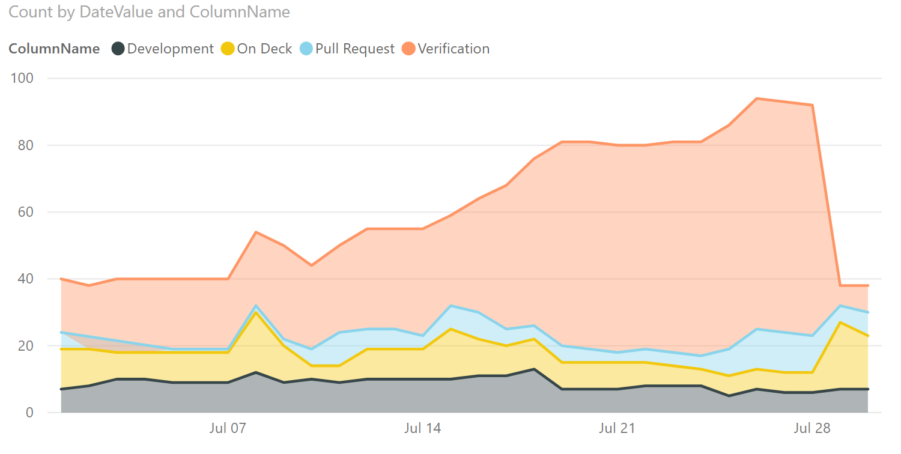
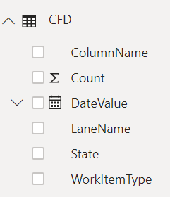
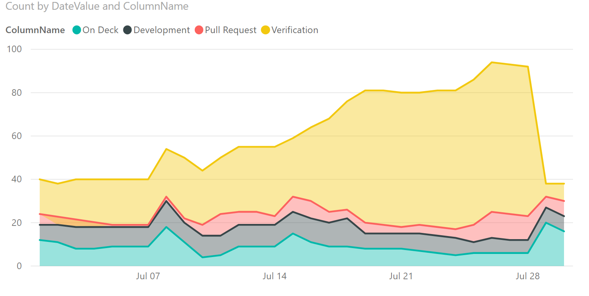

# Cumulative Flow Diagram (CFD)  sample report

[!INCLUDE [temp](../_shared/version-azure-devops.md)]

This article shows you how to display the Stories CFD for a specified team. An example is shown in the following image. 

> [!div class="mx-imgBorder"] 
> 

[!INCLUDE [temp](_shared/sample-required-reading.md)]

## Sample queries

#### [Power BI Query](#tab/powerbi/)

[!INCLUDE [temp](_shared/sample-powerbi-query.md)]

```
let
   Source = OData.Feed ("https://analytics.dev.azure.com/{organization}/{project}/_odata/V3.0-preview/WorkItemBoardSnapshot?"
        &"$apply=filter( "
            &"Team/TeamName eq '{teamname}' "
            &"and BoardName eq 'Stories'  "
            &"and DateValue ge {startdate} "
        &") "
        &"/groupby( "
            &"(DateValue,ColumnName,LaneName,State,WorkItemType,AssignedTo/UserName,Area/AreaPath),  "
            &"aggregate($count as Count) "
        &") "
    ,null, [Implementation="2.0",OmitValues = ODataOmitValues.Nulls,ODataVersion = 4]) 
in
    Source
```

#### [OData Query](#tab/odata/)

[!INCLUDE [temp](_shared/sample-odata-query.md)]

```
https://analytics.dev.azure.com/{organization}/{project}/_odata/V3.0-preview/WorkItemBoardSnapshot?
        $apply=filter(
            Team/TeamName eq '{teamname}'
            and BoardName eq 'Stories' 
            and DateValue ge {startdate}
        )
        /groupby(
            (DateValue,ColumnName,LaneName,State,WorkItemType,AssignedTo/UserName,Area/AreaPath), 
            aggregate($count as Count)
        )
```
***

### Substitution strings

[!INCLUDE [temp](_shared/sample-query-substitutions.md)]
* {teamname} - The name of the team to display the CFD for
* {startdate} - The date to start the CFD chart from. Format: YYYY-MM-DDZ. Example: 2019-04-01Z represents 2019-April-01. Do not enclose in quotes.


### Query breakdown

The following table describes each part of the query.

<table width="90%">
<tbody valign="top">
<tr><td width="25%"><b>Query part</b></td><td><b>Description</b></td><tr>
<tr><td><code>$apply=filter(</code></td><td>Start filter()</td><tr>
<tr><td><code>Team/TeamName eq '{teamname}'</code></td><td>Return items for a specific team</td><tr>
<tr><td><code>and BoardName eq 'Stories'</code></td><td>Return items on the 'Stories' backlog. You can specify other backlog names, such as 'Epics', and 'Features'</td><tr>
<tr><td><code>and DateValue ge {startdate}</code></td><td>Start CFD on or after the specified date. Example: **2019-04-01Z** represents 2019-April-01 2019-July-01</td><tr>
<tr><td><code>)</code></td><td>Close filter()</td><tr>
<tr><td><code>/groupby(</code></td><td>Start groupby()</td><tr>
<tr><td><code>(DateValue, ColumnName, LaneName, State, WorkItemType,AssignedTo/UserName,Area/AreaPath), </code></td><td>Group by DateValue (used for trending), ColumnName, and any other fields you want to report on. Here we include LaneName to enabling filtering by LaneName</td><tr>
<tr><td><code>aggregate($count as Count)</code></td><td>Aggregate as count of work items.</td><tr>
<tr><td><code>)</code></td><td>Close groupby()</td><tr>
</tbody>
</table>


## Power BI transforms

[!INCLUDE [temp](_shared/sample-expandcolumns.md)]

[!INCLUDE [temp](_shared/sample-finish-query.md)]


## Create the report

Power BI shows you the fields you can report on. 

> [!NOTE]   
> The example below assumes that no one renamed any columns. 

> [!div class="mx-imgBorder"] 
> 

For a simple report, perform the following steps:

1. Select Power BI Visualization **Stacked Area Chart**. 
1. Add the field "DateValue" to **Axis**
    - Right click "DateValue" and select "DateValue", rather than Date Hierarchy
1. Add the field "ColumnName" to **Legend**
1. Add the field "Count" to **Values**
1. On the Filter for "ColumnName", select only the values you want to appear on the chart. For example, you may want to unselect "New" and "Done"

The example report:

> [!div class="mx-imgBorder"] 
> 

### Sorting columns in correct order

The above sample will display columns in alphabetical order. To sort the columns in the order specific on the board, perform the following steps:

1. Use the query below to create a new query in Power BI. When done, rename the query to "ColumnOrder" 

#### [Power BI Query](#tab/powerbi/)

[!INCLUDE [temp](_shared/sample-powerbi-query.md)]

```
let
   Source = OData.Feed ("https://analytics.dev.azure.com/{organization}/{project}/_odata/V3.0-preview/BoardLocations?"
        &"$apply=filter( "
            &"Team/TeamName eq '{teamname}'  "
            &"and BoardName eq 'Stories'  "
            &"and IsCurrent eq true "
        &") "
        &"/groupby ((ColumnName,ColumnOrder)) "
    ,null, [Implementation="2.0",OmitValues = ODataOmitValues.Nulls,ODataVersion = 4]) 
in
    Source
```

#### [OData Query](#tab/odata/)

[!INCLUDE [temp](_shared/sample-odata-query.md)]

```
https://analytics.dev.azure.com/{organization}/{project}/_odata/V3.0-preview/BoardLocations?
        $apply=filter(
            Team/TeamName eq '{teamname}' 
            and BoardName eq 'Stories' 
            and IsCurrent eq true
        )
        /groupby ((ColumnName,ColumnOrder))
```
***

### Sort the report in the correct order

1. Once back in Power BI, expand ColumnOrder query and select ColumnName.
1. Select **Modeling** menu.
1. Select **Sort by Column** and choose "ColumnOrder".
1. Select **Manage Relationships** and ensure there is a relationship between "CFD.ColumnName" and "ColumnOrder.ColumnName".
    - It is likely that the relationship was auto-detected.
1. In the report created above, add "ColumnOrder.ColumnName" to **Legend**, replacing "CFD.ColumnName".

The report will now be sorted by correct column order:

> [!div class="mx-imgBorder"] 
> 

> [!NOTE]
> If any work items were in a column that has since been deleted, they will appear as "Blank" in the above report. 

### Pull in data from multiple teams

If you are pulling in data from multiple teams, to aggregate across teams, you must ensure every team in the report has exactly the same set of columns on their boards. Otherwise, you are pulling in varying columns from every team. It is also a good idea to add a **Slicer** Visualization to your report, with Team.TeamName as a field. This allows quick filter of the report by team.


## Full list of sample reports

[!INCLUDE [temp](_shared/sample-fulllist.md)]

## Related articles

[!INCLUDE [temp](_shared/sample-relatedarticles.md)]