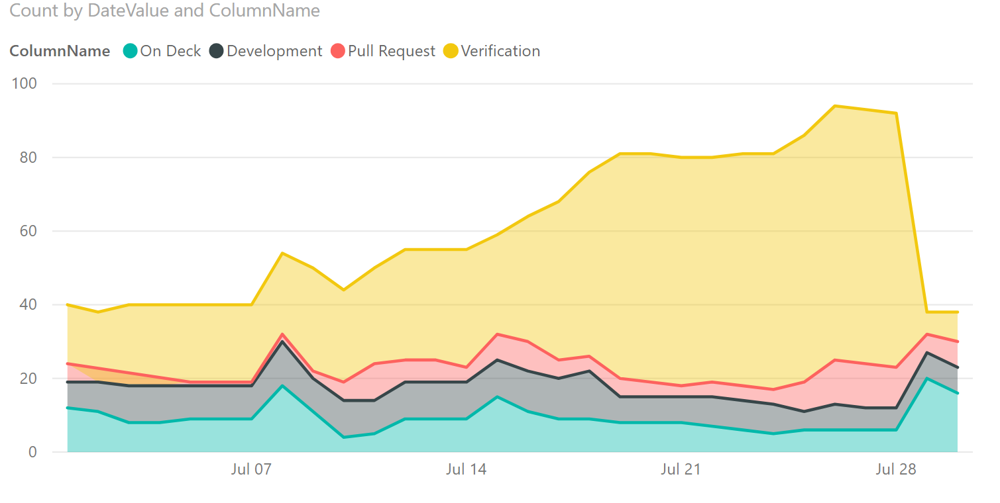

# Cumulative Flow Diagram (CFD) sample report

[!INCLUDE [version-gt-eq-2019](../../includes/version-gt-eq-2019.md)]

This article shows you how to display the Stories CFD for a specified team. An example is shown in the following image. 

> [!div class="mx-imgBorder"] 
> 

[!INCLUDE [temp](includes/sample-required-reading.md)]

[!INCLUDE [prerequisites-simple](../includes/analytics-prerequisites-simple.md)]

## Sample queries

#### [Power BI query](#tab/powerbi/)

[!INCLUDE [temp](includes/sample-powerbi-query.md)]

```
let
   Source = OData.Feed ("https://analytics.dev.azure.com/{organization}/{project}/_odata/V3.0-preview/WorkItemBoardSnapshot?"
        &"$apply=filter( "
            &"Team/TeamName eq '{teamname}' "
            &"and BoardName eq 'Stories'  "
            &"and DateValue ge {startdate} "
        &") "
        &"/groupby( "
            &"(DateValue,ColumnName,LaneName,State,WorkItemType,AssignedTo/UserName,Area/AreaPath),  "
            &"aggregate($count as Count) "
        &") "
    ,null, [Implementation="2.0",OmitValues = ODataOmitValues.Nulls,ODataVersion = 4]) 
in
    Source
```

#### [OData query](#tab/odata/)

[!INCLUDE [temp](includes/sample-odata-query.md)]

```
https://analytics.dev.azure.com/{organization}/{project}/_odata/V3.0-preview/WorkItemBoardSnapshot?
        $apply=filter(
            Team/TeamName eq '{teamname}'
            and BoardName eq 'Stories' 
            and DateValue ge {startdate}
        )
        /groupby(
            (DateValue,ColumnName,LaneName,State,WorkItemType,AssignedTo/UserName,Area/AreaPath), 
            aggregate($count as Count)
        )
```
***

### Substitution strings

[!INCLUDE [temp](includes/sample-query-substitutions.md)]
* `{teamname}` - The name of the team to display the CFD for.
* `{startdate}` - The date to start the CFD chart from. Format: YYYY-MM-DDZ. Example: `2019-04-01Z` represents 2019-April-01. Don't enclose in quotes.


### Query breakdown

The following table describes each part of the query.

:::row:::
   :::column span="1":::
   **Query part**
   :::column-end:::
   :::column span="1":::
   **Description**
   :::column-end:::
:::row-end:::
:::row:::
   :::column span="1":::
   `$apply=filter(`
   :::column-end:::
   :::column span="1":::
   Start filter()
   :::column-end:::
:::row-end:::
:::row:::
   :::column span="1":::
   `Team/TeamName eq '{teamname}'`
   :::column-end:::
   :::column span="1":::
   Return items for a specific team
   :::column-end:::
:::row-end:::
:::row:::
   :::column span="1":::
   `and BoardName eq 'Stories'`
   :::column-end:::
   :::column span="1":::
   Return items on the 'Stories' backlog. You can specify other backlog names, such as 'Epics', and 'Features'
   :::column-end:::
:::row-end:::
:::row:::
   :::column span="1":::
   `and DateValue ge {startdate}`
   :::column-end:::
   :::column span="1":::
   Start CFD on or after the specified date. Example: **2019-04-01Z** represents 2019-April-01 2019-July-01
   :::column-end:::
:::row-end:::
:::row:::
   :::column span="1":::
   `)`
   :::column-end:::
   :::column span="1":::
   Close filter()
   :::column-end:::
:::row-end:::
:::row:::
   :::column span="1":::
   `/groupby(`
   :::column-end:::
   :::column span="1":::
   Start groupby()
   :::column-end:::
:::row-end:::
:::row:::
   :::column span="1":::
   `(DateValue, ColumnName, LaneName, State, WorkItemType,AssignedTo/UserName,Area/AreaPath), `
   :::column-end:::
   :::column span="1":::
   Group by DateValue (used for trending), ColumnName, and any other fields you want to report on. Here we include LaneName to enabling filtering by LaneName
   :::column-end:::
:::row-end:::
:::row:::
   :::column span="1":::
   `aggregate($count as Count)`
   :::column-end:::
   :::column span="1":::
   Aggregate as count of work items.
   :::column-end:::
:::row-end:::
:::row:::
   :::column span="1":::
   `)`
   :::column-end:::
   :::column span="1":::
   Close groupby()
   :::column-end:::
:::row-end:::


[!INCLUDE [temp](includes/query-filters-work-items.md)]


## Power BI transforms

[!INCLUDE [temp](includes/sample-expandcolumns.md)]

[!INCLUDE [temp](includes/sample-finish-query.md)]


## Create the report

Power BI shows you the fields you can report on. 

> [!NOTE]   
> The example below assumes that no one renamed any columns. 

> [!div class="mx-imgBorder"] 
> 

For a simple report, do the following steps:

1. Select Power BI Visualization **Stacked Area Chart**. 
1. Add the field "DateValue" to **Axis**
    - Right-click "DateValue" and select "DateValue", rather than Date Hierarchy
1. Add the field "ColumnName" to **Legend**
1. Add the field "Count" to **Values**
1. On the Filter for "ColumnName", select only the values you want to appear on the chart. For example, you may want to unselect "New" and "Done"

The example report:

> [!div class="mx-imgBorder"] 
> 

### Sorting columns in correct order

The above sample will display columns in alphabetical order. To sort the columns in the order specific on the board, do the following steps:

1. Use the query below to create a new query in Power BI. When done, rename the query to "ColumnOrder" 

#### [Power BI query](#tab/powerbi/)

[!INCLUDE [temp](includes/sample-powerbi-query.md)]

```
let
   Source = OData.Feed ("https://analytics.dev.azure.com/{organization}/{project}/_odata/V3.0-preview/BoardLocations?"
        &"$apply=filter( "
            &"Team/TeamName eq '{teamname}'  "
            &"and BoardName eq 'Stories'  "
            &"and IsCurrent eq true "
        &") "
        &"/groupby ((ColumnName,ColumnOrder)) "
    ,null, [Implementation="2.0",OmitValues = ODataOmitValues.Nulls,ODataVersion = 4]) 
in
    Source
```

#### [OData query](#tab/odata/)

[!INCLUDE [temp](includes/sample-odata-query.md)]

```
https://analytics.dev.azure.com/{organization}/{project}/_odata/V3.0-preview/BoardLocations?
        $apply=filter(
            Team/TeamName eq '{teamname}' 
            and BoardName eq 'Stories' 
            and IsCurrent eq true
        )
        /groupby ((ColumnName,ColumnOrder))
```
***

### Sort the report in the correct order

1. Once back in Power BI, expand ColumnOrder query and select ColumnName.
1. Select **Modeling** menu.
1. Select **Sort by Column** and choose "ColumnOrder".
1. Select **Manage Relationships** and ensure there's a relationship between "CFD.ColumnName" and "ColumnOrder.ColumnName".
    - It's likely that the relationship was autodetected.
1. In the report created above, add "ColumnOrder.ColumnName" to **Legend**, replacing "CFD.ColumnName".

The report will now be sorted by correct column order:

> [!div class="mx-imgBorder"] 
> 

> [!NOTE]
> If any work items were in a column that has since been deleted, they will appear as "Blank" in the above report. 

### Pull in data from multiple teams

If you're pulling data in from multiple teams to aggregate across teams, you must ensure every team in the report has exactly the same set of columns on their boards. Otherwise, you're pulling in varying columns from every team. It's also a good idea to add a **Slicer** Visualization to your report, with Team.TeamName as a field. This step allows quick filter of the report by team.


## Full list of sample reports

[!INCLUDE [temp](includes/sample-fulllist.md)]

## Related articles

[!INCLUDE [temp](includes/sample-relatedarticles.md)]
