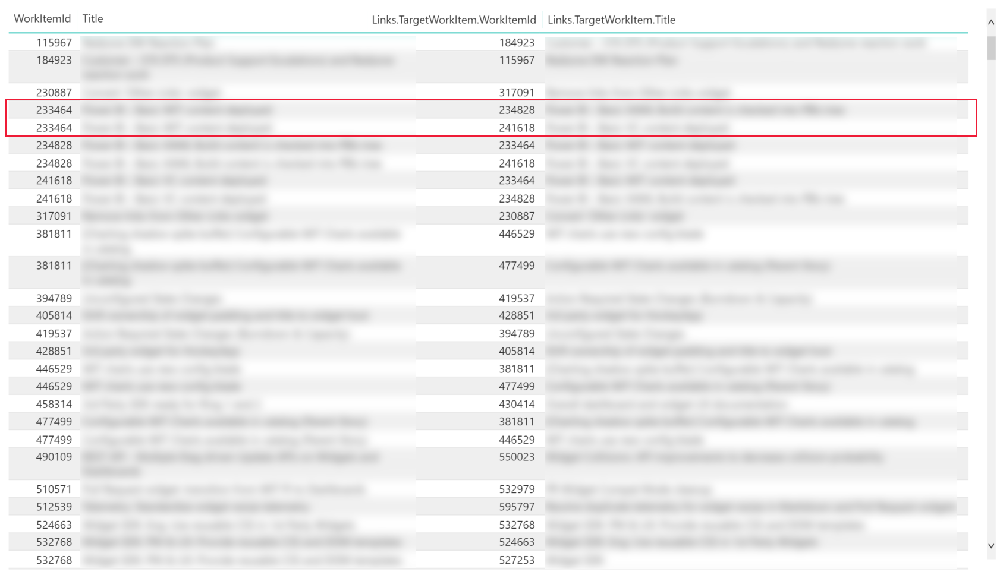
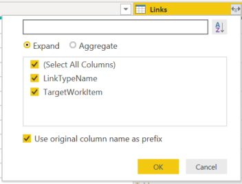
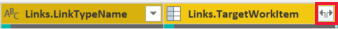
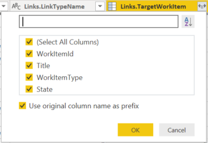
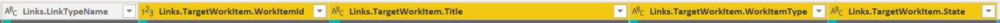
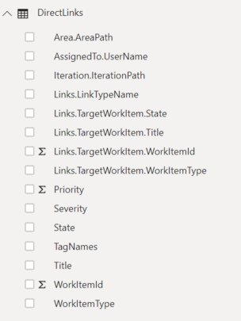

# Work items with direct links sample reports

[!INCLUDE [temp](../_shared/version-azure-devops.md)]

This article shows you how to list a given set of User Stories and their linked User Stories. An example is shown in the following image. 

> [!div class="mx-imgBorder"] 
> 

Other sample queries include listing bugs with a Duplicate link to another bug, and listing bugs which don't contain a Duplicate link to another bug.

[!INCLUDE [temp](_shared/sample-required-reading.md)]


## Sample queries

#### [Power BI Query](#tab/powerbi/)

[!INCLUDE [temp](_shared/sample-powerbi-query.md)]

```
let
   Source = OData.Feed ("https://analytics.dev.azure.com/{organization}/{project}/_odata/v3.0-preview/WorkItems?"
        &"$filter=WorkItemType eq 'User Story' "
            &"and State ne 'Closed' "
            &"and startswith(Area/AreaPath,'{areapath}') "
        &"&$select=WorkItemId,Title,WorkItemType,State,Priority,Severity,TagNames,AreaSK "
        &"&$expand=AssignedTo($select=UserName),Iteration($select=IterationPath),Area($select=AreaPath), "
                &"Links( "
                    &"$filter=LinkTypeName eq 'Related' "
                        &"and TargetWorkItem/WorkItemType eq 'User Story'; "
                    &"$select=LinkTypeName; "
                    &"$expand=TargetWorkItem($select=WorkItemType,WorkItemId,Title,State) "
                &") "
    ,null, [Implementation="2.0",OmitValues = ODataOmitValues.Nulls,ODataVersion = 4]) 
in
    Source
```

#### [OData Query](#tab/odata/)

[!INCLUDE [temp](_shared/sample-odata-query.md)]

```
https://analytics.dev.azure.com/{organization}/{project}/_odata/v3.0-preview/WorkItems?
        $filter=WorkItemType eq 'User Story'
            and State ne 'Closed'
            and startswith(Area/AreaPath,'{areapath}')
        &$select=WorkItemId,Title,WorkItemType,State,Priority,Severity,TagNames,AreaSK
        &$expand=AssignedTo($select=UserName),Iteration($select=IterationPath),Area($select=AreaPath),
                Links(
                    $filter=LinkTypeName eq 'Related'
                        and TargetWorkItem/WorkItemType eq 'User Story';
                    $select=LinkTypeName;
                    $expand=TargetWorkItem($select=WorkItemType,WorkItemId,Title,State)
                )
```

***

### Substitution strings

[!INCLUDE [temp](_shared/sample-query-substitutions.md)]
* {areapath} - Your Area Path. Example format: Project\Level1\Level2


### Query breakdown


The following table describes each part of the query.

<table width="90%">
<tbody valign="top">
<tr><td width="25%"><b>Query part</b></td><td><b>Description</b></td></tr>
<tr><td><code>$filter=WorkItemType eq 'User Story'</code></td><td>Return User Stories.</td>/<tr>
<tr><td><code>and State ne 'Closed'</code></td><td>Omit Closed items.</td></tr>
<tr><td><code>and startswith(Area/AreaPath,'{areapath}')</code></td><td>Work items under a specific Area Path. Replacing with <code>Area/AreaPath eq '{areapath}'</code> returns items at a specific Area Path.<br>To filter by Team Name, use the filter statement <code>Teams/any(x:x/TeamName eq '{teamname})'</code>.</td></tr>
<tr><td><code>&$select=WorkItemId, Title, WorkItemType, State, Priority, Severity, TagNames</code></td><td>Select fields to return.</td></tr>
<tr><td><code>&$expand=AssignedTo($select=UserName), Iteration($select=IterationPath), Area($select=AreaPath), </code></td><td>Expand Assigned To, Iteration, Area entities and select entity fields.</td><tr>
<tr><td><code>Links(</code></td><td>Expand the Links entity</td><tr>
<tr><td><code>$filter=LinkTypeName eq 'Related'</code></td><td>Filter to only links of type 'Related'. <br>Other examples are Parent, Child, Duplicate, Duplicate Of, Affects, Affected By.</td><tr>
<tr><td><code>and TargetWorkItem/WorkItemType eq 'User Story';</code></td><td>Only include links to User Stories.</td><tr>
<tr><td><code>$select=LinkTypeName;</code></td><td>Select the LinkTypeName field to return.</td></tr>
<tr><td><code>$expand=TargetWorkItem($select=WorkItemType, WorkItemId, Title, State)</code></td><td>Select the fields of the linked work item to return.</td></tr>
<tr><td><code>)</code></td><td>Close Links().</td></tr>
</tbody>
</table>


## Power BI transforms

[!INCLUDE [temp](_shared/sample-expandcolumns.md)]

### Expand the Links column

1. Click the expand button on the Links column.

    > [!div class="mx-imgBorder"] 
    > 

1. Select all the fields to flatten.

    > [!div class="mx-imgBorder"] 
    > 

1. Click the expand button on the Links.TargetWorkItem column.

    > [!div class="mx-imgBorder"] 
    > 

1. Select the fields of the Target Work Item to flatten.

    > [!div class="mx-imgBorder"] 
    > 

	The Table now contains flattened Link and Target Work Item field(s).

    > [!div class="mx-imgBorder"] 
    > 

> [!NOTE]
> If the link represents a one-to-many or many-to-many relationship, then multiple links will
> expand to multiple rows, one for each link. 
> 
> For example, if Work Item #1 is linked to Work Item's #2 and #3, then when you expand the Links record, 
> you will have 2 rows for Work Item #1. One that represents its link to Work Item #2, and another that
> represents its link to Work Item #3.


[!INCLUDE [temp](_shared/sample-finish-query.md)]


## Create the report

Power BI shows you the fields you can report on. 

> [!NOTE]   
> The example below assumes that no one renamed any columns. 

> [!div class="mx-imgBorder"] 
> 

For a simple report, perform the following steps:

1. Select Power BI Visualization **Table**.
1. Add columns "WorkItemID" to **Values**.
    - Right click  "WorkItemID" and select **Don't summarize**.
1. Add column "Title" to **Values**.
1. Add column "Link.TargetWorkItem.WorkItemID" to **Values**.
    - Right click "Link.TargetWorkItem.WorkItemID" and select **Don't summarize**.
1. Add column "Link.TargetWorkItem.Title" to **Values**.
1. In **Filters**, for the column "Link.TargetWorkItem.WorkItemID", select **Show items when value** and select the option **is not blank**. Then click **Apply Filter**.
    - This action filters out any work items that don't have a link.

The resulting example report is shown in the following image.

> [!NOTE]
> Note how work item 233464 is represented by two rows, one for each linked work item.

> [!div class="mx-imgBorder"] 
> 

[!INCLUDE [temp](_shared/sample-multipleteams.md)]

## Additional queries

You can use the following additional queries to create different but similar reports using the same steps defined previously in this article.

### Filter by Teams, rather than Area Path

The following query is the same as the one used previously in this article, except it filters by Team Name rather than Area Path. 

#### [Power BI Query](#tab/powerbi/)

[!INCLUDE [temp](_shared/sample-powerbi-query.md)]

```
let
   Source = OData.Feed ("https://analytics.dev.azure.com/{organization}/{project}/_odata/v3.0-preview/WorkItems?"
        &"$filter=WorkItemType eq 'User Story' "
            &"and State ne 'Closed' "
            &"and (Teams/any(x:x/TeamName eq '{teamname}) or Teams/any(x:x/TeamName eq '{teamname}) or Teams/any(x:x/TeamName eq '{teamname}) "
        &"&$select=WorkItemId,Title,WorkItemType,State,Priority,Severity,TagNames,AreaSK "
        &"&$expand=AssignedTo($select=UserName),Iteration($select=IterationPath),Area($select=AreaPath), "
                &"Links( "
                    &"$filter=LinkTypeName eq 'Related' "
                        &"and TargetWorkItem/WorkItemType eq 'User Story'; "
                    &"$select=LinkTypeName; "
                    &"$expand=TargetWorkItem($select=WorkItemType,WorkItemId,Title,State) "
                &") "
    ,null, [Implementation="2.0",OmitValues = ODataOmitValues.Nulls,ODataVersion = 4]) 
in
    Source
```

#### [OData Query](#tab/odata/)

[!INCLUDE [temp](_shared/sample-odata-query.md)]

```
https://analytics.dev.azure.com/{organization}/{project}/_odata/v3.0-preview/WorkItems?
        $filter=WorkItemType eq 'User Story'
            and State ne 'Closed'
            and (Teams/any(x:x/TeamName eq '{teamname}) or Teams/any(x:x/TeamName eq '{teamname}) or Teams/any(x:x/TeamName eq '{teamname})
        &$select=WorkItemId,Title,WorkItemType,State,Priority,Severity,TagNames,AreaSK
        &$expand=AssignedTo($select=UserName),Iteration($select=IterationPath),Area($select=AreaPath),
                Links(
                    $filter=LinkTypeName eq 'Related'
                        and TargetWorkItem/WorkItemType eq 'User Story';
                    $select=LinkTypeName;
                    $expand=TargetWorkItem($select=WorkItemType,WorkItemId,Title,State)
                )
```

***

### Return bugs with a Duplicate link to another bug

#### [Power BI Query](#tab/powerbi/)

[!INCLUDE [temp](_shared/sample-powerbi-query.md)]

```
let
    Source = OData.Feed ("https://analytics.dev.azure.com/{organization}/{project}/_odata/v3.0-preview/WorkItems?"
        &"$filter=WorkItemType eq 'Bug' "
            &"and State ne 'Closed' "
            &"and startswith(Area/AreaPath,'{areapath}') "
            &"and Links/any(x:x/LinkTypeName eq 'Duplicate' and x/TargetWorkItem/WorkItemType eq 'Bug') "
        &"&$select=WorkItemId,Title,WorkItemType,State,Priority,Severity,TagNames "
        &"&$expand=AssignedTo($select=UserName),Iteration($select=IterationPath),Area($select=AreaPath), "
            &"Links( "
                &"$filter=LinkTypeName eq 'Duplicate' "
                &"and TargetWorkItem/WorkItemType eq 'Bug'; "
                    &"$select=LinkTypeName; "
                &"$expand=TargetWorkItem($select=WorkItemType,WorkItemId,Title,State) "
            &") "
    ,null, [Implementation="2.0",OmitValues = ODataOmitValues.Nulls,ODataVersion = 4]) 
in
    Source
```

#### [OData Query](#tab/odata/)

[!INCLUDE [temp](_shared/sample-odata-query.md)]

```
https://analytics.dev.azure.com/{organization}/{project}/_odata/v3.0-preview/WorkItems?
        $filter=WorkItemType eq 'Bug'
            and State ne 'Closed'
            and startswith(Area/AreaPath,'{areapath}')
            and Links/any(x:x/LinkTypeName eq 'Duplicate' and x/TargetWorkItem/WorkItemType eq 'Bug')
        &$select=WorkItemId,Title,WorkItemType,State,Priority,Severity,TagNames
        &$expand=AssignedTo($select=UserName),Iteration($select=IterationPath),Area($select=AreaPath),
            Links(
                $filter=LinkTypeName eq 'Duplicate'
                and TargetWorkItem/WorkItemType eq 'Bug';
                    $select=LinkTypeName;
                $expand=TargetWorkItem($select=WorkItemType,WorkItemId,Title,State)
            )
```

***

### Return bugs that don't have a Duplicate link to another bug

#### [Power BI Query](#tab/powerbi/)

[!INCLUDE [temp](_shared/sample-powerbi-query.md)]

```
let
   Source = OData.Feed ("https://analytics.dev.azure.com/{organization}/{project}/_odata/v3.0-preview/WorkItems?"
        &"$filter=WorkItemType eq 'Bug' "
                &"and State ne 'Closed' "
                &"and startswith(Area/AreaPath,'{areapath}') "
                &"and not (Links/any(x:x/LinkTypeName eq 'Duplicate' and x/TargetWorkItem/WorkItemType eq 'Bug')) "
        &"&$select=WorkItemId,Title,WorkItemType,State,Priority,Severity,TagNames "
        &"&$expand=AssignedTo($select=UserName),Iteration($select=IterationPath),Area($select=AreaPath) "
    ,null, [Implementation="2.0",OmitValues = ODataOmitValues.Nulls,ODataVersion = 4]) 
in
    Source
```

#### [OData Query](#tab/odata/)

[!INCLUDE [temp](_shared/sample-odata-query.md)]

```
https://analytics.dev.azure.com/{organization}/{project}/_odata/v3.0-preview/WorkItems?
        $filter=WorkItemType eq 'Bug'
                and State ne 'Closed'
                and startswith(Area/AreaPath,'{areapath}')
                and not (Links/any(x:x/LinkTypeName eq 'Duplicate' and x/TargetWorkItem/WorkItemType eq 'Bug'))
        &$select=WorkItemId,Title,WorkItemType,State,Priority,Severity,TagNames
        &$expand=AssignedTo($select=UserName),Iteration($select=IterationPath),Area($select=AreaPath)
```

***

## Full list of sample reports

[!INCLUDE [temp](_shared/sample-fulllist.md)]

## Related articles

[!INCLUDE [temp](_shared/sample-relatedarticles.md)]
