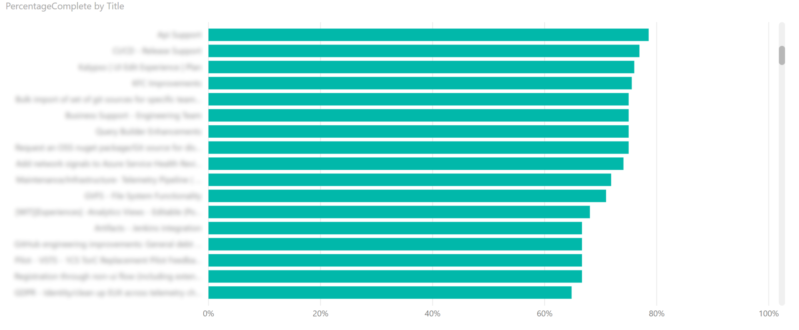
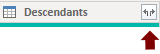
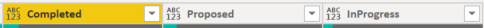

# Feature progress rollup sample report

[!INCLUDE [temp](../includes/version-azure-devops.md)]
 
This article shows you how to display the percentage complete by rollup of Story Points  for a given set of active Features. An example is shown in the following image. 

> [!div class="mx-imgBorder"] 
> 
> 

[!INCLUDE [temp](includes/sample-required-reading.md)]

[!INCLUDE [temp](./includes/prerequisites-power-bi.md)]


## Sample queries

#### [Power BI query](#tab/powerbi/)

[!INCLUDE [temp](includes/sample-powerbi-query.md)]

```
let
   Source = OData.Feed ("https://analytics.dev.azure.com/{organization}/{project}/_odata/v3.0-preview/WorkItems?"
        &"$filter=WorkItemType eq 'Feature' "
            &"and State ne 'Cut' "
            &"and startswith(Area/AreaPath,'{areapath}') "
            &"&$select=WorkItemId,Title,Area,Iteration,AssignedTo,WorkItemType,State,AreaSK"
            &"&$expand=Descendants( "
            &"$apply=filter(WorkItemType eq 'User Story') "
                &"/groupby((StateCategory), "
                &"aggregate(StoryPoints with sum as TotalStoryPoints)) "
            &")  "
    ,null, [Implementation="2.0",OmitValues = ODataOmitValues.Nulls,ODataVersion = 4]) 
in
    Source
```

#### [OData query](#tab/odata/)

[!INCLUDE [temp](includes/sample-odata-query.md)]

```
https://analytics.dev.azure.com/{organization}/{project}/_odata/v3.0-preview/WorkItems?
        $filter=WorkItemType eq 'Feature'
            and State ne 'Cut'
            and startswith(Area/AreaPath,'{areapath}')
            and Descendants/any()
        &$select=WorkItemId,Title,Area,Iteration,AssignedTo,WorkItemType,State,AreaSK
        &$expand=Descendants(
            $apply=filter(WorkItemType eq 'User Story')
                /groupby((StateCategory),
                aggregate(StoryPoints with sum as TotalStoryPoints))
            ) 
```

***

### Substitution strings

[!INCLUDE [temp](includes/sample-query-substitutions.md)]
- {areapath} - Your Area Path. Example format: Project\Level1\Level2


### Query breakdown


The following table describes each part of the query.


:::row:::
   :::column span="":::
      **Query part**  
   :::column-end:::
   :::column span="2":::
      **Description**
   :::column-end:::
:::row-end:::
:::row:::
   :::column span="":::
      ----------------
   :::column-end:::
   :::column span="2":::
      ----------------
   :::column-end:::
:::row-end:::
:::row:::
   :::column span="":::
      `$filter=WorkItemType eq 'Feature'`
   :::column-end:::
   :::column span="2":::
      Return Features.
   :::column-end:::
:::row-end:::
:::row:::
   :::column span="":::
      `and State ne 'Cut'`
   :::column-end:::
   :::column span="2":::
      Omit Features marked as Cut.
   :::column-end:::
:::row-end:::
:::row:::
   :::column span="":::
      `and startswith(Area/AreaPath,'{areapath}')`  
   :::column-end:::
   :::column span="2":::
      Work items under a specific Area Path. Replacing with Area/AreaPath eq '{areapath}' returns items at a specific Area Path.  
      To filter by Team Name, use the filter statement `Teams/any(x:x/TeamName eq '{teamname})'`.
   :::column-end:::
:::row-end:::
:::row:::
   :::column span="":::
      `and Descendants/any()`
   :::column-end:::
   :::column span="2":::
      Filters out any work item that has at least one or "any" descendant. Includes all Features with at least one Child WIT. To get all work items with their descendants, even if they don't have any, run a query without the `Descendants/any()` filter. To omit Features that don't have child User Stories, replace with `any(d:d/WorkItemType eq 'User Story')`.  
      For all work items **with and without descendants**:  
      `$filter=endswith(Area/AreaPath,'suffix')
      &$select=WorkItemId,Title,WorkItemType,State,Area, Descendants
      &$expand=Descendants($select=WorkItemId)`  
      <br/>
      For all workitems with **at least one descendant**:
      `$filter=endswith(Area/AreaPath, 'suffix')and Descendants/any()
      &$select=WorkItemId,Title,WorkItemType,State,Area, Descendants
      &$expand=Descendants($select=WorkItemId)`
   :::column-end:::
:::row-end:::
:::row:::
   :::column span="":::
      `&$select=WorkItemId, Title, WorkItemType, State`  
   :::column-end:::
   :::column span="2":::
      Select fields to return.
   :::column-end:::
:::row-end:::
:::row:::
   :::column span="":::
      `&$expand=Descendants(`  
   :::column-end:::
   :::column span="2":::
      Expand Descendants.
   :::column-end:::
:::row-end:::
:::row:::
   :::column span="":::
      `$apply=filter(WorkItemType eq 'User Story')`  
   :::column-end:::
   :::column span="2":::
      Filters the descendants. Only include User Stories (omits Tasks and Bugs).
   :::column-end:::
:::row-end:::
:::row:::
   :::column span="":::
      `/groupby((StateCategory),`  
   :::column-end:::
   :::column span="2":::
      Group the rollup by StateCategory. For more information on State Categories, see [How workflow states and state categories are used in Backlogs and Boards](../../boards/work-items/workflow-and-state-categories.md).
   :::column-end:::
:::row-end:::
:::row:::
   :::column span="":::
      `aggregate(StoryPoints with sum as TotalStoryPoints))`  
   :::column-end:::
   :::column span="2":::
      Aggregate sum of Story Points.
   :::column-end:::
:::row-end:::
:::row:::
   :::column span="":::
      `)`  
   :::column-end:::
   :::column span="2":::
      Close Descendants().
   :::column-end:::
:::row-end:::
 

## Power BI transforms

[!INCLUDE [temp](includes/sample-expandcolumns.md)]

### Expand Descendants column

The Descendants column contains a table with two fields: State and TotalStoryPoints. You need to expand it.

1. Select the expand button on the Descendants column.

    > [!div class="mx-imgBorder"] 
    > 

2. Check all the fields and choose **OK**.
 
    > [!div class="mx-imgBorder"] 
    > 

3. Table now contains rollup fields.
 
    > [!div class="mx-imgBorder"] 
    > 

### Pivot Descendants.StateCategory column

1. Click the Descendants.StateCategory column header to select it.
1. Select **Transform** menu
1. Select **Pivot Column**
1. For **Values** select "Descendants.TotalStoryPoints"
1. Press **OK**.
	Power BI creates a column for every StateCategory value.

	> [!div class="mx-imgBorder"] 
	> 

### Replace Nulls in the pivoted columns

Some of the new Pivoted StateCategory columns will have null values. For easier reporting, replace the nulls with zeroes. 

[!INCLUDE [temp](includes/sample-replace-nulls.md)]

Repeat for every Pivoted StateCategory column.

### Create a Percentage Complete computed column

1. Select **Add Column** menu.
1. Select **Custom Column**.
1. Enter "PercentComplete" for **New column name**.
1. Enter the following in **Custom column formula**.

    ```
    = [Completed]/([Proposed]+[InProgress]+[Resolved]+[Completed])
    ```

    > [!NOTE]
    > It is possible you won't have a Resolved column, if the work items don't have States mapped to the Resolved State Category. 
    > If so, then omit "[Resolved]" in the above formula.

1. Press **OK**.
1. Select **Transform** menu.
1. Select **Data Type** and select Percentage.

[!INCLUDE [temp](includes/sample-finish-query.md)]


## Create the report

Power BI shows you the fields you can report on. 

> [!NOTE]   
> The example below assumes that no one renamed any columns. 

> [!div class="mx-imgBorder"] 
> 

For a simple report, do the following steps:

1. Select the "PercentageComplete" field in the **Fields** list.
1. Select **Modeling** menu.
1. Select **Format** and choose **Percentage**.
1. Select Power BI Visualization **Clustered bar chart**. 
1. Add the field "Title" to **Axis**.
1. Add the field "PercentageComplete" to **Values**.
    - Right-click PercentageComplete and select **Sum**.

The example report displays.

> [!div class="mx-imgBorder"] 
> 

[!INCLUDE [temp](includes/sample-multipleteams.md)]

## Additional queries

You can use the following additional queries to create different but similar reports using the same steps defined previously in this article. 

### Filter by Teams, rather than Area Path

This query is the same as the one used above, except it filters by Team Name rather than Area Path. 

#### [Power BI query](#tab/powerbi/)

[!INCLUDE [temp](includes/sample-powerbi-query.md)]

```
let
   Source = OData.Feed ("https://analytics.dev.azure.com/{organization}/{project}/_odata/v3.0-preview/WorkItems?"
        &"$filter=WorkItemType eq 'Feature' "
            &"and State ne 'Cut' "
            &"and (Teams/any(x:x/TeamName eq '{teamname}) or Teams/any(x:x/TeamName eq '{teamname}) or Teams/any(x:x/TeamName eq '{teamname}) "
            &"and Descendants/any() "
        &"&$select=WorkItemId,Title,WorkItemType,State,AreaSK "
        &"&$expand=Descendants( "
            &"$apply=filter(WorkItemType eq 'User Story') "
                &"/groupby((StateCategory), "
                &"aggregate(StoryPoints with sum as TotalStoryPoints)) "
            &")  "
    ,null, [Implementation="2.0",OmitValues = ODataOmitValues.Nulls,ODataVersion = 4]) 
in
    Source
```

#### [OData query](#tab/odata/)

[!INCLUDE [temp](includes/sample-odata-query.md)]

```
https://analytics.dev.azure.com/{organization}/{project}/_odata/v3.0-preview/WorkItems?
        $filter=WorkItemType eq 'Feature'
            and State ne 'Cut'
            and (Teams/any(x:x/TeamName eq '{teamname}) or Teams/any(x:x/TeamName eq '{teamname}) or Teams/any(x:x/TeamName eq '{teamname})
            and Descendants/any()
        &$select=WorkItemId,Title,WorkItemType,State,AreaSK
        &$expand=Descendants(
            $apply=filter(WorkItemType eq 'User Story')
                /groupby((StateCategory),
                aggregate(StoryPoints with sum as TotalStoryPoints))
            ) 
```

***

## Full list of sample reports

[!INCLUDE [temp](includes/sample-fulllist.md)]

## Related articles

[!INCLUDE [temp](includes/sample-relatedarticles.md)]
