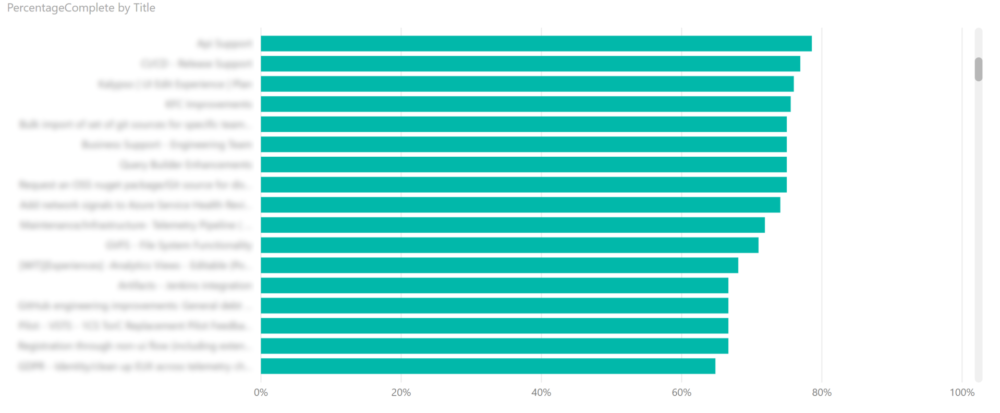
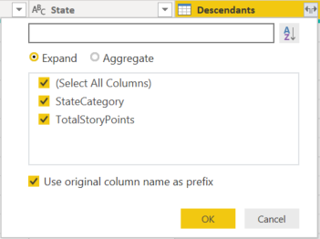
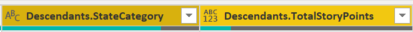
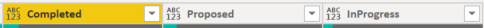
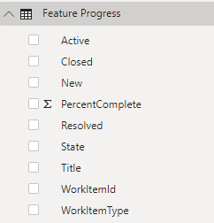

# Feature progress rollup sample report

[!INCLUDE [temp](../_shared/version-azure-devops.md)]
 
This article shows you how to display the percentage complete by rollup of Story Points  for a given set of active Features. An example is shown in the following image. 

> [!div class="mx-imgBorder"] 
> 
> 

[!INCLUDE [temp](_shared/sample-required-reading.md)]


## Sample queries

#### [Power BI Query](#tab/powerbi/)

[!INCLUDE [temp](_shared/sample-powerbi-query.md)]

```
let
   Source = OData.Feed ("https://analytics.dev.azure.com/{organization}/{project}/_odata/v3.0-preview/WorkItems?"
        &"$filter=WorkItemType eq 'Feature' "
            &"and State ne 'Cut' "
            &"and startswith(Area/AreaPath,'{areapath}') "
            &"and Descendants/any() "
        &"&$select=WorkItemId,Title,WorkItemType,State,AreaSK "
        &"&$expand=Descendants( "
            &"$apply=filter(WorkItemType eq 'User Story') "
                &"/groupby((StateCategory), "
                &"aggregate(StoryPoints with sum as TotalStoryPoints)) "
            &")  "
    ,null, [Implementation="2.0",OmitValues = ODataOmitValues.Nulls,ODataVersion = 4]) 
in
    Source
```

#### [OData Query](#tab/odata/)

[!INCLUDE [temp](_shared/sample-odata-query.md)]

```
https://analytics.dev.azure.com/{organization}/{project}/_odata/v3.0-preview/WorkItems?
        $filter=WorkItemType eq 'Feature'
            and State ne 'Cut'
            and startswith(Area/AreaPath,'{areapath}')
            and Descendants/any()
        &$select=WorkItemId,Title,WorkItemType,State,AreaSK
        &$expand=Descendants(
            $apply=filter(WorkItemType eq 'User Story')
                /groupby((StateCategory),
                aggregate(StoryPoints with sum as TotalStoryPoints))
            ) 
```

***

### Substitution strings

[!INCLUDE [temp](_shared/sample-query-substitutions.md)]
- {areapath} - Your Area Path. Example format: Project\Level1\Level2


### Query breakdown


The following table describes each part of the query.

<table width="90%">
<tbody valign="top">
<tr><td width="25%"><b>Query part</b></td><td><b>Description</b></td><tr>
<tr><td><code>$filter=WorkItemType eq 'Feature'</code></td><td>Return Features.</td><tr>
<tr><td><code>and State ne 'Cut'</code></td><td>Omit Features marked as Cut.</td><tr>
<tr><td><code>and startswith(Area/AreaPath,'{areapath}')</code></td><td>Work items under a specific Area Path. Replacing with <code>Area/AreaPath eq '{areapath}'</code> returns items at a specific Area Path.<br>To filter by Team Name, use the filter statement <code>Teams/any(x:x/TeamName eq '{teamname})'</code>.</td><tr>
<tr><td><code>and Descendants/any()</code></td><td>Include all Features, even those with no User Stories. Replace with "any(d:d/WorkItemType eq 'User Story')" to omit Features that don't have child User Stories.</td><tr>
<tr><td><code>&$select=WorkItemId, Title, WorkItemType, State</code></td><td>Select fields to return.</td><tr>
<tr><td><code>&$expand=Descendants(</code></td><td>Expand Descendants.</td><tr>
<tr><td><code>$apply=filter(WorkItemType eq 'User Story')</code></td><td>Filters the descendants. Only include User Stories (omits Tasks and Bugs).</td><tr>
<tr><td><code>/groupby((StateCategory), </code></td><td>Group the rollup by StateCategory. For more information on State Categories see <a href="../../boards/work-items/workflow-and-state-categories.md">How workflow states and state categories are used in Backlogs and Boards.</td><tr>
<tr><td><code>aggregate(StoryPoints with sum as TotalStoryPoints))</code></td><td>Aggregate sum of Story Points.</td><tr>
<tr><td><code>)</code></td><td>Close Descendants().</td><tr>

</tbody>
</table>


## Power BI transforms

[!INCLUDE [temp](_shared/sample-expandcolumns.md)]

### Expand Descendants column

The Descendants column contains a table with two fields: State and TotalStoryPoints. You need to expand it.

1. Select the expand button on the Descendants column.

    > [!div class="mx-imgBorder"] 
    > 

2. Check all the fields and choose **OK**.
 
    > [!div class="mx-imgBorder"] 
    > 

3. Table now contains rollup fields.
 
    > [!div class="mx-imgBorder"] 
    > 

### Pivot Descendants.StateCategory column

1. Click the Descendants.StateCategory column header to select it.
1. Select **Transform** menu
1. Select **Pivot Column**
1. For **Values** select "Descendants.TotalStoryPoints"
1. Press **OK**.
	Power BI creates a column for every StateCategory value.

	> [!div class="mx-imgBorder"] 
	> 

### Replace Nulls in the pivoted columns

Some of the new Pivoted StateCategory columns will have null values. For easier reporting, replace the nulls with zeroes. 

[!INCLUDE [temp](_shared/sample-replace-nulls.md)]

Repeat for every Pivoted StateCategory column.

### Create a Percentage Complete computed column

1. Select **Add Column** menu.
1. Select **Custom Column**.
1. Enter "PercentComplete" for **New column name**.
1. Enter the following in **Custom column formula**.

    ``
    = ([Proposed]+[InProgress]+[Resolved])/([Proposed]+[InProgress]+[Resolved]+[Completed])
    ``

    > [!NOTE]
    > It is possible you won't have a Resolved column, if the work items don't have States mapped to the Resolved State Category. 
    > If so, then omit "[Resolved]" in the above formula.

1. Press **OK**.
1. Select **Transform** menu.
1. Select **Data Type** and select Percentage.

[!INCLUDE [temp](_shared/sample-finish-query.md)]


## Create the report

Power BI shows you the fields you can report on. 

> [!NOTE]   
> The example below assumes that no one renamed any columns. 

> [!div class="mx-imgBorder"] 
> 

For a simple report, perform the following steps:

1. Select the "PercentageComplete" field in the **Fields** list.
1. Select **Modeling** menu.
1. Select **Format** and choose **Percentage**.
1. Select Power BI Visualization **Clustered bar chart**. 
1. Add the field "Title" to **Axis**.
1. Add the field "PercentageComplete" to **Values**.
    - Right click PercentageComplete and select **Sum**.

The example report displays.

> [!div class="mx-imgBorder"] 
> 

[!INCLUDE [temp](_shared/sample-multipleteams.md)]

## Additional queries

You can use the following additional queries to create different but similar reports using the same steps defined previously in this article. 

### Filter by Teams, rather than Area Path

This query is the same as the one used above, except it filters by Team Name rather than Area Path. 

#### [Power BI Query](#tab/powerbi/)

[!INCLUDE [temp](_shared/sample-powerbi-query.md)]

```
let
   Source = OData.Feed ("https://analytics.dev.azure.com/{organization}/{project}/_odata/v3.0-preview/WorkItems?"
        &"$filter=WorkItemType eq 'Feature' "
            &"and State ne 'Cut' "
            &"and (Teams/any(x:x/TeamName eq '{teamname}) or Teams/any(x:x/TeamName eq '{teamname}) or Teams/any(x:x/TeamName eq '{teamname}) "
            &"and Descendants/any() "
        &"&$select=WorkItemId,Title,WorkItemType,State,AreaSK "
        &"&$expand=Descendants( "
            &"$apply=filter(WorkItemType eq 'User Story') "
                &"/groupby((StateCategory), "
                &"aggregate(StoryPoints with sum as TotalStoryPoints)) "
            &")  "
    ,null, [Implementation="2.0",OmitValues = ODataOmitValues.Nulls,ODataVersion = 4]) 
in
    Source
```

#### [OData Query](#tab/odata/)

[!INCLUDE [temp](_shared/sample-odata-query.md)]

```
https://analytics.dev.azure.com/{organization}/{project}/_odata/v3.0-preview/WorkItems?
        $filter=WorkItemType eq 'Feature'
            and State ne 'Cut'
            and (Teams/any(x:x/TeamName eq '{teamname}) or Teams/any(x:x/TeamName eq '{teamname}) or Teams/any(x:x/TeamName eq '{teamname})
            and Descendants/any()
        &$select=WorkItemId,Title,WorkItemType,State,AreaSK
        &$expand=Descendants(
            $apply=filter(WorkItemType eq 'User Story')
                /groupby((StateCategory),
                aggregate(StoryPoints with sum as TotalStoryPoints))
            ) 
```

***

## Full list of sample reports

[!INCLUDE [temp](_shared/sample-fulllist.md)]

## Related articles

[!INCLUDE [temp](_shared/sample-relatedarticles.md)]
