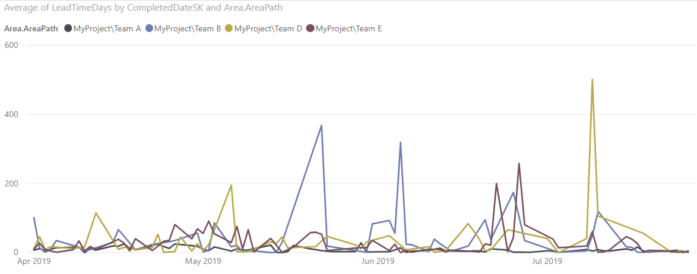

# Lead time and Cycle time sample report

[!INCLUDE [version-gt-eq-2019](../../includes/version-gt-eq-2019.md)] 

You can create lead time and cycle charts using the queries provided in this article. Lead time and cycle time indicate how long it takes for work to flow through a team's development pipeline. Lead time measures the total time elapsed from the creation of work items to their completion. Cycle time measures the time it takes for a team to complete work items once they begin actively working on them.

The following image shows an example for average lead time broken down by priority assignments made to the user stories.

:::image type="content" source="media/reports-boards/lead-time-trend-chart.png" alt-text="Screenshot of Power BI Lead Cycle Time trend chart report.":::

To learn more about lead and cycle time, see [Lead Time and Cycle Time widgets](../dashboards/cycle-time-and-lead-time.md) and [Cumulative flow, lead time, and cycle time guidance](../dashboards/cumulative-flow-cycle-lead-time-guidance.md).


[!INCLUDE [temp](includes/sample-required-reading.md)]

[!INCLUDE [prerequisites-simple](../includes/analytics-prerequisites-simple.md)]

## Sample queries

Queries in this section support returning lead and cycle time data for completed User Stories. You can query by area path or team name(s). All of these queries specify the `WorkItems` entity set as they return data calculated for each work item by the Analytics service.  


[!INCLUDE [temp](includes/query-filters-work-items.md)]

###  Return Lead Time and Cycle Time for User Stories and Area Path 

#### [Power BI query](#tab/powerbi/)

[!INCLUDE [temp](includes/sample-powerbi-query.md)]

```
let
   Source = OData.Feed ("https://analytics.dev.azure.com/{organization}/{project}/_odata/v3.0-preview/WorkItems?"
        &"$filter=WorkItemType eq 'User Story' "
            &"and StateCategory eq 'Completed' "
            &"and CompletedDate ge {startdate} "
            &"and startswith(Area/AreaPath,'{areapath}') "
        &"&$select=WorkItemId,Title,WorkItemType,State,Priority,AreaSK "
            &",CycleTimeDays,LeadTimeDays,CompletedDateSK "
        &"&$expand=AssignedTo($select=UserName),Iteration($select=IterationPath),Area($select=AreaPath) "
    ,null, [Implementation="2.0",OmitValues = ODataOmitValues.Nulls,ODataVersion = 4]) 
in
    Source
```

#### [OData query](#tab/odata/)

[!INCLUDE [temp](includes/sample-odata-query.md)]

```
https://analytics.dev.azure.com/{organization}/{project}/_odata/v3.0-preview/WorkItems?
        $filter=WorkItemType eq 'User Story'
            and StateCategory eq 'Completed'
            and CompletedDate ge {startdate}
            and startswith(Area/AreaPath,'{areapath}')
        &$select=WorkItemId,Title,WorkItemType,State,Priority,AreaSK
            ,CycleTimeDays,LeadTimeDays,CompletedDateSK
        &$expand=AssignedTo($select=UserName),Iteration($select=IterationPath),Area($select=AreaPath)
```

***

## Substitution strings and query breakdown

[!INCLUDE [temp](includes/sample-query-substitutions.md)]

- `{organization}` - Your organization name 
- `{project}` - Your team project name, or omit "/{project}" entirely, for a cross-project query
- `{areapath}` - Your Area Path. Example format: `Project\Level1\Level2`
- `{startdate}` - Start your report for items completed on or after a given date with the format: `YYYY-MM-DDZ`. For example: `2022-04-01Z` represents 2022-April-01. Don't enclose in quotes.


### Query breakdown

The following table describes each part of the query.

:::row:::
   :::column span="1":::
   **Query part**
   :::column-end:::
   :::column span="1":::
   **Description**
   :::column-end:::
:::row-end:::
---
:::row:::
   :::column span="1":::
   `$filter=WorkItemType eq 'User Story'`
   :::column-end:::
   :::column span="1":::
   Return data for User Stories.
   :::column-end:::
:::row-end:::
:::row:::
   :::column span="1":::
   `and StateCategory eq 'Completed'`
   :::column-end:::
   :::column span="1":::
   Return only completed items. The system calculates values for **Lead Time Days** and **Cycle Time Days** only for work items that have completed. 
   > [!NOTE]   
   > If you look at the raw data of records, you may see entries where `CycleTimeDays=0`. This occurs when the User Story or work item enters an *In Progress* workflow category state and *Completed* on the same day.  For more information on workflow state categories, see [How workflow states and state categories are used in Backlogs and Boards](../../boards/work-items/workflow-and-state-categories.md).
   :::column-end:::
:::row-end:::
:::row:::
   :::column span="1":::
   `and CompletedDate ge {startdate}`
   :::column-end:::
   :::column span="1":::
   Return items that are completed after the specified date. Example: **2022-04-01Z** represents 2022-April-01
   :::column-end:::
:::row-end:::
:::row:::
   :::column span="1":::
   `and startswith(Area/AreaPath,'{areapath}')`
   :::column-end:::
   :::column span="1":::
   Return work items under a specific **Area Path** that you specify in`'{areapath}'`. To filter by team name, use the filter statement `Teams/any(x:x/TeamName eq '{teamname})'`.  
   :::column-end:::
:::row-end:::
:::row:::
   :::column span="1":::
   `&$select=WorkItemId, Title, WorkItemType, State, Priority`
   :::column-end:::
   :::column span="1":::
   Select properties to return.  
   :::column-end:::
:::row-end:::
:::row:::
   :::column span="1":::
   `, CycleTimeDays, LeadTimeDays, CompletedDateSK`
   :::column-end:::
   :::column span="1":::
   Return the properties that support  **Lead Time Days**, **Cycle Time Days** and `CompletedDateSK`. CompletedDateSK returns a date value as an integer
   :::column-end:::
:::row-end:::
:::row:::
   :::column span="1":::
   `&$expand=AssignedTo($select=UserName), Iteration($select=IterationPath), Area($select=AreaPath)`
   :::column-end:::
   :::column span="1":::
   Expand the properties for `AssignedTo`, `Iteration`, and `Area` entities and select entity fields for them. 
   :::column-end:::
:::row-end:::


### Return Lead Time and Cycle Time for User Stories and teams

This query is the same as the one provided in the previous section, except it filters by several team names rather than area paths.  

#### [Power BI query](#tab/powerbi/)

[!INCLUDE [temp](includes/sample-powerbi-query.md)]

```
let
   Source = OData.Feed ("https://analytics.dev.azure.com/{organization}/{project}/_odata/v3.0-preview/WorkItems?"
        &"$filter=WorkItemType eq 'User Story' "
            &"and StateCategory eq 'Completed' "
            &"and CompletedDate ge {startdate} "
            &"and (Teams/any(x:x/TeamName eq '{teamname}) or Teams/any(x:x/TeamName eq '{teamname}) or Teams/any(x:x/TeamName eq '{teamname}) "
        &"&$select=WorkItemId,Title,WorkItemType,State,Priority,AreaSK "
            &",CycleTimeDays,LeadTimeDays,CompletedDateSK "
        &"&$expand=AssignedTo($select=UserName),Iteration($select=IterationPath),Area($select=AreaPath) "
    ,null, [Implementation="2.0",OmitValues = ODataOmitValues.Nulls,ODataVersion = 4]) 
in
    Source
```

#### [OData query](#tab/odata/)

[!INCLUDE [temp](includes/sample-odata-query.md)]

```
https://analytics.dev.azure.com/{organization}/{project}/_odata/v3.0-preview/WorkItems?
        $filter=WorkItemType eq 'User Story'
            and StateCategory eq 'Completed'
            and CompletedDate ge {startdate}
            and (Teams/any(x:x/TeamName eq '{teamname}) or Teams/any(x:x/TeamName eq '{teamname}) or Teams/any(x:x/TeamName eq '{teamname})
        &$select=WorkItemId,Title,WorkItemType,State,Priority,AreaSK
            ,CycleTimeDays,LeadTimeDays,CompletedDateSK
        &$expand=AssignedTo($select=UserName),Iteration($select=IterationPath),Area($select=AreaPath)
```

***

[!INCLUDE [temp](includes/rename-query.md)]

## Transform data in Power Query Editor

From the Power Query Editor, choose the query with the data you want to transform. For a Lead/Cycle time chart, you'll want to make the following transformations: 

- Expand columns such as `Area`, `Iteration`, and `AssignedTo`. 
- Transform the data type for the `LeadTimeDays` and `CycleTimeDays` columns to a Whole number. 
- Transform the data type for the `CompletedDateSK` column from an integer to a date value.  

To learn how, see the following sections in [Transform Analytics data to generate Power BI reports](transform-analytics-data-report-generation.md):
- [Expand columns](transform-analytics-data-report-generation.md#expand-columns). 
- [Transform the LeadTimeDays and CycleTimeDays columns to whole Numbers](transform-analytics-data-report-generation.md#leadtimedays-cycletimedays).
- [Transform a column data type](transform-analytics-data-report-generation.md#transform-data-type). 
  

[!INCLUDE [temp](includes/close-apply.md)]

## Create the trend chart  

In the following example, the query was renamed to *LeadCycleTime*, but no columns were renamed. 

1. In Power BI, choose the **Line chart** report under **Visualizations**. 

	:::image type="content" source="media/reports-boards/lead-time-trend-chart-visualizations.png" alt-text="Screenshot of Power BI Visualizations and Fields selections for Lead Time trend chart report. ":::

1. Add `CompletedDateSK` to the **X-axis**.

1. Add `LeadTimeDays` to the **Y-axis**, right-click and select **Average**.  

1. Add `Priority` to **Legend**.

 
The example report displays. Note that as you hover over any area in the report, more data is shown. 

:::image type="content" source="media/reports-boards/lead-time-trend-chart.png" alt-text="Screenshot of Sample Power BI Lead Cycle Time trend chart report.":::

## Related articles

[!INCLUDE [temp](includes/sample-relatedarticles.md)]


<!--- 
To pivot the report by Area Path (representing teams), add the field "Area.AreaPath" to **Legend**, replacing "Priority"

> [!div class="mx-imgBorder"] 
> 
 
--> 


