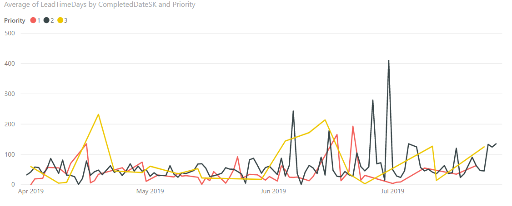
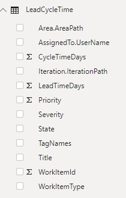
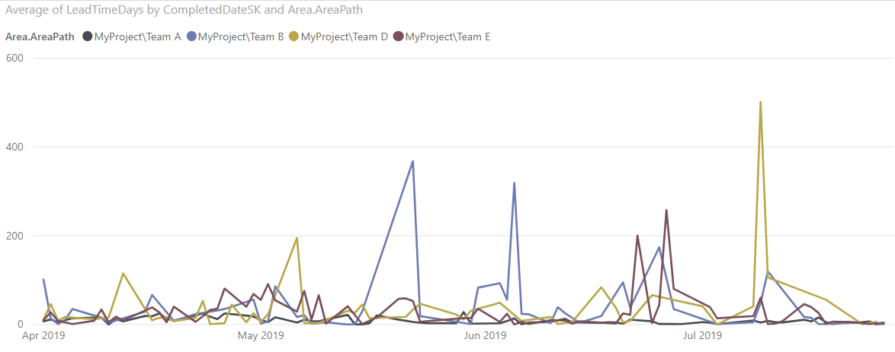

# Lead/cycle time sample report

[!INCLUDE [temp](../_shared/version-azure-devops.md)]

This article shows you how to display average lead time or cycle time for a given set of User Stories. The following image shows an example for average lead time. To learn more about lead and cycle time, see [Cumulative flow, lead time, and cycle time guidance](../dashboards/cumulative-flow-cycle-lead-time-guidance.md). 

> [!div class="mx-imgBorder"] 
> 

[!INCLUDE [temp](_shared/sample-required-reading.md)]


## Sample queries

#### [Power BI Query](#tab/powerbi/)

[!INCLUDE [temp](_shared/sample-powerbi-query.md)]

```
let
   Source = OData.Feed ("https://analytics.dev.azure.com/{account}/{project}/_odata/v3.0-preview/WorkItems?"
        &"$filter=WorkItemType eq 'User Story' "
            &"and StateCategory eq 'Completed' "
            &"and CompletedDate ge {startdate} "
            &"and startswith(Area/AreaPath,'{areapath}') "
        &"&$select=WorkItemId,Title,WorkItemType,State,Priority,Severity,TagNames,AreaSK "
            &",CycleTimeDays,LeadTimeDays,CompletedDateSK "
        &"&$expand=AssignedTo($select=UserName),Iteration($select=IterationPath),Area($select=AreaPath) "
    ,null, [Implementation="2.0",OmitValues = ODataOmitValues.Nulls,ODataVersion = 4]) 
in
    Source
```

#### [OData Query](#tab/odata/)

[!INCLUDE [temp](_shared/sample-odata-query.md)]

```
https://analytics.dev.azure.com/{account}/{project}/_odata/v3.0-preview/WorkItems?
        $filter=WorkItemType eq 'User Story'
            and StateCategory eq 'Completed'
            and CompletedDate ge {startdate}
            and startswith(Area/AreaPath,'{areapath}')
        &$select=WorkItemId,Title,WorkItemType,State,Priority,Severity,TagNames,AreaSK
            ,CycleTimeDays,LeadTimeDays,CompletedDateSK
        &$expand=AssignedTo($select=UserName),Iteration($select=IterationPath),Area($select=AreaPath)
```

***

### Substitution strings

[!INCLUDE [temp](_shared/sample-query-substitutions.md)]
- {areapath} - Your Area Path. Example format: Project\Level1\Level2
- {startdate} - Start your report for items completed on/after a given date. Format: YYYY-MM-DDZ. Example: 2019-04-01Z represents 2019-April-01. Do not enclose in quotes.


### Query breakdown

The following table describes each part of the query.

<table width="90%">
<tbody valign="top">
<tr><td width="25%"><b>Query part</b></td><td><b>Description</b></td><tr>
<tr><td><code>$filter=WorkItemType eq 'User Story'</code></td><td>Return User Stories</td><tr>
<tr><td><code>and StateCategory eq 'Completed'</code></td><td>Return only completed items. Only completed items have Lead/Cycle Times calculated. For more information on State Categories see <a href="../../boards/work-items/workflow-and-state-categories.md">How workflow states and state categories are used in Backlogs and Boards.</td><tr>
<tr><td><code>and CompletedDate ge {startdate}</code></td><td>Return items Closed after the specified date. Example: **2019-04-01Z** represents 2019-April-01</td><tr>
<tr><td><code>and startswith(Area/AreaPath,'{areapath}')</code></td><td>Work items under a specific Area Path. Replacing with "Area/AreaPath eq '{areapath}'" returns items at a specific Area Path.<br>To filter by Team Name, use the filter statement <code>Teams/any(x:x/TeamName eq '{teamname})'</code></td><tr>
<tr><td><code>&$select=WorkItemId, Title, WorkItemType, State, Priority, Severity, TagNames</code></td><td>Select fields to return</td><tr>
<tr><td><code>, CycleTimeDays, LeadTimeDays, CompletedDateSK</code></td><td>Also return the Cycle/Lead Time fields, as well as CompletedDateSK. CompletedDateSK is the CompletedDate as an integer</td><tr>
<tr><td><code>&$expand=AssignedTo($select=UserName), Iteration($select=IterationPath), Area($select=AreaPath)</code></td><td>Expand Assigned To, Iteration, Area entities and select entity fields</td><tr>
</tbody>
</table>


## Power BI transforms

[!INCLUDE [temp](_shared/sample-expandcolumns.md)]

### Change LeadTimeDays and CycleTimeDays to data type: Whole Number

The LeadTimeDays and CycleTimeDays are decimal fields. For example if Lead Time is 10 and 1/2 days, the value is 10.5. Since most Lead/Cycle Time reports assume that this is rounded to the nearest day, we need to convert these fields to an Integer. Making this conversion converts all values less than 1 to 0. 

1. Select the LeadTimeDays column by clicking the column header.
1. Select the **Transform** menu.
1. Select **Data Type** and change to **Whole Numbers**.
1. Repeat for CycleTimeDays.

### Change CompletedDateSK to a Date field

The CompletedDateSK field is the integer version of the Completed Date field in the format YYYYMMDD. For example the integer value of 2019-July-01 is 20190701. For easier reporting, we change this to a Date field.

1. Select the CompletedDateSK column by choosing the column header.
1. Select the **Transform** menu.
1. Select **Data Type** and change to **Text**.
1. Select **Date Type** (again) and change to **Date**.
1. When the **Change Column Type** dialog appears, select **Add new step** (rather than **Replace current step**). This 2-step process is the easiest way to change it to a proper Date field in Power BI.


[!INCLUDE [temp](_shared/sample-finish-query.md)]


## Create the report

Power BI shows you the fields you can report on. 

> [!NOTE]   
> The example below assumes that no one renamed any columns. 

> [!div class="mx-imgBorder"] 
> 

For a simple report, perform the following steps:

1. Select Power BI Visualization **Line chart**. 
1. Add the field "CompletedDateSK" to **Axis**.
    - Right click "CompletedDateSK" and select "CompletedDateSK", rather than Date Hierarchy.
1. Add the field "Priority" to legend.
1. Add the field "LeadTimeDays" to **Values**.
    - Right click "LeadTimeDays" field and ensure **Average** is selected.

The example report:

> [!div class="mx-imgBorder"] 
> 

To pivot the report by Area Path (representing teams), add the field "Area.AreaPath" to **Legend**, replacing "Priority"

> [!div class="mx-imgBorder"] 
> 

[!INCLUDE [temp](_shared/sample-multipleteams.md)]

## Additional queries

Additional queries that can be used to create different, but similar reports. You can use these queries with the steps defined above.

### Filter by Teams, rather than Area Path

This query is the same as the one used above, except it filters by Team Name rather than Area Path. 

#### [Power BI Query](#tab/powerbi/)

[!INCLUDE [temp](_shared/sample-powerbi-query.md)]

```
let
   Source = OData.Feed ("https://analytics.dev.azure.com/{account}/{project}/_odata/v3.0-preview/WorkItems?"
        &"$filter=WorkItemType eq 'User Story' "
            &"and StateCategory eq 'Completed' "
            &"and CompletedDate ge {startdate} "
            &"and (Teams/any(x:x/TeamName eq '{teamname}) or Teams/any(x:x/TeamName eq '{teamname}) or Teams/any(x:x/TeamName eq '{teamname}) "
        &"&$select=WorkItemId,Title,WorkItemType,State,Priority,Severity,TagNames,AreaSK "
            &",CycleTimeDays,LeadTimeDays,CompletedDateSK "
        &"&$expand=AssignedTo($select=UserName),Iteration($select=IterationPath),Area($select=AreaPath) "
    ,null, [Implementation="2.0",OmitValues = ODataOmitValues.Nulls,ODataVersion = 4]) 
in
    Source
```

#### [OData Query](#tab/odata/)

[!INCLUDE [temp](_shared/sample-odata-query.md)]

```
https://analytics.dev.azure.com/{account}/{project}/_odata/v3.0-preview/WorkItems?
        $filter=WorkItemType eq 'User Story'
            and StateCategory eq 'Completed'
            and CompletedDate ge {startdate}
            and (Teams/any(x:x/TeamName eq '{teamname}) or Teams/any(x:x/TeamName eq '{teamname}) or Teams/any(x:x/TeamName eq '{teamname})
        &$select=WorkItemId,Title,WorkItemType,State,Priority,Severity,TagNames,AreaSK
            ,CycleTimeDays,LeadTimeDays,CompletedDateSK
        &$expand=AssignedTo($select=UserName),Iteration($select=IterationPath),Area($select=AreaPath)
```

***

## Full list of sample reports

[!INCLUDE [temp](_shared/sample-fulllist.md)]

## Related articles

[!INCLUDE [temp](_shared/sample-relatedarticles.md)]
