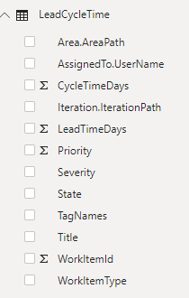

# Lead time and Cycle time sample report

[!INCLUDE [version-gt-eq-2019](../../includes/version-gt-eq-2019.md)]

This article shows you how to display average lead time or cycle time for a given set of User Stories. The following image shows an example for average lead time. To learn more about lead and cycle time, see [Cumulative flow, lead time, and cycle time guidance](../dashboards/cumulative-flow-cycle-lead-time-guidance.md). 

> [!div class="mx-imgBorder"] 
> 

[!INCLUDE [temp](includes/sample-required-reading.md)]

[!INCLUDE [temp](./includes/prerequisites-power-bi.md)]

## Sample queries

#### [Power BI query](#tab/powerbi/)

[!INCLUDE [temp](includes/sample-powerbi-query.md)]

```
let
   Source = OData.Feed ("https://analytics.dev.azure.com/{organization}/{project}/_odata/v3.0-preview/WorkItems?"
        &"$filter=WorkItemType eq 'User Story' "
            &"and StateCategory eq 'Completed' "
            &"and CompletedDate ge {startdate} "
            &"and startswith(Area/AreaPath,'{areapath}') "
        &"&$select=WorkItemId,Title,WorkItemType,State,Priority,Severity,TagNames,AreaSK "
            &",CycleTimeDays,LeadTimeDays,CompletedDateSK "
        &"&$expand=AssignedTo($select=UserName),Iteration($select=IterationPath),Area($select=AreaPath) "
    ,null, [Implementation="2.0",OmitValues = ODataOmitValues.Nulls,ODataVersion = 4]) 
in
    Source
```

#### [OData query](#tab/odata/)

[!INCLUDE [temp](includes/sample-odata-query.md)]

```
https://analytics.dev.azure.com/{organization}/{project}/_odata/v3.0-preview/WorkItems?
        $filter=WorkItemType eq 'User Story'
            and StateCategory eq 'Completed'
            and CompletedDate ge {startdate}
            and startswith(Area/AreaPath,'{areapath}')
        &$select=WorkItemId,Title,WorkItemType,State,Priority,Severity,TagNames,AreaSK
            ,CycleTimeDays,LeadTimeDays,CompletedDateSK
        &$expand=AssignedTo($select=UserName),Iteration($select=IterationPath),Area($select=AreaPath)
```

***

### Substitution strings

[!INCLUDE [temp](includes/sample-query-substitutions.md)]
- `{areapath}` - Your Area Path. Example format: `Project\Level1\Level2`
- `{startdate}` - Start your report for items completed on/after a given date. Format: YYYY-MM-DDZ. Example: `2019-04-01Z` represents 2019-April-01. Don't enclose in quotes.


### Query breakdown

The following table describes each part of the query.

:::row:::
   :::column span="1":::
   **Query part**
   :::column-end:::
   :::column span="1":::
   **Description**
   :::column-end:::
:::row-end:::
:::row:::
   :::column span="1":::
   `$filter=WorkItemType eq 'User Story'`
   :::column-end:::
   :::column span="1":::
   Return User Stories
   :::column-end:::
:::row-end:::
:::row:::
   :::column span="1":::
   `and StateCategory eq 'Completed'`
   :::column-end:::
   :::column span="1":::
   Return only completed items. Only completed items have Lead/Cycle Times calculated. For more information on State Categories, see [How workflow states and state categories](../../boards/work-items/workflow-and-state-categories.md) are used in Backlogs and Boards.
   :::column-end:::
:::row-end:::
:::row:::
   :::column span="1":::
   `and CompletedDate ge {startdate}`
   :::column-end:::
   :::column span="1":::
   Return items Closed after the specified date. Example: **2019-04-01Z** represents 2019-April-01
   :::column-end:::
:::row-end:::
:::row:::
   :::column span="1":::
   `and startswith(Area/AreaPath,'{areapath}')`
   :::column-end:::
   :::column span="1":::
   Work items under a specific Area Path. Replacing with `Area/AreaPath eq '{areapath}'` returns items at a specific Area Path.
   
   To filter by Team Name, use the filter statement `Teams/any(x:x/TeamName eq '{teamname})'`
   :::column-end:::
:::row-end:::
:::row:::
   :::column span="1":::
   `&$select=WorkItemId, Title, WorkItemType, State, Priority, Severity, TagNames`
   :::column-end:::
   :::column span="1":::
   Select fields to return
   :::column-end:::
:::row-end:::
:::row:::
   :::column span="1":::
   `, CycleTimeDays, LeadTimeDays, CompletedDateSK`
   :::column-end:::
   :::column span="1":::
   Return the Cycle/Lead Time fields and CompletedDateSK. CompletedDateSK is the CompletedDate as an integer
   :::column-end:::
:::row-end:::
:::row:::
   :::column span="1":::
   `&$expand=AssignedTo($select=UserName), Iteration($select=IterationPath), Area($select=AreaPath)`
   :::column-end:::
   :::column span="1":::
   Expand Assigned To, Iteration, Area entities and select entity fields
   :::column-end:::
:::row-end:::


[!INCLUDE [temp](includes/query-filters-work-items.md)]

## Power BI transforms

[!INCLUDE [temp](includes/sample-expandcolumns.md)]

### Change LeadTimeDays and CycleTimeDays to data type: Whole Number

The LeadTimeDays and CycleTimeDays are decimal fields. For example if Lead Time is 10 and 1/2 days, the value is 10.5. Since most Lead/Cycle Time reports assume that it's rounded to the nearest day, we need to convert these fields to an Integer. Making this conversion converts all values less than 1 to 0. 

1. Select the LeadTimeDays column by clicking the column header.
1. Select the **Transform** menu.
1. Select **Data Type** and change to **Whole Numbers**.
1. Repeat for CycleTimeDays.

### Change CompletedDateSK to a Date field

The CompletedDateSK field is the integer version of the Completed Date field in the format YYYYMMDD. For example, the integer value of 2019-July-01 is 20190701. For easier reporting, we change it to a Date field.

1. Select the CompletedDateSK column by choosing the column header.
1. Select the **Transform** menu.
1. Select **Data Type** and change to **Text**.
1. Select **Date Type** (again) and change to **Date**.
1. When the **Change Column Type** dialog appears, select **Add new step** (rather than **Replace current step**). This two-step process is the easiest way to change it to a proper Date field in Power BI.


[!INCLUDE [temp](includes/sample-finish-query.md)]


## Create the report

Power BI shows you the fields you can report on. 

> [!NOTE]   
> The example below assumes that no one renamed any columns. 

> [!div class="mx-imgBorder"] 
> 

For a simple report, do the following steps:

1. Select Power BI Visualization **Line chart**. 
1. Add the field "CompletedDateSK" to **Axis**.
    - Right-click "CompletedDateSK" and select "CompletedDateSK", rather than Date Hierarchy.
1. Add the field "Priority" to legend.
1. Add the field "LeadTimeDays" to **Values**.
    - Right-click "LeadTimeDays" field and ensure **Average** is selected.

The example report:

> [!div class="mx-imgBorder"] 
> 

To pivot the report by Area Path (representing teams), add the field "Area.AreaPath" to **Legend**, replacing "Priority"

> [!div class="mx-imgBorder"] 
> 

[!INCLUDE [temp](includes/sample-multipleteams.md)]

## Additional queries

You can use the following additional queries to create different but similar reports. You can use these queries with the steps defined above.

### Filter by Teams, rather than Area Path

This query is the same as the one used above, except it filters by Team Name rather than Area Path. 

#### [Power BI query](#tab/powerbi/)

[!INCLUDE [temp](includes/sample-powerbi-query.md)]

```
let
   Source = OData.Feed ("https://analytics.dev.azure.com/{organization}/{project}/_odata/v3.0-preview/WorkItems?"
        &"$filter=WorkItemType eq 'User Story' "
            &"and StateCategory eq 'Completed' "
            &"and CompletedDate ge {startdate} "
            &"and (Teams/any(x:x/TeamName eq '{teamname}) or Teams/any(x:x/TeamName eq '{teamname}) or Teams/any(x:x/TeamName eq '{teamname}) "
        &"&$select=WorkItemId,Title,WorkItemType,State,Priority,Severity,TagNames,AreaSK "
            &",CycleTimeDays,LeadTimeDays,CompletedDateSK "
        &"&$expand=AssignedTo($select=UserName),Iteration($select=IterationPath),Area($select=AreaPath) "
    ,null, [Implementation="2.0",OmitValues = ODataOmitValues.Nulls,ODataVersion = 4]) 
in
    Source
```

#### [OData query](#tab/odata/)

[!INCLUDE [temp](includes/sample-odata-query.md)]

```
https://analytics.dev.azure.com/{organization}/{project}/_odata/v3.0-preview/WorkItems?
        $filter=WorkItemType eq 'User Story'
            and StateCategory eq 'Completed'
            and CompletedDate ge {startdate}
            and (Teams/any(x:x/TeamName eq '{teamname}) or Teams/any(x:x/TeamName eq '{teamname}) or Teams/any(x:x/TeamName eq '{teamname})
        &$select=WorkItemId,Title,WorkItemType,State,Priority,Severity,TagNames,AreaSK
            ,CycleTimeDays,LeadTimeDays,CompletedDateSK
        &$expand=AssignedTo($select=UserName),Iteration($select=IterationPath),Area($select=AreaPath)
```

***

## Full list of sample reports

[!INCLUDE [temp](includes/sample-fulllist.md)]

## Related articles

[!INCLUDE [temp](includes/sample-relatedarticles.md)]
