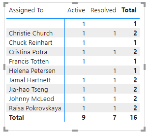

# Open bugs sample report 

[!INCLUDE [version-gt-eq-2019](../../includes/version-gt-eq-2019.md)]

This article shows you how to display, for a given set of open Bugs, a breakdown by State and Assigned To fields. An example is shown in the following image. 

> [!div class="mx-imgBorder"] 
> 


[!INCLUDE [temp](includes/sample-required-reading.md)]

[!INCLUDE [temp](./includes/prerequisites-power-bi.md)]


## Sample queries

#### [Power BI query](#tab/powerbi/)

[!INCLUDE [temp](includes/sample-powerbi-query.md)]

```
let
   Source = OData.Feed ("https://analytics.dev.azure.com/{organization}/{project}/_odata/v3.0-preview/WorkItems?"
        &"$filter=WorkItemType eq 'Bug' "
            &"and StateCategory ne 'Completed' "
            &"and startswith(Area/AreaPath,'{areapath}') "
        &"&$select=WorkItemId,Title,WorkItemType,State,Priority,Severity,TagNames,AreaSK "
        &"&$expand=AssignedTo($select=UserName),Iteration($select=IterationPath),Area($select=AreaPath) "
    ,null, [Implementation="2.0",OmitValues = ODataOmitValues.Nulls,ODataVersion = 4]) 
in
    Source
```

#### [OData query](#tab/odata/)

[!INCLUDE [temp](includes/sample-odata-query.md)]

```
https://analytics.dev.azure.com/{organization}/{project}/_odata/v3.0-preview/WorkItems?
        $filter=WorkItemType eq 'Bug'
            and StateCategory ne 'Completed'
            and startswith(Area/AreaPath,'{areapath}')
        &$select=WorkItemId,Title,WorkItemType,State,Priority,Severity,TagNames,AreaSK
        &$expand=AssignedTo($select=UserName),Iteration($select=IterationPath),Area($select=AreaPath)
```

***

### Substitution strings

[!INCLUDE [temp](includes/sample-query-substitutions.md)]
- `{areapath}` - Your Area Path. Example format: `Project\Level1\Level2`


### Query breakdown

The following table describes each part of the query.

:::row:::
   :::column span="1":::
   **Query part**
   :::column-end:::
   :::column span="3":::
   **Description**
   :::column-end:::
:::row-end:::
:::row:::
   :::column span="1":::
   `$filter=WorkItemType eq 'Bug'`
   :::column-end:::
   :::column span="3":::
   Return Bugs.
   :::column-end:::
:::row-end:::
:::row:::
   :::column span="1":::
   `and StateCategory ne 'Completed'`
   :::column-end:::
   :::column span="3":::
   Filters out items that are completed. For more information on State Categories, see [How workflow states and state categories](../../boards/work-items/workflow-and-state-categories.md) are used in Backlogs and Boards.
   :::column-end:::
:::row-end:::
:::row:::
   :::column span="1":::
   `and startswith(Area/AreaPath,'{areapath}')`
   :::column-end:::
   :::column span="3":::
   Work items under a specific Area Path. Replacing with `Area/AreaPath eq '{areapath}'` returns items at a specific Area Path.
   
   To filter by Team Name, use the filter statement `Teams/any(x:x/TeamName eq '{teamname})'`.
   :::column-end:::
:::row-end:::
:::row:::
   :::column span="1":::
   `&$select=WorkItemId, Title, WorkItemType, State, Priority, Severity, TagNames`
   :::column-end:::
   :::column span="3":::
   Select fields to return.
   :::column-end:::
:::row-end:::
:::row:::
   :::column span="1":::
   `&$expand=AssignedTo($select=UserName), Iteration($select=IterationPath), Area($select=AreaPath)`
   :::column-end:::
   :::column span="3":::
   Expand Assigned To, Iteration, Area entities and select entity fields.
   :::column-end:::
:::row-end:::


[!INCLUDE [temp](includes/query-filters-work-items.md)]

## Power BI transforms

[!INCLUDE [temp](includes/sample-expandcolumns.md)]

[!INCLUDE [temp](includes/sample-finish-query.md)]


## Create the report

Power BI shows you the fields you can report on. 

> [!NOTE]   
> The example below assumes that no one renamed any columns. 

> [!div class="mx-imgBorder"] 
> 

For a simple report, do the following steps:

1. Select Power BI Visualization **Matrix**. 
1. Add the field "State" to **Columns**.
1. Add the field "AssignedTo.UserName" to **Rows**.
1. Add the field "WorkItemId" to **Values**.
    - Right-click "WorkItemId" field and ensure **Count** is selected.

The example report displays. 

> [!div class="mx-imgBorder"] 
> 

[!INCLUDE [temp](includes/sample-multipleteams.md)]

## Additional queries

You can use the following additional queries to create different but similar reports using the same steps defined previously in this article.

### Filter by Teams, rather than Area Path

You can query for open bugs by Team Name rather than Area Path.  

#### [Power BI query](#tab/powerbi/)

[!INCLUDE [temp](includes/sample-powerbi-query.md)]

```
let
   Source = OData.Feed ("https://analytics.dev.azure.com/{organization}/{project}/_odata/v3.0-preview/WorkItems?"
        &"$filter=WorkItemType eq 'Bug' "
            &"and StateCategory ne 'Completed'' "
            &"and (Teams/any(x:x/TeamName eq '{teamname}) or Teams/any(x:x/TeamName eq '{teamname}) or Teams/any(x:x/TeamName eq '{teamname}) "
        &"&$select=WorkItemId,Title,WorkItemType,State,Priority,Severity,TagNames,AreaSK "
        &"&$expand=AssignedTo($select=UserName),Iteration($select=IterationPath),Area($select=AreaPath) "
    ,null, [Implementation="2.0",OmitValues = ODataOmitValues.Nulls,ODataVersion = 4]) 
in
    Source
```

#### [OData query](#tab/odata/)

[!INCLUDE [temp](includes/sample-odata-query.md)]

```
https://analytics.dev.azure.com/{organization}/{project}/_odata/v3.0-preview/WorkItems?
        $filter=WorkItemType eq 'Bug'
            and StateCategory ne 'Completed'
            and (Teams/any(x:x/TeamName eq '{teamname}) or Teams/any(x:x/TeamName eq '{teamname}) or Teams/any(x:x/TeamName eq '{teamname})
        &$select=WorkItemId,Title,WorkItemType,State,Priority,Severity,TagNames,AreaSK
        &$expand=AssignedTo($select=UserName),Iteration($select=IterationPath),Area($select=AreaPath)
```

***

### User Stories in a specific Iteration

You can query for open bugs by Area Path and a specific Iteration.

#### [Power BI query](#tab/powerbi/)

[!INCLUDE [temp](includes/sample-powerbi-query.md)]

```
let
   Source = OData.Feed ("https://analytics.dev.azure.com/{organization}/{project}/_odata/v3.0-preview/WorkItems?"
        &"$filter=WorkItemType eq 'User Story' "
            &"and startswith(Area/AreaPath,'{areapath}') "
            &"and startswith(Iteration/IterationPath,'{iterationpath}') "
        &"&$select=WorkItemId,Title,WorkItemType,State,Priority,Severity,TagNames,AreaSK "
        &"&$expand=AssignedTo($select=UserName),Iteration($select=IterationPath),Area($select=AreaPath) "
    ,null, [Implementation="2.0",OmitValues = ODataOmitValues.Nulls,ODataVersion = 4]) 
in
    Source
```

#### [OData query](#tab/odata/)

[!INCLUDE [temp](includes/sample-odata-query.md)]

```
https://analytics.dev.azure.com/{organization}/{project}/_odata/v3.0-preview/WorkItems?
        $filter=WorkItemType eq 'User Story'
            and startswith(Area/AreaPath,'{areapath}')
            and startswith(Iteration/IterationPath,'{iterationpath}')
        &$select=WorkItemId,Title,WorkItemType,State,Priority,Severity,TagNames,AreaSK
        &$expand=AssignedTo($select=UserName),Iteration($select=IterationPath),Area($select=AreaPath)
```

***

## Full list of sample reports

[!INCLUDE [temp](includes/sample-fulllist.md)]

## Related articles

[!INCLUDE [temp](includes/sample-relatedarticles.md)]
