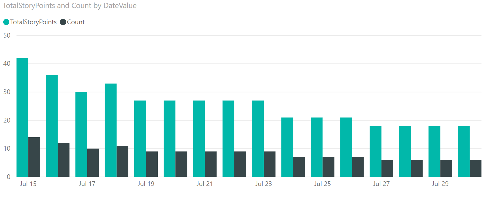
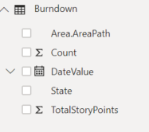
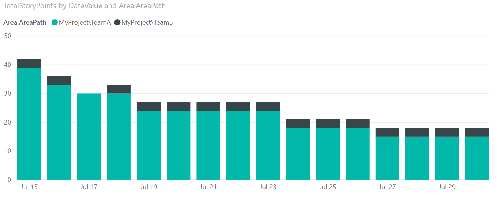
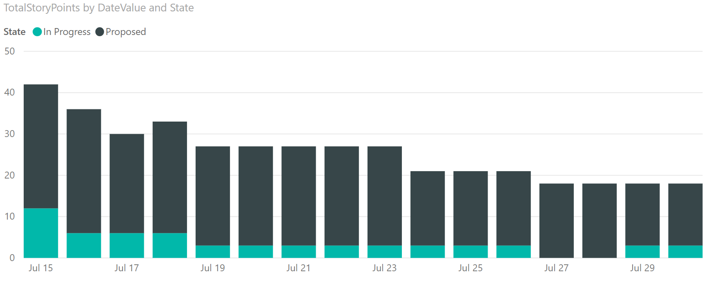

# Sample - Release Burndown

[!INCLUDE [temp](../_shared/version-azure-devops.md)]

This article shows you how to display the burndown of User Stories for a release based on work items tagged with a release tag. The following image shows a burndown both by Story Points and User Stories count.
 
> [!div class="mx-imgBorder"] 
> 

[!INCLUDE [temp](_shared/sample-required-reading.md)]


## Sample queries

#### [Power BI Query](#tab/powerbi/)

[!INCLUDE [temp](_shared/sample-powerbi-query.md)]

```
let
   Source = OData.Feed ("https://analytics.dev.azure.com/{organization}/{project}/_odata/v3.0-preview/WorkItemSnapshot?"
        &"$apply=filter(WorkItemType eq 'User Story' "
            &"and StateCategory ne 'Completed' "
            &"and startswith(Area/AreaPath,'{areapath}') "
            &"and Tags/any(x:x/TagName eq '{tagname}') "
            &"and DateValue ge {startdate} "
            &"and DateValue le {enddate} "
        &") "
        &"/groupby ( "
            &"(DateValue,State,Area/AreaPath), "
            &"aggregate ($count as Count, StoryPoints with sum as TotalStoryPoints) "
        &") "
    ,null, [Implementation="2.0",OmitValues = ODataOmitValues.Nulls,ODataVersion = 4]) 
in
    Source
```

#### [OData Query](#tab/odata/)

[!INCLUDE [temp](_shared/sample-odata-query.md)]

```
https://analytics.dev.azure.com/{organization}/{project}/_odata/v3.0-preview/WorkItemSnapshot?
        $apply=filter(WorkItemType eq 'User Story'
            and StateCategory ne 'Completed'
            and startswith(Area/AreaPath,'{areapath}')
            and Tags/any(x:x/TagName eq '{tagname}')
            and DateValue ge {startdate}
            and DateValue le {enddate}
        )
        /groupby (
            (DateValue,State,Area/AreaPath),
            aggregate ($count as Count, StoryPoints with sum as TotalStoryPoints)
        )
```

***

### Substitution strings

[!INCLUDE [temp](_shared/sample-query-substitutions.md)]
- {areapath} - Your Area Path. Example format: Project\Level1\Level2
- {tag} - A tag that represents your release. All work items tagged with {tagname} are included in the report
- {startdate} - The date to start the burndown report
- {enddate} - The date to end the burndown report.


### Query breakdown

The following table describes each part of the query.


<table width="90%">
<tbody valign="top">
<tr><td width="25%"><b>Query part</b></td><td><b>Description</b></td><tr>
<tr><td><code>$apply=filter(WorkItemType eq 'User Story'</code></td><td>Include User Stories in burndown.</td><tr>
<tr><td><code>and StateCategory ne 'Completed'</code></td><td>Filters out items that are completed. For more information on State Categories see <a href="../../boards/work-items/workflow-and-state-categories.md">How workflow states and state categories are used in Backlogs and Boards.</a></td><tr>
<tr><td><code>and startswith(Area/AreaPath,'{areapath}')</code></td><td>Work items under a specific Area Path. Replacing with <code>Area/AreaPath eq '{areapath}'</code> returns items at a specific Area Path.<br>To filter by Team Name, use the filter statement "Teams/any(x:x/TeamName eq '{teamname})'"</td><tr>
<tr><td><code>and Tags/any(x:x/TagName eq '{tagname}')</code>.</td><td>Specifies the Tag that represents the Release to burndown, and to include all work items tagged with {tagname} in the report.</td><tr>
<tr><td><code>and DateValue ge {startdate}</code></td><td>Start burndown on or after the specified date. Example: <strong>2019-04-01Z</strong>represents 2019-April-01.</td><tr>
<tr><td><code>and DateValue le {enddate}</code></td><td>Start burndown on or before the specified date. Same format as {startdate}.</td><tr>
<tr><td><code>)</code></td><td>Close  filter().</td><tr>
<tr><td><code>/groupby (</code></td><td>Start groupby().</td><tr>
<tr><td><code>(DateValue, State, Area/AreaPath), </code></td><td>Group by DateValue (used for trending), and any fields you want to report on.</td><tr>
<tr><td><code>aggregate ($count as Count, StoryPoints with sum as TotalStoryPoints)</code></td><td>Aggregate by count of user stories, and sum of Story Points.</td><tr>
<tr><td><code>)</code></td><td>Close groupby().</td><tr>
</tbody>
</table>


## Power BI transforms

[!INCLUDE [temp](_shared/sample-expandcolumns.md)]

[!INCLUDE [temp](_shared/sample-finish-query.md)]


## Create the report

Power BI shows you the fields you can report on. 

> [!NOTE]   
> The example below assumes that no one renamed any columns. 


> [!div class="mx-imgBorder"] 
> 

For a simple report, perform the following steps:

1. Select Power BI Visualization **Clustered column chart**. 
1. Add the field "DateValue" to **Axis**
    - Right click "DateValue" and select "DateValue", rather than Date Hierarchy
1. Add the field "TotalStoryPoints" to **Values**
1. Add the field "Count" to **Values**

The example report displays burndown on both Story Points and Count of Stories.

> [!div class="mx-imgBorder"] 
> 

To pivot burndown by Area Path, perform the following steps:

1. Select Power BI Visualization **Stacked barchart**. 
1. Add the field "DateValue" to **Axis**.
    - Right click "DateValue" and select "DateValue", rather than Date Hierarchy.
1. Add the field "TotalStoryPoints" or "Count" to **Values**. You cannot have 2 fields in Values.
1. Add the field "Area.AreaPath" to **Legend**.

The example report displays burndown pivoted by Area Path.

> [!div class="mx-imgBorder"] 
> 

To pivot the burndown by State, add the field "State" to **Values**, replacing "Area.AreaPath".

> [!div class="mx-imgBorder"] 
> 

[!INCLUDE [temp](_shared/sample-multipleteams.md)]

## Additional queries

You can use the following additional queries to create different but similar reports using the same steps defined previously in this article.

### Filter by Teams, rather than Area Path

This query is the same as the one used above, except it filters by Team Name rather than Area Path. 

#### [Power BI Query](#tab/powerbi/)

[!INCLUDE [temp](_shared/sample-powerbi-query.md)]

```
let
   Source = OData.Feed ("https://analytics.dev.azure.com/{organization}/{project}/_odata/v3.0-preview/WorkItemSnapshot?"
        &"$apply=filter(WorkItemType eq 'User Story' "
            &"and StateCategory ne 'Completed' "
            &"and (Teams/any(x:x/TeamName eq '{teamname}) or Teams/any(x:x/TeamName eq '{teamname}) or Teams/any(x:x/TeamName eq '{teamname}) "
            &"and Tags/any(x:x/TagName eq '{tagname}') "
            &"and DateValue ge {startdate} "
            &"and DateValue le {enddate} "
        &") "
        &"/groupby ( "
            &"(DateValue,State,Area/AreaPath), "
            &"aggregate ($count as Count, StoryPoints with sum as TotalStoryPoints) "
        &") "
    ,null, [Implementation="2.0",OmitValues = ODataOmitValues.Nulls,ODataVersion = 4]) 
in
    Source
```

#### [OData Query](#tab/odata/)

[!INCLUDE [temp](_shared/sample-odata-query.md)]

```
https://analytics.dev.azure.com/{organization}/{project}/_odata/v3.0-preview/WorkItemSnapshot?
        $apply=filter(WorkItemType eq 'User Story'
            and StateCategory ne 'Completed'
            and (Teams/any(x:x/TeamName eq '{teamname}) or Teams/any(x:x/TeamName eq '{teamname}) or Teams/any(x:x/TeamName eq '{teamname})
            and Tags/any(x:x/TagName eq '{tagname}')
            and DateValue ge {startdate}
            and DateValue le {enddate}
        )
        /groupby (
            (DateValue,State,Area/AreaPath),
            aggregate ($count as Count, StoryPoints with sum as TotalStoryPoints)
        )
```

* * *

### Burndown with a snapshot every Friday

Using a weekly snapshot reduces the amount of data pulled into Power BI, and increases query performance. 

#### [Power BI Query](#tab/powerbi/)

[!INCLUDE [temp](_shared/sample-powerbi-query.md)]

```
let
   Source = OData.Feed ("https://analytics.dev.azure.com/{organization}/{project}/_odata/v3.0-preview/WorkItemSnapshot?"
        &"$apply=filter(WorkItemType eq 'User Story' "
            &"and StateCategory ne 'Completed' "
            &"and startswith(Area/AreaPath,'{areapath}') "
            &"and Tags/any(x:x/TagName eq '{tagname}') "
            &"and DateValue ge {startdate} "
            &"and DateValue le {enddate} "
            &"and Date/DayName eq 'Friday' "
        &") "
        &"/groupby ( "
            &"(DateValue,State,Area/AreaPath,AreaSK), "
            &"aggregate ($count as Count, StoryPoints with sum as TotalStoryPoints) "
        &") "
    ,null, [Implementation="2.0",OmitValues = ODataOmitValues.Nulls,ODataVersion = 4]) 
in
    Source
```

#### [OData Query](#tab/odata/)

[!INCLUDE [temp](_shared/sample-odata-query.md)]

```
https://analytics.dev.azure.com/{organization}/{project}/_odata/v3.0-preview/WorkItemSnapshot?
        $apply=filter(WorkItemType eq 'User Story'
            and StateCategory ne 'Completed'
            and startswith(Area/AreaPath,'{areapath}')
            and Tags/any(x:x/TagName eq '{tagname}')
            and DateValue ge {startdate}
            and DateValue le {enddate}
            and Date/DayName eq 'Friday'
        )
        /groupby (
            (DateValue,State,Area/AreaPath,AreaSK),
            aggregate ($count as Count, StoryPoints with sum as TotalStoryPoints)
        )
```

***


### Burndown based off an Iteration Path

Some organizations use Iteration Paths to mark Stories for a Release. For example, they may have an Iteration Path of MyProject\Release1. The following query shows how to select Stories by Iteration Path.

#### [Power BI Query](#tab/powerbi/)

[!INCLUDE [temp](_shared/sample-powerbi-query.md)]

```
let
   Source = OData.Feed ("https://analytics.dev.azure.com/{organization}/{project}/_odata/v3.0-preview/WorkItemSnapshot?"
        &"$apply=filter(WorkItemType eq 'User Story' "
            &"and StateCategory ne 'Completed' "
            &"and startswith(Area/AreaPath,'{areapath}') "
            &"and startswith(Iteration/IterationPath,'{iterationpath}') "
            &"and DateValue ge {startdate} "
            &"and DateValue le {enddate} "
            &") "
        &"/groupby ( "
            &"(DateValue,StateCategory,State,Area/AreaPath,AreaSK), "
            &"aggregate ($count as Count, StoryPoints with sum as TotalStoryPoints) "
        &") "
    ,null, [Implementation="2.0",OmitValues = ODataOmitValues.Nulls,ODataVersion = 4]) 
in
    Source
```

#### [OData Query](#tab/odata/)

[!INCLUDE [temp](_shared/sample-odata-query.md)]

```
https://analytics.dev.azure.com/{organization}/{project}/_odata/v3.0-preview/WorkItemSnapshot?
        $apply=filter(WorkItemType eq 'User Story'
            and StateCategory ne 'Completed'
            and startswith(Area/AreaPath,'{areapath}')
            and startswith(Iteration/IterationPath,'{iterationpath}')
            and DateValue ge {startdate}
            and DateValue le {enddate}
            )
        /groupby (
            (DateValue,StateCategory,State,Area/AreaPath,AreaSK),
            aggregate ($count as Count, StoryPoints with sum as TotalStoryPoints)
        )
```

***

### Burndown based off a custom field

Some organizations use a custom field to mark Stories for a Release. For example, they may have a field called "Milestone". This query shows you how to select Stories by a custom field.
You will need to replace both {customfield} and {releasevalue} in the query.
To determine the name of your custom field, [explore the Analytics metadata](../extend-analytics/analytics-metadata.md). You will use the Property Name as {customfield}.

#### [Power BI Query](#tab/powerbi/)

[!INCLUDE [temp](_shared/sample-powerbi-query.md)]

```
let
   Source = OData.Feed ("https://analytics.dev.azure.com/{organization}/{project}/_odata/v3.0-preview/WorkItemSnapshot?"
        &"$apply=filter(WorkItemType eq 'User Story' "
            &"and StateCategory ne 'Completed' "
            &"and startswith(Area/AreaPath,'{areapath}') "
            &"and {customfieldname} eq '{releasevalue}' "
            &"and DateValue ge {startdate} "
            &"and DateValue le {enddate} "
            &") "
        &"/groupby ( "
            &"(DateValue,StateCategory,State,Area/AreaPath,AreaSK), "
            &"aggregate ($count as Count, StoryPoints with sum as TotalStoryPoints) "
        &") "
    ,null, [Implementation="2.0",OmitValues = ODataOmitValues.Nulls,ODataVersion = 4]) 
in
    Source
```

#### [OData Query](#tab/odata/)

[!INCLUDE [temp](_shared/sample-odata-query.md)]

```
https://analytics.dev.azure.com/{organization}/{project}/_odata/v3.0-preview/WorkItemSnapshot?
        $apply=filter(WorkItemType eq 'User Story'
            and StateCategory ne 'Completed'
            and startswith(Area/AreaPath,'{areapath}')
            and {customfieldname} eq '{releasevalue}'
            and DateValue ge {startdate}
            and DateValue le {enddate}
            )
        /groupby (
            (DateValue,StateCategory,State,Area/AreaPath,AreaSK),
            aggregate ($count as Count, StoryPoints with sum as TotalStoryPoints)
        )
```

* * *

## Full list of sample reports

[!INCLUDE [temp](_shared/sample-fulllist.md)]

## Related articles

[!INCLUDE [temp](_shared/sample-relatedarticles.md)]
