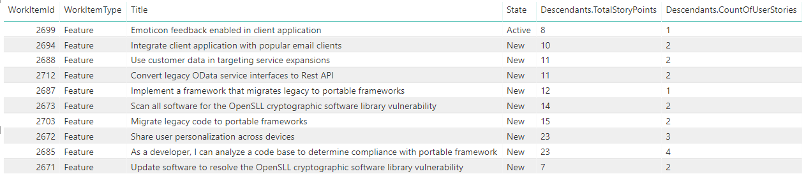
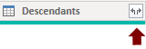
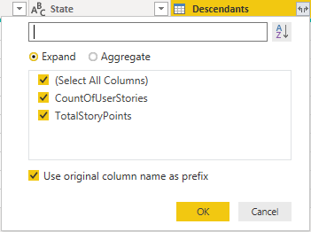
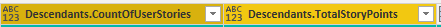
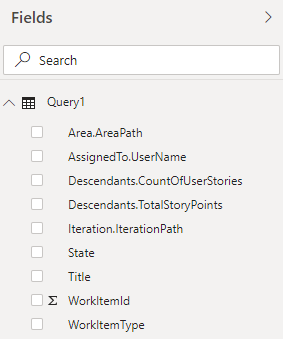

# Rollup child work item values to parent sample report

[!INCLUDE [temp](../_shared/version-azure-devops.md)]

This article shows you how to generate the rollup count of User Stories and total Story Points for a given set of Features. An example is shown in the following image. 

> [!div class="mx-imgBorder"] 
> 

[!INCLUDE [temp](_shared/sample-required-reading.md)]


## Sample queries

#### [Power BI Query](#tab/powerbi/)

[!INCLUDE [temp](_shared/sample-powerbi-query.md)]

```
let
    Source = OData.Feed("https://analytics.dev.azure.com/{organization}/{project}/_odata/v3.0-preview/WorkItems?"
            &"$filter=WorkItemType eq 'Feature'"
            &" and State ne 'Cut'"
            &" and startswith(Area/AreaPath,'{areapath}')"
            &" and Descendants/any()"    
        &"& $select=WorkItemId,Title,WorkItemType,State,AreaSK"
        &"& $expand=AssignedTo($select=UserName),Iteration($select=IterationPath),Area($select=AreaPath),"        
            &"Descendants("
                &"$apply=filter(WorkItemType eq 'User Story')"
                &"/aggregate($count as CountOfUserStories, StoryPoints with sum as TotalStoryPoints)"
            &")", 
        null, [Implementation="2.0",OmitValues = ODataOmitValues.Nulls,ODataVersion = 4])  
in
    Source
```

#### [OData Query](#tab/odata/)

[!INCLUDE [temp](_shared/sample-odata-query.md)]

```
https://analytics.dev.azure.com/{organization}/{project}/_odata/v3.0-preview/WorkItems?
    $filter=WorkItemType eq 'Feature'
        and State ne 'Cut'
        and startswith(Area/AreaPath,'{areapath}')
        and Descendants/any()
    &$select=WorkItemId,Title,WorkItemType,State,AreaSK
    &$expand=AssignedTo($select=UserName),Iteration($select=IterationPath),Area($select=AreaPath),
        Descendants(
        $apply=filter(WorkItemType eq 'User Story')
        /aggregate($count as CountOfUserStories, StoryPoints with sum as TotalStoryPoints)
        )
```

***

### Substitution strings

[!INCLUDE [temp](_shared/sample-query-substitutions.md)]
- {areapath} - Your Area Path. Example format: Project\Level1\Level2


### Query breakdown


The following table describes each part of the query.

<table width="90%">
<tbody valign="top">
<tr><td width="25%"><b>Query part</b></td><td><b>Description</b></td><tr>
<tr><td><code>$filter=WorkItemType eq 'Feature'</code></td><td>Return Features.</td><tr>
<tr><td><code>and State ne 'Cut'</code></td><td>Omit Closed bugs.</td><tr>
<tr><td><code>and startswith(Area/AreaPath,'{areapath}')</code></td><td>Work items under a specific Area Path. Replacing with <code>Area/AreaPath eq '{areapath}'</code> returns items at a specific Area Path.<br>To filter by Team Name, use the filter statement <code>Teams/any(x:x/TeamName eq '{teamname})'</code>.</td><tr>
<tr><td><code>and Descendants/any()</code></td><td>Include all Features, even those with no User Stories. Replace with "any(d:d/WorkItemType eq 'User Story')" to omit Features that don't have child User Stories.</td><tr>
<tr><td><code>&$select=WorkItemId, Title, WorkItemType, State</code></td><td>Select fields to return.</td><tr>
<tr><td><code>&$expand=AssignedTo($select=UserName), Iteration($select=IterationPath), Area($select=AreaPath),</code></td><td>Expand Assigned To, Iteration, Area entities and select entity fields.</td><tr>
<tr><td><code>Descendants(</code></td><td>Expand Descendants.</td><tr>
<tr><td><code>$apply=filter(WorkItemType eq 'User Story')</code></code></td><td>Filters the descendants. Only include User Stories (omits Tasks and Bugs).</td><tr>
<tr><td><code>/aggregate($count as CountOfUserStories, StoryPoints with sum as TotalStoryPoints)</code></td><td>For all Descendants matching the filter clause above, count them, and sum the StoryPoints field.</td><tr>
<tr><td><code>)</code></td><td>Close Descendants().</td><tr>
</tbody>
</table>


## Power BI transforms

[!INCLUDE [temp](_shared/sample-expandcolumns.md)]

### Expand Descendants column

1. Choose the expand button, and select the columns to report on:

    > [!div class="mx-imgBorder"] 
    > 

2. Check all the columns and choose **OK**.

    > [!div class="mx-imgBorder"] 
    > 

3. The Descendants entity is flattened to the selected columns:

    > [!div class="mx-imgBorder"] 
    > 

### Replace null values in rollup fields

If a work item doesn't have ayn children, the rollup value may be null. For example, **Descendants.CountOfUserStories** is "null" if a Feature doesn't have any child User Stories.

For easier reporting, replace all nulls with zero by following these steps.

[!INCLUDE [temp](_shared/sample-replace-nulls.md)]

Repeat for all the rollup columns.

[!INCLUDE [temp](_shared/sample-finish-query.md)]


## Create the report

Power BI shows you the fields you can report on. 

> [!NOTE]   
> The example below assumes that no one renamed any columns. 

> [!div class="mx-imgBorder"] 
> 

For a simple report, perform the following steps:

1. Choose the Power BI Visualization **Table**. 
1. Add the following fields to **Values**
    - WorkItemId
    - WorkItemType
    - Title
    - State
    - Descendants.CountOfUserStories
    - Descendants.TotalStoryPoints

The example report displays:

> [!div class="mx-imgBorder"] 
> 

[!INCLUDE [temp](_shared/sample-multipleteams.md)]

## Additional queries

You can use the following additional queries to create different but similar reports using the same steps defined previously in this article.

### Filter by Teams, rather than Area Path

You can generate rollup reports filtering by Team Name rather than Area Path.  

#### [Power BI Query](#tab/powerbi/)

[!INCLUDE [temp](_shared/sample-powerbi-query.md)]

```
let
    Source = OData.Feed("https://analytics.dev.azure.com/{organization}/{project}/_odata/v3.0-preview/WorkItems?"
            &"$filter=WorkItemType eq 'Feature'"
            &" and State ne 'Cut'"
            &" and (Teams/any(x:x/TeamName eq '{teamname}) or Teams/any(x:x/TeamName eq '{teamname}) or Teams/any(x:x/TeamName eq '{teamname})"
            &" and Descendants/any()"    
        &"& $select=WorkItemId,Title,WorkItemType,State,AreaSK"
        &"& $expand=AssignedTo($select=UserName),Iteration($select=IterationPath),Area($select=AreaPath),"        
            &"Descendants("
                &"$apply=filter(WorkItemType eq 'User Story')"
                &"/aggregate($count as CountOfUserStories, StoryPoints with sum as TotalStoryPoints)"
            &")", 
        null, [Implementation="2.0",OmitValues = ODataOmitValues.Nulls,ODataVersion = 4])  
in
    Source
```

#### [OData Query](#tab/odata/)

[!INCLUDE [temp](_shared/sample-odata-query.md)]

```
https://analytics.dev.azure.com/{organization}/{project}/_odata/v3.0-preview/WorkItems?
    $filter=WorkItemType eq 'Feature'
        and State ne 'Cut'
        and (Teams/any(x:x/TeamName eq '{teamname}) or Teams/any(x:x/TeamName eq '{teamname}) or Teams/any(x:x/TeamName eq '{teamname})
        and Descendants/any()
    &$select=WorkItemId,Title,WorkItemType,State,AreaSK
    &$expand=AssignedTo($select=UserName),Iteration($select=IterationPath),Area($select=AreaPath),
        Descendants(
        $apply=filter(WorkItemType eq 'User Story')
        /aggregate($count as CountOfUserStories, StoryPoints with sum as TotalStoryPoints)
        )
```

***

### Rollup Story Points to Epics

You can rollup story points to Epics using the following query.  

#### [Power BI](#tab/powerbi/)

[!INCLUDE [temp](_shared/sample-powerbi-query.md)]

```
let
    Source = OData.Feed("https://analytics.dev.azure.com/{organization}/{project}/_odata/v3.0-preview/WorkItems?"
            &"$filter=WorkItemType eq 'Epic'"
            &" and State ne 'Cut'"
            &" and startswith(Area/AreaPath,'{areapath}')"
            &" and Descendants/any(d:d/WorkItemType eq 'User Story')"    
        &"& $select=WorkItemId,Title,WorkItemType,State,AreaSK"
        &"& $expand=AssignedTo($select=UserName),Iteration($select=IterationPath),Area($select=AreaPath),"        
            &"Descendants("
                &"$apply=filter(WorkItemType eq 'User Story')"
                &"/aggregate(StoryPoints with sum as TotalStoryPoints)"
            &")", 
        null, [Implementation="2.0",OmitValues = ODataOmitValues.Nulls,ODataVersion = 4])  
in
    Source
```

#### [OData](#tab/odata/)

[!INCLUDE [temp](_shared/sample-odata-query.md)]

```
https://analytics.dev.azure.com/{organization}/{project}/_odata/v3.0-preview/WorkItems?
    $filter=WorkItemType eq 'Epic'
        and State ne 'Cut'
        and startswith(Area/AreaPath,'{areapath}')
        and Descendants/any()
    &$select=WorkItemId,Title,WorkItemType,State,AreaSK
    &$expand=AssignedTo($select=UserName),Iteration($select=IterationPath),Area($select=AreaPath),
        Descendants(
        $apply=filter(WorkItemType eq 'User Story')
        /aggregate(StoryPoints with sum as TotalStoryPoints)
        )
```

***

### Rollup Tasks Remaining Work to Features 

#### [Power BI](#tab/powerbi/)

[!INCLUDE [temp](_shared/sample-powerbi-query.md)]

```
let
    Source = OData.Feed("https://analytics.dev.azure.com/{organization}/{project}/_odata/v3.0-preview/WorkItems?"
            &"$filter=WorkItemType eq 'Feature'"
            &" and State ne 'Cut'"
            &" and startswith(Area/AreaPath,'{areapath}')"
            &" and Descendants/any()"    
        &"& $select=WorkItemId,Title,WorkItemType,State,AreaSK"
        &"& $expand=AssignedTo($select=UserName),Iteration($select=IterationPath),Area($select=AreaPath),"        
            &"Descendants("
                &"$apply=filter(WorkItemType eq 'Task')"
                &"/aggregate(RemainingWork with sum as TotalRemainingWork)"
            &")", 
        null, [Implementation="2.0",OmitValues = ODataOmitValues.Nulls,ODataVersion = 4])  
in
    Source
```

#### [OData](#tab/odata/)

[!INCLUDE [temp](_shared/sample-odata-query.md)]

```
https://analytics.dev.azure.com/{organization}/{project}/_odata/v3.0-preview/WorkItems?
    $filter=WorkItemType eq 'Feature'
        and State ne 'Cut'
        and startswith(Area/AreaPath,'{areapath}')
        and Descendants/any()
    &$select=WorkItemId,Title,WorkItemType,State,AreaSK
    &$expand=AssignedTo($select=UserName),Iteration($select=IterationPath),Area($select=AreaPath),
        Descendants(
        $apply=filter(WorkItemType eq 'Task')
        /aggregate(RemainingWork with sum as TotalRemainingWork)
        )
```

***

### Rollup Bug count to Features

#### [Power BI](#tab/powerbi/)

[!INCLUDE [temp](_shared/sample-powerbi-query.md)]

```
let
    Source = OData.Feed("https://analytics.dev.azure.com/{organization}/{project}/_odata/v3.0-preview/WorkItems?"
            &"$filter=WorkItemType eq 'Feature'"
            &" and State ne 'Cut'"
            &" and startswith(Area/AreaPath,'{areapath}')"
            &" and Descendants/any()"    
        &"& $select=WorkItemId,Title,WorkItemType,State,AreaSK"
        &"& $expand=AssignedTo($select=UserName),Iteration($select=IterationPath),Area($select=AreaPath),"        
            &"Descendants("
                &"$apply=filter(WorkItemType eq 'Bug')"
                &"/aggregate($count as CountOfBugs)"
            &")", 
        null, [Implementation="2.0",OmitValues = ODataOmitValues.Nulls,ODataVersion = 4])  
in
    Source
```

#### [OData](#tab/odata/)

[!INCLUDE [temp](_shared/sample-odata-query.md)]

```
https://analytics.dev.azure.com/{organization}/{project}/_odata/v3.0-preview/WorkItems?
    $filter=WorkItemType eq 'Feature'
        and State ne 'Cut'
        and startswith(Area/AreaPath,'{areapath}')
        and Descendants/any()
    &$select=WorkItemId,Title,WorkItemType,State,AreaSK
    &$expand=AssignedTo($select=UserName),Iteration($select=IterationPath),Area($select=AreaPath),
        Descendants(
        $apply=filter(WorkItemType eq 'Bug')
        /aggregate($count as CountOfBugs)
        )
```

***

## Full list of sample reports

[!INCLUDE [temp](_shared/sample-fulllist.md)]

## Related articles

[!INCLUDE [temp](_shared/sample-relatedarticles.md)]
