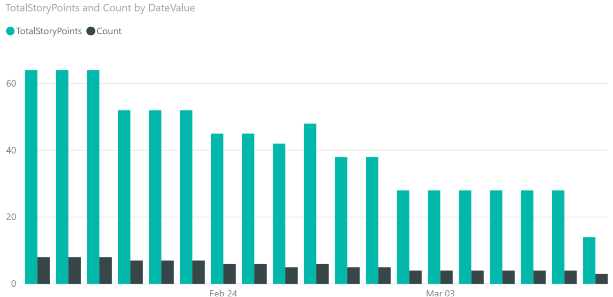
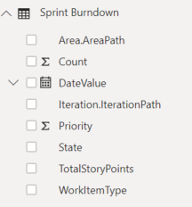

# Sprint burndown sample reports

[!INCLUDE [temp](../_shared/version-azure-devops.md)]

This article shows you how to display the burndown of User Stories for the current sprint. The following image shows a burndown both by Story Points and User Stories count.

> [!div class="mx-imgBorder"] 
> 

[!INCLUDE [temp](_shared/sample-required-reading.md)]

## Goal
Burndown User Stories in the current Sprint

## Sample queries

#### [Power BI Query](#tab/powerbi/)

[!INCLUDE [temp](_shared/sample-powerbi-query.md)]

```
let
   Source = OData.Feed ("https://analytics.dev.azure.com/{organization}/{project}/_odata/v3.0-preview/WorkItemSnapshot? "
        &"$apply=filter( "
            &"WorkItemType eq 'User Story' "
            &"and startswith(Area/AreaPath,'{areapath}') "
            &"and StateCategory ne 'Completed' "
            &"and DateValue ge Iteration/StartDate "
            &"and DateValue le Iteration/EndDate "
            &"and Iteration/StartDate le now()  "
            &"and Iteration/EndDate ge now() "
        &") "
        &"/groupby( "
            &"(DateValue,State,WorkItemType,Priority,Area/AreaPath,Iteration/IterationPath), "
            &"aggregate($count as Count, StoryPoints with sum as TotalStoryPoints) "
        &") "
    ,null, [Implementation="2.0",OmitValues = ODataOmitValues.Nulls,ODataVersion = 4]) 
in
    Source
```

#### [OData Query](#tab/odata/)

[!INCLUDE [temp](_shared/sample-odata-query.md)]

```
https://analytics.dev.azure.com/{organization}/{project}/_odata/v3.0-preview/WorkItemSnapshot? 
        $apply=filter(
            WorkItemType eq 'User Story'
            and startswith(Area/AreaPath,'{areapath}')
            and StateCategory ne 'Completed'
            and DateValue ge Iteration/StartDate
            and DateValue le Iteration/EndDate
            and Iteration/StartDate le now() 
            and Iteration/EndDate ge now()
        )
        /groupby(
            (DateValue,State,WorkItemType,Priority,Area/AreaPath,Iteration/IterationPath),
            aggregate($count as Count, StoryPoints with sum as TotalStoryPoints)
        )
```

***

### Substitution strings

[!INCLUDE [temp](_shared/sample-query-substitutions.md)]
* {areapath} - Your Area Path. Example format: Project\Level1\Level2 


### Query breakdown


The following table describes each part of the query.

<table width="90%">
<tbody valign="top">
<tr><td width="25%"><b>Query part</b></td><td><b>Description</b></td><tr>
<tr><td><code>$apply=filter(</code></td><td>Start filter()</td><tr>
<tr><td><code>WorkItemType eq 'User Story'</code></td><td>Burndown on User Stories</td><tr>
<tr><td><code>and startswith(Area/AreaPath,'{areapath}')</code></td><td>Work items under a specific Area Path. Replacing with "Area/AreaPath eq '{areapath}'" returns items at a specific Area Path.<br>To filter by Team Name, use the filter statement <code>Teams/any(x:x/TeamName eq '{teamname})'</code></td><tr>
<tr><td><code>and StateCategory ne 'Completed'</code></td><td>Filters out items that are completed. For more information on State Categories see <a href="../../boards/work-items/workflow-and-state-categories.md">How workflow states and state categories are used in Backlogs and Boards.</td><tr>
<tr><td><code>and DateValue ge Iteration/StartDate</code></td><td>Begin trend at Iteration start.</td><tr>
<tr><td><code>and DateValue le Iteration/EndDate</code></td><td>End trend at Interation end.</td><tr>
<tr><td><code>and Iteration/StartDate le now()</code></td><td>Select current Iteration.</td><tr>
<tr><td><code>and Iteration/EndDate ge now()</code></td><td>Select current Iteration</td><tr>
<tr><td><code>)</td><td>Close filter()</code></td><tr>
<tr><td><code>/groupby(</td><td>Start groupby()</code></td><tr>
<tr><td><code>(DateValue, State, WorkItemType, Priority, Area/AreaPath, Iteration/IterationPath), </code></td><td>Group by DateValue (used for trending), and any fields you want to report on</td><tr>
<tr><td><code>aggregate($count as Count,  StoryPoints with sum as TotalStoryPoints)</code></td><td>Aggregate by count of user stories, and sum of Story Points</td><tr>
<tr><td><code>)</code></td><td>Close groupby()</td><tr>
</tbody>
</table>


## Power BI transforms

[!INCLUDE [temp](_shared/sample-expandcolumns.md)]

[!INCLUDE [temp](_shared/sample-finish-query.md)]


## Create the report

Power BI shows you the fields you can report on. 

> [!NOTE]   
> The example below assumes that no one renamed any columns. 

> [!div class="mx-imgBorder"] 
> 

For a simple report, perform the following steps:

1. Select Power BI Visualization **Clustered column chart**. 
1. Add the field "DateValue" to **Axis**
    - Right click "DateValue" and select "DateValue", rather than Date Hierarchy
1. Add the field "TotalStoryPoints" to **Values**
1. Add the field "Count" to **Values**

The example report, which displays burndown on both Story Points and Count of Stories.

> [!div class="mx-imgBorder"] 
> 

[!INCLUDE [temp](_shared/sample-multipleteams.md)]

## Additional queries

Additional queries that can be used to create different, but similar reports. You can use these queries with the steps defined above.

### Filter by Teams, rather than Area Path

This query is the same as the one used above, except it filters by Team Name rather than Area Path. 

#### [Power BI Query](#tab/powerbi/)

[!INCLUDE [temp](_shared/sample-powerbi-query.md)]

```
let
   Source = OData.Feed ("https://analytics.dev.azure.com/{organization}/{project}/_odata/v3.0-preview/WorkItemSnapshot? "
        &"$apply=filter( "
            &"WorkItemType eq 'User Story' "
            &"and (Teams/any(x:x/TeamName eq '{teamname}) or Teams/any(x:x/TeamName eq '{teamname}) or Teams/any(x:x/TeamName eq '{teamname}) "
            &"and StateCategory ne 'Completed' "
            &"and DateValue ge Iteration/StartDate "
            &"and DateValue le Iteration/EndDate "
            &"and Iteration/StartDate le now()  "
            &"and Iteration/EndDate ge now() "
        &") "
        &"/groupby( "
            &"(DateValue,State,WorkItemType,Priority,Area/AreaPath,Iteration/IterationPath), "
            &"aggregate($count as Count, StoryPoints with sum as TotalStoryPoints) "
        &") "
    ,null, [Implementation="2.0",OmitValues = ODataOmitValues.Nulls,ODataVersion = 4]) 
in
    Source
```

#### [OData Query](#tab/odata/)

[!INCLUDE [temp](_shared/sample-odata-query.md)]

```
https://analytics.dev.azure.com/{organization}/{project}/_odata/v3.0-preview/WorkItemSnapshot? 
        $apply=filter(
            WorkItemType eq 'User Story'
            and (Teams/any(x:x/TeamName eq '{teamname}) or Teams/any(x:x/TeamName eq '{teamname}) or Teams/any(x:x/TeamName eq '{teamname})
            and StateCategory ne 'Completed'
            and DateValue ge Iteration/StartDate
            and DateValue le Iteration/EndDate
            and Iteration/StartDate le now() 
            and Iteration/EndDate ge now()
        )
        /groupby(
            (DateValue,State,WorkItemType,Priority,Area/AreaPath,Iteration/IterationPath),
            aggregate($count as Count, StoryPoints with sum as TotalStoryPoints)
        )
```

* * *

### All Sprints since the beginning of the year

You may want to view a burndown of all the sprints in a single report. These queries pulls in sprint burndowns (by story points) for all the sprints since the beginning of the year 2019.

#### [Power BI Query](#tab/powerbi/)

[!INCLUDE [temp](_shared/sample-powerbi-query.md)]

```
let
   Source = OData.Feed ("https://analytics.dev.azure.com/{organization}/{project}/_odata/v3.0-preview/WorkItemSnapshot? "
        &"$apply=filter( "
            &"WorkItemType eq 'User Story' "
            &"and startswith(Area/AreaPath,'{areapath}') "
            &"and StateCategory ne 'Completed' "
            &"and DateValue ge Iteration/StartDate "
            &"and DateValue le Iteration/EndDate "
            &"and Iteration/StartDate ge 2019-01-01Z "
        &") "
        &"/groupby( "
            &"(DateValue,Iteration/EndDate,Area/AreaPath,Iteration/IterationPath,State,WorkItemType,Priority,AreaSK), "
            &"aggregate($count as Count, StoryPoints with sum as TotalStoryPoints) "
        &") "
    ,null, [Implementation="2.0",OmitValues = ODataOmitValues.Nulls,ODataVersion = 4]) 
in
    Source
```

#### [OData Query](#tab/odata/)

[!INCLUDE [temp](_shared/sample-odata-query.md)]

```
https://analytics.dev.azure.com/{organization}/{project}/_odata/v3.0-preview/WorkItemSnapshot? 
        $apply=filter(
            WorkItemType eq 'User Story'
            and startswith(Area/AreaPath,'{areapath}')
            and StateCategory ne 'Completed'
            and DateValue ge Iteration/StartDate
            and DateValue le Iteration/EndDate
            and Iteration/StartDate ge 2019-01-01Z
        )
        /groupby(
            (DateValue,Iteration/EndDate,Area/AreaPath,Iteration/IterationPath,State,WorkItemType,Priority,AreaSK),
            aggregate($count as Count, StoryPoints with sum as TotalStoryPoints)
        )
```

* * *

<a id="remaining-work" />


### Burndown by Tasks' Remaining Work

#### [Power BI Query](#tab/powerbi/)

[!INCLUDE [temp](_shared/sample-powerbi-query.md)]

```
Doc-ready Power BI Query (anonomized)
let
   Source = OData.Feed ("https://analytics.dev.azure.com/{organization}/{project}/_odata/v3.0-preview/WorkItemSnapshot? "
        &"$apply=filter( "
            &"startswith(Area/AreaPath,'{project}') "
            &"and StateCategory ne 'Completed' "
            &"and DateValue ge Iteration/StartDate "
            &"and DateValue le Iteration/EndDate "
            &"and Iteration/StartDate le now()  "
            &"and Iteration/EndDate ge now() "
            &"and WorkItemType eq 'Task' "
        &") "
            &"/groupby( "
            &"(DateValue,State,WorkItemType,Activity,Priority,Area/AreaPath,Iteration/IterationPath,AreaSK), "
            &"aggregate($count as Count, RemainingWork with sum as TotalRemainingWork) "
        &") "
    ,null, [Implementation="2.0",OmitValues = ODataOmitValues.Nulls,ODataVersion = 4]) 
in
    Source
```

#### [OData Query](#tab/odata/)

[!INCLUDE [temp](_shared/sample-odata-query.md)]

```
https://analytics.dev.azure.com/{organization}/{project}/_odata/v3.0-preview/WorkItemSnapshot? 
        $apply=filter(
            startswith(Area/AreaPath,'{project}')
            and StateCategory ne 'Completed'
            and DateValue ge Iteration/StartDate
            and DateValue le Iteration/EndDate
            and Iteration/StartDate le now() 
            and Iteration/EndDate ge now()
            and WorkItemType eq 'Task'
        )
            /groupby(
            (DateValue,State,WorkItemType,Activity,Priority,Area/AreaPath,Iteration/IterationPath,AreaSK),
            aggregate($count as Count, RemainingWork with sum as TotalRemainingWork)
        )
```

***

## Full list of sample reports

[!INCLUDE [temp](_shared/sample-fulllist.md)]

## Related articles

[!INCLUDE [temp](_shared/sample-relatedarticles.md)]
