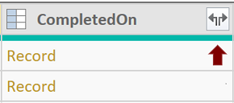
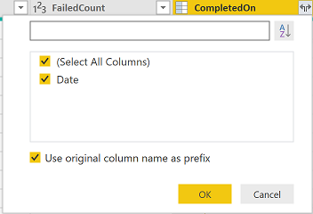
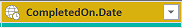
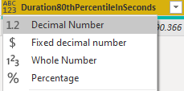
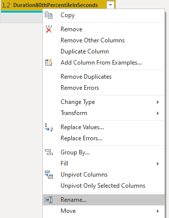

# Pipeline duration trend sample report 

[!INCLUDE [temp](../includes/version-azure-devops-cloud.md)]

This article shows you how to create a report that shows how long your pipeline typically takes to complete successfully. The daily trend of pipeline duration report is similar to the 'Pipeline duration trend' chart of the [Pipeline duration report](../../pipelines/reports/pipelinereport.md#pipeline-duration-report). 

[!INCLUDE [temp](includes/preview-note.md)]

The following image shows an example of such a chart.

> [!div class="mx-imgBorder"] 
> 

[!INCLUDE [temp](includes/sample-required-reading.md)]

[!INCLUDE [temp](./includes/prerequisites-power-bi-2020.md)]

## Sample queries

#### [Power BI query](#tab/powerbi/)

[!INCLUDE [temp](includes/sample-powerbi-query.md)]

```
let
   Source = OData.Feed ("https://analytics.dev.azure.com/{organization}/{project}/_odata/v3.0-preview/PipelineRuns?"
        &"$apply=filter( "
                &"Pipeline/PipelineName eq '{pipelinename}' "
                &"and CompletedDate ge {startdate} "
                &"and (SucceededCount eq 1 or PartiallySucceededCount eq 1) "
        &") "
        &"/compute( "
            &"percentile_cont(TotalDurationSeconds, 0.8,CompletedDateSK) as Duration80thPercentileInSeconds) "
                &"/groupby( "
                &"(Duration80thPercentileInSeconds, CompletedOn/Date)) "
            &"&$orderby=CompletedOn/Date asc "
    ,null, [Implementation="2.0",OmitValues = ODataOmitValues.Nulls,ODataVersion = 4]) 
in
    Source
```

#### [OData query](#tab/odata/)

[!INCLUDE [temp](includes/sample-odata-query.md)]

```
https://analytics.dev.azure.com/{organization}/{project}/_odata/v3.0-preview/PipelineRuns?
$apply=filter(
    Pipeline/PipelineName eq '{pipelinename}'
    and CompletedDate ge {startdate}
    and (SucceededCount eq 1 or PartiallySucceededCount eq 1)
    )
/compute(
    percentile_cont(TotalDurationSeconds, 0.8,CompletedDateSK) as Duration80thPercentileInSeconds)
/groupby(
    (Duration80thPercentileInSeconds, CompletedOn/Date))
&$orderby=CompletedOn/Date asc
```

***

### Substitution strings

[!INCLUDE [temp](includes/pipelines-sample-query-substitutions.md)]


### Query breakdown

The following table describes each part of the query.

<table width="90%">
<tbody valign="top">
<tr><td width="25%"><b>Query part</b></td><td><b>Description</b></td><tr>
<tr><td><code>$apply=filter(</code></td>
<td>Start filter()</td>
<tr>
<tr>
<td><code>Pipeline/PipelineName eq '{pipelinename}'</code></td>
<td>Return pipeline runs for the specified pipeline</td>
<tr>
<tr>
<td><code>and CompletedDate ge {startdate}</code></td>
<td>Return pipeline runs on or after the specified date</td>
<tr>
<tr>
<td><code>and (SucceededCount eq 1 or PartiallySucceededCount eq 1)</code></td>
<td>Return only the successful or partially successful runs</td>
<tr>
<tr><td><code>)</code></td>
<td>Close filter()</td>
<tr>
<tr><td><code>/compute(</code></td>
<td>Start compute()</td>
<tr>
<tr><td><code>percentile_cont(TotalDurationSeconds, 0.8,CompletedDateSK) as Duration80thPercentileInSeconds)</code></td>
<td>Compute 80th percentile of Pipeline durations of all pipeline runs that match the filter criteria</td>
<tr>
<tr><td><code>/groupby(</code></td>
<td>Start groupby()</td>
<tr>
<tr><td><code>(Duration80thPercentileInSeconds, CompletedOn/Date))</code></td>
<td>Group by date of completion of pipeline run and calculated day wise 80th percentile pipeline Duration</td>
<tr>
<tr><td><code>&$orderby=CompletedOn/Date asc</code></td>
<td>Order the response by completed date</td>
<tr>
</tbody>
</table>


[!INCLUDE [temp](includes/query-filters-pipelines.md)]


## Power BI transforms

The query returns some columns that you need to expand and flatten into its fields before you can use them in Power BI. In this example such an entity is CompletedOn.

After closing the Advanced Editor and while remaining in the Power Query Editor, select the expand button on **CompletedOn**.


### Expand the CompletedOn column 

1. Choose the expand button.

    > [!div class="mx-imgBorder"] 
    > 
    
1. Select the checkbox "(Select All Columns)" to expand.

    > [!div class="mx-imgBorder"] 
    > 

1. The table now contains the expanded entity **CompletedOn.Date**.

    > [!div class="mx-imgBorder"] 
    > 


### Change the column type

The query doesn't return all the columns in the format in which you can directly consume them in Power BI reports. Therefore, you can change the column type as shown. 

- Change the type of column **Duration80thPercentileInSeconds** to **Decimal Number**.

    > [!div class="mx-imgBorder"] 
    > 


### Rename fields and query

When finished, you may choose to rename columns. 

1. Right-click a column header and select **Rename...**

	> [!div class="mx-imgBorder"] 
	> 
  
1. You also may want to rename the query from the default **Query1**, to something more meaningful. 

	> [!div class="mx-imgBorder"] 
	> 
  
1. Once done, choose **Close & Apply** to save the query and return to Power BI.

	> [!div class="mx-imgBorder"] 
	> 
  
  
## Create the report

Power BI shows you the fields you can report on. 

> [!NOTE]   
> The example below assumes that no one renamed any columns. 
> [!div class="mx-imgBorder"] 
> 

For a simple report, do the following steps:

1. Select Power BI Visualization **Line Chart**.

1. Add the field "CompletedOn.Date" to **Axis**.
	
	- Right-click "CompletedOn.Date" and select "CompletedOn.Date", rather than Date Hierarchy.
	
1. Add the field "Duration80thPercentileInSeconds" to **Values**.

	- Right-click "Duration80thPercentileInSeconds" field and ensure **Sum** is selected.


Your report should look like this. 

> [!div class="mx-imgBorder"] 
> 


## Additional queries

You can use the following additional queries to create different but similar reports using the same steps defined previously in this article.


### Use Pipeline Id, rather than Pipeline Name

You can change your Pipeline name. To ensure that the Power BI reports don't break when the pipeline name is changed, use pipeline ID rather than pipeline name. You can obtain the pipeline ID  from the URL of the pipeline runs page.
https:\//dev.azure.com/{organization}/{project}/_build?definitionId= **{pipelineid}**

#### [Power BI query](#tab/powerbi/)

[!INCLUDE [temp](includes/sample-powerbi-query.md)]

```
let
   Source = OData.Feed ("https://analytics.dev.azure.com/{organization}/{project}/_odata/v3.0-preview/PipelineRuns?"
        &"$apply=filter( "
                &"PipelineId eq {pipelineId} "
                &"and CompletedDate ge {startdate} "
                &"and (SucceededCount eq 1 or PartiallySucceededCount eq 1) "
        &") "
        &"/compute( "
            &"percentile_cont(TotalDurationSeconds, 0.8,CompletedDateSK) as Duration80thPercentileInSeconds) "
                &"/groupby( "
                &"(Duration80thPercentileInSeconds, CompletedOn/Date)) "
            &"&$orderby=CompletedOn/Date asc "
    ,null, [Implementation="2.0",OmitValues = ODataOmitValues.Nulls,ODataVersion = 4]) 
in
    Source
```
#### [OData query](#tab/odata/)

[!INCLUDE [temp](includes/sample-odata-query.md)]

```
https://analytics.dev.azure.com/{organization}/{project}/_odata/v3.0-preview/PipelineRuns?
$apply=filter(
    PipelineId eq {pipelineId}
    and CompletedDate ge {startdate}
    and (SucceededCount eq 1 or PartiallySucceededCount eq 1)
    )
/compute(
    percentile_cont(TotalDurationSeconds, 0.8,CompletedDateSK) as Duration80thPercentileInSeconds)
/groupby(
    (Duration80thPercentileInSeconds, CompletedOn/Date))
&$orderby=CompletedOn/Date asc
```

***

### Get 50th and 90th percentile, along with 80th percentile duration trend

You may want to view the duration trend calculated using other percentile value. Below query gives 50th and 90th percentile pipeline duration along with 80th percentile.

#### [Power BI query](#tab/powerbi/)

[!INCLUDE [temp](includes/sample-powerbi-query.md)]

```
let
   Source = OData.Feed ("https://analytics.dev.azure.com/{organization}/{project}/_odata/v3.0-preview/PipelineRuns?"
        &"$apply=filter( "
                &"Pipeline/PipelineName eq '{pipelinename}' "
                &"and CompletedDate ge {startdate} "
                &"and (SucceededCount eq 1 or PartiallySucceededCount eq 1) "
        &") "
        &"/compute( "
            &"percentile_cont(TotalDurationSeconds, 0.5,CompletedDateSK) as Duration50thPercentileInSeconds, "
                &"percentile_cont(TotalDurationSeconds, 0.8,CompletedDateSK) as Duration80thPercentileInSeconds, "
                &"percentile_cont(TotalDurationSeconds, 0.90,CompletedDateSK) as Duration90thPercentileInSeconds) "
            &"/groupby( "
                &"(Duration50thPercentileInSeconds, Duration80thPercentileInSeconds, Duration90thPercentileInSeconds, CompletedOn/Date)) "
            &"&$orderby=CompletedOn/Date asc "
    ,null, [Implementation="2.0",OmitValues = ODataOmitValues.Nulls,ODataVersion = 4]) 
in
    Source
```
#### [OData query](#tab/odata/)

[!INCLUDE [temp](includes/sample-odata-query.md)]

```
https://analytics.dev.azure.com/{organization}/{project}/_odata/v3.0-preview/PipelineRuns?
$apply=filter(
    Pipeline/PipelineName eq '{pipelinename}'
    and CompletedDate ge {startdate}
    and (SucceededCount eq 1 or PartiallySucceededCount eq 1)
    )
/compute(
    percentile_cont(TotalDurationSeconds, 0.5,CompletedDateSK) as Duration50thPercentileInSeconds,
    percentile_cont(TotalDurationSeconds, 0.8,CompletedDateSK) as Duration80thPercentileInSeconds,
    percentile_cont(TotalDurationSeconds, 0.90,CompletedDateSK) as Duration90thPercentileInSeconds)
/groupby(
    (Duration50thPercentileInSeconds, Duration80thPercentileInSeconds, Duration90thPercentileInSeconds, CompletedOn/Date))
&$orderby=CompletedOn/Date asc
```

***

### Filter by branch

You may want to view the duration trend of a pipeline for a particular **branch** only. To create the report, follow the below additional steps along with what is defined previously in this article.

- Expand Branch into Branch.BranchName
- Select Power BI Visualization **Slicer** and add the field Branch.BranchName to the slicer's **Field**
- Select the pipeline from the slicer for which you need to see the pipeline duration trend

#### [Power BI query](#tab/powerbi/)

[!INCLUDE [temp](includes/sample-powerbi-query.md)]

```
let
   Source = OData.Feed ("https://analytics.dev.azure.com/{organization}/{project}/_odata/v3.0-preview/PipelineRuns?"
        &"$apply=filter( "
                &"Pipeline/PipelineName eq '{pipelinename}' "
                &"and CompletedDate ge {startdate} "
                &"and (SucceededCount eq 1 or PartiallySucceededCount eq 1) "
        &") "
        &"/compute( "
            &"percentile_cont(TotalDurationSeconds, 0.8,BranchSK, CompletedDateSK) as Duration80thPercentileInSeconds) "
                &"/groupby( "
                &"(Duration80thPercentileInSeconds, Branch/BranchName, CompletedOn/Date)) "
            &"&$orderby=CompletedOn/Date asc "
    ,null, [Implementation="2.0",OmitValues = ODataOmitValues.Nulls,ODataVersion = 4]) 
in
    Source
```
#### [OData query](#tab/odata/)

[!INCLUDE [temp](includes/sample-odata-query.md)]

```
https://analytics.dev.azure.com/{organization}/{project}/_odata/v3.0-preview/PipelineRuns?
$apply=filter(
    Pipeline/PipelineName eq '{pipelinename}'
    and CompletedDate ge {startdate}
    and (SucceededCount eq 1 or PartiallySucceededCount eq 1)
    )
/compute(
    percentile_cont(TotalDurationSeconds, 0.8,BranchSK, CompletedDateSK) as Duration80thPercentileInSeconds)
/groupby(
    (Duration80thPercentileInSeconds, Branch/BranchName, CompletedOn/Date))
&$orderby=CompletedOn/Date asc
```

***

### Duration trend for all project pipelines 

You may want to view the duration trend for all the pipelines of the project in a single report. To create the report, follow the below additional steps along with what is defined previously in this article.

- Expand Pipeline into Pipeline.PipelineName
- Select Power BI Visualization **Slicer** and add the field Pipeline.PipelineName to the slicer's **Field**
- Select the Build pipeline from the slicer for which you need to see the trend of pipeline pass rate 

Refer [Outcome summary for all pipelines](sample-pipelines-allpipelines.md) sample report which has detailed similar steps as required here.

#### [Power BI query](#tab/powerbi/)

[!INCLUDE [temp](includes/sample-powerbi-query.md)]

```
let
   Source = OData.Feed ("https://analytics.dev.azure.com/{organization}/{project}/_odata/v3.0-preview/PipelineRuns?"
        &"$apply=filter( "
                &"CompletedDate ge {startdate} "
                &"and (SucceededCount eq 1 or PartiallySucceededCount eq 1) "
                &") "
        &"/compute( "
        &"percentile_cont(TotalDurationSeconds, 0.8,PipelineId, CompletedDateSK) as Duration80thPercentileInSeconds) "
            &"/groupby( "
                &"(Duration80thPercentileInSeconds, Pipeline/PipelineName, CompletedOn/Date)) "
                &"&$orderby=CompletedOn/Date asc "
    ,null, [Implementation="2.0",OmitValues = ODataOmitValues.Nulls,ODataVersion = 4]) 
in
    Source
```
#### [OData query](#tab/odata/)

[!INCLUDE [temp](includes/sample-odata-query.md)]

```
https://analytics.dev.azure.com/{organization}/{project}/_odata/v3.0-preview/PipelineRuns?
$apply=filter(
    CompletedDate ge {startdate}
    and (SucceededCount eq 1 or PartiallySucceededCount eq 1)
    )
/compute(
    percentile_cont(TotalDurationSeconds, 0.8,PipelineId, CompletedDateSK) as Duration80thPercentileInSeconds)
/groupby(
    (Duration80thPercentileInSeconds, Pipeline/PipelineName, CompletedOn/Date))
&$orderby=CompletedOn/Date asc
```

***

## Full list of sample reports for Pipelines

[!INCLUDE [temp](includes/sample-full-list-pipelines.md)]

## Related articles

[!INCLUDE [temp](includes/sample-related-articles-pipelines.md)]
