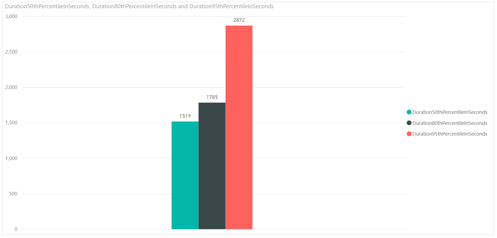

# Pipeline duration sample report 

[!INCLUDE [version-gt-eq-2020](../../includes/version-gt-eq-2020.md)]

This article shows you how to get pipeline duration, or the time taken to run a pipeline. This report is similar to the duration summary metric in the 'Pipeline duration' chart of the [Pipeline duration report](../../pipelines/reports/pipelinereport.md#pipeline-duration-report). 

[!INCLUDE [temp](includes/preview-note.md)]

An example of the pipeline duration report is shown in the following image.

> [!div class="mx-imgBorder"] 
> 

[!INCLUDE [temp](includes/sample-required-reading.md)]

[!INCLUDE [temp](./includes/prerequisites-power-bi-2020.md)]

## Sample queries

#### [Power BI query](#tab/powerbi/)

[!INCLUDE [temp](includes/sample-powerbi-query.md)]

```
let
   Source = OData.Feed ("https://analytics.dev.azure.com/{organization}/{project}/_odata/v3.0-preview/PipelineRuns?"
        &"$apply=filter( "
                &"Pipeline/PipelineName eq '{pipelinename}' "
                &"and CompletedDate ge {startdate} "
                &"and (SucceededCount eq 1 or PartiallySucceededCount eq 1) "
        &") "
        &"/compute( "
            &"percentile_cont(TotalDurationSeconds, 0.5) as Duration50thPercentileInSeconds, "
                &"percentile_cont(TotalDurationSeconds, 0.8) as Duration80thPercentileInSeconds, "
                &"percentile_cont(TotalDurationSeconds, 0.95) as Duration95thPercentileInSeconds) "
            &"/groupby( "
                &"(Duration50thPercentileInSeconds, Duration80thPercentileInSeconds,Duration95thPercentileInSeconds)) "
    ,null, [Implementation="2.0",OmitValues = ODataOmitValues.Nulls,ODataVersion = 4]) 
in
    Source
```

#### [OData query](#tab/odata/)

[!INCLUDE [temp](includes/sample-odata-query.md)]

```
https://analytics.dev.azure.com/{organization}/{project}/_odata/v3.0-preview/PipelineRuns?
$apply=filter(
    Pipeline/PipelineName eq '{pipelinename}'
    and CompletedDate ge {startdate}
    and (SucceededCount eq 1 or PartiallySucceededCount eq 1)
    )
/compute(
    percentile_cont(TotalDurationSeconds, 0.5) as Duration50thPercentileInSeconds,
    percentile_cont(TotalDurationSeconds, 0.8) as Duration80thPercentileInSeconds,
    percentile_cont(TotalDurationSeconds, 0.95) as Duration95thPercentileInSeconds)
/groupby(
(Duration50thPercentileInSeconds, Duration80thPercentileInSeconds,Duration95thPercentileInSeconds))
```

***

### Substitution strings
[!INCLUDE [temp](includes/sample-query-substitutions.md)]

[!INCLUDE [temp](includes/sample-query-substitutions-pipelines.md)]


### Query breakdown

The following table describes each part of the query.

:::row:::
   :::column span="1":::
   **Query part**
   :::column-end:::
   :::column span="1":::
   **Description**
   :::column-end:::
:::row-end:::
:::row:::
   :::column span="1":::
   `$apply=filter(`
   :::column-end:::
   :::column span="1":::
   Start filter()
   :::column-end:::
:::row-end:::
:::row:::
   :::column span="1":::
   `Pipeline/PipelineName eq '{pipelinename}'`
   :::column-end:::
   :::column span="1":::
   Return pipeline runs for the specified pipeline
   :::column-end:::
:::row-end:::
:::row:::
   :::column span="1":::
   `and CompletedDate ge {startdate}`
   :::column-end:::
   :::column span="1":::
   Return pipeline runs on or after the specified date
   :::column-end:::
:::row-end:::
:::row:::
   :::column span="1":::
   `and (SucceededCount eq 1 or PartiallySucceededCount eq 1)`
   :::column-end:::
   :::column span="1":::
   Return only the successful or partially successful runs
   :::column-end:::
:::row-end:::
:::row:::
   :::column span="1":::
   `)`
   :::column-end:::
   :::column span="1":::
   Close filter()
   :::column-end:::
:::row-end:::
:::row:::
   :::column span="1":::
   `/compute(`
   :::column-end:::
   :::column span="1":::
   Start compute()
   :::column-end:::
:::row-end:::
:::row:::
   :::column span="1":::
   `percentile_cont(TotalDurationSeconds, 0.5) as Duration50thPercentileInSeconds,`
   :::column-end:::
   :::column span="1":::
   Compute 50th percentile of Pipeline durations of all pipeline runs that match the filter criteria/td>
:::row-end:::
:::row:::
   :::column span="1":::
   `percentile_cont(TotalDurationSeconds, 0.8) as Duration80thPercentileInSeconds,`
   :::column-end:::
   :::column span="1":::
   Compute 80th percentile of Pipeline durations of all pipeline runs that match the filter criteria
   :::column-end:::
:::row-end:::
:::row:::
   :::column span="1":::
   `percentile_cont(TotalDurationSeconds, 0.95) as Duration95thPercentileInSeconds)`
   :::column-end:::
   :::column span="1":::
   Compute 95th percentile of Pipeline durations of all pipeline runs that match the filter criteria
   :::column-end:::
:::row-end:::
:::row:::
   :::column span="1":::
   `/groupby(`
   :::column-end:::
   :::column span="1":::
   Start groupby()
   :::column-end:::
:::row-end:::
:::row:::
   :::column span="1":::
   `(Duration50thPercentileInSeconds, Duration80thPercentileInSeconds,Duration95thPercentileInSeconds))`
   :::column-end:::
   :::column span="1":::
   Group the response by - Duration50thPercentileInSeconds, Duration80thPercentileInSeconds,Duration95thPercentileInSeconds
   :::column-end:::
:::row-end:::

[!INCLUDE [temp](includes/query-filters-pipelines.md)]

## Power BI transforms

### Change column type

The query doesn't return all the columns in the format in which you can directly consume them in Power BI reports.

1. Change the type of columns **Duration50thPercentileInSeconds, Duration80thPercentileInSeconds** and **Duration95thPercentileInSeconds** to **Decimal Number**.

    > [!div class="mx-imgBorder"] 
    > 


### Rename fields and query 

When finished, you may choose to rename columns. 

1. Right-click a column header and select **Rename...**

	> [!div class="mx-imgBorder"] 
	> 
  
1. You also may want to rename the query from the default **Query1**, to something more meaningful. 

	> [!div class="mx-imgBorder"] 
	> 
  
1. Once done, choose **Close & Apply** to save the query and return to Power BI.

	> [!div class="mx-imgBorder"] 
	> 
  
  
## Create the report

Power BI shows you the fields you can report on. 

> [!NOTE]   
> The example below assumes that no one renamed any columns. 
> [!div class="mx-imgBorder"] 
> 

For a simple report, do the following steps:

1. Select Power BI Visualization **Clustered Column chart**.

1. Add the field "Duration50thPercentileInSeconds" to **Fields**.

1. Add the field "Duration80thPercentileInSeconds" to **Fields**.

1. Add the field "Duration95thPercentileInSeconds" to **Fields**.


Your report should appear similar to the following image.   

> [!div class="mx-imgBorder"] 
> 


## More queries

You can use the following other queries to create different but similar reports using the same steps defined previously in this article.


### Use Pipeline ID, rather than Pipeline Name

You can change your Pipeline name. To ensure that the Power BI reports don't break when the pipeline name is changed, use pipeline ID rather than pipeline name. You can obtain the pipeline ID  from the URL of the pipeline runs page.

`https://dev.azure.com/{organization}/{project}/_build?definitionId= **{pipelineid}**`

#### [Power BI query](#tab/powerbi/)

[!INCLUDE [temp](includes/sample-powerbi-query.md)]

```
let
   Source = OData.Feed ("https://analytics.dev.azure.com/{organization}/{project}/_odata/v3.0-preview/PipelineRuns?"
        &"$apply=filter( "
                &"PipelineId  eq {pipelineid} "
                &"and CompletedDate ge {startdate} "
                &"and (SucceededCount eq 1 or PartiallySucceededCount eq 1) "
        &") "
        &"/compute( "
            &"percentile_cont(TotalDurationSeconds, 0.5) as Duration50thPercentileInSeconds, "
                &"percentile_cont(TotalDurationSeconds, 0.8) as Duration80thPercentileInSeconds, "
                &"percentile_cont(TotalDurationSeconds, 0.95) as Duration95thPercentileInSeconds) "
            &"/groupby( "
                &"(Duration50thPercentileInSeconds, Duration80thPercentileInSeconds,Duration95thPercentileInSeconds)) "
    ,null, [Implementation="2.0",OmitValues = ODataOmitValues.Nulls,ODataVersion = 4]) 
in
    Source
```

#### [OData query](#tab/odata/)

[!INCLUDE [temp](includes/sample-odata-query.md)]

```
https://analytics.dev.azure.com/{organization}/{project}/_odata/v3.0-preview/PipelineRuns?
$apply=filter(
    PipelineId  eq {pipelineid}
    and CompletedDate ge {startdate}
    and (SucceededCount eq 1 or PartiallySucceededCount eq 1)
    )
/compute(
    percentile_cont(TotalDurationSeconds, 0.5) as Duration50thPercentileInSeconds,
    percentile_cont(TotalDurationSeconds, 0.8) as Duration80thPercentileInSeconds,
    percentile_cont(TotalDurationSeconds, 0.95) as Duration95thPercentileInSeconds)
/groupby(
(Duration50thPercentileInSeconds, Duration80thPercentileInSeconds,Duration95thPercentileInSeconds))
```

***

### Filter by branch

You may want to view the duration of a pipeline for a particular **branch** only. To create the report, carry out the following extra steps along with those steps defined previously in this article.

- Expand Branch into Branch.BranchName.  
- Add the field **Branch.BranchName** to **Axis**.  

#### [Power BI query](#tab/powerbi/)

[!INCLUDE [temp](includes/sample-powerbi-query.md)]

```
let
   Source = OData.Feed ("https://analytics.dev.azure.com/{organization}/{project}/_odata/v3.0-preview/PipelineRuns?"
        &"$apply=filter( "
                &"Pipeline/PipelineName eq '{pipelinename}' "
                &"and CompletedDate ge {startdate} "
                &"and (SucceededCount eq 1 or PartiallySucceededCount eq 1) "
        &") "
        &"/compute( "
            &"percentile_cont(TotalDurationSeconds, 0.5, BranchSK) as Duration50thPercentileInSeconds, "
                &"percentile_cont(TotalDurationSeconds, 0.8, BranchSK) as Duration80thPercentileInSeconds, "
                &"percentile_cont(TotalDurationSeconds, 0.95, BranchSK) as Duration95thPercentileInSeconds) "
            &"/groupby( "
                &"(Duration50thPercentileInSeconds, Duration80thPercentileInSeconds,Duration95thPercentileInSeconds, Branch/BranchName)) "
    ,null, [Implementation="2.0",OmitValues = ODataOmitValues.Nulls,ODataVersion = 4]) 
in
    Source
```

#### [OData query](#tab/odata/)

[!INCLUDE [temp](includes/sample-odata-query.md)]

```
https://analytics.dev.azure.com/{organization}/{project}/_odata/v3.0-preview/PipelineRuns?
$apply=filter(
    Pipeline/PipelineName eq '{pipelinename}'
    and CompletedDate ge {startdate}
    and (SucceededCount eq 1 or PartiallySucceededCount eq 1)
    )
/compute(
    percentile_cont(TotalDurationSeconds, 0.5, BranchSK) as Duration50thPercentileInSeconds,
    percentile_cont(TotalDurationSeconds, 0.8, BranchSK) as Duration80thPercentileInSeconds,
    percentile_cont(TotalDurationSeconds, 0.95, BranchSK) as Duration95thPercentileInSeconds)
/groupby(
(Duration50thPercentileInSeconds, Duration80thPercentileInSeconds,Duration95thPercentileInSeconds, Branch/BranchName))
```

***

### Duration for all project pipelines

You may want to view the duration for all the pipelines of the project in a single report. To create the report, follow the below extra steps along with what is defined previously in this article.

- Expand Pipeline into  Pipeline.PipelineName.
- Add the field **PIpeline.PipelineName** to **Axis**.

Refer [Outcome summary for all pipelines](sample-pipelines-allpipelines.md) sample report that has detailed similar steps as required here.

#### [Power BI query](#tab/powerbi/)

[!INCLUDE [temp](includes/sample-powerbi-query.md)]

```
let
   Source = OData.Feed ("https://analytics.dev.azure.com/{organization}/{project}/_odata/v3.0-preview/PipelineRuns?"
        &"$apply=filter( "
                &"CompletedDate ge {startdate} "
                &"and (SucceededCount eq 1 or PartiallySucceededCount eq 1) "
                &"    ) "
        &"/compute( "
        &"percentile_cont(TotalDurationSeconds, 0.5, PipelineId) as Duration50thPercentileInSeconds, "
            &"percentile_cont(TotalDurationSeconds, 0.8, PipelineId) as Duration80thPercentileInSeconds, "
                &"percentile_cont(TotalDurationSeconds, 0.95, PipelineId) as Duration95thPercentileInSeconds) "
                &"/groupby( "
            &"(Duration50thPercentileInSeconds, Duration80thPercentileInSeconds,Duration95thPercentileInSeconds, Pipeline/PipelineName)) "
    ,null, [Implementation="2.0",OmitValues = ODataOmitValues.Nulls,ODataVersion = 4]) 
in
    Source
```


#### [OData query](#tab/odata/)

[!INCLUDE [temp](includes/sample-odata-query.md)]

```
https://analytics.dev.azure.com/{organization}/{project}/_odata/v3.0-preview/PipelineRuns?
$apply=filter(
    CompletedDate ge {startdate}
    and (SucceededCount eq 1 or PartiallySucceededCount eq 1)
    )
/compute(
    percentile_cont(TotalDurationSeconds, 0.5, PipelineId) as Duration50thPercentileInSeconds,
    percentile_cont(TotalDurationSeconds, 0.8, PipelineId) as Duration80thPercentileInSeconds,
    percentile_cont(TotalDurationSeconds, 0.95, PipelineId) as Duration95thPercentileInSeconds)
/groupby(
(Duration50thPercentileInSeconds, Duration80thPercentileInSeconds,Duration95thPercentileInSeconds, Pipeline/PipelineName))
```

***

## Full list of sample reports for Pipelines

[!INCLUDE [temp](includes/sample-full-list-pipelines.md)]

## Related articles

[!INCLUDE [temp](includes/sample-related-articles-pipelines.md)]
