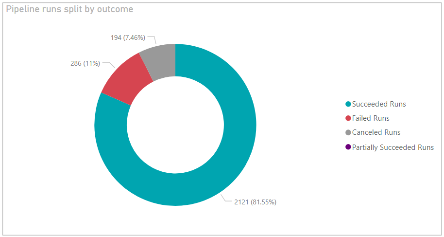

# Pipeline outcome summary sample report 

[!INCLUDE [temp](../_shared/version-azure-devops-cloud.md)]

This article shows you how to get the number of runs for different pipeline outcomes (Succeeded / Failed / Canceled / Partially Succeeded). An example is shown in the following image.
 

> [!div class="mx-imgBorder"] 
> 


[!INCLUDE [temp](_shared/sample-required-reading.md)]


## Sample queries

#### [Power BI Query](#tab/powerbi/)

[!INCLUDE [temp](_shared/sample-powerbi-query.md)]

```
let
   Source = OData.Feed ("https://analytics.dev.azure.com/{organization}/{project}/_odata/v3.0-preview/Builds?"
        &"$apply=filter( "
                &"BuildPipeline/BuildPipelineName eq '{pipelinename}' "
                &"and CompletedDate ge {startdate} "
                &") "
        &"/aggregate( "
        &"$count as TotalCount, "
            &"SucceededCount with sum as SucceededCount , "
                &"FailedCount with sum as FailedCount, "
                &"PartiallySucceededCount with sum as PartiallySucceededCount , "
            &"CanceledCount with sum as CanceledCount "
                &") "
    ,null, [Implementation="2.0",OmitValues = ODataOmitValues.Nulls,ODataVersion = 4]) 
in
    Source
```

#### [OData Query](#tab/odata/)

[!INCLUDE [temp](_shared/sample-odata-query.md)]

```
https://analytics.dev.azure.com/{organization}/{project}/_odata/v3.0-preview/Builds?
$apply=filter(
	BuildPipeline/BuildPipelineName eq '{pipelineName}'
	and CompletedDate ge {startdate}
	)
/aggregate(
	$count as TotalCount,
	SucceededCount with sum as SucceededCount ,
	FailedCount with sum as FailedCount,
	PartiallySucceededCount with sum as PartiallySucceededCount ,
	CanceledCount with sum as CanceledCount
	)
```

***

### Substitution strings

[!INCLUDE [temp](_shared/pipelines-sample-query-substitutions.md)]


### Query breakdown

The following table describes each part of the query.

<table width="90%">
<tbody valign="top">
<tr><td width="25%"><b>Query part</b></td><td><b>Description</b></td><tr>
<tr><td><code>$apply=filter(</code></td>
<td>Start filter()</td>
<tr>
<tr>
<td><code>BuildPipeline/BuildPipelineName eq '{pipelinename}'</code></td>
<td>Return pipeline runs for the specified pipeline</td>
<tr>
<tr>
<td><code>and CompletedDate ge {startdate}</code></td>
<td>Return pipeline runs on or after the specified date</td>
<tr>
<tr><td><code>)</code></td>
<td>Close filter()</td>
<tr>
<tr><td><code>/aggregate(</code></td>
<td>Start aggregate. For all the pipeline runs matching the above filter criteria:</td>
<tr>
<tr><td><code>$count as TotalCount,</code></td>
<td>Count the total number of runs as TotalCount</td>
<tr>
<tr><td><code>SucceededCount with sum as SucceededCount ,</code></td>
<td>Count the number of successful runs as SucceededCount</td>
<tr>
<tr><td><code>FailedCount with sum as FailedCount,</code></td>
<td>Count the number of failed runs as FailedCount</td>
<tr>
<tr><td><code>PartiallySucceededCount with sum as PartiallySucceededCount ,</code></td>
<td>Count the number of partially successful runs as PartiallySucceededCount</td>
<tr>
<tr><td><code>CanceledCount with sum as CanceledCount</code></td>
<td>Count the number of canceled runs as CanceledCount</td>
<tr>
<tr><td><code>)</code></td>
<td>Close aggregate()</td>
<tr>
</tbody>
</table>


## Power BI transforms

### Change column type

1. Change the type of column TotalCount to **Whole Number**.

    > [!div class="mx-imgBorder"] 
    > 

### Rename fields and query, then Close & Apply

When finished, you may choose to rename columns. 

1. Right-click a column header and select **Rename...**

	> [!div class="mx-imgBorder"] 
	> 

1. You also may want to rename the query from the default **Query1**, to something more meaningful. 

	> [!div class="mx-imgBorder"] 
	> 

1. Once done, choose **Close & Apply** to save the query and return to Power BI.

	> [!div class="mx-imgBorder"] 
	> 
  
  
## Create the report

Power BI shows you the fields you can report on. 

> [!NOTE]   
> The example below assumes that no one renamed any columns. 

> [!div class="mx-imgBorder"] 
> 

For a simple report, perform the following steps:

1. Select Power BI Visualization **Donut Chart**. 
1. Add the field "SucceededCount" to **Values**.
    - Right-click "SucceededCount" field and ensure **Sum** is selected.
1. Add the field "FailedCount" to **Values**.
	  - Right-click "FailedCount" field and ensure **Sum** is selected.
1. Add the field "CanceledCount" to **Values**.
	  - Right-click "CanceledCount" field and ensure **Sum** is selected.
1. Add the field "PartiallySucceededCount " to **Values**.
    - Right-click "PartiallySucceededCount " field and ensure **Sum** is selected.
    
Your report should look like this. 

> [!div class="mx-imgBorder"] 
> 


[!INCLUDE [temp](_shared/sample-multipleteams.md)]

## Additional queries

You can use the following additional queries to create different but similar reports using the same steps defined previously in this article.

### Use Pipeline ID, rather than Pipeline Name

You can change your Pipeline name. To ensure that the Power BI reports don't break when a pipeline name is changed, use the pipeline ID rather than its name. For a pipeline, its ID can be obtained from the URL of the runs page.

`https://dev.azure.com/{organization}/{project}/_build?definitionId= **{pipelineid}**`

#### [Power BI Query](#tab/powerbi/)

[!INCLUDE [temp](_shared/sample-powerbi-query.md)]

```
let
   Source = OData.Feed ("https://analytics.dev.azure.com/{organization}/{project}/_odata/v3.0-preview/Builds?"
        &"$apply=filter( "
                &"BuildPipelineId eq {pipelineId} "
                &"and CompletedDate ge {startdate} "
                &") "
        &"/aggregate( "
        &"$count as TotalCount, "
            &"SucceededCount with sum as SucceededCount , "
                &"FailedCount with sum as FailedCount, "
                &"PartiallySucceededCount with sum as PartiallySucceededCount , "
            &"CanceledCount with sum as CanceledCount "
                &") "
    ,null, [Implementation="2.0",OmitValues = ODataOmitValues.Nulls,ODataVersion = 4]) 
in
    Source
```

#### [OData Query](#tab/odata/)

[!INCLUDE [temp](_shared/sample-odata-query.md)]

```
https://analytics.dev.azure.com/{organization}/{project}/_odata/v3.0-preview/Builds?
$apply=filter(
	BuildPipelineId eq {pipelineId}
	and CompletedDate ge {startdate}
	)
/aggregate(
	$count as TotalCount,
	SucceededCount with sum as SucceededCount ,
	FailedCount with sum as FailedCount,
	PartiallySucceededCount with sum as PartiallySucceededCount ,
	CanceledCount with sum as CanceledCount
)
```

***

### Filter by branch

You may want to view the outcome summary of a pipeline for a particular **branch**. To create the report, perform the following additional steps along with what is defined previously in this article.

- Expand Branch into Branch.BranchName
- Select Power BI Visualization **Slicer** and add the field Branch.BranchName to the slicer's **Field**
- Select the pipeline from the slicer for which you need to see the outcome summary


#### [Power BI Query](#tab/powerbi/)

[!INCLUDE [temp](_shared/sample-powerbi-query.md)]

```
let
   Source = OData.Feed ("https://analytics.dev.azure.com/{organization}/{project}/_odata/v3.0-preview/Builds?"
        &"$apply=filter( "
                &"BuildPipeline/BuildPipelineName eq '{pipelinename}' "
                &"and CompletedDate ge {startdate} "
                &") "
        &"/groupby( "
        &"(Branch/BranchName), "
            &"aggregate( "
                &"$count as TotalCount, "
                &"SucceededCount with sum as SucceededCount , "
            &"FailedCount with sum as FailedCount, "
                &"PartiallySucceededCount with sum as PartiallySucceededCount , "
            &"CanceledCount with sum as CanceledCount "
        &")) "
    ,null, [Implementation="2.0",OmitValues = ODataOmitValues.Nulls,ODataVersion = 4]) 
in
    Source
```

#### [OData Query](#tab/odata/)

[!INCLUDE [temp](_shared/sample-odata-query.md)]

```
https://analytics.dev.azure.com/{organization}/{project}/_odata/v3.0-preview/Builds?
$apply=filter(
	BuildPipeline/BuildPipelineName eq '{pipelinename}'
	and CompletedDate ge {startdate}
	)
/groupby(
(Branch/BranchName),
aggregate(
	$count as TotalCount,
	SucceededCount with sum as SucceededCount ,
	FailedCount with sum as FailedCount,
	PartiallySucceededCount with sum as PartiallySucceededCount ,
	CanceledCount with sum as CanceledCount
	))
```

***

### Filter by Build Reason

You may want to view the outcome summary of a pipeline for a particular **Build Reason** (Manual / BatchedCI, Pull Request etc.) only. To create the report, follow the below additional steps along with what is defined previously in this article.

- Select Power BI Visualization **Slicer** and add the field Branch.BranchName to the slicer's **Field**
- Select the pipeline from the slicer for which you need to see the outcome summary


#### [Power BI Query](#tab/powerbi/)

[!INCLUDE [temp](_shared/sample-powerbi-query.md)]

```
let
   Source = OData.Feed ("https://analytics.dev.azure.com/{organization}/{project}/_odata/v3.0-preview/Builds?"
        &"$apply=filter( "
                &"BuildPipeline/BuildPipelineName eq '{pipelinename}' "
                &"and CompletedDate ge {startdate} "
                &") "
        &"/groupby( "
        &"(BuildReason), "
            &"aggregate( "
                &"$count as TotalCount, "
                &"SucceededCount with sum as SucceededCount , "
            &"FailedCount with sum as FailedCount, "
                &"PartiallySucceededCount with sum as PartiallySucceededCount , "
            &"CanceledCount with sum as CanceledCount "
        &")) "
    ,null, [Implementation="2.0",OmitValues = ODataOmitValues.Nulls,ODataVersion = 4]) 
in
    Source
```

#### [OData Query](#tab/odata/)

[!INCLUDE [temp](_shared/sample-odata-query.md)]

```
https://analytics.dev.azure.com/{organization}/{project}/_odata/v3.0-preview/Builds?
$apply=filter(
	BuildPipeline/BuildPipelineName eq '{pipelinename}'
	and CompletedDate ge {startdate}
	)
/groupby(
(BuildReason),
aggregate(
	$count as TotalCount,
	SucceededCount with sum as SucceededCount ,
	FailedCount with sum as FailedCount,
	PartiallySucceededCount with sum as PartiallySucceededCount ,
	CanceledCount with sum as CanceledCount
))
```

***

### Outcome summary for all project pipelines 

You may want to view the pipeline outcome summary for all project pipelines in a single report. To create the report, perform the following additional steps along with those provided previously in this article.

- Expand BuildPipeline into BuildPipeline.BuildPipelineName
- Select Power BI Visualization **Slicer** and add the field BuildPipeline.BuildPipelineName to the slicer's **Field**
- Select the Build pipeline from the slicer for which you need to see the outcome summary.


#### [Power BI Query](#tab/powerbi/)

[!INCLUDE [temp](_shared/sample-powerbi-query.md)]

```
let
   Source = OData.Feed ("https://analytics.dev.azure.com/{organization}/{project}/_odata/v3.0-preview/Builds?"
        &"$apply=filter( "
                &"CompletedDate ge {startdate} "
                &") "
                &"/groupby( "
        &"(BuildPipeline/BuildPipelineName), "
        &"aggregate( "
            &"$count as TotalCount, "
                &"SucceededCount with sum as SucceededCount , "
                &"FailedCount with sum as FailedCount, "
            &"PartiallySucceededCount with sum as PartiallySucceededCount , "
                &"CanceledCount with sum as CanceledCount "
            &")) "
    ,null, [Implementation="2.0",OmitValues = ODataOmitValues.Nulls,ODataVersion = 4]) 
in
    Source
```

#### [OData Query](#tab/odata/)

[!INCLUDE [temp](_shared/sample-odata-query.md)]

```
https://analytics.dev.azure.com/{organization}/{project}/_odata/v3.0-preview/Builds?
$apply=filter(
	CompletedDate ge {startdate}
	)
/groupby(
(BuildPipeline/BuildPipelineName),
aggregate(
	$count as TotalCount,
	SucceededCount with sum as SucceededCount ,
	FailedCount with sum as FailedCount,
	PartiallySucceededCount with sum as PartiallySucceededCount ,
	CanceledCount with sum as CanceledCount
	))
```

***

## Full list of Pipelines sample reports 

[!INCLUDE [temp](_shared/sample-full-list-pipelines.md)]

## Related articles

[!INCLUDE [temp](_shared/sample-related-articles-pipelines.md)]
