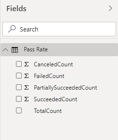

# Pipeline outcome summary sample report 

[!INCLUDE [version-gt-eq-2020](../../includes/version-gt-eq-2020.md)] 

This article shows you how to get the number of runs for different pipeline outcomes (Succeeded / Failed / Canceled / Partially Succeeded). 

[!INCLUDE [temp](includes/preview-note.md)]

An example is shown in the following image.

> [!div class="mx-imgBorder"] 
> 


[!INCLUDE [temp](includes/sample-required-reading.md)]

[!INCLUDE [temp](./includes/prerequisites-power-bi-2020.md)]

## Sample queries

#### [Power BI query](#tab/powerbi/)

[!INCLUDE [temp](includes/sample-powerbi-query.md)]

```
let
   Source = OData.Feed ("https://analytics.dev.azure.com/{organization}/{project}/_odata/v3.0-preview/PipelineRuns?"
        &"$apply=filter( "
                &"Pipeline/PipelineName eq '{pipelineName}' "
                &"and CompletedDate ge {startdate} "
                &") "
        &"/aggregate( "
        &"$count as TotalCount, "
            &"SucceededCount with sum as SucceededCount , "
                &"FailedCount with sum as FailedCount, "
                &"PartiallySucceededCount with sum as PartiallySucceededCount , "
            &"CanceledCount with sum as CanceledCount "
                &") "
    ,null, [Implementation="2.0",OmitValues = ODataOmitValues.Nulls,ODataVersion = 4]) 
in
    Source
```

#### [OData query](#tab/odata/)

[!INCLUDE [temp](includes/sample-odata-query.md)]

```
https://analytics.dev.azure.com/{organization}/{project}/_odata/v3.0-preview/PipelineRuns?
$apply=filter(
	Pipeline/PipelineName eq '{pipelineName}'
	and CompletedDate ge {startdate}
	)
/aggregate(
	$count as TotalCount,
	SucceededCount with sum as SucceededCount ,
	FailedCount with sum as FailedCount,
	PartiallySucceededCount with sum as PartiallySucceededCount ,
	CanceledCount with sum as CanceledCount
	)

```

***

### Substitution strings
[!INCLUDE [temp](includes/sample-query-substitutions.md)]

[!INCLUDE [temp](includes/sample-query-substitutions-pipelines.md)]


### Query breakdown

The following table describes each part of the query.

:::row:::
   :::column span="1":::
   **Query part**
   :::column-end:::
   :::column span="1":::
   **Description**
   :::column-end:::
:::row-end:::
---
:::row:::
   :::column span="1":::
   `$apply=filter(`
   :::column-end:::
   :::column span="1":::
   Start filter()
   :::column-end:::
:::row-end:::
:::row:::
   :::column span="1":::
   `Pipeline/PipelineName eq '{pipelinename}'`
   :::column-end:::
   :::column span="1":::
   Return pipeline runs for the specified pipeline
   :::column-end:::
:::row-end:::
:::row:::
   :::column span="1":::
   `and CompletedDate ge {startdate}`
   :::column-end:::
   :::column span="1":::
   Return pipeline runs on or after the specified date
   :::column-end:::
:::row-end:::
:::row:::
   :::column span="1":::
   `)`
   :::column-end:::
   :::column span="1":::
   Close filter()
   :::column-end:::
:::row-end:::
:::row:::
   :::column span="1":::
   `/aggregate(`
   :::column-end:::
   :::column span="1":::
   Start aggregate. For all the pipeline runs matching the above filter criteria:
   :::column-end:::
:::row-end:::
:::row:::
   :::column span="1":::
   `$count as TotalCount,`
   :::column-end:::
   :::column span="1":::
   Count the total number of runs as TotalCount
   :::column-end:::
:::row-end:::
:::row:::
   :::column span="1":::
   `SucceededCount with sum as SucceededCount ,`
   :::column-end:::
   :::column span="1":::
   Count the number of successful runs as SucceededCount
   :::column-end:::
:::row-end:::
:::row:::
   :::column span="1":::
   `FailedCount with sum as FailedCount,`
   :::column-end:::
   :::column span="1":::
   Count the number of failed runs as FailedCount
   :::column-end:::
:::row-end:::
:::row:::
   :::column span="1":::
   `PartiallySucceededCount with sum as PartiallySucceededCount ,`
   :::column-end:::
   :::column span="1":::
   Count the number of partially successful runs as PartiallySucceededCount
   :::column-end:::
:::row-end:::
:::row:::
   :::column span="1":::
   `CanceledCount with sum as CanceledCount`
   :::column-end:::
   :::column span="1":::
   Count the number of canceled runs as CanceledCount
   :::column-end:::
:::row-end:::
:::row:::
   :::column span="1":::
   `)`
   :::column-end:::
   :::column span="1":::
   Close aggregate()
   :::column-end:::
:::row-end:::

[!INCLUDE [temp](includes/query-filters-pipelines.md)]

## Power BI transforms

### Change column type

1. Change the type of column TotalCount to **Whole Number**.

    > [!div class="mx-imgBorder"] 
    > 

### Rename fields and query, then Close & Apply

When finished, you may choose to rename columns. 

1. Right-click a column header and select **Rename...**

	> [!div class="mx-imgBorder"] 
	> 

1. You also may want to rename the query from the default **Query1**, to something more meaningful. 

	> [!div class="mx-imgBorder"] 
	> 

1. Once done, choose **Close & Apply** to save the query and return to Power BI.

	> [!div class="mx-imgBorder"] 
	> 
  
  
## Create the report

Power BI shows you the fields you can report on. 

> [!NOTE]   
> The example below assumes that no one renamed any columns. 

> [!div class="mx-imgBorder"] 
> 

For a simple report, do the following steps:

1. Select Power BI Visualization **Donut Chart**. 
1. Add the field "SucceededCount" to **Values**.
    - Right-click "SucceededCount" field and ensure **Sum** is selected.
1. Add the field "FailedCount" to **Values**.
	  - Right-click "FailedCount" field and ensure **Sum** is selected.
1. Add the field "CanceledCount" to **Values**.
	  - Right-click "CanceledCount" field and ensure **Sum** is selected.
1. Add the field "PartiallySucceededCount " to **Values**.
    - Right-click "PartiallySucceededCount " field and ensure **Sum** is selected.
    
Your report should look like this. 

> [!div class="mx-imgBorder"] 
> 


[!INCLUDE [temp](includes/sample-multipleteams.md)]

## More queries

You can use the following other queries to create different but similar reports using the same steps defined previously in this article.

### Use Pipeline ID, rather than Pipeline Name

You can change your Pipeline name. To ensure that the Power BI reports don't break when a pipeline name is changed, use the pipeline ID rather than its name. You can obtain the pipeline ID  from the URL of the pipeline runs page.

`https://dev.azure.com/{organization}/{project}/_build?definitionId= **{pipelineid}**`

#### [Power BI query](#tab/powerbi/)

[!INCLUDE [temp](includes/sample-powerbi-query.md)]

```
let
   Source = OData.Feed ("https://analytics.dev.azure.com/{organization}/{project}/_odata/v3.0-preview/PipelineRuns?"
        &"$apply=filter( "
                &"PipelineId eq {pipelineId} "
                &"and CompletedDate ge {startdate} "
                &") "
        &"/aggregate( "
        &"$count as TotalCount, "
            &"SucceededCount with sum as SucceededCount , "
                &"FailedCount with sum as FailedCount, "
                &"PartiallySucceededCount with sum as PartiallySucceededCount , "
            &"CanceledCount with sum as CanceledCount "
                &") "
    ,null, [Implementation="2.0",OmitValues = ODataOmitValues.Nulls,ODataVersion = 4]) 
in
    Source
```

#### [OData query](#tab/odata/)

[!INCLUDE [temp](includes/sample-odata-query.md)]

```
https://analytics.dev.azure.com/{organization}/{project}/_odata/v3.0-preview/PipelineRuns?
$apply=filter(
    PipelineId eq {pipelineId}
    and CompletedDate ge {startdate}
    )
/aggregate(
    $count as TotalCount,
    SucceededCount with sum as SucceededCount ,
    FailedCount with sum as FailedCount,
    PartiallySucceededCount with sum as PartiallySucceededCount ,
    CanceledCount with sum as CanceledCount
)
```

***

### Filter by branch

You may want to view the outcome summary of a pipeline for a particular **branch**. To create the report, carry out the following extra steps along with what is defined previously in this article.

- Expand Branch into Branch.BranchName
- Select Power BI Visualization **Slicer** and add the field Branch.BranchName to the slicer's **Field**
- Select the pipeline from the slicer for which you need to see the outcome summary


#### [Power BI query](#tab/powerbi/)

[!INCLUDE [temp](includes/sample-powerbi-query.md)]

```
let
   Source = OData.Feed ("https://analytics.dev.azure.com/{organization}/{project}/_odata/v3.0-preview/PipelineRuns?"
        &"$apply=filter( "
                &"Pipeline/PipelineName eq '{pipelinename}' "
                &"and CompletedDate ge {startdate} "
                &") "
        &"/groupby( "
        &"(Branch/BranchName), "
            &"aggregate( "
                &"$count as TotalCount, "
                &"SucceededCount with sum as SucceededCount , "
            &"FailedCount with sum as FailedCount, "
                &"PartiallySucceededCount with sum as PartiallySucceededCount , "
            &"CanceledCount with sum as CanceledCount "
        &")) "
    ,null, [Implementation="2.0",OmitValues = ODataOmitValues.Nulls,ODataVersion = 4]) 
in
    Source
```

#### [OData query](#tab/odata/)

[!INCLUDE [temp](includes/sample-odata-query.md)]

```
https://analytics.dev.azure.com/{organization}/{project}/_odata/v3.0-preview/PipelineRuns?
$apply=filter(
    Pipeline/PipelineName eq '{pipelinename}'
    and CompletedDate ge {startdate}
    )
/groupby(
(Branch/BranchName),
aggregate(
    $count as TotalCount,
    SucceededCount with sum as SucceededCount ,
    FailedCount with sum as FailedCount,
    PartiallySucceededCount with sum as PartiallySucceededCount ,
    CanceledCount with sum as CanceledCount
    ))
```

***

### Filter by Build Reason

You may want to view the outcome summary of a pipeline for a particular **Build Reason** (Manual / BatchedCI, Pull Request, and so on) only. To create the report, follow the extra steps below along with what is defined previously in this article.

- Select Power BI Visualization **Slicer** and add the field RunReason to the slicer's **Field**
- Select the pipeline from the slicer for which you need to see the outcome summary


#### [Power BI query](#tab/powerbi/)

[!INCLUDE [temp](includes/sample-powerbi-query.md)]

```
let
   Source = OData.Feed ("https://analytics.dev.azure.com/{organization}/{project}/_odata/v3.0-preview/PipelineRuns?"
        &"$apply=filter( "
                &"Pipeline/PipelineName eq '{pipelinename}' "
                &"and CompletedDate ge {startdate} "
                &") "
        &"/groupby( "
        &"(RunReason), "
            &"aggregate( "
                &"$count as TotalCount, "
                &"SucceededCount with sum as SucceededCount , "
            &"FailedCount with sum as FailedCount, "
                &"PartiallySucceededCount with sum as PartiallySucceededCount , "
            &"CanceledCount with sum as CanceledCount "
        &")) "
    ,null, [Implementation="2.0",OmitValues = ODataOmitValues.Nulls,ODataVersion = 4]) 
in
    Source
```

#### [OData query](#tab/odata/)

[!INCLUDE [temp](includes/sample-odata-query.md)]

```
https://analytics.dev.azure.com/{organization}/{project}/_odata/v3.0-preview/PipelineRuns?
$apply=filter(
    Pipeline/PipelineName eq '{pipelinename}'
    and CompletedDate ge {startdate}
    )
/groupby(
(RunReason),
aggregate(
    $count as TotalCount,
    SucceededCount with sum as SucceededCount ,
    FailedCount with sum as FailedCount,
    PartiallySucceededCount with sum as PartiallySucceededCount ,
    CanceledCount with sum as CanceledCount
))
```

***

### Outcome summary for all project pipelines 

You may want to view the pipeline outcome summary for all project pipelines in a single report. To create the report, carry out the following extra steps along with the ones provided previously in this article.

- Expand Pipeline into Pipeline.PipelineName
- Select Power BI Visualization **Slicer** and add the field Pipeline.PipelineName to the slicer's **Field**
- Select the pipeline from the slicer for which you need to see the outcome summary.

Refer [Outcome summary for all pipelines](sample-pipelines-allpipelines.md) sample report for detailed steps. 


#### [Power BI query](#tab/powerbi/)

[!INCLUDE [temp](includes/sample-powerbi-query.md)]

```
let
   Source = OData.Feed ("https://analytics.dev.azure.com/{organization}/{project}/_odata/v3.0-preview/PipelineRuns?"
        &"$apply=filter( "
                &"CompletedDate ge {startdate} "
                &") "
                &"/groupby( "
        &"(Pipeline/PipelineName), "
        &"aggregate( "
            &"$count as TotalCount, "
                &"SucceededCount with sum as SucceededCount , "
                &"FailedCount with sum as FailedCount, "
            &"PartiallySucceededCount with sum as PartiallySucceededCount , "
                &"CanceledCount with sum as CanceledCount "
            &")) "
    ,null, [Implementation="2.0",OmitValues = ODataOmitValues.Nulls,ODataVersion = 4]) 
in
    Source
```

#### [OData query](#tab/odata/)

[!INCLUDE [temp](includes/sample-odata-query.md)]

```
https://analytics.dev.azure.com/{organization}/{project}/_odata/v3.0-preview/PipelineRuns?
$apply=filter(
    CompletedDate ge {startdate}
    )
/groupby(
(Pipeline/PipelineName),
aggregate(
    $count as TotalCount,
    SucceededCount with sum as SucceededCount ,
    FailedCount with sum as FailedCount,
    PartiallySucceededCount with sum as PartiallySucceededCount ,
    CanceledCount with sum as CanceledCount
    ))
```

*** 

## Related articles

[!INCLUDE [temp](includes/sample-related-articles-pipelines.md)]
