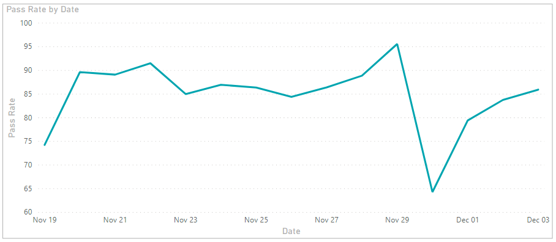
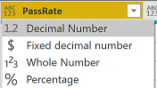
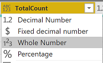
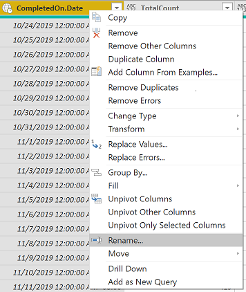

# Pipeline pass rate trend sample report 

[!INCLUDE [version-gt-eq-2020](../../includes/version-gt-eq-2020.md)] 

This article shows you how to create a report that shows a pipeline's daily pass rate trend. Pass rate of a pipeline is defined as the percentage of successful pipeline runs to the total pipeline runs. It's similar to the 'Pass rate trend' chart of the [Pipeline pass rate report](../../pipelines/reports/pipelinereport.md#pipeline-pass-rate-report).

[!INCLUDE [temp](includes/preview-note.md)]

The following image shows an example of such a trend.

> [!div class="mx-imgBorder"] 
> 

[!INCLUDE [temp](includes/sample-required-reading.md)]

[!INCLUDE [temp](./includes/prerequisites-power-bi-2020.md)]

## Sample queries

### [Power BI query](#tab/powerbi/)

[!INCLUDE [temp](includes/sample-powerbi-query.md)]

```
let
   Source = OData.Feed ("https://analytics.dev.azure.com/{organization}/{project}/_odata/v3.0-preview/PipelineRuns?"
        &"$apply=filter( "
                &"Pipeline/PipelineName eq '{pipelineName}' "
                &"and CompletedDate ge {startdate} "
                &"and CanceledCount ne 1 "
        &") "
        &"/groupby( "
            &"(CompletedOn/Date), "
                &"aggregate "
                &"($count as TotalCount, "
            &"SucceededCount with sum as SucceededCount , "
                &"FailedCount with sum as FailedCount, "
            &"PartiallySucceededCount with sum as PartiallySucceededCount)) "
        &"/compute( "
    &"SucceededCount mul 100.0 div TotalCount as PassRate, "
    &"FailedCount mul 100.0 div TotalCount as FailRate, "
    &"PartiallySucceededCount mul 100.0 div TotalCount as PartiallySuccessfulRate) "
    &"&$orderby=CompletedOn/Date asc "
    ,null, [Implementation="2.0",OmitValues = ODataOmitValues.Nulls,ODataVersion = 4]) 
in
    Source
```

### [OData query](#tab/odata/)

[!INCLUDE [temp](includes/sample-odata-query.md)]

```
https://analytics.dev.azure.com/{organization}/{project}/_odata/v3.0-preview/PipelineRuns?
$apply=filter(
	Pipeline/PipelineName eq '{pipelineName}'
	and CompletedDate ge {startdate}
	and CanceledCount ne 1
	)
/groupby(
	(CompletedOn/Date),
	aggregate
	($count as TotalCount,
	SucceededCount with sum as SucceededCount ,
	FailedCount with sum as FailedCount,
	PartiallySucceededCount with sum as PartiallySucceededCount))
/compute(
SucceededCount mul 100.0 div TotalCount as PassRate,
FailedCount mul 100.0 div TotalCount as FailRate,
PartiallySucceededCount mul 100.0 div TotalCount as PartiallySuccessfulRate)
&$orderby=CompletedOn/Date asc
```

***

### Substitution strings

[!INCLUDE [temp](includes/pipelines-sample-query-substitutions.md)]


### Query breakdown

The following table describes each part of the query.

:::row:::
   :::column span="1":::
   **Query part**
   :::column-end:::
   :::column span="1":::
   **Description**
   :::column-end:::
:::row-end:::
:::row:::
   :::column span="1":::
   `$apply=filter(`
   :::column-end:::
   :::column span="1":::
   Start filter()
   :::column-end:::
:::row-end:::
:::row:::
   :::column span="1":::
   `Pipeline/PipelineName eq '{pipelinename}'`
   :::column-end:::
   :::column span="1":::
   Return pipeline runs for the specified pipeline
   :::column-end:::
:::row-end:::
:::row:::
   :::column span="1":::
   `and CompletedDate ge {startdate}`
   :::column-end:::
   :::column span="1":::
   Return pipeline runs on or after the specified date
   :::column-end:::
:::row-end:::
:::row:::
   :::column span="1":::
   `and CanceledCount ne 1`
   :::column-end:::
   :::column span="1":::
   Omit the canceled pipeline runs
   :::column-end:::
:::row-end:::
:::row:::
   :::column span="1":::
   `)`
   :::column-end:::
   :::column span="1":::
   Close filter()
   :::column-end:::
:::row-end:::
:::row:::
   :::column span="1":::
   `/groupby(`
   :::column-end:::
   :::column span="1":::
   Start groupby()
   :::column-end:::
:::row-end:::
:::row:::
   :::column span="1":::
   `(CompletedOn/Date),`
   :::column-end:::
   :::column span="1":::
   Group by date of completion of pipeline run
   :::column-end:::
:::row-end:::
:::row:::
   :::column span="1":::
   `aggregate`
   :::column-end:::
   :::column span="1":::
   Start aggregate. For all the pipeline runs matching the above filter criteria:
   :::column-end:::
:::row-end:::
:::row:::
   :::column span="1":::
   `($count as TotalCount,`
   :::column-end:::
   :::column span="1":::
   Count the total number of runs as TotalCount
   :::column-end:::
:::row-end:::
:::row:::
   :::column span="1":::
   `SucceededCount with sum as SucceededCount ,`
   :::column-end:::
   :::column span="1":::
   Count the number of successful runs as SucceededCount
   :::column-end:::
:::row-end:::
:::row:::
   :::column span="1":::
   `FailedCount with sum as FailedCount,`
   :::column-end:::
   :::column span="1":::
   Count the number of failed runs as FailedCount
   :::column-end:::
:::row-end:::
:::row:::
   :::column span="1":::
   `PartiallySucceededCount with sum as PartiallySucceededCount))`
   :::column-end:::
   :::column span="1":::
   Count the number of partially successful runs as PartiallySucceededCount. Close aggregate() and groupby()
   :::column-end:::
:::row-end:::
:::row:::
   :::column span="1":::
   `/compute(`
   :::column-end:::
   :::column span="1":::
   Start of compute()
   :::column-end:::
:::row-end:::
:::row:::
   :::column span="1":::
   `SucceededCount mul 100.0 div TotalCount as PassRate,`
   :::column-end:::
   :::column span="1":::
   Calculate PassRate for each day by dividing number of successful runs by number of total runs
   :::column-end:::
:::row-end:::
:::row:::
   :::column span="1":::
   `FailedCount mul 100.0 div TotalCount as FailRate,`
   :::column-end:::
   :::column span="1":::
   Calculate FailRate for each day by dividing number of failed runs by number of total runs
   :::column-end:::
:::row-end:::
:::row:::
   :::column span="1":::
   `PartiallySucceededCount mul 100.0 div TotalCount as PartiallySuccessfulRate)`
   :::column-end:::
   :::column span="1":::
   Calculate PartiallySuccessfulRate for each day by dividing number of partially successful runs by number of total runs
   :::column-end:::
:::row-end:::
:::row:::
   :::column span="1":::
   `&$orderby=CompletedOn/Date asc`
   :::column-end:::
   :::column span="1":::
   Order the result in ascending order based on date of pipeline run
   :::column-end:::
:::row-end:::

[!INCLUDE [temp](includes/query-filters-pipelines.md)]


## Power BI transforms

### Expand CompletedOn column

The query returns some columns that you need to expand and flatten into its fields before you can use them in Power BI. Here in this example, such an entity is CompletedOn.

After closing the Advanced Editor and while remaining in the Power Query Editor, select the expand button on **CompletedOn**.

1. Choose the expand button

    > [!div class="mx-imgBorder"] 
    > 
    
1. Select the checkbox "(Select All Columns)" to expand

    > [!div class="mx-imgBorder"] 
    > 

1. The table now contains the expanded entity **CompletedOn.Date**

    > [!div class="mx-imgBorder"] 
    > 


### Change column type

The query doesn't return all the columns in the format in which you can directly consume them in Power BI reports. This section lists the columns whose type you have to change for creating reports.

1. Change the type of columns **PassRate, FailRate** and **PartiallySuccessfulRate** to **Decimal Number**.

    > [!div class="mx-imgBorder"] 
    > 

1. Change the type of column **TotalCount** to **Whole Number**.

    > [!div class="mx-imgBorder"] 
    > 


### Rename fields and query, then Close & Apply

When finished, you may choose to rename columns. 

1. Right-click a column header and select **Rename...**

	> [!div class="mx-imgBorder"] 
	> 
  
1. You also may want to rename the query from the default **Query1**, to something more meaningful. 

	> [!div class="mx-imgBorder"] 
	> 
  
1. Once done, choose **Close & Apply** to save the query and return to Power BI.

	> [!div class="mx-imgBorder"] 
	> 
  
  
## Create the report

Power BI shows you the fields you can report on. 

> [!NOTE]   
> The example below assumes that no one renamed any columns. 
> [!div class="mx-imgBorder"] 
> 

For a simple report, do the following steps:

1. Select Power BI Visualization **Line Chart**. 
1. Add the field **CompletedOn.Date** to **Axis**.
    - Right-click **CompletedOn.Date** and select **CompletedOn.Date**, rather than Date Hierarchy.
1. Add the field **PassRate** to **Values**.
	  - Right-click **PassRate** field and ensure **Sum** is selected.
  

Your report should look like this. 

> [!div class="mx-imgBorder"] 
> 


## More queries

You can use the following other queries to create different but similar reports using the same steps defined previously in this article.


### Use Pipeline ID, rather than Pipeline Name

You can change your Pipeline name. To ensure that the Power BI reports don't break when the pipeline name is changed, use pipeline ID rather than pipeline name. You can obtain the pipeline ID from the URL of the pipelines runs page.

`https://dev.azure.com/{organization}/{project}/_build?definitionId=**{pipelineid}**`

#### [Power BI query](#tab/powerbi/)

[!INCLUDE [temp](includes/sample-powerbi-query.md)]

```
let
   Source = OData.Feed ("https://analytics.dev.azure.com/{organization}/{project}/_odata/v3.0-preview/PipelineRuns?"
        &"$apply=filter( "
                &"PipelineId eq {pipelineId} "
                &"and CompletedDate ge {startdate} "
                &"and CanceledCount ne 1 "
        &") "
        &"/groupby( "
            &"(CompletedOn/Date), "
                &"aggregate "
                &"($count as TotalCount, "
            &"SucceededCount with sum as SucceededCount , "
                &"FailedCount with sum as FailedCount, "
            &"PartiallySucceededCount with sum as PartiallySucceededCount)) "
        &"/compute( "
    &"SucceededCount mul 100.0 div TotalCount as PassRate, "
    &"FailedCount mul 100.0 div TotalCount as FailRate, "
    &"PartiallySucceededCount mul 100.0 div TotalCount as PartiallySuccessfulRate) "
    &"&$orderby=CompletedOn/Date asc "
    ,null, [Implementation="2.0",OmitValues = ODataOmitValues.Nulls,ODataVersion = 4]) 
in
    Source
```
#### [OData query](#tab/odata/)

[!INCLUDE [temp](includes/sample-odata-query.md)]

```
https://analytics.dev.azure.com/{organization}/{project}/_odata/v3.0-preview/PipelineRuns?
$apply=filter(
	PipelineId eq {pipelineId}
	and CompletedDate ge {startdate}
	and CanceledCount ne 1
	)
/groupby(
	(CompletedOn/Date),
	aggregate
	($count as TotalCount,
	SucceededCount with sum as SucceededCount ,
	FailedCount with sum as FailedCount,
	PartiallySucceededCount with sum as PartiallySucceededCount))
/compute(
SucceededCount mul 100.0 div TotalCount as PassRate,
FailedCount mul 100.0 div TotalCount as FailRate,
PartiallySucceededCount mul 100.0 div TotalCount as PartiallySuccessfulRate)
&$orderby=CompletedOn/Date asc
```

***

### Filter by branch

You may want to view the pass rate trend of a pipeline for a particular **branch** only. To create the report, follow the extra steps below along with what is defined previously in this article.
- Expand Branch into Branch.BranchName
- Select Power BI Visualization **Slicer** and add the field Branch.BranchName to the slicer's **Field**
- Select the pipeline from the slicer for which you need to see the outcome summary

#### [Power BI query](#tab/powerbi/)

[!INCLUDE [temp](includes/sample-powerbi-query.md)]

```
let
   Source = OData.Feed ("https://analytics.dev.azure.com/{organization}/{project}/_odata/v3.0-preview/PipelineRuns?"
        &"$apply=filter( "
                &"Pipeline/PipelineName eq '{pipelineName}' "
                &"and CompletedDate ge {startdate} "
                &"and CanceledCount ne 1 "
        &") "
        &"/groupby( "
            &"(Branch/BranchName, CompletedOn/Date), "
                &"aggregate "
                &"($count as TotalCount, "
            &"SucceededCount with sum as SucceededCount , "
                &"FailedCount with sum as FailedCount, "
            &"PartiallySucceededCount with sum as PartiallySucceededCount)) "
        &"/compute( "
    &"SucceededCount mul 100.0 div TotalCount as PassRate, "
    &"FailedCount mul 100.0 div TotalCount as FailRate, "
    &"PartiallySucceededCount mul 100.0 div TotalCount as PartiallySuccessfulRate) "
    &"&$orderby=CompletedOn/Date asc "
    ,null, [Implementation="2.0",OmitValues = ODataOmitValues.Nulls,ODataVersion = 4]) 
in
    Source
```
#### [OData query](#tab/odata/)

[!INCLUDE [temp](includes/sample-odata-query.md)]

```
https://analytics.dev.azure.com/{organization}/{project}/_odata/v3.0-preview/PipelineRuns?
$apply=filter(
    Pipeline/PipelineName eq '{pipelineName}'
    and CompletedDate ge {startdate}
    and CanceledCount ne 1
    )
/groupby(
    (Branch/BranchName, CompletedOn/Date),
    aggregate
    ($count as TotalCount,
    SucceededCount with sum as SucceededCount ,
    FailedCount with sum as FailedCount,
    PartiallySucceededCount with sum as PartiallySucceededCount))
/compute(
SucceededCount mul 100.0 div TotalCount as PassRate,
FailedCount mul 100.0 div TotalCount as FailRate,
PartiallySucceededCount mul 100.0 div TotalCount as PartiallySuccessfulRate)
&$orderby=CompletedOn/Date asc
```

***

### Filter by Build Reason

You may want to view the pass rate trend of a pipeline for a particular **Build Reason** (Manual / BatchedCI, Pull Request, and so on) only. To create the report, follow these extra steps along with what is defined previously in this article.
- Select Power BI Visualization **Slicer** and add the field RunReason to the slicer's **Field**
- Select the pipeline from the slicer for which you need to see the outcome summary.

#### [Power BI query](#tab/powerbi/)

[!INCLUDE [temp](includes/sample-powerbi-query.md)]

```
let
   Source = OData.Feed ("https://analytics.dev.azure.com/{organization}/{project}/_odata/v3.0-preview/PipelineRuns?"
        &"$apply=filter( "
                &"Pipeline/PipelineName eq '{pipelineName}' "
                &"and CompletedDate ge {startdate} "
                &"and CanceledCount ne 1 "
        &") "
        &"/groupby( "
            &"(RunReason, CompletedOn/Date), "
                &"aggregate "
                &"($count as TotalCount, "
            &"SucceededCount with sum as SucceededCount , "
                &"FailedCount with sum as FailedCount, "
            &"PartiallySucceededCount with sum as PartiallySucceededCount)) "
        &"/compute( "
    &"SucceededCount mul 100.0 div TotalCount as PassRate, "
    &"FailedCount mul 100.0 div TotalCount as FailRate, "
    &"PartiallySucceededCount mul 100.0 div TotalCount as PartiallySuccessfulRate) "
    &"&$orderby=CompletedOn/Date asc "
    ,null, [Implementation="2.0",OmitValues = ODataOmitValues.Nulls,ODataVersion = 4]) 
in
    Source
```
#### [OData query](#tab/odata/)


[!INCLUDE [temp](includes/sample-odata-query.md)]
```
https://analytics.dev.azure.com/{organization}/{project}/_odata/v3.0-preview/PipelineRuns?
$apply=filter(
    Pipeline/PipelineName eq '{pipelineName}'
    and CompletedDate ge {startdate}
    and CanceledCount ne 1
    )
/groupby(
    (RunReason, CompletedOn/Date),
    aggregate
    ($count as TotalCount,
    SucceededCount with sum as SucceededCount ,
    FailedCount with sum as FailedCount,
    PartiallySucceededCount with sum as PartiallySucceededCount))
/compute(
SucceededCount mul 100.0 div TotalCount as PassRate,
FailedCount mul 100.0 div TotalCount as FailRate,
PartiallySucceededCount mul 100.0 div TotalCount as PartiallySuccessfulRate)
&$orderby=CompletedOn/Date asc
```

***

### Pass rate trend for all project pipelines

You may want to view the pass rate trend for all the pipelines of the project in a single report. To create the report, follow the extra steps below along with what is defined previously in this article.  
- Expand Pipeline into  Pipeline.PipelineName  
- Select Power BI Visualization **Slicer** and add the field Pipeline.PipelineName to the slicer's **Field**  
- Select the Build pipeline from the slicer for which you need to see the outcome summary

Refer [Outcome summary for all pipelines](sample-pipelines-allpipelines.md) sample report that has detailed similar steps as required here.

#### [Power BI query](#tab/powerbi/)

[!INCLUDE [temp](includes/sample-powerbi-query.md)]

```
let
   Source = OData.Feed ("https://analytics.dev.azure.com/{organization}/{project}/_odata/v3.0-preview/PipelineRuns?"
        &"$apply=filter( "
                &"CompletedDate ge {startdate} "
                &"and CanceledCount ne 1 "
                &") "
        &"/groupby( "
        &"(Pipeline/PipelineName, CompletedOn/Date), "
            &"aggregate "
                &"($count as TotalCount, "
                &"SucceededCount with sum as SucceededCount , "
            &"FailedCount with sum as FailedCount, "
                &"PartiallySucceededCount with sum as PartiallySucceededCount)) "
            &"/compute( "
        &"SucceededCount mul 100.0 div TotalCount as PassRate, "
    &"FailedCount mul 100.0 div TotalCount as FailRate, "
    &"PartiallySucceededCount mul 100.0 div TotalCount as PartiallySuccessfulRate) "
    &"&$orderby=CompletedOn/Date asc "
    ,null, [Implementation="2.0",OmitValues = ODataOmitValues.Nulls,ODataVersion = 4]) 
in
    Source
```
#### [OData query](#tab/odata/)

[!INCLUDE [temp](includes/sample-odata-query.md)]

```
https://analytics.dev.azure.com/{organization}/{project}/_odata/v3.0-preview/PipelineRuns?
$apply=filter(
    CompletedDate ge {startdate}
    and CanceledCount ne 1
    )
/groupby(
    (Pipeline/PipelineName, CompletedOn/Date),
    aggregate
    ($count as TotalCount,
    SucceededCount with sum as SucceededCount ,
    FailedCount with sum as FailedCount,
    PartiallySucceededCount with sum as PartiallySucceededCount))
/compute(
SucceededCount mul 100.0 div TotalCount as PassRate,
FailedCount mul 100.0 div TotalCount as FailRate,
PartiallySucceededCount mul 100.0 div TotalCount as PartiallySuccessfulRate)
&$orderby=CompletedOn/Date asc
```

***

## Full list of sample reports for Pipelines

[!INCLUDE [temp](includes/sample-full-list-pipelines.md)]

## Related articles

[!INCLUDE [temp](includes/sample-related-articles-pipelines.md)]
