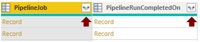
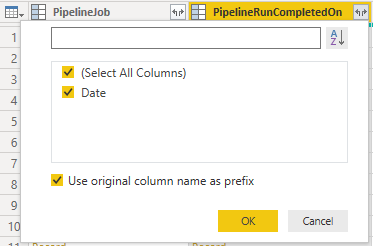
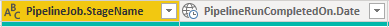
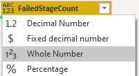
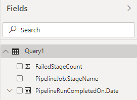

# Pipeline stage wise failures sample report 

[!INCLUDE [version-gt-eq-2020](../../includes/version-gt-eq-2020.md)] 

This article shows you how to create a report of a pipeline's daily stage failures. This report is similar to the 'Failure trend' chart of the [Pipeline pass rate report](../../pipelines/reports/pipelinereport.md#pipeline-pass-rate-report). 

[!INCLUDE [temp](includes/preview-note.md)]

The following image shows an example of such a chart.

> [!div class="mx-imgBorder"] 
> 

[!INCLUDE [temp](includes/sample-required-reading.md)]

[!INCLUDE [temp](./includes/prerequisites-power-bi-2020.md)]

## Sample queries

### [Power BI query](#tab/powerbi/)

[!INCLUDE [temp](includes/sample-powerbi-query.md)]

```
let
   Source = OData.Feed ("https://analytics.dev.azure.com/{organization}/{project}/_odata/v3.0-preview/PipelineRunActivityResults?"
        &"$apply=filter( "
                &"Pipeline/PipelineName eq '{pipelinename}' "
                &"and PipelineRunCompletedOn/Date ge {startdate} "
                &"and PipelineRunOutcome eq 'Failed' "
        &"and TaskOutcome eq 'Failed' "
        &") "
            &"/groupby( "
                &"(PipelineRunCompletedOn/Date, PipelineRunId, PipelineJob/StageName ), "
                &"aggregate (FailedCount with sum as FailedCount)) "
            &"/groupby( "
                &"(PipelineRunCompletedOn/Date, PipelineJob/StageName ), "
            &"aggregate "
        &"(cast(FailedCount gt 0, Edm.Int32) with sum as FailedStageCount)) "
    ,null, [Implementation="2.0",OmitValues = ODataOmitValues.Nulls,ODataVersion = 4]) 
in
    Source

```

### [OData query](#tab/odata/)

[!INCLUDE [temp](includes/sample-odata-query.md)]

```
https://analytics.dev.azure.com/{organization}/{project}/_odata/v3.0-preview/PipelineRunActivityResults?
$apply=filter(
    Pipeline/PipelineName eq '{pipelinename}'
    and PipelineRunCompletedOn/Date ge {startdate}
    and PipelineRunOutcome eq 'Failed'
    and TaskOutcome eq 'Failed'
    )
/groupby(
    (PipelineRunCompletedOn/Date, PipelineRunId, PipelineJob/StageName ),
    aggregate (FailedCount with sum as FailedCount))
/groupby(
    (PipelineRunCompletedOn/Date, PipelineJob/StageName ),
    aggregate
(cast(FailedCount gt 0, Edm.Int32) with sum as FailedStageCount))
```

***

### Substitution strings

[!INCLUDE [temp](includes/pipelines-sample-query-substitutions.md)]


### Query breakdown

The following table describes each part of the query.

:::row:::
   :::column span="1":::
   **Query part**
   :::column-end:::
   :::column span="1":::
   **Description**
   :::column-end:::
:::row-end:::
:::row:::
   :::column span="1":::
   `$apply=filter(`
   :::column-end:::
   :::column span="1":::
   Start filter()
   :::column-end:::
:::row-end:::
:::row:::
   :::column span="1":::
   `Pipeline/PipelineName eq '{pipelinename}'`
   :::column-end:::
   :::column span="1":::
   Return task results for a specific pipeline
   :::column-end:::
:::row-end:::
:::row:::
   :::column span="1":::
   `and PipelineRunCompletedOn/Date ge {startdate}`
   :::column-end:::
   :::column span="1":::
   Return task results for pipeline runs on or after the specified date
   :::column-end:::
:::row-end:::
:::row:::
   :::column span="1":::
   `and PipelineRunOutcome eq 'Failed'`
   :::column-end:::
   :::column span="1":::
   Return task results where build outcome is failed
   :::column-end:::
:::row-end:::
:::row:::
   :::column span="1":::
   `and TaskOutcome eq 'Failed'`
   :::column-end:::
   :::column span="1":::
   Return task results where task outcome is failed
   :::column-end:::
:::row-end:::
:::row:::
   :::column span="1":::
   `)`
   :::column-end:::
   :::column span="1":::
   Close of filter statement
   :::column-end:::
:::row-end:::
:::row:::
   :::column span="1":::
   `/groupby(`
   :::column-end:::
   :::column span="1":::
   Start groupby()
   :::column-end:::
:::row-end:::
:::row:::
   :::column span="1":::
   `(PipelineRunCompletedOn/Date, PipelineRunId, PipelineJob/StageName ),`
   :::column-end:::
   :::column span="1":::
   Group by date of completion of pipeline run, Build ID and stage name.
   :::column-end:::
:::row-end:::
:::row:::
   :::column span="1":::
   `aggregate (FailedCount with sum as FailedCount))`
   :::column-end:::
   :::column span="1":::
   For each day, build ID and Stage, count the total number of failures. It will be the total number of task failures & not stage failures
   :::column-end:::
:::row-end:::
:::row:::
   :::column span="1":::
   `/groupby(`
   :::column-end:::
   :::column span="1":::
   Start groupby()
   :::column-end:::
:::row-end:::
:::row:::
   :::column span="1":::
   `(PipelineRunCompletedOn/Date, PipelineJob/StageName ),`
   :::column-end:::
   :::column span="1":::
   Group by day and stage name.
   :::column-end:::
:::row-end:::
:::row:::
   :::column span="1":::
   `aggregate`
   :::column-end:::
   :::column span="1":::
   Start of aggregate
   :::column-end:::
:::row-end:::
:::row:::
   :::column span="1":::
   `(cast(FailedCount gt 0, Edm.Int32) with sum as FailedStageCount))`
   :::column-end:::
   :::column span="1":::
   For each day, sum the number of times a stage failed
   :::column-end:::
:::row-end:::


[!INCLUDE [temp](includes/query-filters-pipelines.md)]

## Power BI transforms

### Expand PipelineRunCompletedOn and PipelineJob column

The query returns some columns that you need to expand and flatten into its fields before you can use them in Power BI. In this example, such entities are PipelineRunCompletedOn and PipelineJob. 

After closing the Advanced Editor and while remaining in the Power Query Editor, select the expand button on both of these entities.

1. Choose the expand button.

    > [!div class="mx-imgBorder"] 
    > 
    
1. Select the checkbox "(Select All Columns)" to expand.

    > [!div class="mx-imgBorder"] 
    > 

1. The table now contains the expanded entity **CompletedOn.Date**.

    > [!div class="mx-imgBorder"] 
    > 


### Change column type

The query doesn't return all the columns in the format in which you can directly consume them in Power BI reports.

1. Change the type of column FailedStageCount to **Whole Number**.

    > [!div class="mx-imgBorder"] 
    > 
    

### Rename fields and query 

When finished, you may choose to rename columns. 

1. Right-click a column header and select **Rename...**

	> [!div class="mx-imgBorder"] 
	> 
  
1. You also may want to rename the query from the default **Query1**, to something more meaningful. 

	> [!div class="mx-imgBorder"] 
	> 
  
1. Once done, choose **Close & Apply** to save the query and return to Power BI.

	> [!div class="mx-imgBorder"] 
	> 
  
  
## Create the report

Power BI shows you the fields you can report on. 

> [!NOTE]   
> The example below assumes that no one renamed any columns. 

> [!div class="mx-imgBorder"] 
> 

For a simple report, do the following steps:

1. Select Power BI Visualization **Stacked column chart**. 

1. Add the field **PipelineRunCompletedOn.Date** to **Axis**.
    - Right-click **PipelineRunCompletedOn.Date** and select **PipelineRunCompletedOn.Date**, rather than Date Hierarchy.
	
1. Add the field **FailedStageCount** to **Values**.
	  - Right-click **FailedStageCount** field and ensure **Sum** is selected.

1. Add the field **PipelineJob.StageName** to **Legend**.
	  - Right-click **PipelineJob.StageName** field and ensure **Sum** is selected.
  

Your report should look similar to the following image. 

> [!div class="mx-imgBorder"] 
> 


## More queries

You can use the following extra queries to create different but similar reports using the same steps defined previously in this article.


### Task wise failure trend, rather than Stage wise failure trend

You may want to view the task wise failure trend, rather than stage wise failure trend.

#### [Power BI query](#tab/powerbi/)
[!INCLUDE [temp](includes/sample-powerbi-query.md)]
```
let
   Source = OData.Feed ("https://analytics.dev.azure.com/{organization}/{project}/_odata/v3.0-preview/PipelineRunActivityResults?"
        &"$apply=filter( "
                &"Pipeline/PipelineName eq '{pipelinename}' "
                &"and PipelineRunCompletedOn/Date ge {startdate} "
                &"and PipelineRunOutcome eq 'Failed' "
        &"and TaskOutcome eq 'Failed' "
        &") "
            &"/groupby( "
                &"(PipelineRunCompletedOn/Date, TaskDisplayName), "
                &"aggregate "
            &"(FailedCount with sum as FailedCount)) "
    ,null, [Implementation="2.0",OmitValues = ODataOmitValues.Nulls,ODataVersion = 4]) 
in
    Source
```
#### [OData query](#tab/odata/)
[!INCLUDE [temp](includes/sample-odata-query.md)]
```
https://analytics.dev.azure.com/{organization}/{project}/_odata/v3.0-preview/PipelineRunActivityResults?
$apply=filter(
    Pipeline/PipelineName eq '{pipelinename}'
    and PipelineRunCompletedOn/Date ge {startdate}
    and PipelineRunOutcome eq 'Failed'
    and TaskOutcome eq 'Failed'
    )
/groupby(
    (PipelineRunCompletedOn/Date, TaskDisplayName),
    aggregate
(FailedCount with sum as FailedCount))
```

***

### Job wise failure trend, rather than Stage wise failure trend

You may want to view the job wise failure trend, rather than stage wise failure trend.

#### [Power BI query](#tab/powerbi/)

[!INCLUDE [temp](includes/sample-powerbi-query.md)]

```
let
   Source = OData.Feed ("https://analytics.dev.azure.com/{organization}/{project}/_odata/v3.0-preview/PipelineRunActivityResults?"
        &"$apply=filter( "
                &"Pipeline/PipelineName eq '{pipelinename}' "
                &"and PipelineRunCompletedOn/Date ge {startdate} "
                &"and PipelineRunOutcome eq 'Failed' "
        &"and TaskOutcome eq 'Failed' "
        &") "
            &"/groupby( "
                &"(PipelineRunCompletedOn/Date, PipelineRunId, PipelineJob/JobName ), "
                &"aggregate (FailedCount with sum as FailedCount)) "
            &"/groupby( "
                &"(PipelineRunCompletedOn/Date, PipelineJob/JobName ), "
            &"aggregate "
        &"(cast(FailedCount gt 0, Edm.Int32) with sum as FailedJobCount)) "
    ,null, [Implementation="2.0",OmitValues = ODataOmitValues.Nulls,ODataVersion = 4]) 
in
    Source
```
#### [OData query](#tab/odata/)

[!INCLUDE [temp](includes/sample-odata-query.md)]

```
https://analytics.dev.azure.com/{organization}/{project}/_odata/v3.0-preview/PipelineRunActivityResults?
$apply=filter(
    Pipeline/PipelineName eq '{pipelinename}'
    and PipelineRunCompletedOn/Date ge {startdate}
    and PipelineRunOutcome eq 'Failed'
    and TaskOutcome eq 'Failed'
    )
/groupby(
    (PipelineRunCompletedOn/Date, PipelineRunId, PipelineJob/JobName ),
    aggregate (FailedCount with sum as FailedCount))
/groupby(
    (PipelineRunCompletedOn/Date, PipelineJob/JobName ),
    aggregate
(cast(FailedCount gt 0, Edm.Int32) with sum as FailedJobCount))
```

***

## Full list of sample reports for Pipelines

[!INCLUDE [temp](includes/sample-full-list-pipelines.md)]

## Related articles

[!INCLUDE [temp](includes/sample-related-articles-pipelines.md)]
