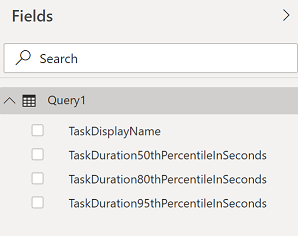
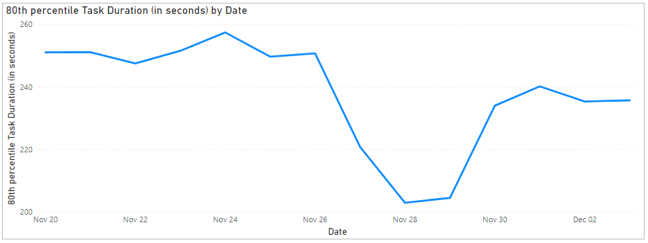

# Pipeline task duration sample report 

[!INCLUDE [version-gt-eq-2020](../../includes/version-gt-eq-2020.md)] 

This article shows you how to get the time taken to execute different tasks of a pipeline. 

[!INCLUDE [temp](includes/preview-note.md)]

An example is shown in the following image.


> [!div class="mx-imgBorder"] 
> 

[!INCLUDE [temp](includes/sample-required-reading.md)]

[!INCLUDE [temp](./includes/prerequisites-power-bi-2020.md)]

## Sample queries

### [Power BI query](#tab/powerbi/)

[!INCLUDE [temp](includes/sample-powerbi-query.md)]

```
let
   Source = OData.Feed ("https://analytics.dev.azure.com/{organization}/{project}/_odata/v3.0-preview/PipelineRunActivityResults?"
        &"$apply=filter( "
                &"Pipeline/PipelineName eq '{pipelinename}' "
                &"and PipelineRunCompletedOn/Date ge {startdate} "
                &"and (PipelineRunOutcome eq 'Succeed' or PipelineRunOutcome eq 'PartiallySucceeded') "
        &"and (CanceledCount ne 1 and SkippedCount ne 1 and AbandonedCount ne 1) "
        &") "
            &"/compute( "
                &"percentile_cont(ActivityDurationSeconds, 0.5, TaskDisplayName) as TaskDuration50thPercentileInSeconds, "
                &"percentile_cont(ActivityDurationSeconds, 0.8, TaskDisplayName) as TaskDuration80thPercentileInSeconds, "
            &"percentile_cont(ActivityDurationSeconds, 0.95, TaskDisplayName) as TaskDuration95thPercentileInSeconds) "
                &"/groupby( "
            &"(TaskDuration50thPercentileInSeconds, TaskDuration80thPercentileInSeconds,TaskDuration95thPercentileInSeconds, TaskDisplayName)) "
        &"&$orderby=TaskDuration50thPercentileInSeconds desc "
    ,null, [Implementation="2.0",OmitValues = ODataOmitValues.Nulls,ODataVersion = 4]) 
in
    Source
```

### [OData query](#tab/odata/)

[!INCLUDE [temp](includes/sample-odata-query.md)]

```
https://analytics.dev.azure.com/{organization}/{project}/_odata/v3.0-preview/PipelineRunActivityResults?
$apply=filter(
    Pipeline/PipelineName eq '{pipelinename}'
    and PipelineRunCompletedOn/Date ge {startdate}
    and (PipelineRunOutcome eq 'Succeed' or PipelineRunOutcome eq 'PartiallySucceeded')
    and (CanceledCount ne 1 and SkippedCount ne 1 and AbandonedCount ne 1)
    )
/compute(
    percentile_cont(ActivityDurationSeconds, 0.5, TaskDisplayName) as TaskDuration50thPercentileInSeconds,
    percentile_cont(ActivityDurationSeconds, 0.8, TaskDisplayName) as TaskDuration80thPercentileInSeconds,
    percentile_cont(ActivityDurationSeconds, 0.95, TaskDisplayName) as TaskDuration95thPercentileInSeconds)
/groupby(
    (TaskDuration50thPercentileInSeconds, TaskDuration80thPercentileInSeconds,TaskDuration95thPercentileInSeconds, TaskDisplayName))
&$orderby=TaskDuration50thPercentileInSeconds desc
```

***

### Substitution strings

[!INCLUDE [temp](includes/pipelines-sample-query-substitutions.md)]

### Query breakdown

The following table describes each part of the query.

:::row:::
   :::column span="1":::
   **Query part**
   :::column-end:::
   :::column span="1":::
   **Description**
   :::column-end:::
:::row-end:::
:::row:::
   :::column span="1":::
   `$apply=filter(`
   :::column-end:::
   :::column span="1":::
   Start filter()
   :::column-end:::
:::row-end:::
:::row:::
   :::column span="1":::
   `Pipeline/PipelineName eq '{pipelinename}'`
   :::column-end:::
   :::column span="1":::
   Return pipeline runs for the specified pipeline
   :::column-end:::
:::row-end:::
:::row:::
   :::column span="1":::
   `and PipelineRunCompletedOn/Date ge {startdate}`
   :::column-end:::
   :::column span="1":::
   Return task results for pipeline runs on or after the specified date
   :::column-end:::
:::row-end:::
:::row:::
   :::column span="1":::
   `and (PipelineRunOutcome eq 'Succeed' or PipelineRunOutcome eq 'PartiallySucceeded')`
   :::column-end:::
   :::column span="1":::
   Return task results from only the successful or partially successful pipeline runs
   :::column-end:::
:::row-end:::
:::row:::
   :::column span="1":::
   `and (CanceledCount ne 1 and SkippedCount ne 1 and AbandonedCount ne 1)`
   :::column-end:::
   :::column span="1":::
   Omit the pipeline runs that were canceled, skipper or abandoned
   :::column-end:::
:::row-end:::
:::row:::
   :::column span="1":::
   `)`
   :::column-end:::
   :::column span="1":::
   Close filter()
   :::column-end:::
:::row-end:::
:::row:::
   :::column span="1":::
   `/compute(`
   :::column-end:::
   :::column span="1":::
   Start compute()
   :::column-end:::
:::row-end:::
:::row:::
   :::column span="1":::
   `percentile_cont(ActivityDurationSeconds, 0.5, TaskDisplayName) as TaskDuration50thPercentileInSeconds,`
   :::column-end:::
   :::column span="1":::
   For each task, compute the 50th percentile of task durations of all tasks that match the filter criteria
   :::column-end:::
:::row-end:::
:::row:::
   :::column span="1":::
   `percentile_cont(ActivityDurationSeconds, 0.8, TaskDisplayName) as TaskDuration80thPercentileInSeconds,`
   :::column-end:::
   :::column span="1":::
   For each task, compute the 80th percentile of task durations of all tasks that match the filter criteria
   :::column-end:::
:::row-end:::
:::row:::
   :::column span="1":::
   `percentile_cont(ActivityDurationSeconds, 0.95, TaskDisplayName) as TaskDuration95thPercentileInSeconds)`
   :::column-end:::
   :::column span="1":::
   For each task, compute the 95th percentile of task durations of all tasks that match the filter criteria
   :::column-end:::
:::row-end:::
:::row:::
   :::column span="1":::
   `/groupby(`
   :::column-end:::
   :::column span="1":::
   Start groupby()
   :::column-end:::
:::row-end:::
:::row:::
   :::column span="1":::
   `(TaskDuration50thPercentileInSeconds, TaskDuration80thPercentileInSeconds,TaskDuration95thPercentileInSeconds, TaskDisplayName))`
   :::column-end:::
   :::column span="1":::
   Group by task of pipeline run and calculated day wise 50th percentile task duration, 80th percentile task duration and 95th percentile task duration
   :::column-end:::
:::row-end:::
:::row:::
   :::column span="1":::
   `&$orderby=TaskDuration50thPercentileInSeconds desc`
   :::column-end:::
   :::column span="1":::
   Order the response by task having highest 50th percentile duration
   :::column-end:::
:::row-end:::


[!INCLUDE [temp](includes/query-filters-pipelines.md)]

## Power BI transforms

### Change column type

The query doesn't return all the columns in the format in which you can directly consume them in Power BI reports.

1. Change the type of column **TaskDuration80thPercentileInSeconds, TaskDuration80thPercentileInSeconds** and **TaskDuration95thPercentileInSeconds** to **Decimal Number**.

    > [!div class="mx-imgBorder"] 
    > 


### Rename fields and query

When finished, you may choose to rename columns. 

1. Right-click a column header and select **Rename...**

	> [!div class="mx-imgBorder"] 
	> 
  
1. You also may want to rename the query from the default **Query1**, to something more meaningful. 

	> [!div class="mx-imgBorder"] 
	> 
  
1. Once done, choose **Close & Apply** to save the query and return to Power BI.

	> [!div class="mx-imgBorder"] 
	> 
  
  
## Create the report

Power BI shows you the fields you can report on. 

> [!NOTE]   
> The example below assumes that no one renamed any columns. 
> [!div class="mx-imgBorder"] 
> 

For a simple report, do the following steps:

1. Select Power BI Visualization **Line Chart**.

1. Add the field **BuildCompletedOn.Date** to **Axis**.

    - Right-click **BuildCompletedOn.Date** and select **BuildCompletedOn.Date**, rather than Date Hierarchy.
	
1. Add the field **TaskDuration80thPercentileInSeconds** to **Values**.

    - Right-click **TaskDuration80thPercentileInSeconds** field and ensure **Sum** is selected.

Your report should look similar to the following image. 

> [!div class="mx-imgBorder"] 
> 


## Full list of sample reports for Pipelines

[!INCLUDE [temp](includes/sample-full-list-pipelines.md)]

## Related articles

[!INCLUDE [temp](includes/sample-related-articles-pipelines.md)]

