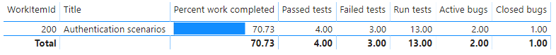

# Requirements tracking rollup sample report

[!INCLUDE [temp](../includes/version-azure-devops.md)]

This report builds on the [Requirements tracking report](sample-stories-overview.md) report and does a one level roll-up to provide aggregated metrics. For example, if you are tracking requirements with User Stories, you can have a one-level roll up (up to Features) with the queries provided in this section.

[!INCLUDE [temp](includes/preview-note.md)]

An example is shown in the following image. 

> [!div class="mx-imgBorder"] 
> 

> [!NOTE] 
> Requirement tracking is supported only for test cases linked through a [**Requirement-based test suite**](../../test/create-a-test-plan.md#backlog). The association between a requirement work item&mdash;User Story ([Agile](../../boards/work-items/guidance/agile-process.md)), Product Backlog Item ([Scrum](../../boards/work-items/guidance/scrum-process.md)), Requirement ([CMMI](../../boards/work-items/guidance/cmmi-process.md)), or Issue ([Basic](../../boards/get-started/plan-track-work.md)) and manual test execution is only formed when the test case is linked via a **Requirement-based test suite**. 

[!INCLUDE [stories-overview-info](includes/sample-stories-overview-info.md)]

[!INCLUDE [stories-overview-prereqs](includes/sample-stories-overview-prereqs.md)]


## Sample queries

### Query area and iteration paths

In order to scope your report to a particular Area and Iteration path, you can query them as described in [Query your work tracking data using OData Analytics](../extend-analytics/wit-analytics.md#query-a-single-entity-set) and use AreaSK and IterationSK values of interest to supply to the other queries provided in the sections provided later in this article.

### Query for percentage of hours completion for requirements

> [!NOTE]   
> Change the `WorkItemType` based on the process you are using. The Scrum template supports **Feature** and the Basic template supports **Epic** as the roll up work item type, respectively.

#### [Power BI query](#tab/powerbi/)

[!INCLUDE [temp](includes/sample-powerbi-query.md)]

```
let
    Source = OData.Feed("https://analytics.dev.azure.com/{organization}/{project}/_odata/v3.0-preview/WorkItems? 
$filter=( 
    IterationSK eq {iterationSK}
    and AreaSK eq {areaSK}
    and WorkItemType eq 'Feature'
)
&$expand=Descendants( 
    $apply=filter( CompletedWork ne null or RemainingWork ne null ) 
    /aggregate( 
        iif(CompletedWork ne null, CompletedWork, 0) with sum as SumCompletedWork, 
        iif(RemainingWork ne null, RemainingWork, 0) with sum as SumRemainingWork 
    ) 
    /compute( 
        (SumCompletedWork add SumRemainingWork) as TotalWork, 
        SumCompletedWork as SumCompleted 
    ) 
    /compute( 
        iif(TotalWork gt 0,(SumCompleted div cast(TotalWork, Edm.Double) mul 100), 0) as PercCompletedWork 
    ) 
)
&$select=WorkItemId, Title", null, [Implementation="2.0"]),
    #"Expanded Descendants" = Table.ExpandTableColumn(Source, "Descendants", {"SumCompletedWork", "SumRemainingWork", "TotalWork", "SumCompleted", "PercCompletedWork"}, {"Descendants.SumCompletedWork", "Descendants.SumRemainingWork", "Descendants.TotalWork", "Descendants.SumCompleted", "Descendants.PercCompletedWork"}),
    #"Changed Type" = Table.TransformColumnTypes(#"Expanded Descendants",{{"Descendants.SumCompletedWork", type number}, {"Descendants.SumRemainingWork", type number}, {"Descendants.TotalWork", type number}, {"Descendants.SumCompleted", type number}, {"Descendants.PercCompletedWork", type number}})
in
    #"Changed Type"
```

#### [OData query](#tab/odata/)

[!INCLUDE [temp](includes/sample-odata-query.md)]

```
https://analytics.dev.azure.com/{organization}/{project}/_odata/v3.0-preview/WorkItems? 
$filter=( 
    IterationSK eq {iterationSK}
    and AreaSK eq {areaSK}
    and WorkItemType eq 'Feature'
)
&$expand=Descendants( 
    $apply=filter( CompletedWork ne null or RemainingWork ne null ) 
    /aggregate( 
        iif(CompletedWork ne null, CompletedWork, 0) with sum as SumCompletedWork, 
        iif(RemainingWork ne null, RemainingWork, 0) with sum as SumRemainingWork 
    ) 
    /compute( 
        (SumCompletedWork add SumRemainingWork) as TotalWork, 
        SumCompletedWork as SumCompleted 
    ) 
    /compute( 
        iif(TotalWork gt 0,(SumCompleted div cast(TotalWork, Edm.Double) mul 100), 0) as PercCompletedWork 
    ) 
)
&$select=WorkItemId, Title
```

***

### Query for test execution status of requirements

#### [Power BI query](#tab/powerbi/)

[!INCLUDE [temp](includes/sample-powerbi-query.md)]

```
let
    Source = OData.Feed("https://analytics.dev.azure.com/{organization}/{project}/_odata/v3.0-preview/TestPoints? 
	$apply=filter(
	    (TestSuite/RequirementWorkItem/IterationSK eq {iterationSK}
    and TestSuite/RequirementWorkItem/AreaSK eq {areaSK}
    and TestSuite/RequirementWorkItem/Processes/any(p:p/BacklogType eq 'RequirementBacklog')
    and TestSuite/RequirementWorkItem/Processes/all(p:p/IsBugType eq false)
	))
	/compute(iif(TestSuite/RequirementWorkItem/Parent ne null, TestSuite/RequirementWorkItem/Parent/WorkItemId, 0) as ParentWorkItemId, 
	iif(TestSuite/RequirementWorkItem/Parent ne null, TestSuite/RequirementWorkItem/Parent/Title, 'Unparented') as ParentWorkItemTitle
	)/groupby(
	    (ParentWorkItemId, ParentWorkItemTitle), 
	    aggregate(
	        $count as TotalCount, 
	        cast(LastResultOutcome eq 'Passed', Edm.Int32) with sum as PassedCount, 
	        cast(LastResultOutcome eq 'Failed', Edm.Int32) with sum as FailedCount, 
            cast(LastResultOutcome eq 'Blocked', Edm.Int32) with sum as BlockedCount,
            cast(LastResultOutcome eq 'NotApplicable', Edm.Int32) with sum as NotApplicableCount,
	        cast(LastResultOutcome eq 'None', Edm.Int32) with sum as NotRunCount, 
	        cast(LastResultOutcome ne 'None', Edm.Int32) with sum as RunCount)
)", null, [Implementation="2.0"]),
    #"Changed Type" = Table.TransformColumnTypes(#"Source",{{"TotalCount", type number}, {"PassedCount", type number}, {"FailedCount", type number}, {"BlockedCount", type number}, {"NotApplicableCount", type number}, {"NotRunCount", type number}, {"RunCount", type number}})
in
    #"Changed Type"
```

#### [OData query](#tab/odata/)

[!INCLUDE [temp](includes/sample-odata-query.md)]

```
https://analytics.dev.azure.com/{organization}/{project}/_odata/v3.0-preview/TestPoints? 
$apply=filter(
    (TestSuite/RequirementWorkItem/IterationSK eq {iterationSK}
and TestSuite/RequirementWorkItem/AreaSK eq {areaSK}
and TestSuite/RequirementWorkItem/Processes/any(p:p/BacklogType eq 'RequirementBacklog')
and TestSuite/RequirementWorkItem/Processes/all(p:p/IsBugType eq false)
))
/compute(iif(TestSuite/RequirementWorkItem/Parent ne null, TestSuite/RequirementWorkItem/Parent/WorkItemId, 0) as ParentWorkItemId, 
iif(TestSuite/RequirementWorkItem/Parent ne null, TestSuite/RequirementWorkItem/Parent/Title, 'Unparented') as ParentWorkItemTitle
)/groupby(
    (ParentWorkItemId, ParentWorkItemTitle), 
    aggregate(
        $count as TotalCount, 
        cast(LastResultOutcome eq 'Passed', Edm.Int32) with sum as PassedCount, 
        cast(LastResultOutcome eq 'Failed', Edm.Int32) with sum as FailedCount, 
        cast(LastResultOutcome eq 'Blocked', Edm.Int32) with sum as BlockedCount,
        cast(LastResultOutcome eq 'NotApplicable', Edm.Int32) with sum as NotApplicableCount,
        cast(LastResultOutcome eq 'None', Edm.Int32) with sum as NotRunCount, 
        cast(LastResultOutcome ne 'None', Edm.Int32) with sum as RunCount
    )
)
```

***

  

[!INCLUDE [temp](includes/note-test-suites-requirements.md)]  


### Query for status of bugs linked to the requirements

> [!NOTE]   
> Change the `WorkItemType` based on the process you are using. The Scrum template supports **Feature** and the Basic template supports **Epic** as the roll up work item type, respectively.

#### [Power BI query](#tab/powerbi/)

[!INCLUDE [temp](includes/sample-powerbi-query.md)]

```
let
    Source = OData.Feed("https://analytics.dev.azure.com/{organization}/{project}/_odata/v3.0-preview/WorkItems?
    $filter=(
        IterationSK eq {iterationSK}
        and AreaSK eq {areaSK}
        and WorkItemType eq 'Feature'
    )
&$expand=Descendants(
    $apply=filter(
        WorkItemType eq 'Bug'
    )
    /groupby(
        (State),
        aggregate($count as Count)
    )
)
&$select=WorkItemId,Title", null, [Implementation="2.0"]),
    #"Expanded Descendants" = Table.ExpandTableColumn(Source, "Descendants", {"State", "Count"}, {"Descendants.State", "Descendants.Count"}),
    #"Filtered Rows" = Table.SelectRows(#"Expanded Descendants", each [Descendants.Count] <> null and [Descendants.Count] <> ""),
    #"Pivoted Column" = Table.Pivot(#"Filtered Rows", List.Distinct(#"Filtered Rows"[Descendants.State]), "Descendants.State", "Descendants.Count", List.Sum),
    #"Changed Type" = Table.TransformColumnTypes(#"Pivoted Column",{{"Active", type number}, {"Closed", type number}})
in
    #"Changed Type"
```

#### [OData query](#tab/odata/)

[!INCLUDE [temp](includes/sample-odata-query.md)]

```
https://analytics.dev.azure.com/{organization}/{project}/_odata/v3.0-preview/WorkItems?
    $filter=(
        IterationSK eq {iterationSK}
        and AreaSK eq {areaSK}
        and WorkItemType eq 'Feature'
    )
&$expand=Descendants(
    $apply=filter(
        WorkItemType eq 'Bug'
    )
    /groupby(
        (State),
        aggregate($count as Count)
    )
)
&$select=WorkItemId,Title
```

***


[!INCLUDE [stories-overview-substitutions-breakdown](includes/sample-stories-overview-sub-breakdown.md)]


## Power BI transforms

The transforms applied to Power BI queries are already added in query snippets.


## Create the report

Power BI shows you the fields you can report on. 

> [!NOTE]   
> The following example assumes that no one renamed any columns. 

To create the report, perform the following steps:

1. From the **Modeling** tab, choose **Manage Relationships** and link the three query results by WorkItemId column. 
1. Create a Power BI visualization **Table**.
1. Add the columns you are interested in from the three Power BI queries.
1. Select **Sum** as aggregation for additive columns like **Passed tests** etc.
    > [!div class="mx-imgBorder"] 
    > 

Here, **Authentication scenarios** is a parent feature of two User Stories.

> [!div class="mx-imgBorder"] 
> 

## Related articles

[!INCLUDE [temp](includes/sample-relatedarticles.md)]
