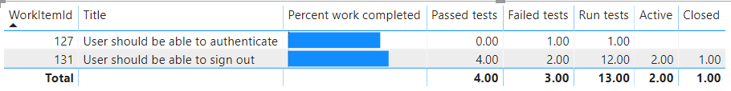

# Sample: Requirements tracking report

[!INCLUDE [temp](../_shared/version-azure-devops.md)]

This article provides instructions on how to track the quality of work items that belong to the Requirements category. This includes work items such as User Stories (Agile), Product Backlog Items (Scrum) and Requirements (CMMI). 

An example is shown in the following image. 

> [!div class="mx-imgBorder"] 
> 

This report displays the following information for each requirement that it lists:

- **Percent work completed**:  Progress bar that shows the percentage of completed work based on the rollup of completed hours for all tasks that are linked to the requirement.
- **Passed tests**: The number of test cases run that have passed based on the most recent test run.  
- **Failed tests**: The number of test cases run that have failed based on the most recent test run. 
- **Run tests**:  The number of test runs that have executed.  
- **Active bugs**: The number of linked bugs in an Active state. 
- **Closed bugs**: The number of linked bugs in a  Closed, Done, or Completed state. 

## Questions the report answers

Requirements tracking reports are useful for answering the following types of questions.

**Work Progress**
- *Does the amount of work that remains for each requirement correspond to your expectations?*
- *Are top-ranked requirements being implemented first?*
- *How many tests are defined for each requirement? How many tests are passing?*
- *What requirements are being implemented that have no test cases defined for them?*

**Quality Progress**
- *How many test cases have run for each requirement, and how many have passed?*
- *How many active bugs does each requirement have?*
- *Are bugs being found for requirements that are being tested?*
- *Are bugs being resolved or are they remaining active?*

**Risk Assessment**
- *Which requirements are at risk?*
- *Which requirements aren't sufficiently stable for release?*
- *Which requirements can we ship today?*

## Prerequisites

For the report to generate useful data, you need to have performed the following tasks: 

- You have define requirement work items and assigned them to the area and iteration paths of interest. For information about how to define area and iteration paths, see [Define area paths](../../organizations/settings/set-area-paths.md) and [Define iteration paths](../../organizations/settings/set-iteration-paths-sprints.md).
- To get the percentage of hours completion, you need to fill in the [Complete Work](../../boards/queries/query-numeric.md#completed-work) and [Remaining Work](../../boards/queries/query-numeric.md#remaining-work) fields of tasks or bugs linked to requirements with the **Child** link type. 
- To get the execution status of test cases, you will have created requirement-based test suites in Test Plans corresponding to those requirements. To learn more, see [Create test plans and test suites](../../test/create-a-test-plan.md).
- To get the status of bugs, you will have created and linked bugs to requirements with the **Child** link type.

[!INCLUDE [temp](_shared/sample-required-reading.md)]


## Substitution strings

[!INCLUDE [temp](_shared/sample-query-substitutions.md)]

- {iterationSK} - Iteration SK of the iteration path you are interested in.
- {areaSK} - Area SK of the area path you are interested in.


## Query breakdown

The following table describes each part of the query.

<table>
<tbody valign="top">
<tr><td width="50%"><b>Query part</b></td><td><b>Description</b></td><tr>
<tr><td width="50%"><code>Processes/any(p:p/BacklogType eq 'RequirementBacklog')</code></td><td>Filter the work items in such a way that they should fall in 'requirements' category for at least one process associated with them.</td><tr>
<tr><td><code>Processes/all(p:p/IsBugType eq false)</code></td><td>Omit the bug type work items while getting requirements.</td><tr>
</tbody>
</table>


## Sample queries

### Query Area and Iteration paths

In order to scope your report to a particular Area and Iteration path, you can query them as described in [Query your work tracking data using OData Analytics](../extend-analytics/wit-analytics.md#query-a-single-entity-set) and use AreaSK and IterationSK values of interest to supply to the other queries provided in the sections provided later in this article.

### Query for percentage of hours completion for requirements

#### [Power BI Query](#tab/powerbi/)

[!INCLUDE [temp](_shared/sample-powerbi-query.md)]

```
let
    Source = OData.Feed("https://analytics.dev.azure.com/{organization}/{project}/_odata/v3.0-preview/WorkItems? 
    $filter=(
        IterationSK eq {iterationSK}
        and AreaSK eq {areaSK}
        and Processes/any(p:p/BacklogType eq 'RequirementBacklog') 
        and Processes/all(p:p/IsBugType eq false)
    )
    &$expand=Descendants(
        $apply=filter(
            CompletedWork ne null 
            or RemainingWork ne null
        )
        /aggregate(
            iif(CompletedWork ne null, CompletedWork, 0) with sum as SumCompletedWork, 
            iif(RemainingWork ne null, RemainingWork, 0) with sum as SumRemainingWork
        )/compute(
            (SumCompletedWork add SumRemainingWork) as TotalWork, 
            SumCompletedWork as SumCompleted
        )/compute(
            iif(TotalWork gt 0,(SumCompleted div cast(TotalWork, Edm.Double) mul 100), 0) as PercCompletedWork
        )
)&$select=WorkItemId, Title", null, [Implementation="2.0"]),
    #"Expanded Descendants" = Table.ExpandTableColumn(Source, "Descendants", {"SumCompletedWork", "SumRemainingWork", "TotalWork", "SumCompleted", "PercCompletedWork"}, {"Descendants.SumCompletedWork", "Descendants.SumRemainingWork", "Descendants.TotalWork", "Descendants.SumCompleted", "Descendants.PercCompletedWork"}),
    #"Changed Type" = Table.TransformColumnTypes(#"Expanded Descendants",{{"Descendants.SumCompletedWork", type number}, {"Descendants.SumRemainingWork", type number}, {"Descendants.TotalWork", type number}, {"Descendants.SumCompleted", type number}, {"Descendants.PercCompletedWork", type number}})
in
    #"Changed Type"
```

#### [OData Query](#tab/odata/)

[!INCLUDE [temp](_shared/sample-odata-query.md)]

```
https://analytics.dev.azure.com/{organization}/{project}/_odata/v3.0-preview/WorkItems? 
$filter=(
    IterationSK eq {iterationSK}
    and AreaSK eq {areaSK}
    and Processes/any(p:p/BacklogType eq 'RequirementBacklog') 
    and Processes/all(p:p/IsBugType eq false)
)
&$expand=Descendants(
    $apply=filter(
        CompletedWork ne null 
        or RemainingWork ne null
    )
    /aggregate(
        iif(CompletedWork ne null, CompletedWork, 0) with sum as SumCompletedWork, 
        iif(RemainingWork ne null, RemainingWork, 0) with sum as SumRemainingWork
    )
    /compute(
        (SumCompletedWork add SumRemainingWork) as TotalWork, 
        SumCompletedWork as SumCompleted
    )
    /compute(
        iif(TotalWork gt 0,(SumCompleted div cast(TotalWork, Edm.Double) mul 100), 0) as PercCompletedWork
    )
)&$select=WorkItemId, Title
```

***

### Query for test execution status of requirements

#### [Power BI Query](#tab/powerbi/)

[!INCLUDE [temp](_shared/sample-powerbi-query.md)]

```
let 
    Source = OData.Feed ("https://analytics.dev.azure.com/{organization}/{project}/_odata/v3.0-preview/TestPoints? 
    $apply=filter(
        (TestSuite/RequirementWorkItem/IterationSK eq {iterationSK} 
        and TestSuite/RequirementWorkItem/AreaSK eq {areaSK}
        and TestSuite/RequirementWorkItem/Processes/any(p:p/BacklogType eq 'RequirementBacklog') 
        and TestSuite/RequirementWorkItem/Processes/all(p:p/IsBugType eq false)
        )
    )
    /compute(TestSuite/RequirementWorkItem/WorkItemId as WorkItemId, TestSuite/RequirementWorkItem/Title as WorkItemTitle)
    /groupby(
        (WorkItemId, WorkItemTitle),
        aggregate(
            $count as TotalCount, 
            cast(LastResultOutcome eq 'Passed', Edm.Int32) with sum as PassedCount, 
            cast(LastResultOutcome eq 'Failed', Edm.Int32) with sum as FailedCount, 
            cast(LastResultOutcome eq 'Blocked', Edm.Int32) with sum as BlockedCount,
            cast(LastResultOutcome eq 'NotApplicable', Edm.Int32) with sum as NotApplicableCount,
            cast(LastResultOutcome eq 'None', Edm.Int32) with sum as NotRunCount, 
            cast(LastResultOutcome ne 'None', Edm.Int32) with sum as RunCount)
)", null, [Implementation="2.0"]),
    #"Changed Type" = Table.TransformColumnTypes(Source,{{"TotalCount", type number}, {"PassedCount", type number}, {"FailedCount", type number}, {"BlockedCount",type number}, {"NotApplicableCount", type number}, {"NotRunCount", type number}, {"RunCount", type number}})
in
    #"Changed Type"
```

#### [OData Query](#tab/odata/)

[!INCLUDE [temp](_shared/sample-odata-query.md)]

```
https://analytics.dev.azure.com/{organization}/{project}/_odata/v3.0-preview/TestPoints? 
$apply=filter(
    (TestSuite/RequirementWorkItem/IterationSK eq {iterationSK} 
    and TestSuite/RequirementWorkItem/AreaSK eq {areaSK}
    and TestSuite/RequirementWorkItem/Processes/any(p:p/BacklogType eq 'RequirementBacklog') 
    and TestSuite/RequirementWorkItem/Processes/all(p:p/IsBugType eq false)
    )
)
/compute(TestSuite/RequirementWorkItem/WorkItemId as WorkItemId, TestSuite/RequirementWorkItem/Title as WorkItemTitle)
/groupby(
    (WorkItemId, WorkItemTitle),
    aggregate(
        $count as TotalCount, 
        cast(LastResultOutcome eq 'Passed', Edm.Int32) with sum as PassedCount, 
        cast(LastResultOutcome eq 'Failed', Edm.Int32) with sum as FailedCount, 
        cast(LastResultOutcome eq 'Blocked', Edm.Int32) with sum as BlockedCount,
        cast(LastResultOutcome eq 'NotApplicable', Edm.Int32) with sum as NotApplicableCount,
        cast(LastResultOutcome eq 'None', Edm.Int32) with sum as NotRunCount, 
        cast(LastResultOutcome ne 'None', Edm.Int32) with sum as RunCount
    )
)
```

***

### Query for status of bugs linked to the requirements

#### [Power BI Query](#tab/powerbi/)

[!INCLUDE [temp](_shared/sample-powerbi-query.md)]

```
let
    Source = OData.Feed("https://analytics.dev.azure.com/{organization}/{project}/_odata/v3.0-preview/WorkItems?
    $filter=(
        IterationSK eq {iterationSK} 
        and AreaSK eq {areaSK}
        and Processes/any(p:p/BacklogType eq 'RequirementBacklog') 
        and Processes/all(p:p/IsBugType eq false)
    )
    &$expand=Links(
        $apply=filter(
            (LinkTypeName eq 'Child' or LinkTypeName eq 'Related')
            and TargetWorkItem/WorkItemType eq 'Bug'
        )
        /groupby(
            (TargetWorkItem/State),
            aggregate($count as Count)
        )
    )&$select=WorkItemId,Title", null, [Implementation="2.0"]),
    #"Expanded Links" = Table.ExpandTableColumn(Source, "Links", {"TargetWorkItem", "Count"}, {"Links.TargetWorkItem", "Links.Count"}),
    #"Expanded Links.TargetWorkItem" = Table.ExpandRecordColumn(#"Expanded Links", "Links.TargetWorkItem", {"State"}, {"Links.TargetWorkItem.State"}),
    #"Filtered Rows" = Table.SelectRows(#"Expanded Links.TargetWorkItem", each [Links.Count] <> null and [Links.Count] <> ""),
    #"Pivoted Column" = Table.Pivot(#"Filtered Rows", List.Distinct(#"Filtered Rows"[Links.TargetWorkItem.State]), "Links.TargetWorkItem.State", "Links.Count", List.Sum),
    #"Changed Type" = Table.TransformColumnTypes(#"Pivoted Column",{{"Active", type number}, {"Closed", type number}})
in
    #"Changed Type"
```

#### [OData Query](#tab/odata/)

[!INCLUDE [temp](_shared/sample-odata-query.md)]

```
https://analytics.dev.azure.com/{organization}/{project}/_odata/v3.0-preview/WorkItems?
    $filter=(
        IterationSK eq {iterationSK}  
        and AreaSK eq {areaSK} 
        and Processes/any(p:p/BacklogType eq 'RequirementBacklog') 
        and Processes/all(p:p/IsBugType eq false)
    )
&$expand=Links(
    $apply=filter(
        (LinkTypeName eq 'Child' or LinkTypeName eq 'Related')
        and TargetWorkItem/WorkItemType eq 'Bug'
    )
    /groupby(
        (TargetWorkItem/State),
        aggregate($count as Count)
    )
)&$select=WorkItemId,Title
```

***

## Power BI transforms

The transforms applied to Power BI queries are already added in query snippets.


## Create the report

Power BI shows you the fields you can report on. 

> [!NOTE]   
> The example below assumes that no one renamed any columns. 

To create the report, perform the following steps:

1. From the **Modeling** tab, choose **Manage Relationships** and link the three query results by WorkItemId column. 
1. Create a Power BI visualization **Table**.
1. Add the columns you are interested in from the three Power BI queries.
1. Select **Sum** as aggregation for additive columns like **Passed tests** etc.
    > [!div class="mx-imgBorder"] 
    > 

Your report should look similar to the following image. 

> [!div class="mx-imgBorder"] 
> 

## One-level roll up for work items

If you are tracking requirements with User Stories, you can have a one-level roll up (up to Features) with the queries provided in this section.  

### Query for percentage of hours completion for requirements

#### [Power BI Query](#tab/powerbi/)

[!INCLUDE [temp](_shared/sample-powerbi-query.md)]

```
let
    Source = OData.Feed("https://analytics.dev.azure.com/{organization}/{project}/_odata/v3.0-preview/WorkItems? 
$filter=( 
    IterationSK eq {iterationSK}
    and AreaSK eq {areaSK}
    and WorkItemType eq 'Feature'
)
&$expand=Descendants( 
    $apply=filter( CompletedWork ne null or RemainingWork ne null ) 
    /aggregate( 
        iif(CompletedWork ne null, CompletedWork, 0) with sum as SumCompletedWork, 
        iif(RemainingWork ne null, RemainingWork, 0) with sum as SumRemainingWork 
    ) 
    /compute( 
        (SumCompletedWork add SumRemainingWork) as TotalWork, 
        SumCompletedWork as SumCompleted 
    ) 
    /compute( 
        iif(TotalWork gt 0,(SumCompleted div cast(TotalWork, Edm.Double) mul 100), 0) as PercCompletedWork 
    ) 
)
&$select=WorkItemId, Title", null, [Implementation="2.0"]),
    #"Expanded Descendants" = Table.ExpandTableColumn(Source, "Descendants", {"SumCompletedWork", "SumRemainingWork", "TotalWork", "SumCompleted", "PercCompletedWork"}, {"Descendants.SumCompletedWork", "Descendants.SumRemainingWork", "Descendants.TotalWork", "Descendants.SumCompleted", "Descendants.PercCompletedWork"}),
    #"Changed Type" = Table.TransformColumnTypes(#"Expanded Descendants",{{"Descendants.SumCompletedWork", type number}, {"Descendants.SumRemainingWork", type number}, {"Descendants.TotalWork", type number}, {"Descendants.SumCompleted", type number}, {"Descendants.PercCompletedWork", type number}})
in
    #"Changed Type"
```

#### [OData Query](#tab/odata/)

[!INCLUDE [temp](_shared/sample-odata-query.md)]

```
https://analytics.dev.azure.com/{organization}/{project}/_odata/v3.0-preview/WorkItems? 
$filter=( 
    IterationSK eq {iterationSK}
    and AreaSK eq {areaSK}
    and WorkItemType eq 'Feature'
)
&$expand=Descendants( 
    $apply=filter( CompletedWork ne null or RemainingWork ne null ) 
    /aggregate( 
        iif(CompletedWork ne null, CompletedWork, 0) with sum as SumCompletedWork, 
        iif(RemainingWork ne null, RemainingWork, 0) with sum as SumRemainingWork 
    ) 
    /compute( 
        (SumCompletedWork add SumRemainingWork) as TotalWork, 
        SumCompletedWork as SumCompleted 
    ) 
    /compute( 
        iif(TotalWork gt 0,(SumCompleted div cast(TotalWork, Edm.Double) mul 100), 0) as PercCompletedWork 
    ) 
)
&$select=WorkItemId, Title
```

***

### Query for test execution status of requirements

#### [Power BI Query](#tab/powerbi/)

[!INCLUDE [temp](_shared/sample-powerbi-query.md)]

```
let
    Source = OData.Feed("https://analytics.dev.azure.com/{organization}/{project}/_odata/v3.0-preview/TestPoints? 
	$apply=filter(
	    (TestSuite/RequirementWorkItem/IterationSK eq {iterationSK}
    and TestSuite/RequirementWorkItem/AreaSK eq {areaSK}
    and TestSuite/RequirementWorkItem/Processes/any(p:p/BacklogType eq 'RequirementBacklog')
    and TestSuite/RequirementWorkItem/Processes/all(p:p/IsBugType eq false)
	))
	/compute(iif(TestSuite/RequirementWorkItem/Parent ne null, TestSuite/RequirementWorkItem/Parent/WorkItemId, 0) as ParentWorkItemId, 
	iif(TestSuite/RequirementWorkItem/Parent ne null, TestSuite/RequirementWorkItem/Parent/Title, 'Unparented') as ParentWorkItemTitle
	)/groupby(
	    (ParentWorkItemId, ParentWorkItemTitle), 
	    aggregate(
	        $count as TotalCount, 
	        cast(LastResultOutcome eq 'Passed', Edm.Int32) with sum as PassedCount, 
	        cast(LastResultOutcome eq 'Failed', Edm.Int32) with sum as FailedCount, 
            cast(LastResultOutcome eq 'Blocked', Edm.Int32) with sum as BlockedCount,
            cast(LastResultOutcome eq 'NotApplicable', Edm.Int32) with sum as NotApplicableCount,
	        cast(LastResultOutcome eq 'None', Edm.Int32) with sum as NotRunCount, 
	        cast(LastResultOutcome ne 'None', Edm.Int32) with sum as RunCount)
)", null, [Implementation="2.0"]),
    #"Changed Type" = Table.TransformColumnTypes(#"Source",{{"TotalCount", type number}, {"PassedCount", type number}, {"FailedCount", type number}, {"BlockedCount", type number}, {"NotApplicableCount", type number}, {"NotRunCount", type number}, {"RunCount", type number}})
in
    #"Changed Type"
```

#### [OData Query](#tab/odata/)

[!INCLUDE [temp](_shared/sample-odata-query.md)]

```
https://analytics.dev.azure.com/{organization}/{project}/_odata/v3.0-preview/TestPoints? 
$apply=filter(
    (TestSuite/RequirementWorkItem/IterationSK eq {iterationSK}
and TestSuite/RequirementWorkItem/AreaSK eq {areaSK}
and TestSuite/RequirementWorkItem/Processes/any(p:p/BacklogType eq 'RequirementBacklog')
and TestSuite/RequirementWorkItem/Processes/all(p:p/IsBugType eq false)
))
/compute(iif(TestSuite/RequirementWorkItem/Parent ne null, TestSuite/RequirementWorkItem/Parent/WorkItemId, 0) as ParentWorkItemId, 
iif(TestSuite/RequirementWorkItem/Parent ne null, TestSuite/RequirementWorkItem/Parent/Title, 'Unparented') as ParentWorkItemTitle
)/groupby(
    (ParentWorkItemId, ParentWorkItemTitle), 
    aggregate(
        $count as TotalCount, 
        cast(LastResultOutcome eq 'Passed', Edm.Int32) with sum as PassedCount, 
        cast(LastResultOutcome eq 'Failed', Edm.Int32) with sum as FailedCount, 
        cast(LastResultOutcome eq 'Blocked', Edm.Int32) with sum as BlockedCount,
        cast(LastResultOutcome eq 'NotApplicable', Edm.Int32) with sum as NotApplicableCount,
        cast(LastResultOutcome eq 'None', Edm.Int32) with sum as NotRunCount, 
        cast(LastResultOutcome ne 'None', Edm.Int32) with sum as RunCount
    )
)
```

***

### Query for status of bugs linked to the requirements

#### [Power BI Query](#tab/powerbi/)

[!INCLUDE [temp](_shared/sample-powerbi-query.md)]

```
let
    Source = OData.Feed("https://analytics.dev.azure.com/{organization}/{project}/_odata/v3.0-preview/WorkItems?
    $filter=(
        IterationSK eq {iterationSK}
        and AreaSK eq {areaSK}
        and WorkItemType eq 'Feature'
    )
&$expand=Descendants(
    $apply=filter(
        WorkItemType eq 'Bug'
    )
    /groupby(
        (State),
        aggregate($count as Count)
    )
)
&$select=WorkItemId,Title", null, [Implementation="2.0"]),
    #"Expanded Descendants" = Table.ExpandTableColumn(Source, "Descendants", {"State", "Count"}, {"Descendants.State", "Descendants.Count"}),
    #"Filtered Rows" = Table.SelectRows(#"Expanded Descendants", each [Descendants.Count] <> null and [Descendants.Count] <> ""),
    #"Pivoted Column" = Table.Pivot(#"Filtered Rows", List.Distinct(#"Filtered Rows"[Descendants.State]), "Descendants.State", "Descendants.Count", List.Sum),
    #"Changed Type" = Table.TransformColumnTypes(#"Pivoted Column",{{"Active", type number}, {"Closed", type number}})
in
    #"Changed Type"
```

#### [OData Query](#tab/odata/)

[!INCLUDE [temp](_shared/sample-odata-query.md)]

```
https://analytics.dev.azure.com/{organization}/{project}/_odata/v3.0-preview/WorkItems?
    $filter=(
        IterationSK eq {iterationSK}
        and AreaSK eq {areaSK}
        and WorkItemType eq 'Feature'
    )
&$expand=Descendants(
    $apply=filter(
        WorkItemType eq 'Bug'
    )
    /groupby(
        (State),
        aggregate($count as Count)
    )
)
&$select=WorkItemId,Title
```

***

## Create the roll-up report

Once you follow the above mentioned steps to create the report, your report should look similar to the following image. Here, **Authentication scenarios** is a parent feature of two User Stories.

> [!div class="mx-imgBorder"] 
> 

## Related articles

[!INCLUDE [temp](_shared/sample-relatedarticles.md)]