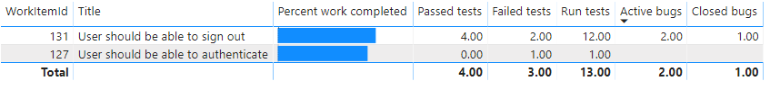

# Requirements tracking sample report

[!INCLUDE [version-gt-eq-2020](../../includes/version-gt-eq-2020.md)]

You can track the quality of work items that belong to the Requirements category with the requirements tracking report. The Requirements category includes work items such as User Stories (Agile), Product Backlog Items (Scrum), Issues (Basic), and Requirements (CMMI). To learn more about work item categories, see [Track user stories, issues, bugs, and other work items](../../boards/work-items/about-work-items.md#wit).

The following image shows an example of a requirements tracking report. 

:::image type="content" source="media/odatapowerbi-storiesoverview.png" alt-text="Screenshot of Power BI Requirements tracking report.":::

This report displays the following information for each requirement that it lists:

- **Percent work completed**:  Progress bar that shows the percentage of completed work based on the rollup of completed hours for all tasks that are linked to the requirement.
- **Passed tests**: The number of test cases run that's passed based on the most recent test run.  
- **Failed tests**: The number of test cases run that's failed based on the most recent test run. 
- **Run tests**:  The number of test runs that's executed.  
- **Active bugs**: The number of linked bugs in an Active state. 
- **Closed bugs**: The number of linked bugs in a  Closed, Done, or Completed state. 


> [!NOTE] 
> Requirement tracking is supported only for test cases linked through a [**Requirement-based test suite**](../../test/create-a-test-plan.md#backlog). The association between a requirement work item&mdash;User Story ([Agile](../../boards/work-items/guidance/agile-process.md)), Product Backlog Item ([Scrum](../../boards/work-items/guidance/scrum-process.md)), Requirement ([CMMI](../../boards/work-items/guidance/cmmi-process.md)), or Issue ([Basic](../../boards/get-started/plan-track-work.md))&mdash;and manual test execution is only formed when the test case is linked via a **Requirement-based test suite**. 

[!INCLUDE [stories-overview-info](includes/sample-stories-overview-info.md)] 

[!INCLUDE [temp](includes/preview-note.md)]

[!INCLUDE [prerequisites-simple](../includes/analytics-prerequisites-simple.md)]

[!INCLUDE [temp](includes/sample-required-reading.md)]

[!INCLUDE [stories-overview-prereqs](includes/sample-stories-overview-prereqs.md)]  

## Sample queries

To generate the report, you must add three Power BI queries to Power BI desktop and then link them. Each query executes either the `WorkItems` or `TestPoints` entity set.
 
> [!NOTE]   
> The Power BI query snippets provided in the following sections include the requisite data transforms to expand columns and change data type.

[!INCLUDE [temp](includes/query-filters-work-items.md)]   

### Query area and iteration paths

In order to scope your report to a particular Area and Iteration path, you can filter the query using AreaSK and IterationSK. For details, see [Define basic queries using OData Analytics](../extend-analytics/analytics-recipes.md#area).

### Query for percentage of hours completion for requirements

> [!NOTE]   
> The following query works for the Agile process since it defines `Remaining Work` and `Completed Work` fields in work items.

#### [Power BI query](#tab/powerbi/)

[!INCLUDE [temp](includes/sample-powerbi-query.md)]

```
let
    Source = OData.Feed("https://analytics.dev.azure.com/{organization}/{project}/_odata/v3.0-preview/WorkItems? 
    $filter=(
        IterationSK eq {iterationSK}
        and AreaSK eq {areaSK}
        and Processes/any(p:p/BacklogType eq 'RequirementBacklog') 
        and Processes/all(p:p/IsBugType eq false)
    )
    &$expand=Descendants(
        $apply=filter(
            CompletedWork ne null 
            or RemainingWork ne null
        )
        /aggregate(
            iif(CompletedWork ne null, CompletedWork, 0) with sum as SumCompletedWork, 
            iif(RemainingWork ne null, RemainingWork, 0) with sum as SumRemainingWork
        )/compute(
            (SumCompletedWork add SumRemainingWork) as TotalWork, 
            SumCompletedWork as SumCompleted
        )/compute(
            iif(TotalWork gt 0,(SumCompleted div cast(TotalWork, Edm.Double) mul 100), 0) as PercCompletedWork
        )
)&$select=WorkItemId, Title", null, [Implementation="2.0"]),
    #"Expanded Descendants" = Table.ExpandTableColumn(Source, "Descendants", {"SumCompletedWork", "SumRemainingWork", "TotalWork", "SumCompleted", "PercCompletedWork"}, {"Descendants.SumCompletedWork", "Descendants.SumRemainingWork", "Descendants.TotalWork", "Descendants.SumCompleted", "Descendants.PercCompletedWork"}),
    #"Changed Type" = Table.TransformColumnTypes(#"Expanded Descendants",{{"Descendants.SumCompletedWork", type number}, {"Descendants.SumRemainingWork", type number}, {"Descendants.TotalWork", type number}, {"Descendants.SumCompleted", type number}, {"Descendants.PercCompletedWork", type number}})
in
    #"Changed Type"
```

#### [OData query](#tab/odata/)

[!INCLUDE [temp](includes/sample-odata-query.md)]

```
https://analytics.dev.azure.com/{organization}/{project}/_odata/v3.0-preview/WorkItems? 
$filter=(
    IterationSK eq {iterationSK}
    and AreaSK eq {areaSK}
    and Processes/any(p:p/BacklogType eq 'RequirementBacklog') 
    and Processes/all(p:p/IsBugType eq false)
)
&$expand=Descendants(
    $apply=filter(
        CompletedWork ne null 
        or RemainingWork ne null
    )
    /aggregate(
        iif(CompletedWork ne null, CompletedWork, 0) with sum as SumCompletedWork, 
        iif(RemainingWork ne null, RemainingWork, 0) with sum as SumRemainingWork
    )
    /compute(
        (SumCompletedWork add SumRemainingWork) as TotalWork, 
        SumCompletedWork as SumCompleted
    )
    /compute(
        iif(TotalWork gt 0,(SumCompleted div cast(TotalWork, Edm.Double) mul 100), 0) as PercCompletedWork
    )
)&$select=WorkItemId, Title
```

***

### Query for test execution status of requirements


[!INCLUDE [temp](includes/query-filters-test.md)] 

#### [Power BI query](#tab/powerbi/)

[!INCLUDE [temp](includes/sample-powerbi-query.md)]

```
let 
    Source = OData.Feed ("https://analytics.dev.azure.com/{organization}/{project}/_odata/v3.0-preview/TestPoints? 
    $apply=filter(
        (TestSuite/RequirementWorkItem/IterationSK eq {iterationSK} 
        and TestSuite/RequirementWorkItem/AreaSK eq {areaSK}
        and TestSuite/RequirementWorkItem/Processes/any(p:p/BacklogType eq 'RequirementBacklog') 
        and TestSuite/RequirementWorkItem/Processes/all(p:p/IsBugType eq false)
        )
    )
    /compute(TestSuite/RequirementWorkItem/WorkItemId as WorkItemId, TestSuite/RequirementWorkItem/Title as WorkItemTitle)
    /groupby(
        (WorkItemId, WorkItemTitle),
        aggregate(
            $count as TotalCount, 
            cast(LastResultOutcome eq 'Passed', Edm.Int32) with sum as PassedCount, 
            cast(LastResultOutcome eq 'Failed', Edm.Int32) with sum as FailedCount, 
            cast(LastResultOutcome eq 'Blocked', Edm.Int32) with sum as BlockedCount,
            cast(LastResultOutcome eq 'NotApplicable', Edm.Int32) with sum as NotApplicableCount,
            cast(LastResultOutcome eq 'None', Edm.Int32) with sum as NotRunCount, 
            cast(LastResultOutcome ne 'None', Edm.Int32) with sum as RunCount)
)", null, [Implementation="2.0"]),
    #"Changed Type" = Table.TransformColumnTypes(Source,{{"TotalCount", type number}, {"PassedCount", type number}, {"FailedCount", type number}, {"BlockedCount",type number}, {"NotApplicableCount", type number}, {"NotRunCount", type number}, {"RunCount", type number}})
in
    #"Changed Type"
```
 

#### [OData query](#tab/odata/)

[!INCLUDE [temp](includes/sample-odata-query.md)]

```
https://analytics.dev.azure.com/{organization}/{project}/_odata/v3.0-preview/TestPoints? 
$apply=filter(
    (TestSuite/RequirementWorkItem/IterationSK eq {iterationSK} 
    and TestSuite/RequirementWorkItem/AreaSK eq {areaSK}
    and TestSuite/RequirementWorkItem/Processes/any(p:p/BacklogType eq 'RequirementBacklog') 
    and TestSuite/RequirementWorkItem/Processes/all(p:p/IsBugType eq false)
    )
)
/compute(TestSuite/RequirementWorkItem/WorkItemId as WorkItemId, TestSuite/RequirementWorkItem/Title as WorkItemTitle)
/groupby(
    (WorkItemId, WorkItemTitle),
    aggregate(
        $count as TotalCount, 
        cast(LastResultOutcome eq 'Passed', Edm.Int32) with sum as PassedCount, 
        cast(LastResultOutcome eq 'Failed', Edm.Int32) with sum as FailedCount, 
        cast(LastResultOutcome eq 'Blocked', Edm.Int32) with sum as BlockedCount,
        cast(LastResultOutcome eq 'NotApplicable', Edm.Int32) with sum as NotApplicableCount,
        cast(LastResultOutcome eq 'None', Edm.Int32) with sum as NotRunCount, 
        cast(LastResultOutcome ne 'None', Edm.Int32) with sum as RunCount
    )
)
```

***


[!INCLUDE [temp](includes/note-test-suites-requirements.md)]  


### Query for status of bugs linked to the requirements

#### [Power BI query](#tab/powerbi/)

[!INCLUDE [temp](includes/sample-powerbi-query.md)]

```
let
    Source = OData.Feed("https://analytics.dev.azure.com/{organization}/{project}/_odata/v3.0-preview/WorkItems?
    $filter=(
        IterationSK eq {iterationSK} 
        and AreaSK eq {areaSK}
        and Processes/any(p:p/BacklogType eq 'RequirementBacklog') 
        and Processes/all(p:p/IsBugType eq false)
    )
    &$expand=Links(
        $apply=filter(
            (LinkTypeName eq 'Child' or LinkTypeName eq 'Related')
            and TargetWorkItem/WorkItemType eq 'Bug'
        )
        /groupby(
            (TargetWorkItem/State),
            aggregate($count as Count)
        )
    )&$select=WorkItemId,Title", null, [Implementation="2.0"]),
    #"Expanded Links" = Table.ExpandTableColumn(Source, "Links", {"TargetWorkItem", "Count"}, {"Links.TargetWorkItem", "Links.Count"}),
    #"Expanded Links.TargetWorkItem" = Table.ExpandRecordColumn(#"Expanded Links", "Links.TargetWorkItem", {"State"}, {"Links.TargetWorkItem.State"}),
    #"Filtered Rows" = Table.SelectRows(#"Expanded Links.TargetWorkItem", each [Links.Count] <> null and [Links.Count] <> ""),
    #"Pivoted Column" = Table.Pivot(#"Filtered Rows", List.Distinct(#"Filtered Rows"[Links.TargetWorkItem.State]), "Links.TargetWorkItem.State", "Links.Count", List.Sum),
    #"Changed Type" = Table.TransformColumnTypes(#"Pivoted Column",{{"Active", type number}, {"Closed", type number}})
in
    #"Changed Type"
```

#### [OData query](#tab/odata/)

[!INCLUDE [temp](includes/sample-odata-query.md)]

```
https://analytics.dev.azure.com/{organization}/{project}/_odata/v3.0-preview/WorkItems?
    $filter=(
        IterationSK eq {iterationSK}  
        and AreaSK eq {areaSK} 
        and Processes/any(p:p/BacklogType eq 'RequirementBacklog') 
        and Processes/all(p:p/IsBugType eq false)
    )
&$expand=Links(
    $apply=filter(
        (LinkTypeName eq 'Child' or LinkTypeName eq 'Related')
        and TargetWorkItem/WorkItemType eq 'Bug'
    )
    /groupby(
        (TargetWorkItem/State),
        aggregate($count as Count)
    )
)&$select=WorkItemId,Title
```

***
 

## Substitution strings and query breakdown

[!INCLUDE [temp](includes/sample-query-substitutions.md)]

- `{organization}` - Your organization name 
- `{project}` - The name of your project  
- `{iterationSK}` - The GUID associated with the **Iteration Path** of interest. To look up the GUID, see [../extend-analytics/wit-analytics.md#iterationsk](Return the IterationSK for a specific Iteration Path)
- `{areaSK}` - The GUID associated with the Area Path of interest. To look up the GUID, see [../extend-analytics/wit-analytics.md#areask](Return the AreaSK for a specific Area Path).


### Query breakdown

The following table describes each part of the query.

:::row:::
   :::column span="1":::
   **Query part**
   :::column-end:::
   :::column span="1":::
   **Description**
   :::column-end:::
:::row-end:::
---
:::row:::
   :::column span="1":::
       `$filter=(
        IterationSK eq {iterationSK}
        and AreaSK eq {areaSK}`
        )`
   :::column-end:::
   :::column span="1":::
   Returns data for only selected Iteration, Area, and backlog work items.  
   :::column-end:::
:::row-end:::
:::row:::
   :::column span="1":::
   `Processes/any(p:p/BacklogType eq 'RequirementBacklog')`
   :::column-end:::
   :::column span="1":::
   Filter the work items in such a way that they should fall in 'requirements' category for at least one process associated with them.
   :::column-end:::
:::row-end:::
:::row:::
   :::column span="1":::
   `Processes/all(p:p/IsBugType eq false)`
   :::column-end:::
   :::column span="1":::
   Omit the bug type work items while getting requirements. In Basic process template, Issue work items are also of bug type, so for Basic process remove this clause from your query.
   :::column-end:::
:::row-end:::
:::row:::
   :::column span="1":::
      `filter(
        (TestSuite/RequirementWorkItem/IterationSK eq {iterationSK} 
        and TestSuite/RequirementWorkItem/AreaSK eq {areaSK}
        and TestSuite/RequirementWorkItem/Processes/any(p:p/BacklogType eq 'RequirementBacklog') 
        and TestSuite/RequirementWorkItem/Processes/all(p:p/IsBugType eq false)
        )
       )`
   :::column-end:::
   :::column span="1":::
   Return data for only selected requirements based on Iteration and Area.  
   :::column-end:::
:::row-end:::
:::row:::
   :::column span="1":::
   `/aggregate($count as TotalCount,`
   :::column-end:::
   :::column span="1":::
   Aggregate data across the filtered test points with having count as `TotalCount`.
   :::column-end:::
:::row-end:::
:::row:::
   :::column span="1":::
   `cast(LastResultOutcome eq 'Passed', Edm.Int32) with sum as Passed`
   :::column-end:::
   :::column span="1":::
   While aggregating, type-cast test points having latest execution outcome 'Passed' to 1 and sum them up as '`Passed`' metric.
   :::column-end:::
:::row-end:::
:::row:::
   :::column span="1":::
       `&$expand=Descendants(
        $apply=filter(
            CompletedWork ne null 
            or RemainingWork ne null
        )`
   :::column-end:::
   :::column span="1":::
   Returns *Completed Work* and *Remaining Work* data for child work items of filtered parent items.  
   :::column-end:::
:::row-end:::
:::row:::
   :::column span="1":::
    `/aggregate(
        iif(CompletedWork ne null, CompletedWork, 0) with sum as SumCompletedWork, 
        iif(RemainingWork ne null, RemainingWork, 0) with sum as SumRemainingWork`
   :::column-end:::
   :::column span="1":::
   Aggregate *Completed Work* and *Remaining Work* data across the filtered work items.
   :::column-end:::
:::row-end:::
:::row:::
   :::column span="1":::
      `)/compute(
            (SumCompletedWork add SumRemainingWork) as TotalWork, 
            SumCompletedWork as SumCompleted`
   :::column-end:::
   :::column span="1":::
   Compute the total rollup of *Completed Work* and *Remaining Work*.
   :::column-end:::
:::row-end:::
:::row:::
   :::column span="1":::
      `)/compute(
            iif(TotalWork gt 0,(SumCompleted div cast(TotalWork, Edm.Double) mul 100), 0) as PercCompletedWork
       )`
   :::column-end:::
   :::column span="1":::
   Calculate the percent of completed wor.
   :::column-end:::
:::row-end:::
 


## Create the Table report 

To create the report, perform the following steps:

1. From the **Modeling** tab, choose **Manage Relationships** and link the three query results by `WorkItemId` column. 
1. Under **Visualizations**, choose **Table**.
1. Add the columns you're interested in from the three Power BI queries.
1. Select **Sum** as aggregation for additive columns like **Passed tests** etc.
    > [!div class="mx-imgBorder"] 
    > 

Your report should look similar to the following image. 

> [!div class="mx-imgBorder"] 
> 


## Related articles

[!INCLUDE [temp](includes/sample-relatedarticles.md)]
