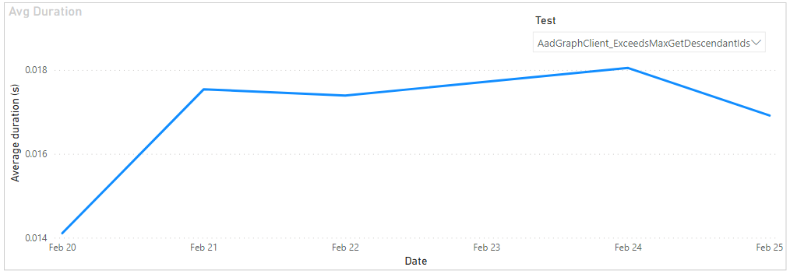
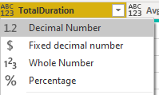
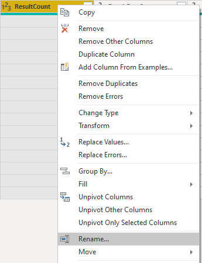
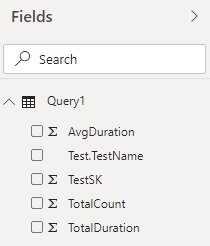

# Test duration trend sample report

[!INCLUDE [temp](../includes/version-azure-devops-cloud.md)]

This article shows you how to create a report that shows the day wise trend of the average time taken to execute a test for a selected time range.

[!INCLUDE [temp](includes/preview-note.md)]

An example is shown in the following image.

> [!div class="mx-imgBorder"] 
> 


[!INCLUDE [temp](includes/sample-required-reading.md)]

[!INCLUDE [temp](./includes/prerequisites-power-bi-cloud-only.md)]

## Sample queries

#### [Power BI query](#tab/powerbi/)

[!INCLUDE [temp](includes/sample-powerbi-query.md)]

```
let
   Source = OData.Feed (""
in
    Source
                &"Pipeline/PipelineName eq '{pipelineName}' "
                &"And Date/Date ge {startdate} "
        &"And Workflow eq 'Build' "
        &") "
            &"/groupby( "
                &"(TestSK, Test/TestName, Date/Date), "
                &"aggregate( "
            &"ResultCount with sum as TotalCount, "
                &"ResultDurationSeconds with sum as TotalDuration "
            &")) "
        &"/compute( "
    &"TotalDuration div TotalCount as AvgDuration "
    &") "
    ,null, [Implementation="2.0",OmitValues = ODataOmitValues.Nulls,ODataVersion = 4]) 
in
    Source
```

#### [OData query](#tab/odata/)

[!INCLUDE [temp](includes/sample-odata-query.md)]

```
https://analytics.dev.azure.com/{organization}/{project}/_odata/v4.0-preview/TestResultsDaily?
$apply=filter(
	Pipeline/PipelineName eq '{pipelineName}'
	And Date/Date ge {startdate}
	And Workflow eq 'Build'
	)
/groupby(
	(TestSK, Test/TestName, Date/Date), 
	aggregate(
	ResultCount with sum as TotalCount,
	ResultDurationSeconds with sum as TotalDuration
	))
/compute(
	TotalDuration div TotalCount as AvgDuration
	)
```

***

### Substitution strings

Each query contains the following strings that you must substitute with your values. Don't include brackets {} with your substitution. For example if your organization name is "Fabrikam", replace {organization} with **Fabrikam**, not {Fabrikam}.
 
- {organization} - Your organization name
- {project} - Your team project name
- {pipelinename} - Your pipeline name. Example: **Fabrikam hourly build pipeline**.
- {startdate} - The date to start your report. Format: YYYY-MM-DDZ. Example: **2021-09-01Z** represents September 1, 2021. Don't enclose in quotes or brackets and use two digits for both, month and date.

### Query breakdown

The following table describes each part of the query.

<table width="90%">
<tbody valign="top">
<tr><td width="25%"><b>Query part</b></td><td><b>Description</b></td><tr>
<tr><td><code>$apply=filter(</code></td>
<td>Start filter()</td>
<tr>
<tr>
<td><code>Pipeline/PipelineName eq '{pipelineName}'</code></td>
<td>Return test runs for the specified pipeline</td>
<tr>
<tr><td><code>And Date/Date ge {startdate}</code></td>
<td>Return test runs on or after the specified date</td>
<tr>
<tr><td><code>and Workflow eq 'Build'</code></td>
<td>Return test runs for 'Build' workflow</td>
<tr>
<tr><td><code>)</code></td>
<td>Close filter()</td>
<tr>
<tr><td><code>/groupby(</code></td>
<td>Start groupby()</td>
<tr>
<tr><td><code>(TestSK, Test/TestName, Date/Date),</code></td>
<td>Group by the test Name and date of execution of test</td>
<tr>
<tr><td><code>aggregate(</code></td>
<td>Start aggregate. For all the test runs matching the above filter criteria:</td>
<tr>
<tr><td><code>ResultCount with sum as TotalCount,</code></td>
<td>Count the total number of test runs as TotalCount</td>
<tr>
<tr><td><code>ResultDurationSeconds with sum as TotalDuration</code></td>
<td>Sum the total duration of all the runs as TotalDuration</td>
<tr>
<tr><td><code>))</code></td>
<td>Close aggregate() and groupby()</td>
<tr>
<tr><td><code>/compute(</code></td>
<td>Start compute()</td>
<tr>
<tr><td><code>TotalDuration div TotalCount as AvgDuration</code></td>
<td>For all the tests, we already have total number of runs and total duration. Calculate average duration by diving total duration by total number of runs</td>
<tr>
<tr><td><code>)</code></td>
<td>Close compute()</td>
<tr>
</tbody>
</table>

[!INCLUDE [temp](includes/query-filters-test.md)]

## Power BI transforms

The query returns some columns that you need to expand and flatten into its fields before you can use them in Power BI. In this example such entities are Test and Date.

After closing the Advanced Editor and while remaining in the Power Query Editor, select the expand button on **Test** and **Date**.

### Expand the Test and Date column

1. Choose the expand button

    > [!div class="mx-imgBorder"] 
    > 
    
1. Select the checkbox "(Select All Columns)" to expand

    > [!div class="mx-imgBorder"] 
    > 

1. The table now contains the expanded entity **Test.TestName**.

    > [!div class="mx-imgBorder"] 
    > 
    

### Change column type

The query doesn't return all the columns in the format in which you can directly consume them in Power BI reports. Therefore, you can change the column type as shown.

1. Change the type of column **TotalCount** to **Whole Number**.

    > [!div class="mx-imgBorder"] 
    > 
    
1. Change the type of column **TotalDuration** and **AvgDuration** to **Decimal Number**.

    > [!div class="mx-imgBorder"] 
    > 


### Rename fields and query, then Close & Apply

When finished, you may choose to rename columns. 

1. Right-click a column header and select **Rename...**

	> [!div class="mx-imgBorder"] 
	> 

1. You also may want to rename the query from the default **Query1**, to something more meaningful. 

	> [!div class="mx-imgBorder"] 
	> 

1. Once done, choose **Close & Apply** to save the query and return to Power BI.

	> [!div class="mx-imgBorder"] 
	> 
  
  
## Create the report

Power BI shows you the fields you can report on. 

> [!NOTE]   
> The example below assumes that no one renamed any columns. 

> [!div class="mx-imgBorder"] 
> 

For a simple report, do the following steps:

1. Select Power BI Visualization **Line Chart**.
1. Add the field "Date.Date" to **Axis**.
    - Right click "Date.Date" and select "Date.Date", rather than Date Hierarchy.
1. Add the field "AvgDuration" to **Values**.
1. Add Power Visualization **Slicer**.
1. Add the field "Test.TestName" to **Field** of Slicer.
    
Your report should look like this. 

> [!div class="mx-imgBorder"] 
> 


## Full list of Pipelines sample reports 

[!INCLUDE [temp](includes/sample-full-list-pipelines.md)]

## Related articles

[!INCLUDE [temp](includes/sample-related-articles-pipelines.md)]
