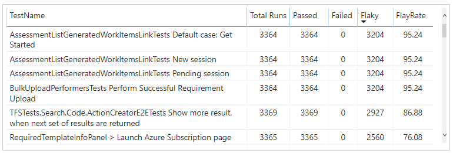
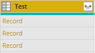
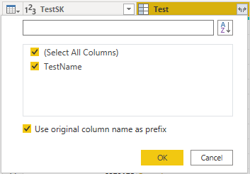
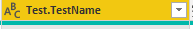
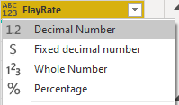

# Flaky tests sample report

[!INCLUDE [temp](../includes/version-azure-devops-cloud.md)]

This article shows you how to create a report that shows the list of flaky tests for a pipeline. An example is shown in the following image.

> [!div class="mx-imgBorder"] 
> 

[!INCLUDE [temp](includes/preview-note.md)]

Specifically, you'll find sample queries for the following reports: 

- Flaky tests for build workflow
- Flaky tests for release workflow
- Flaky tests for a particular branch
- Flaky tests for a particular test file
- Flaky tests for a particular test owner 

[!INCLUDE [temp](./includes/prerequisites-power-bi-cloud-only.md)]

## Sample queries

[!INCLUDE [temp](includes/sample-required-reading.md)]

#### [Power BI query](#tab/powerbi/)

[!INCLUDE [temp](includes/sample-powerbi-query.md)]

```
let
   Source = OData.Feed (""
in
    Source
                &"Pipeline/PipelineId eq 7813 "
                &"And Date/Date ge 2020-02-04Z "
        &"And Workflow eq 'Build') "
        &"/groupby((TestSK, Test/TestName), "
            &"aggregate( "
                &"ResultCount with sum as TotalCount, "
                &"ResultPassCount with sum as PassedCount, "
            &"ResultFailCount with sum as FailedCount, "
                &"ResultNotExecutedCount with sum as NotExecutedCount, "
            &"ResultNotImpactedCount with sum as NotImpactedCount, "
        &"ResultFlakyCount with sum as FlakyCount)) "
    &"/filter(FlakyCount gt 0) "
    &"/compute( "
    &"(FlakyCount div cast(TotalCount, Edm.Decimal)) mul 100 as FlaykRate) "
    ,null, [Implementation="2.0",OmitValues = ODataOmitValues.Nulls,ODataVersion = 4]) 
in
    Source
```

#### [OData query](#tab/odata/)

[!INCLUDE [temp](includes/sample-odata-query.md)]

```
https://analytics.dev.azure.com/{organization}/{project}/_odata/v4.0-preview/TestResultsDaily?
$apply=filter(
	Pipeline/PipelineName eq '{pipelineName}'
	And Date/Date ge {startdate}
	And Workflow eq 'Build'
	)
/groupby(
	(TestSK, Test/TestName), 
	aggregate(
	ResultCount with sum as TotalCount,
	ResultPassCount with sum as PassedCount,
	ResultFailCount with sum as FailedCount,
	ResultNotExecutedCount with sum as NotExecutedCount,
	ResultNotImpactedCount with sum as NotImpactedCount,
	ResultFlakyCount with sum as FlakyCount))
/filter(FlakyCount gt 0)
/compute(
	(FlakyCount div cast(TotalCount, Edm.Decimal)) mul 100 as FlakyRate
)
```

***

### Substitution strings

Each query contains the following strings that you must substitute with your values. Don't include brackets {} with your substitution. For example if your organization name is "Fabrikam", replace {organization} with **Fabrikam**, not {Fabrikam}.
 
- {organization} - Your organization name
- {project} - Your team project name
- {pipelinename} - Your pipeline name. Example: **Fabrikam hourly build pipeline**.
- {startdate} - The date to start your report. Format: YYYY-MM-DDZ. Example: **2021-09-01Z** represents September 1, 2021. Don't enclose in quotes or brackets and use two digits for both, month and date.

### Query breakdown

The following table describes each part of the query.

<table width="90%">
<tbody valign="top">
<tr><td width="25%"><b>Query part</b></td><td><b>Description</b></td><tr>
<tr><td><code>$apply=filter(</code></td>
<td>Start filter()</td>
<tr>
<tr>
<td><code>Pipeline/PipelineName eq '{pipelineName}'</code></td>
<td>Return test runs for the specified pipeline</td>
<tr>
<tr><td><code>and CompletedOn/Date ge {startdate}</code></td>
<td>Return test runs on or after the specified date</td>
<tr>
<tr><td><code>and Workflow eq 'Build'</code></td>
<td>Return test runs for 'Build' workflow</td>
<tr>
<tr><td><code>)</code></td>
<td>Close filter()</td>
<tr>
<tr><td><code>/groupby(</code></td>
<td>Start groupby()</td>
<tr>
<tr><td><code>(TestSK, Test/TestName),</code></td>
<td>Group by the test Name</td>
<tr>
<tr><td><code>aggregate(</code></td>
<td>Start aggregate. For all the test runs matching the above filter criteria:</td>
<tr>
<tr><td><code>ResultCount with sum as TotalCount,</code></td>
<td>Count the total number of test runs as TotalCount</td>
<tr>
<tr><td><code>ResultPassCount with sum as PassedCount,</code></td>
<td>Count the total number of passed test runs as PassedCount</td>
<tr>
<tr><td><code>ResultFailCount with sum as FailedCount,</code></td>
<td>Count the total number of failed test runs as FailedCount</td>
<tr>
<tr><td><code>ResultNotExecutedCount with sum as NotExecutedCount</code></td>
<td>Count the total number of not executed test runs as NotExecutedCount</td>
<tr>
<tr><td><code>ResultNotImpactedCount with sum as NotImpactedCount,</code></td>
<td>Count the total number of not impacted test runs as NotImpactedCount</td>
<tr>
<tr><td><code>ResultFlakyCount with sum as FlakyCount</code></td>
<td>Count the total number of flaky test runs as FlakyCount</td>
<tr>
<tr><td><code>))</code></td>
<td>Close aggregate() and groupby()</td>
<tr>
<tr><td><code>/filter(FlakyCount gt 0)</code></td>
<td>Filter out only those tests that were flaky at least once</td>
<tr>
<tr><td><code>/compute(</code></td>
<td>Start compute()</td>
<tr>
<tr><td><code>(FlakyCount div cast(TotalCount, Edm.Decimal)) mul 100 as FlakyRate</code></td>
<td>For all the flaky tests, calculate Flaky rate</td>
<tr>
<tr><td><code>)</code></td>
<td>Close compute()</td>
<tr>
</tbody>
</table>


## Power BI transforms

The query returns some columns that you need to expand and flatten into its fields before you can use them in Power BI. In this example such an entity is Test.

After closing the Advanced Editor and while remaining in the Power Query Editor, select the expand button on **Test**.

### Expand the Test column

1. Choose the expand button

    > [!div class="mx-imgBorder"] 
    > 
    
1. Select the checkbox "(Select All Columns)" to expand

    > [!div class="mx-imgBorder"] 
    > 

1. The table now contains the expanded entity **Test.TestName**.

    > [!div class="mx-imgBorder"] 
    > 
    

### Change column type

The query doesn't return all the columns in the format in which you can directly consume them in Power BI reports. Therefore, you can change the column type as shown.

1. Change the type of column **TotalCount**, **PassedCount**, **FailedCount**, **NotExecutedCount**, **NotImpactedCount** and **FlakyCount** to **Whole Number**.

    > [!div class="mx-imgBorder"] 
    > 
    
1. Change the type of column **FlakyRate** to **Decimal Number**.

    > [!div class="mx-imgBorder"] 
    > 


### Rename fields and query, then Close & Apply

When finished, you may choose to rename columns. 

1. Right-click a column header and select **Rename...**

	> [!div class="mx-imgBorder"] 
	> 

1. You also may want to rename the query from the default **Query1**, to something more meaningful. 

	> [!div class="mx-imgBorder"] 
	> 

1. Once done, choose **Close & Apply** to save the query and return to Power BI.

	> [!div class="mx-imgBorder"] 
	> 
  
  
## Create the report

Power BI shows you the fields you can report on. 

> [!NOTE]   
> The example below assumes that no one renamed any columns. 

> [!div class="mx-imgBorder"] 
> 

For a simple report, do the following steps:

1. Select Power BI Visualization **Table**.
1. Add the field "Test.TestName" to **Values**.
1. Add the field "TotalCount" to **Values**.
1. Add the field "PassedCount" to **Values**.
1. Add the field "FailedCount" to **Values**.
1. Add the field "FlakyCount" to **Values**.
1. Add the field "FlakyRate" to **Values**
    
Your report should look like this. 

> [!div class="mx-imgBorder"] 
> 


You can use the following additional queries to create different but similar reports using the same steps defined previously in this article.

## Flaky tests for Release workflow

You may want to view the flaky tests of a pipeline for **Release** workflow, instead of Build workflow.

#### [Power BI query](#tab/powerbi/)

[!INCLUDE [temp](includes/sample-powerbi-query.md)]

```
let
   Source = OData.Feed (""
in
    Source
                &"Pipeline/PipelineName eq '{pipelineName}' "
                &"And Date/Date ge {startdate}) "
        &"/groupby((TestSK, Test/TestName, Workflow), "
        &"aggregate( "
            &"ResultCount with sum as TotalCount, "
                &"ResultPassCount with sum as PassedCount, "
                &"ResultFailCount with sum as FailedCount, "
            &"ResultNotExecutedCount with sum as NotExecutedCount, "
                &"ResultNotImpactedCount with sum as NotImpactedCount, "
            &"ResultFlakyCount with sum as FlakyCount)) "
        &"/filter(FlakyCount gt 0) "
    &"/compute( "
    &"(FlakyCount div cast(TotalCount, Edm.Decimal)) mul 100 as FlakyRate) "
    ,null, [Implementation="2.0",OmitValues = ODataOmitValues.Nulls,ODataVersion = 4]) 
in
    Source
```

#### [OData query](#tab/odata/)

[!INCLUDE [temp](includes/sample-odata-query.md)]

```
https://analytics.dev.azure.com/{organization}/{project}/_odata/v4.0-preview/TestResultsDaily?
$apply=filter(
	Pipeline/PipelineName eq '{pipelineName}'
	And Date/Date ge {startdate})
/groupby((TestSK, Test/TestName, Workflow), 
	aggregate(
	ResultCount with sum as TotalCount,
	ResultPassCount with sum as PassedCount,
	ResultFailCount with sum as FailedCount,
	ResultNotExecutedCount with sum as NotExecutedCount,
	ResultNotImpactedCount with sum as NotImpactedCount,
	ResultFlakyCount with sum as FlakyCount))
/filter(FlakyCount gt 0)
/compute(
(FlakyCount div cast(TotalCount, Edm.Decimal)) mul 100 as FlakyRate)
```

***

## Filter by branch

You may want to view the flaky tests of a pipeline for a particular branch only. To create the report, perform the following additional steps along with what is defined previously in this article.

- Expand Branch into Branch.BranchName
- Select Power BI Visualization Slicer and add the field Branch.BranchName to the slicer's Field
- Select the pipeline from the slicer for which you need to see the outcome summary

#### [Power BI query](#tab/powerbi/)

[!INCLUDE [temp](includes/sample-powerbi-query.md)]

```
let
   Source = OData.Feed (""
in
    Source
                &"Pipeline/PipelineName eq '{pipelineName}' "
                &"And Date/Date ge {startdate} "
        &"And Workflow eq 'Build') "
        &"/groupby((TestSK, Test/TestName, Branch/BranchName), "
            &"aggregate( "
                &"ResultCount with sum as TotalCount, "
                &"ResultPassCount with sum as PassedCount, "
            &"ResultFailCount with sum as FailedCount, "
                &"ResultNotExecutedCount with sum as NotExecutedCount, "
            &"ResultNotImpactedCount with sum as NotImpactedCount, "
        &"ResultFlakyCount with sum as FlakyCount)) "
    &"/filter(FlakyCount gt 0) "
    &"/compute( "
    &"(FlakyCount div cast(TotalCount, Edm.Decimal)) mul 100 as FlakyRate) "
    ,null, [Implementation="2.0",OmitValues = ODataOmitValues.Nulls,ODataVersion = 4]) 
in
    Source
```

#### [OData query](#tab/odata/)

[!INCLUDE [temp](includes/sample-odata-query.md)]

```
https://analytics.dev.azure.com/{organization}/{project}/_odata/v4.0-preview/TestResultsDaily?
$apply=filter(
	Pipeline/PipelineName eq '{pipelineName}'
	And Date/Date ge {startdate}
	And Workflow eq 'Build')
/groupby((TestSK, Test/TestName, Branch/BranchName), 
	aggregate(
	ResultCount with sum as TotalCount,
	ResultPassCount with sum as PassedCount,
	ResultFailCount with sum as FailedCount,
	ResultNotExecutedCount with sum as NotExecutedCount,
	ResultNotImpactedCount with sum as NotImpactedCount,
	ResultFlakyCount with sum as FlakyCount))
/filter(FlakyCount gt 0)
/compute(
(FlakyCount div cast(TotalCount, Edm.Decimal)) mul 100 as FlakyRate)
```

***

## Filter by test file

You may want to view the flaky tests of a pipeline for a particular test file only. To create the report, perform the following additional steps along with what is defined previously in this article.

- Expand Branch into Test.ContainerName
- Select Power BI Visualization Slicer and add the field Test.ContainerName to the slicer's Field
- Select the pipeline from the slicer for which you need to see the outcome summary

#### [Power BI query](#tab/powerbi/)

[!INCLUDE [temp](includes/sample-powerbi-query.md)]

```
let
   Source = OData.Feed (""
in
    Source
                &"Pipeline/PipelineName eq '{pipelineName}' "
                &"And Date/Date ge {startdate}) "
        &"/groupby((TestSK, Test/TestName, Test/ContainerName), "
        &"aggregate( "
            &"ResultCount with sum as TotalCount, "
                &"ResultPassCount with sum as PassedCount, "
                &"ResultFailCount with sum as FailedCount, "
            &"ResultNotExecutedCount with sum as NotExecutedCount, "
                &"ResultNotImpactedCount with sum as NotImpactedCount, "
            &"ResultFlakyCount with sum as FlakyCount)) "
        &"/filter(FlakyCount gt 0) "
    &"/compute( "
    &"(FlakyCount div cast(TotalCount, Edm.Decimal)) mul 100 as FlakyRate) "
    ,null, [Implementation="2.0",OmitValues = ODataOmitValues.Nulls,ODataVersion = 4]) 
in
    Source
```

#### [OData query](#tab/odata/)

[!INCLUDE [temp](includes/sample-odata-query.md)]

```
https://analytics.dev.azure.com/{organization}/{project}/_odata/v4.0-preview/TestResultsDaily?
$apply=filter(
	Pipeline/PipelineName eq '{pipelineName}'
	And Date/Date ge {startdate})
/groupby((TestSK, Test/TestName, Test/ContainerName), 
	aggregate(
	ResultCount with sum as TotalCount,
	ResultPassCount with sum as PassedCount,
	ResultFailCount with sum as FailedCount,
	ResultNotExecutedCount with sum as NotExecutedCount,
	ResultNotImpactedCount with sum as NotImpactedCount,
	ResultFlakyCount with sum as FlakyCount))
/filter(FlakyCount gt 0)
/compute(
(FlakyCount div cast(TotalCount, Edm.Decimal)) mul 100 as FlakyRate)
```

***

## Filter by test owner

You may want to view the flaky tests of a pipeline for tests owned by a particular test owner only. To create the report, perform the following additional steps along with what is defined previously in this article.

- Expand Branch into Test.TestOwner
- Select Power BI Visualization Slicer and add the field Test.TestOwner to the slicer's Field
- Select the pipeline from the slicer for which you need to see the outcome summary

#### [Power BI query](#tab/powerbi/)

[!INCLUDE [temp](includes/sample-powerbi-query.md)]

```
let
   Source = OData.Feed (""
in
    Source
                &"Pipeline/PipelineName eq '{pipelineName}' "
                &"And Date/Date ge {startdate}) "
        &"/groupby((TestSK, Test/TestName, Test/TestOwner), "
        &"aggregate( "
            &"ResultCount with sum as TotalCount, "
                &"ResultPassCount with sum as PassedCount, "
                &"ResultFailCount with sum as FailedCount, "
            &"ResultNotExecutedCount with sum as NotExecutedCount, "
                &"ResultNotImpactedCount with sum as NotImpactedCount, "
            &"ResultFlakyCount with sum as FlakyCount)) "
        &"/filter(FlakyCount gt 0) "
    &"/compute( "
    &"(FlakyCount div cast(TotalCount, Edm.Decimal)) mul 100 as FlakyRate) "
    ,null, [Implementation="2.0",OmitValues = ODataOmitValues.Nulls,ODataVersion = 4]) 
in
    Source
```

#### [OData query](#tab/odata/)

[!INCLUDE [temp](includes/sample-odata-query.md)]

```
https://analytics.dev.azure.com/{organization}/{project}/_odata/v4.0-preview/TestResultsDaily?
$apply=filter(
	Pipeline/PipelineName eq '{pipelineName}'
	And Date/Date ge {startdate})
/groupby((TestSK, Test/TestName, Test/TestOwner), 
	aggregate(
	ResultCount with sum as TotalCount,
	ResultPassCount with sum as PassedCount,
	ResultFailCount with sum as FailedCount,
	ResultNotExecutedCount with sum as NotExecutedCount,
	ResultNotImpactedCount with sum as NotImpactedCount,
	ResultFlakyCount with sum as FlakyCount))
/filter(FlakyCount gt 0)
/compute(
(FlakyCount div cast(TotalCount, Edm.Decimal)) mul 100 as FlakyRate)
```

***

## Full list of Pipelines sample reports 

[!INCLUDE [temp](includes/sample-full-list-pipelines.md)]

## Related articles

[!INCLUDE [temp](includes/sample-related-articles-pipelines.md)]
