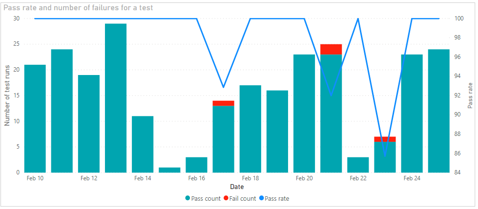
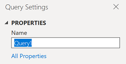
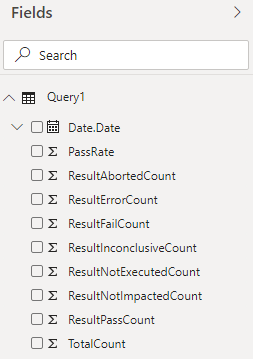

# Pass rate trend of a test sample report 

[!INCLUDE [temp](../includes/version-azure-devops-cloud.md)]

This article shows you how to create a report that shows day wise trend of number of times a test passed and failed, along with its pass rate of any given test of a pipeline.

An example is shown in the following image.

> [!div class="mx-imgBorder"] 
> 


[!INCLUDE [temp](includes/preview-note.md)]

[!INCLUDE [temp](./includes/prerequisites-power-bi-cloud-only.md)]

## Sample queries

[!INCLUDE [temp](includes/sample-required-reading.md)]

#### [Power BI query](#tab/powerbi/)

[!INCLUDE [temp](includes/sample-powerbi-query.md)]

```
let
   Source = OData.Feed ("https://analytics.dev.azure.com/{organization}/{project}/_odata/v4.0-preview/TestResultsDaily?
$apply=filter("
                &"Pipeline/PipelineName eq '{pipelineName}' "
                &"And Date/Date ge {startdate} "
        &"And Test/TestName eq '{testName}' "
        &"And Workflow eq 'Build') "
            &"/groupby((Date/Date), "
                &"aggregate( "
                &"ResultCount with sum as TotalCount, "
            &"ResultPassCount with sum as ResultPassCount, "
                &"ResultFailCount with sum as ResultFailCount, "
            &"ResultAbortedCount with sum as ResultAbortedCount, "
        &"ResultErrorCount with sum as ResultErrorCount, "
    &"ResultInconclusiveCount with sum as ResultInconclusiveCount, "
    &"ResultNotExecutedCount with sum as ResultNotExecutedCount, "
    &"ResultNotImpactedCount with sum as ResultNotImpactedCount)) "
    &"/filter(ResultFailCount gt 0) "
    &"/compute( "
    &"iif(TotalCount gt ResultNotExecutedCount, ((ResultPassCount add ResultNotImpactedCount) div cast(TotalCount sub ResultNotExecutedCount, Edm.Decimal)) mul 100, 0) as PassRate) "
    ,null, [Implementation="2.0",OmitValues = ODataOmitValues.Nulls,ODataVersion = 4]) 
in
    Source
```

#### [OData query](#tab/odata/)

[!INCLUDE [temp](includes/sample-odata-query.md)]

```
https://analytics.dev.azure.com/{organization}/{project}/_odata/v4.0-preview/TestResultsDaily?
$apply=filter(
	Pipeline/PipelineName eq '{pipelineName}'
	And Date/Date ge {startdate}
	And Test/TestName eq '{testName}'
	And Workflow eq 'Build')
/groupby((Date/Date), 
	aggregate(
	ResultCount with sum as TotalCount,
	ResultPassCount with sum as ResultPassCount,
	ResultFailCount with sum as ResultFailCount,
	ResultAbortedCount with sum as ResultAbortedCount,
	ResultErrorCount with sum as ResultErrorCount,
	ResultInconclusiveCount with sum as ResultInconclusiveCount,
	ResultNotExecutedCount with sum as ResultNotExecutedCount,
	ResultNotImpactedCount with sum as ResultNotImpactedCount))
/filter(ResultFailCount gt 0)
/compute(
	iif(TotalCount gt ResultNotExecutedCount, ((ResultPassCount add ResultNotImpactedCount) div cast(TotalCount sub ResultNotExecutedCount, Edm.Decimal)) mul 100, 0) as PassRate)
```

***

### Substitution strings

Each query contains the following strings that you must substitute with your values. Don't include brackets {} with your substitution. For example if your organization name is "Fabrikam", replace {organization} with **Fabrikam**, not {Fabrikam}.
 
- {organization} - Your organization name
- {project} - Your team project name
- {pipelinename} - Your pipeline name. Example: **Fabrikam hourly build pipeline**.
- {testName} - Your test name
- {startdate} - The date to start your report. Format: YYYY-MM-DDZ. Example: **2019-09-04Z** represents September 4, 2019. Don't enclose in quotes or brackets and use two digits for both, month and date.

### Query breakdown

The following table describes each part of the query.

<table width="90%">
<tbody valign="top">
<tr><td width="25%"><b>Query part</b></td><td><b>Description</b></td><tr>
<tr><td><code>$apply=filter(</code></td>
<td>Start filter()</td>
<tr>
<tr>
<td><code>Pipeline/PipelineName eq '{pipelineName}'</code></td>
<td>Return test runs for the specified pipeline</td>
<tr>
<tr><td><code>And Date/Date ge {startdate}</code></td>
<td>Return test runs on or after the specified date</td>
<tr>
<tr><td><code>And Test/TestName eq '{testName}'</code></td>
<td>Return test runs only for the specified test name</td>
<tr>
<tr><td><code>and Workflow eq 'Build'</code></td>
<td>Return test runs for 'Build' workflow</td>
<tr>
<tr><td><code>)</code></td>
<td>Close filter()</td>
<tr>
<tr><td><code>/groupby(</code></td>
<td>Start groupby()</td>
<tr>
<tr><td><code>(Date/Date),</code></td>
<td>Group by the date of completion of test run</td>
<tr>
<tr><td><code>aggregate(</code></td>
<td>Start aggregate. For all the test runs matching the above filter criteria:</td>
<tr>
<tr><td><code>ResultCount with sum as TotalCount,</code></td>
<td>Count the total number of test runs as TotalCount</td>
<tr>
<tr><td><code>ResultPassCount with sum as ResultPassCount,</code></td>
<td>Count the total number of passed test runs as ResultPassCount</td>
<tr>
<tr><td><code>ResultFailCount with sum as ResultFailCount,</code></td>
<td>Count the total number of failed test runs as ResultFailCount</td>
<tr>
<tr><td><code>ResultAbortedCount with sum as ResultAbortedCount,</code></td>
<td>Count the total number of aborted test runs as ResultAbortedCount</td>
<tr>
<tr><td><code>ResultErrorCount with sum as ResultErrorCount,</code></td>
<td>Count the total number of errored test runs as ResultErrorCount</td>
<tr>
<tr><td><code>ResultNotExecutedCount with sum as ResultNotExecutedCount,</code></td>
<td>Count the total number of not executed test runs as ResultNotExecutedCount</td>
<tr>
<tr><td><code>ResultNotImpactedCount with sum as ResultNotImpactedCount</code></td>
<td>Count the total number of not impacted test runs as ResultNotImpactedCount</td>
<tr>
<tr><td><code>))</code></td>
<td>Close aggregate() and groupby()</td>
<tr>
<tr><td><code>/compute(</code></td>
<td>Start compute()</td>
<tr>
<tr><td><code>iif(TotalCount gt ResultNotExecutedCount, ((ResultPassCount add ResultNotImpactedCount) div cast(TotalCount sub ResultNotExecutedCount, Edm.Decimal)) mul 100, 0) as PassRate)</code></td>
<td>For all the days, calculate Pass rate</td>
<tr>
<tr><td><code>)</code></td>
<td>Close compute()</td>
<tr>
</tbody>
</table>


## Power BI transforms

The query returns some columns that you need to expand and flatten into its fields before you can use them in Power BI. In this example such an entity is Date.

After closing the Advanced Editor and while remaining in the Power Query Editor, select the expand button on **Date**.

### Expand the Date column

1. Choose the expand button

    > [!div class="mx-imgBorder"] 
    > 
    
1. Select the checkbox "(Select All Columns)" to expand

    > [!div class="mx-imgBorder"] 
    > 

1. The table now contains the expanded entity **CompletedOn.Date**.

    > [!div class="mx-imgBorder"] 
    > 
    

### Change column type

1. Change the type of column **PassRate** to **Decimal Number** and **TotalCount** to **Whole Number**.

    > [!div class="mx-imgBorder"] 
    > 


### Rename fields and query, then Close & Apply

When finished, you may choose to rename columns. 

1. Right-click a column header and select **Rename...**

	> [!div class="mx-imgBorder"] 
	> 

1. You also may want to rename the query from the default **Query1**, to something more meaningful. 

	> [!div class="mx-imgBorder"] 
	> 

1. Once done, choose **Close & Apply** to save the query and return to Power BI.

	> [!div class="mx-imgBorder"] 
	> 
  
  
## Create the report

Power BI shows you the fields you can report on. 

> [!NOTE]   
> The example below assumes that no one renamed any columns. 

> [!div class="mx-imgBorder"] 
> 

For a simple report, do the following steps:

1. Select Power BI Visualization **Line and stacked column chart**. 
1. Add the field "Date.Date" to **Shared Axis**.
    - Right-click "Date.Date" and select "Date.Date", rather than Date Hierarchy.
1. Add the field "ResultPassCount" to **Column values**.
1. Add the field "ResultFailCount" to **Column values**.
1. Add the field "PassRate" to **Line values**.
    
Your report should look like this. 

> [!div class="mx-imgBorder"] 
> 


## Full list of Pipelines sample reports 

[!INCLUDE [temp](includes/sample-full-list-pipelines.md)]

## Related articles

[!INCLUDE [temp](includes/sample-related-articles-pipelines.md)]
